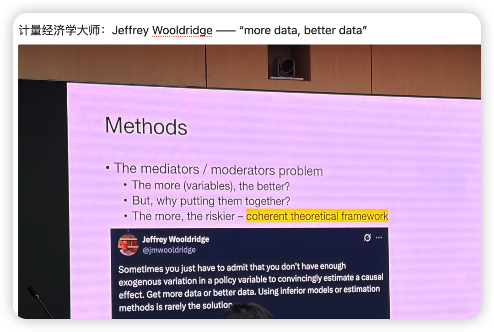

这次PDW最大的收获是打开了AE处理一篇paper的思维黑箱——对于我们如何选择论文的keywords、选择要核心对话的领域、推荐AE和reviewer的思路都有很大帮助！

除了这一点最重要的收获之外，我也选择了一些没那么老生常谈的内容来浅浅分享一下～

AE在想些什么？

AE在分到一篇稿子的时候，第一反应是：这篇稿子是否对我胃口，和我的研究领域相符？

—— 如果符合，AE会非常美滋滋，这样ta去找reviewer也会非常熟悉，甚至ta可以很清楚地知道ta的某个学术朋友会感兴趣这个研究。这样自然而然找到“赏识你研究”的reviewer的可能性会提高；

—— 然而若是让ta感觉：“哈？为啥这个主题的文章会落在我手上”（而且这可能已经是主编深思熟虑后、选择了团队中方向比较契合的AE了），那ta大概率会带着不熟悉感去更加细致地揣摩这个研究，找出这篇文章cite最多的人、或者核心对话的领域中的大佬，大概率就会请求这些人来审稿。

所以这个点给我的启示是：在投稿之前，最好也要过一遍editorial board里诸位AE们（当然包括主编）的研究领域，可以“投其所好”。毕竟这是一种双赢：你可以找到赏识你作品的人，editor和AE也可以更容易地处理文章。

其他一些insights

1. One well-done study is OK。并不是所有文章都得mix-methods study。

同样的思想 在李华芳老师的讲座中也提到：

即使是计量经济学大师，也会强调启示more data & better data是很关键的。

2. 不要假装现实中存在这个问题？ 问问自己、查查现实数据，这个现象在职场中的比例高吗？

3. so what的问题：看完一些研究，AE会说，嗯，这是个好的发现，但是看完这个研究之后，你要如何给leader提建议呢？ PPsych现在非常注重与实践的联系，所谓的practical relevance、societal relevance。

4. AI use：给AI一些思维线索，如果它的prediction和你想的一致，那说明这并不是一个很值得研究的问题，毕竟科学研究要做的是回答what we will know而不是we have known；

沿着这个，我想起这次我在ZJU会议中听AE点评时想到的：

AI固然可以给出100种mechanism，但这些mechanism和IV、DV所在的领域是不是存在断裂，比如Mediator是cognitive相关的，但是DV直接跳到interpersonal outcome就会很割裂。

5. 时间管理：AE们一般睡7-9小时；大部分周末不工作；会使用番茄工作法hhh；也会为了哄自己工作，把大任务切分成小任务，比如今天只思考3个arguments；在被打断的时候，花30s思考一下，我现在做到哪里、下一步要做什么、当前问题是什么 这样回来后更容易恢复状态。

6. Literature Review：读核心文献、读综述、读领域中“key player”的学者的作品，一直到你觉得自己对这个领域达到了理论上的饱和；写综述的时候不要写成历史书，而需要着重介绍你所要加入的conversation是如何发展如何论证的。
