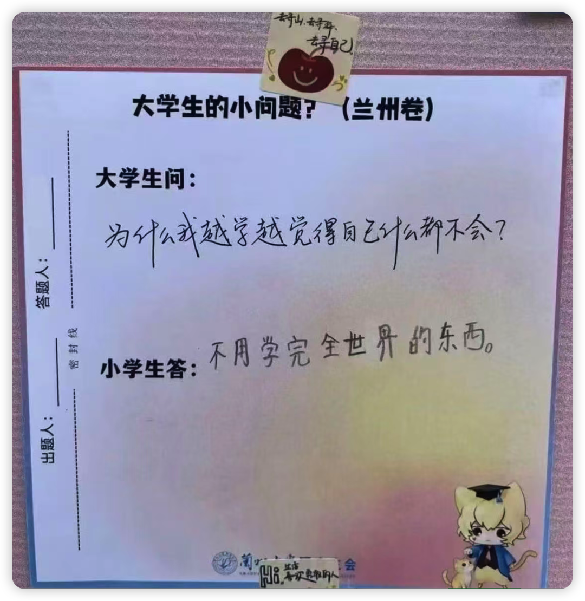
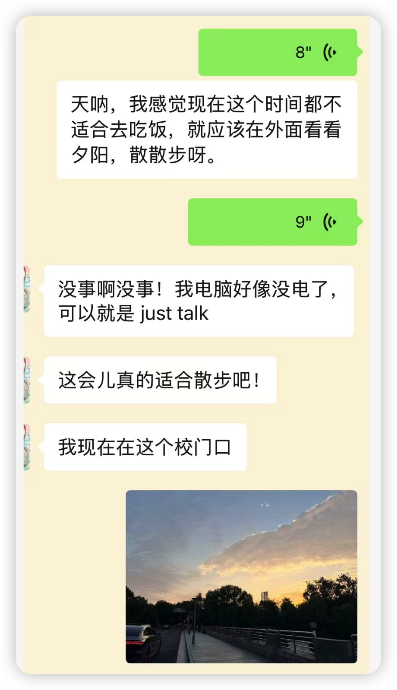
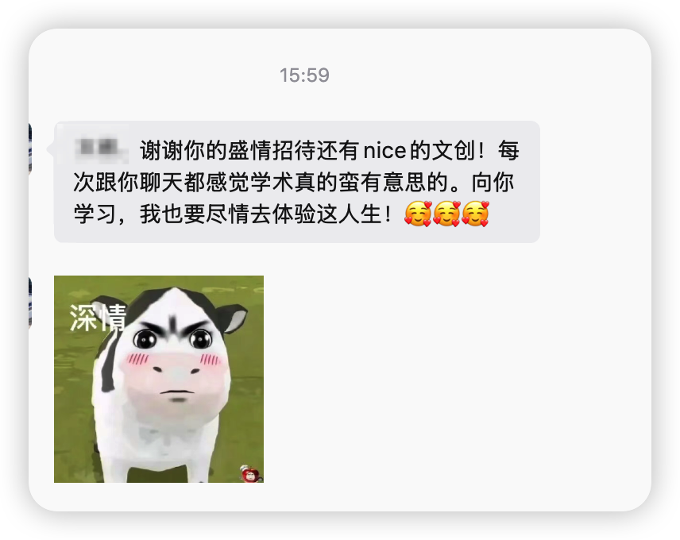
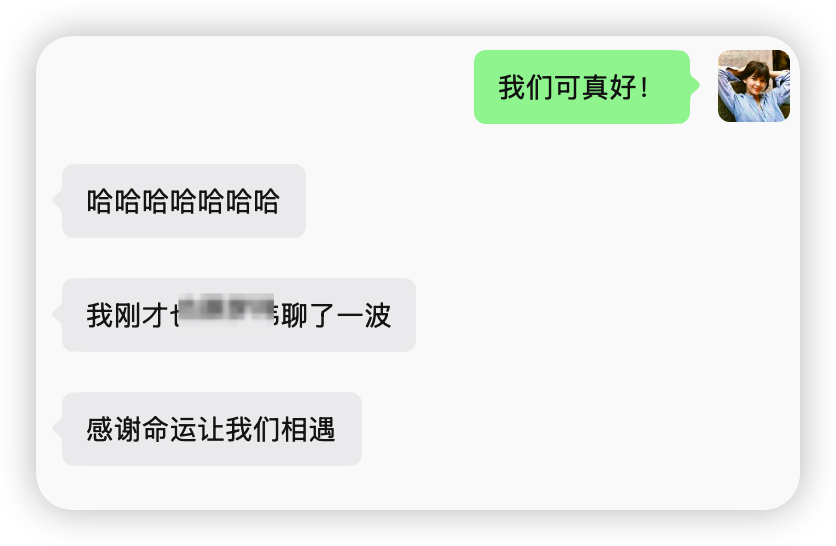
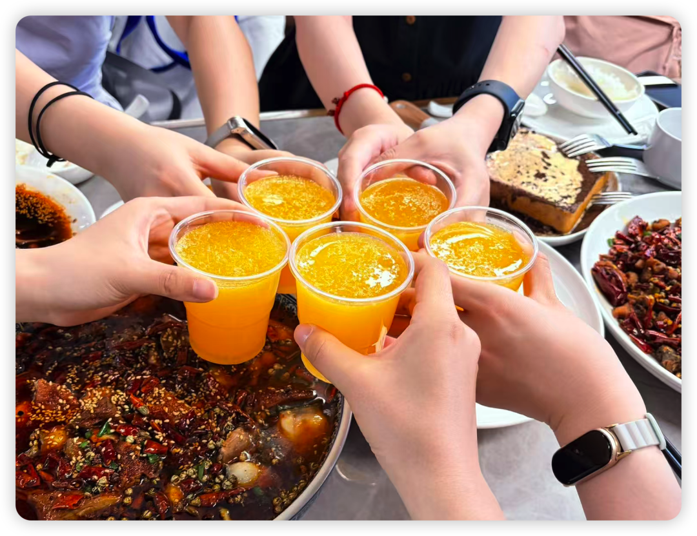
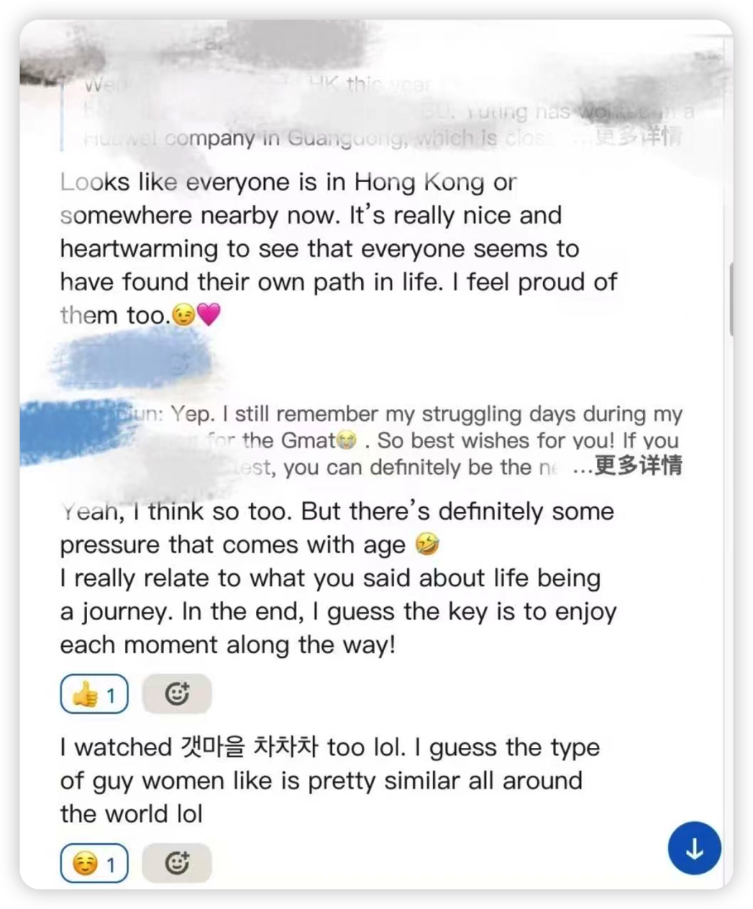

久违了！ 上次更新后我就美美去英国旅游了（期间用1天时间参加了一下PPsych PDW也算是干了件正事儿 也很有收获！等我下一篇来分享  请放心 我的文字已写好！）；

回国后又补一下科研进度；接着又连滚带爬忙一些硕士毕业的事情，日子居然又这样流水般过去了——

最近管院又在举办一年一度的学术会议了，这次阵容更是空前强大！

不过因为这周我在命苦地做一个dirty work，就没有机会每场都听。但神奇的是，目前我已经没有了fear of missing out的感觉，甚至也没有再问别人要PPT和笔记。当然也可能是昨天被朋友发的这个memo治愈了哈哈哈...

其实也是因为我感觉：在经过过去两三年的理论和editorial文章积累后，对于一些顶刊倡导的积累似乎已经达到饱和。似乎千言万语后，还是得回到“算了 还是得多读文献 多做literature review 才能知道对话的文献中到底缺少了什么视角”。

另一个感受是，有时候Q&A的问题本身就有点泛，所以editor们也就只能说一些形而上的东西。

在此我真诚建议大家问「细节中的细节」的问题，比如问问editor们做文献综述都会做到什么精细程度、theorizing的过程是如何不断迭代的、可能的alternative mechanism到底要穷尽到什么程度、even几点睡觉、每天能连续工作多久、如何平衡project-based reading和顶刊泛读... 比起宏大的难以诉诸具体研究话题的“如何提升理论贡献”，我似乎更想了解构建起理论大厦的一砖一瓦——即最小颗粒度的任务处理和行为习惯，这是我们更能上手和学习的东西。 —— PPsych的PDW就有观众问这些具体的小问题，现场氛围也非常其乐融融，所以结束了之后 很多人都觉得学到了很多！

不过虽然这次我没咋听，但还是有巨大的幸福和收获。就在于——

又见到了很多好朋友！ 和同温层的好人们见面真的太开心了，值得我写一条久违地Bubble纪念一下了！

和Lei弟因为夕阳、而毅然决然放弃吃白人饭而绕着学校散步：

和YX在AMJ PDW相识，后来在武汉又闪现见过，INFJ人每次见面都可以直接进入Deep talk环节🥹 我们真的非常掏心窝子了，说不了一点客套话。

和XY在JAP PDW相识，之后在无数次会议都见过！被我爱的田姐狠狠认证过、山清水秀&眉清目秀的“好人！”

后来吃饭还偶遇了另外两位看过我的公众号甚至听过我的小破播客的朋友，于是直接拉来一起吃饭，然后发现一桌子都是NF小绿人！ 这真是人与人之间微妙的磁场了！

想到前段时间还在Linkedin上和当年SIOP上认识的韩国妹子认亲了一下，我们互相patpat治愈一下对方。最搞笑的是我跟她说 我最近在看金宣虎之前的剧《海岸村恰恰恰》，她说她也看过lol、「也许全世界的女人喜欢的帅哥类型都差不多」哈哈哈哈！还给我推荐了《背着宰善跑》！😂😂😂

做学术认识的peers真像是学术发小，每次大型会议的相见，都可以互相聊聊最近的状态，有时甚至可以从气色上就可以判断对方最近是在好好对待自己还是又在受什么学术的苦了；再一起聊聊做科研时遇到的Q&A... 虽然大部分也都是尚未解决的Q而根本没有A，但只是发现 —— 原来大家都共享着一样的Q、知道也许这就是这个阶段需要积累的智识、并相信等有了一定地积累之后 我们也许也可以领悟和精通 ——  就觉得真是一种安慰！

谢谢学术发小们在学术之路的陪伴！
祝我们都能持续感受到了认知增加的快乐，大家一切顺利！
