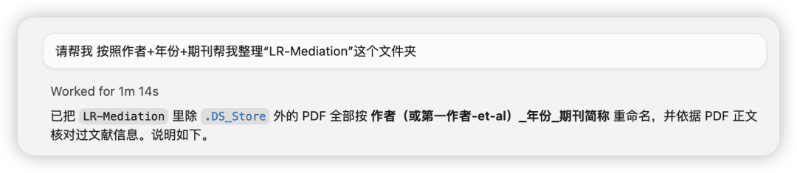
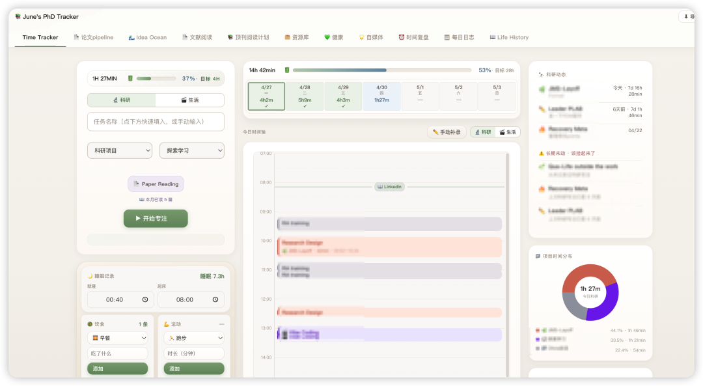
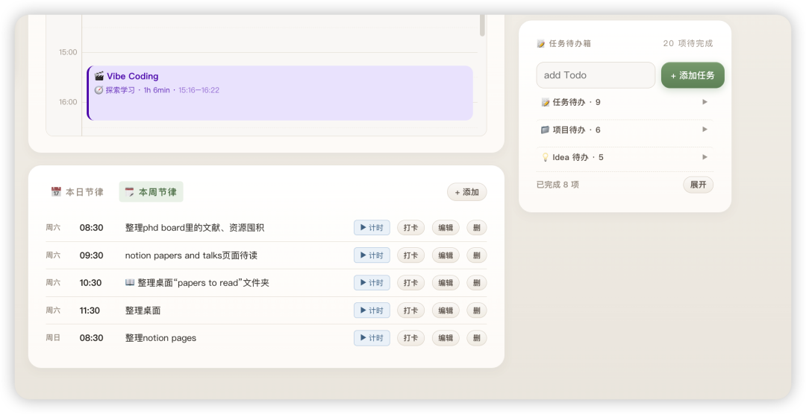

阶段性忙完一些事情，可以来向宇宙传播能量了！

突发奇想，准备开一个像「走出OB新手村」的系列合集([科研素养upup的好东西！](https://mp.weixin.qq.com/mp/appmsgalbum?__biz=MzU1MzY1MjIxOQ==&action=getalbum&album_id=4296937583038660609#wechat_redirect))，更新一下我最近对于AI的使用，也欢迎大家共同分享与碰撞。

本人只把AI当工具，对于其中一些专业名词和原理并不精通，欢迎批评指正。

1. 文件整理与重命名

AI工具：Cursor/Codex/Claude Code（其实任何可以访问电脑权限、直接修改文件的agent都可以）

本人核心痛点：从网站上下载论文的时候，文件名总是很不一致，对于强迫症非常不友好。

之前我可能会拖入zotero进行整理归类，因为zotero也可以直接通过插件对于源文件进行命名整理。—— 直到我的zotero目前有了5000+papers，真的越来越卡了... 而且分类层级也不如桌面文件夹那么丝滑，发送原PDF的时候还要回到层层嵌套的根目录（一个文件夹中的文章通常分布在不同的根目录中），最近我几乎已经不宠幸它了。（文献citation我都用mybib这个网站；看文献也不再需要zotero翻译插件；划线用PDF expert也非常之丝滑 比卡卡的zotero好太多了！）

所以现在直接大道至简！使用文件夹进行文件整理。这时候使用agent来帮助重命名就会非常方便。当然有人也会让AI直接对混乱的桌面进行收纳整理，但对我来说我还是有一个自己的分类逻辑，如果是超级P人可以这么试试。

使用方式：直接大白话就行。把你想要重命名的格式发给它 它会火速一键整理好。

2. Vibe Coding

AI工具：Cursor/Codex/Claude Code

本人核心痛点：作为土生土长心理学+NF人，对于产品的感知力非常高，虽然尝试了很多款时间管理工具，总是能找到不满足需求的地方。幸好Vibe Coding的时代来了！人人都可以是产品经理！每个人都可以根据自己的需求来设计个性化的产品，简直美哉！

虽然之前用Notion也可以实现很多项目管理，但有时候页面创建地太多，反而会迷失，或者是长期下来，有些页面创建了之后也根本没有点进去几次。

我想到最近读的AMJ Paper（虽然里面讲的是不同算法的逻辑 但是对我的启发是关于信息呈现的方式）：比起线性的信息呈现方式，反而是那些网状的、发散的呈现方式更有益于创意生成。

Lazar, M., Lifshitz, H., Ayoubi, C., Emuna, H. (2025). Would Archimedes Shout “Eureka” with Algorithms? The Hidden Hand of Algorithmic Design in Idea Generation, the Creation of Ideation Bubbles, and How Experts Can Burst Them. Academy of Management Journal, 68(5), 881-906. https://doi.org/10.5465/amj.2023.1307

遵循着这个思路，我想到我的个人管理其实并不能是线性的，而应该是一个系统（年初读的《纳瓦尔宝典》和《卡片笔记写作法》均有强调建立系统比单纯地设定目标更有用）。

而系统一词的背后，其实就是不同的节点互相关联，这种复杂的联动方式就无法通过单纯的封装软件管理，而是需要根据自己个性化的方式搭建系统。而之前，如果要足够个性化，就必须习得底层代码（这个区分其实就是SPSS和R的区别），然而AI时代，Vibe Coding可以让我们不用任何软件开发的代码，就可以用自然语言提出需求，来创建独属于我们自己的系统。

（但是不懂代码可能就是会烧太多token... 或许我之后可以再写一篇我目前如果配置AI 相对省钱的方式....)

我的个人系统示范：

首页主要是我的每日时间记录（本人非常佛系地落实可持续发展的原则，坚持每天学4H就已经谢天谢地，每周学28H就已经仁至义尽。绝不强求自己太多，绝不让自己陷入burnout状态）。

另外的巧思是，我把4H的学习设计成了电池充电的样子。因为虽然本人不能狂学，但也不能不学、让脑子陷入沉寂和呆滞状态，适当地学习和思考对我来说反而是充电。

右上角还可以看到最近项目的推进情况 让我雨露均沾一下... 下方根据自己的routine设置了一些每天、每周要做的事情，是一种我自己定期进行熵减、不要处于混乱的提醒系统。

写到这里，突然感觉要是详细写我最近vibe coding的这个系统的逻辑，就有点太多了... 之后再说吧！ 这个系列还是先写写AI可以实现的事情吧！
