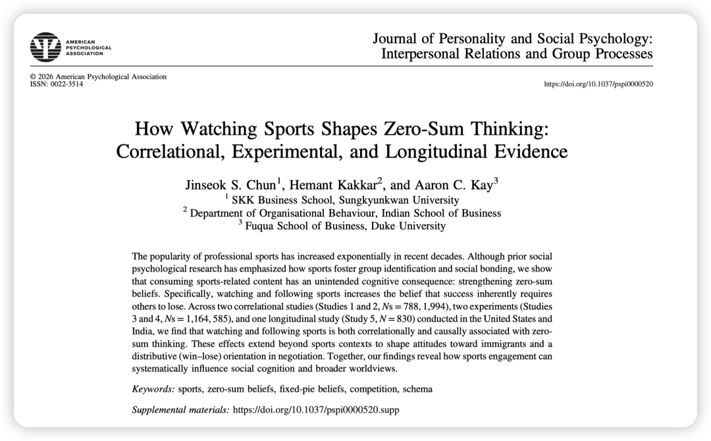
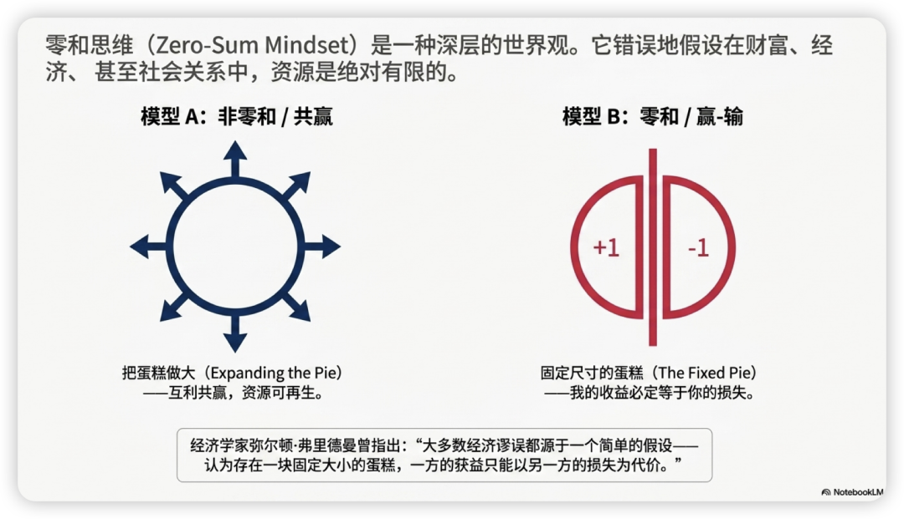
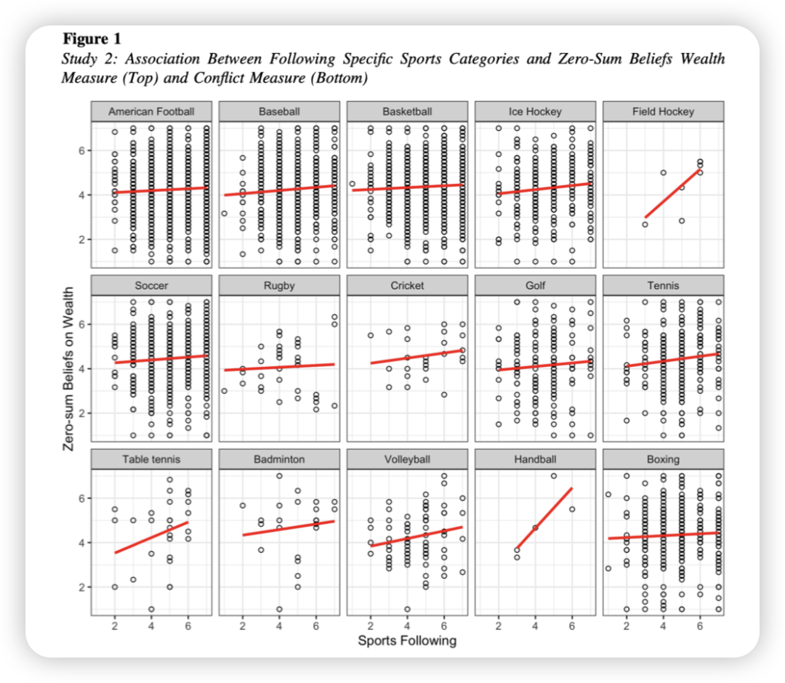
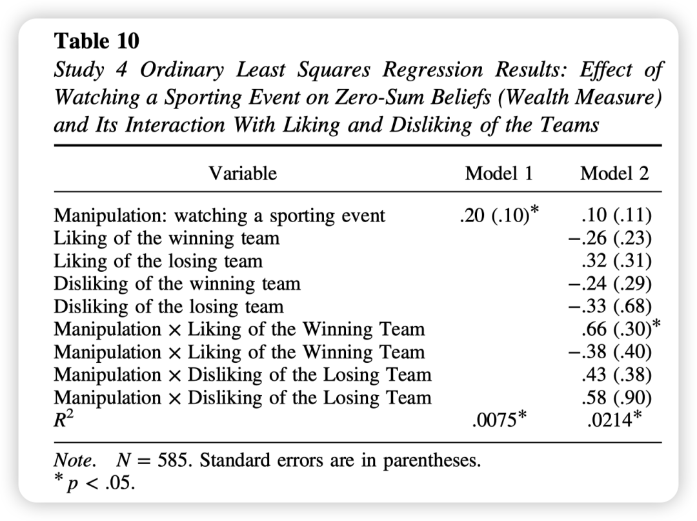
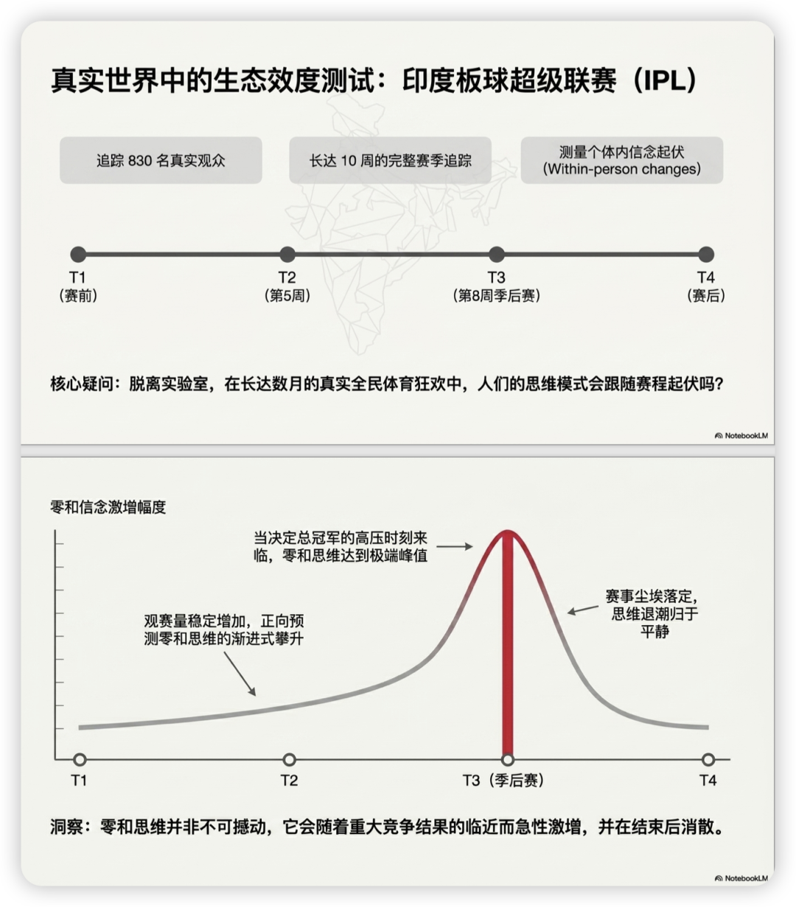

> citation: Chun, J. S., Kakkar, H., Kay, A. C. (2026). How watching sports shapes zero-sum thinking: Correlational, experimental, and longitudinal evidence. *Journal of Personality and Social Psychology*. https://doi.org/10.1037/pspi0000520

### 写在前面

起先我是在文献互助群发现有群友在找这篇文章，当时不知道发在哪个期刊。但看到这个标题我的第一反应是：oh 好扯…

直到后面有人发出pdf，我一看是JPSP，突然又多思考了5秒，觉得：嗯..还真是有点道理的…

（警惕我这种顶刊正确论…）

不过也许social science的目的就是这样一点点拓展人类思考的边界、扩宽一些从未思考过的思想疆域吧🤔。就像在心理学和哲学之前，“我”这个概念也是从未有人思考过的。我们就是这样一点点know myself & ourselves & the world better的！

### 推荐原因

- 学习作者theorizing的方式，如何从sports推理到zero-sum thinking，并不断拔高立意到更实际的downstream outcomes，如对移民的态度、冲突谈判倾向。

### Puzzle

**1. What broad management question does this research project address?**

哪些日常社会行为和环境因素会滋生并强化人们的“零和思维”（Zero-sum beliefs）？

**2. Why is this puzzle important?**
零和思维会对社会的协同与发展造成巨大破坏。在现代社会中，繁荣往往依赖于多方的合作与协同创造。然而，零和思维会导致人们相互猜忌、加剧群体间冲突（如排斥移民）、并阻碍互利共赢的经济或人际互动（如在谈判中放弃“做大蛋糕”）。因此，探明这种破坏性思维的起源具有重大的理论和现实意义。

**3. How does prior research address the puzzle?**

- **先前研究：** 以往关于零和思维前因的研究，主要聚焦于宏观经济状况（如经济衰退）、社会不平等的动态变化以及组织内部的竞争性实践。现有研究假设零和思维主要由个人无法控制的宏观结构性或情境性力量驱动；而在体育心理学领域，过去的文献大多集中于探讨体育如何促进群体的内群体认同（ingroup identification）和社会纽带。
- **现有研究的空白与局限：** 过去的文献忽视了人们日常主动选择的文化消费活动（如观看体育比赛）如何塑造广泛的社会认知。同时，体育界的研究极少关注体育内容“消费者”（观众）在脱离特定群体忠诚度后，其底层世界观是否发生了改变。

### Research Question

**1. What specific question does this research answer?**

观看和关注竞技体育比赛是否会增加人们普遍的零和信念？ 这种信念的增强是否会进一步导致对外部群体（如移民）的排斥以及在人际谈判中偏好“输赢分配”（distributive）而非“合作共赢”（integrative）？

**2. WHY should we expect these relationships between constructs? (Mechanisms)**

- **理论视角：** 认知图式理论（Cognitive Schema Theory）。该理论认为，人们的世界观是由日常经验逐渐抽象和组织而成的认知结构。
- **关系解释（机制）：** 竞技体育在结构上具有明确的“赢家-输家”设定，结果鲜明且极具显著性。观众在反复观看和投入情感的过程中，**通过两条路径形成零和图式：**

- **长期路径（慢性）：** 长期持续的体育关注会让“成王败寇”的竞争动态逐渐形成稳定的零和思维图式。
- **短期路径（急性）：** 即便是短暂观看一场竞争激烈的比赛，也会作为一种情境线索，瞬间激活并强化这种零和信念。这种在体育场上形成的“一方赢即是让另一方输”的图式，会泛化到其他社会领域（如财富分配和谈判）。

### 方法Package简介

研究团队通过5项研究（横跨美国和印度）验证了假设：

- **Study 1 & 2（相关性研究）：** 调查美国观众对城市球队及总体体育运动的关注度。结果发现，体育关注度不仅预测了群体认同，还显著正向预测了财富与冲突领域的零和信念，并间接导致对移民的更负面态度。

- **Study 3 & 4（实验研究）：** 将参与者随机分配观看“激烈的比赛片段”（实验组）或“无竞争性的体育教学视频”（对照组）。结果表明，仅观看3分钟的竞技比赛就能因果性地提升零和信念，进而导致在虚拟谈判中更倾向于采用分配型（输赢）策略。

**球迷身份的放大作用**：探索性分析表明，当参与者不仅观看了比赛，而且本身就是视频中**获胜球队的粉丝**时，这种观看行为对零和信念的提升作用会被进一步放大
- **Study 5（纵向追踪研究）：** 以印度超级板球联赛（IPL）为背景，进行了为期10周的追踪。研究发现，个体内在的体育观看量增加，能预测其零和信念的上升；且这种信念在决定冠军的季后赛期间达到顶峰，在赛季结束后回落。

### 结果：

- **体育消费与零和思维呈正相关且具有因果联系：** 无论是在相关性调查、随机对照实验，还是在真实的纵向体育赛事追踪中，观看和关注竞技体育都一致地强化了零和思维。
- **“竞争动态”是核心诱因：** 实验证明，增加零和思维的不是体育内容本身（对照组也看了体育内容），而是体育中“非胜即败”的竞争动态。
- **负面的下游社会效应：** 由体育激发的零和思维，显著预测了**对移民的负面排斥态度**（群际效应），以及在**商业谈判中更关注切蛋糕而非做大蛋糕的分配型倾向**（人际效应）。
- **时间维度的波动：** 零和思维会随着赛事进程发生波动，在关键的淘汰赛/决赛前达到峰值，证明了环境线索对认知图式的瞬时激活作用。

### 理论贡献与实践贡献

- **理论贡献：**

- **扩展了零和思维的前因文献：** 将零和思维的驱动因素从宏观的社会经济不可控变量，拓展到了个人日常主动参与的微观行为（媒体与体育消费）。
- **完善了体育心理学的双刃剑图景：** 挑战了仅仅将体育视为“社会粘合剂”的单向视角，指出体育虽然能促进内群体团结，但也会导致认知世界观的两极分化，加剧群际对立。
- **对认知图式理论的实证支持：** 在自然情境下展示了日常生活经验如何抽象为广泛的社会信念并产生泛化。

- **实践贡献：**

- **警示不断扩张的体育产业的社会影响：** 提醒政策制定者和组织管理者，大规模的体育狂热可能在无意中削弱社会的合作潜力与包容度。
- **谈判与组织管理的干预启示：** 在商业谈判或团队协作中，如果员工沉浸于高度竞争的体育文化，管理者可能需要额外进行“非零和（双赢）”心智的引导与干预。
- **重塑体育叙事：** 建议体育媒体和教育机构在宣传中，适当将注意力从“队伍间的对抗”转移到“团队内部的合作”或“个人努力的成长”上，以减轻零和思维的负面溢出效应。
