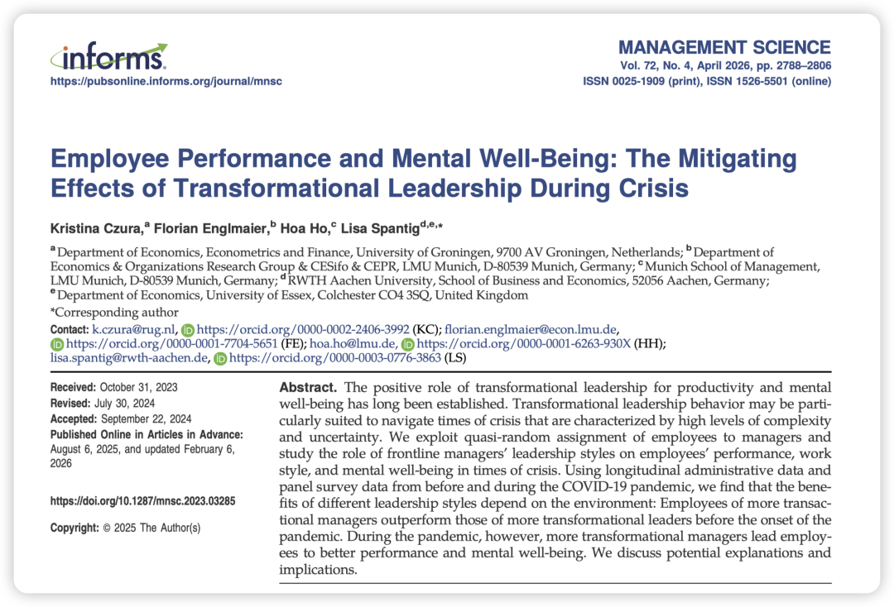
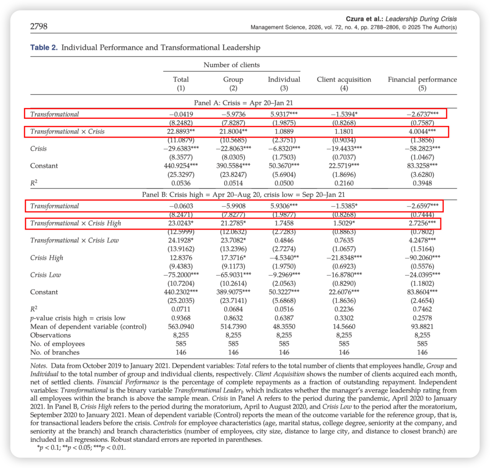
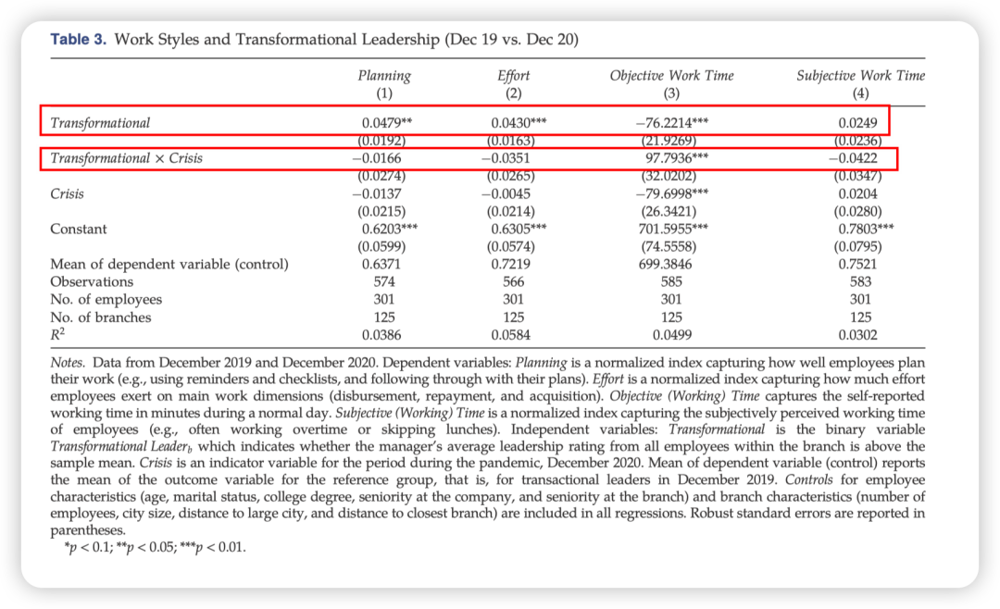
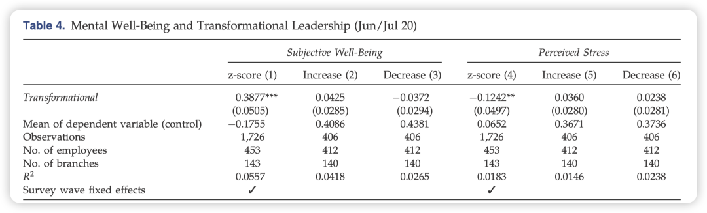
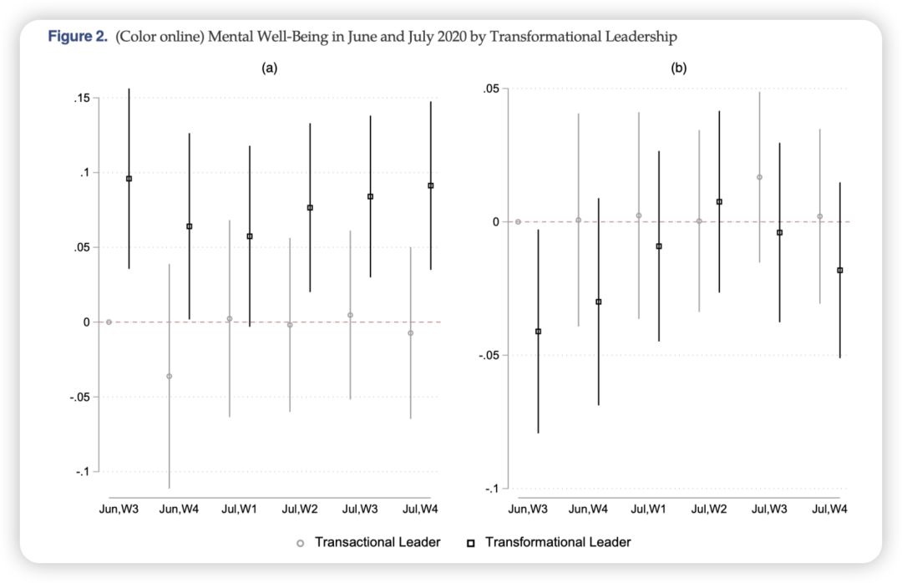

> Czura, K., Englmaier, F., Ho, H., & Spantig, L. (2026). Employee Performance and Mental Well-Being: The Mitigating Effects of Transformational Leadership During Crisis. *Management Science*, *72*(4), 2788–2806. https://doi.org/10.1287/mnsc.2023.03285

### 写在前面

昨天瞎翻informs官网偶然看到这篇，还以为自己看错了。

*做的是transformation leadership？2026年最新的？context竟然还是covid-19？发在了Management Science上？哈？*

带着这些好奇… 我开始阅读…

### 可能的原因...

- 珍贵的Data（结合了危机前后长达16个月的逐月客观绩效数据及问卷数据）
- 实验设计：Quasi-random experiment。在印度一家小额信贷机构中将员工“准随机分配”给一线管理者，避免内生性问题。

### Puzzle

**1. What broad management question does this research project address?**

在不同复杂程度的环境下（尤其是面对突如其来的危机时），何种领导风格（变革型 vs. 交易型）能最有效地促进员工绩效并维护其心理健康？

**2. Why is this puzzle important?**

危机（如COVID-19疫情）被视为复杂性的重要来源，它引入了新的任务，大幅增加了环境的不确定性，导致**常规的基于绩效的契约和激励机制（交易型手段）往往会失效或被迫暂停**。了解在高度复杂和不确定的环境中，领导者应如何调整或依赖特定的领导风格来维持组织的运转和员工的身心健康，对于组织的危机管理与韧性建设至关重要。

**3. How does prior research address the puzzle?**

- **先前研究：** 以往的元分析指出变革型领导力通常对生产力或幸福感产生积极影响，但也有研究表明交易型领导力同样有益。Zehnder等（2017）提出，**最优的领导风格应当取决于环境及其复杂程度**。在危机管理文献中，有研究提出变革型领导力与员工韧性和危机管理正相关。
- **现有研究的假设及其准确性：** 在任务维度低、环境稳定的简单环境中，由于任务易于契约化和量化评估，交易型领导者依赖的绩效激励机制运行良好。而在任务多维且不稳定的复杂环境中，契约难以制定，变革型领导者通过愿景和认同感激发内在动机，会表现得更有效。
- **现有研究的空白与局限：** 尽管Zehnder等提出了上述理论，但**缺乏实证证据的支持**。现有关于危机领导力的研究大多面临**方法论上的局限性**（如难以解决内生性问题），且大多聚焦于企业高层（如CEO），**极少关注频繁与员工互动的一线管理者的作用**。此外，很少有研究在同一情境下同时考察绩效和心理健康这两个结果变量。

### Research Question

**1. What specific question does this research answer?**

在一家印度小额信贷机构中，一线管理者的变革型领导风格（相对于交易型）如何在新冠疫情爆发前（低复杂性）和爆发期间（高复杂性），差异化地影响基层员工的客观财务绩效、工作方式以及主观心理健康？

**2. WHY should we expect these relationships between constructs? (Mechanisms)**

- **理论视角：** 基于Zehnder等（2017）关于“环境复杂性（任务维度和环境稳定性）决定领导风格有效性”的观点。
- **关系解释（机制）：**

- **低复杂性/常态下（危机前）**：小额信贷员工的任务可以通过发放贷款数、还款率等指标清晰衡量，且存在强有力的绩效工资制度。此时，**交易型领导者通过物质激励来对齐员工与组织的目标，能够实现最优的财务绩效**；而变革型领导投入精力构建愿景的成本可能无法通过绩效提升来弥补，甚至可能分散员工对财务指标的注意力。
- **高复杂性/危机中（疫情期间）**：由于封城和债务延期偿付政策，工作环境高度不确定，传统的绩效激励机制停滞，契约失效。此时，**变革型领导者通过建立共同使命感和职业认同感，激发员工的内在动机**。违背这种认同感会产生内疚感等心理成本，因此即使没有外部奖励，员工也能自我驱动完成工作（展现出更高的财务绩效和工作时间投入）。同时，变革型领导的鼓舞和支持还能有效**缓解疫情危机带来的焦虑，提升员工的心理健康水平**。

### 方法Package简介

- **研究背景**：印度一家大型非营利性小额信贷机构，样本包含146个分支机构、144名一线管理者及585名信贷员（员工）。
- **核心数据**：

- **面板行政数据**：2019年10月至2021年1月的逐月客观绩效数据（包括处理的客户数、获取的新客户、贷款财务绩效等）。
- **问卷调查数据**：危机前后的基线与末期调查（测量员工工作方式、努力程度），以及疫情期间（2020年6-7月）连续六周的COVID调查（测量主观幸福感和感知压力）。

- **变量测量**：利用Global Transformational Leadership问卷测量领导风格。为了避免危机导致的内生性感知偏差，**自变量使用的是危机前（Pre-crisis）员工对管理者领导风格的评分均值**，以此将管理者二元分类为“偏变革型”或“偏交易型”。
- **识别策略**：

- **准随机分配**：利用机构中心化和轮岗驱动的招聘配置政策，验证了员工特征在不同领导风格间的平衡性，排除员工与管理者间的选择性匹配（Selection bias）。
- **双重差分模型（DiD）与简单差分**：利用时间维度（危机前 vs. 危机中）和领导风格维度，考察绩效与工作方式的差异化变化；利用横截面/面板回归考察疫情期间的心理健康差异。

### 结果：

- **财务绩效的反转**：

- **危机前（环境简单稳定）**：在有高强度激励机制的常态下，**交易型管理者的员工在财务绩效上显著优于变革型管理者的员工**（财务绩效高出2.7个百分点）。
- **危机中（环境高度复杂）**：疫情爆发后，所有员工绩效普遍下降，但**变革型管理者的员工不仅弥补了危机前的财务绩效劣势，甚至在财务绩效上反超了交易型组**（高出4.0个百分点，且无论是高不确定性时期还是低不确定性时期均是如此）。

- **工作方式的变化**：

- 危机前，变革型领导下的员工计划性和努力程度更高，但客观工作时间较短。
- 危机期间，**交易型领导下的员工客观工作时间大幅缩减（因常规监管和激励失效），而变革型领导下的员工则保持了稳定的工作时间投入**。

- **心理健康的提升**：在危机高峰期（2020年6-7月），**变革型管理者手下的员工表现出显著更高的主观幸福感和更低的感知压力**。

### 理论贡献与实践贡献

**理论贡献：**

- 为Zehnder等（2017）的理论提供了**首个实证证据**，证实了领导风格的最优选择取决于环境复杂性——简单的环境适合交易型领导，复杂的危机环境适合变革型领导。
- **拓展了危机领导力研究**：克服了过去文献中的内生性缺陷，通过准随机分配的自然实验实现了因果推断；并将视角从战略层面的高管下沉到**真正在危机中指导基层员工的一线管理者（Frontline managers）**。
- **统一绩效与心理健康的双重视角**：在同一研究框架内同时揭示了变革型领导力不仅能充当危机时期的生产力缓冲器，还能提升员工的心理健康。

**实践贡献：**

- **因时制宜的领导力应用**：组织应认识到，在日常运营中，基于奖惩和明确目标的交易型领导力是非常高效的；但在突发危机、常规绩效考核工具失效时，组织**必须依赖或及时切换至变革型领导力**来维持业务并稳定军心。
- **重新评估领导力投资的ROI**：虽然在平稳期培养变革型领导者可能短期内看不出财务回报（甚至略低于交易型）并且需要付出极高的时间沟通成本，但它在降低员工心理压力、提升危机时期的员工留存率以及构筑企业韧性方面具有**长期战略价值**。
