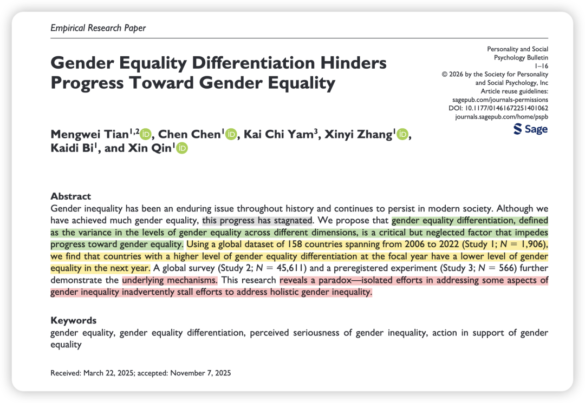
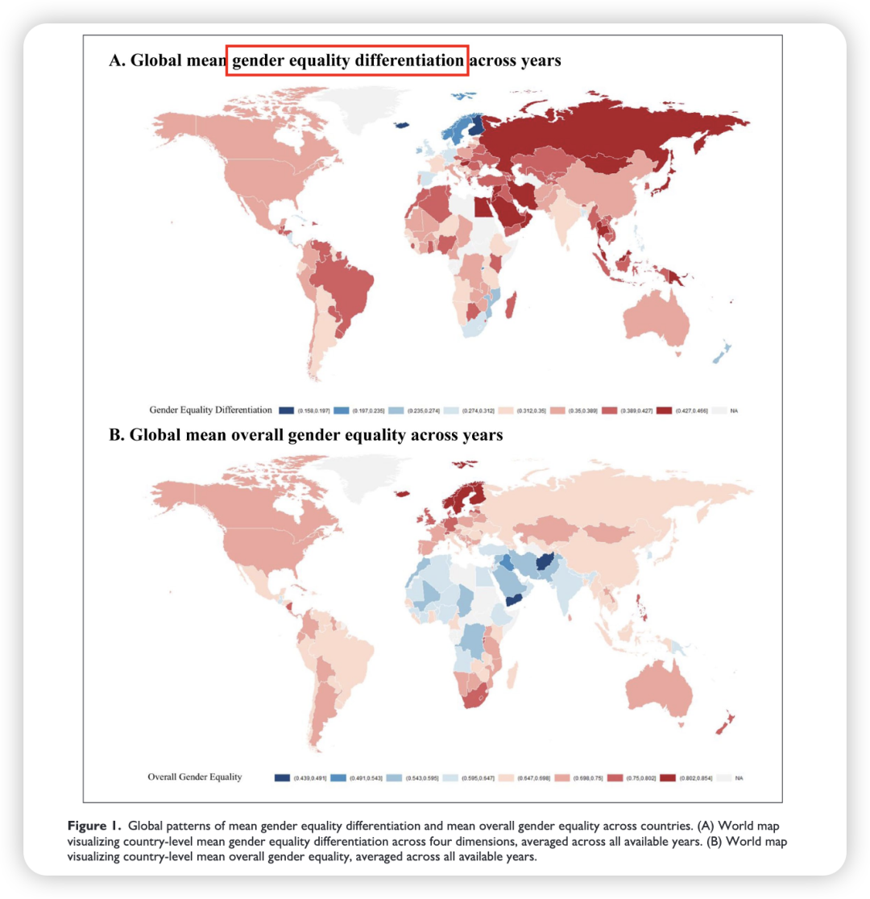
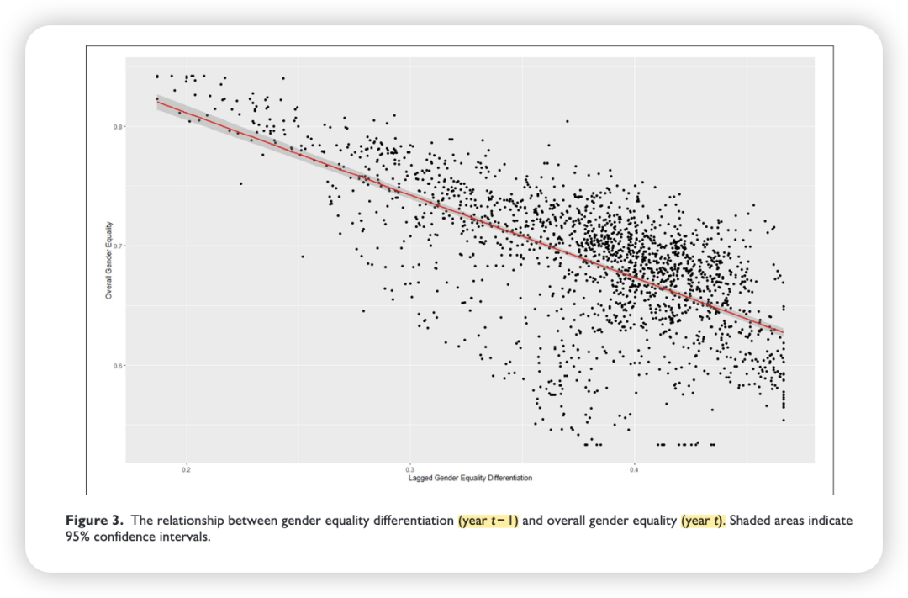
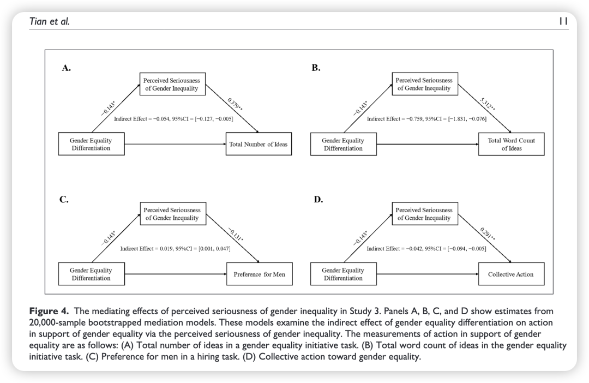

### 

### 

### Tian, M., Chen, C.*, Yam, K. C., Zhang, X., Bi, K., & Qin, X.* (2026). Gender equality differentiation hinders progress toward gender equality. Personality and Social Psychology Bulletin. https://doi.org/10.1177/01461672251401062

### 

### 推荐原因

1、前几天群友转发了一则Strategy Science的editorial文章“The Five Essentials of a Modeling Paper”，虽然这个editorial针对于modeling paper，但我觉得里面的tips对OB paper也适用，我也在不少顶刊workshop中零散听到过类似观点。

其中第三点“模型应尽可能简洁”逐渐成为了近几年的趋势。大家对于冗长的如“八角蜈蚣”一样的机制有些望而生畏、也有些食之无味…逐渐不再相信这种复杂模型的prediction。

在可重复性日益受到重视的时代（[顶刊阅读计划 31｜Nature-2026-社会科学和行为科学可复制性的最新研究！](https://mp.weixin.qq.com/s?__biz=MzU1MzY1MjIxOQ==&mid=2247486464&idx=1&sn=11bf311e1949bb57b172945186917ea3&scene=21#wechat_redirect)），用多个研究讲清楚一件事情、用一句话概括论文的故事、传达一个深入人心的结论，也许是当下删繁就简、但要求也绝对不低的生存方式。

这篇PSPB的文章就用2个二手数据+1个预注册实验讲清楚了一件事情，真的深入人心，推荐！

2、另外，这篇文章的切入方式其实和昨天这篇AMJ异曲同工（[顶刊阅读计划 32｜AMJ-2026-通过人力资源实践来营造工作-生活包容氛围](https://mp.weixin.qq.com/s?__biz=MzU1MzY1MjIxOQ==&mid=2247486475&idx=1&sn=a123e279f4f0d6444ec3efff26604024&scene=21#wechat_redirect)）！都是从现有方案/政策无法解决固有问题的视角切入：“These patterns suggest that **existing approaches** to understanding gender inequality **may not fully capture the dynamics that impede sustained progress**.”

3、我喜欢这篇文章的理论和结论。在某种程度上，我们都生活在信息茧房之中，因此更需要“见树又见林”。局部的进步固然令人欣喜，但唯有始终留意“远方的哭声”，才能让我们更全面地看待世界中的问题，从而真正推动问题的解决。

### Puzzle

**1. What broad management question does this research project address?**

尽管各国政府、活动家和学者在推动经济参与、教育、健康和政治赋权等维度的性别平等上投入了大量资源，但性别不平等现象依然顽固存在，且进展极其缓慢甚至陷入停滞。

**2. Why is this puzzle important?**

按目前的进展速度，全球实现完全的性别平权估计还需要132年。更严峻的是，2022年的数据显示，全球有40%（58个）国家的性别平等进展不仅停滞，甚至出现了倒退。这表明现有解决性别不平等的方法可能未能完全捕捉到阻碍社会持续进步的潜在动态，因此理解这一僵局背后的原因至关重要。

**3. How does prior research address the puzzle?**

- **先前研究：**先前研究主要通过“性别平等悖论”（gender-equality paradox）来解释这种持续存在的差异，即在整体性别平等程度较高的国家，某些特定领域（如价值观、职业选择、偏好等）反而有时会出现更大的性别差异。
- **现有研究的假设及其准确性：**现有的研究倾向于将“性别平等”视为一个单一的、统一的概念，在研究时要么只考察一个国家的整体性别平等水平（平均值），要么只孤立地关注某个特定领域内的平等情况。
- **现有研究的空白与局限：**性别平等本质上是多维度的，在现实中，各个维度的进展往往不同步，导致一国内部各领域的发展呈现不均衡的模式。现有研究忽略了性别平等发展的“配置形态”（configuration），没有解答当国家内部不同维度的性别平等发展不均衡时会发生什么，以及这种不均衡本身是如何导致不平等现象持续存在的。

### Research Question

**1. What specific question does this research answer?**

性别平等分化（Gender equality differentiation，即不同维度之间性别平等水平的差异/方差）是否会阻碍整体性别平等的进展？孤立地解决某些维度的性别不平等问题，是否会无意中拖延了解决整体性别不平等的努力？

**2. WHY should we expect these relationships between constructs? (Mechanisms)**

- **理论视角：****系统合理化理论**（System justification theory）。该理论认为，人们有动机去证明和捍卫现状，倾向于将当前的系统视为公平、合法和可取的，以此来减少不确定性并维持心理舒适度。
- **关系解释：**性别平等分化为维护现状提供了温床。当平等与不平等的领域共存时，会释放出关于性别平等整体状况的“混合信号”。在高度分化的环境中，人们倾向于进行选择性和有偏见的信息处理：**他们会将注意力集中在那些性别平等已取得长足进展的领域，同时淡化、忽视或记错那些仍然存在严重不平等的领域**。这种认知偏差会**显著降低个体对“性别不平等严重性”的感知（Perceived seriousness of gender inequality）**，进而削弱他们采取实际行动去推动性别平等的动机，最终导致整体平权进展停滞。

### 方法Package简介

本研究采用了混合方法设计，结合档案数据与实验，包含三个互补的子研究：

- **Study 1（跨国宏观档案研究）：**使用世界经济论坛《全球性别差距报告》（覆盖158个国家、2006-2022年的1906个观测值），在国家层面检验焦点年份的“性别平等分化”对次年“整体性别平等进展”的预测作用。

- **Study 2（全球调查数据分析）：**结合《世界价值观调查》（WVS，含46国、45611名受访者数据），在个体层面检验性别平等分化与机制变量（感知到的性别不平等严重性）之间的关系。
- **Study 3（预注册实验研究）：**招募566名参与者，通过实验材料操纵性别平等分化程度，探究“感知到的性别不平等严重性”在性别分化程度与“支持性别平等的行动”（如提出平权倡议的数量/字数、招聘中的性别偏好、集体行动意愿等）之间的中介作用。

### 

### 结果：

- **宏观进展受阻（Study 1）：**在控制了GDP、人口年龄、失业率、政治稳定性等变量后，一个国家在第一年的性别平等分化程度越高，其第二年的整体性别平等水平就越低，二者存在显著的负向关联。
- **问题严重性感知下降（Study 2）：**生活在性别平等分化程度较高国家的人们，更不可能将性别不平等视为本国面临的最严重社会问题。
- **行动意愿与中介效应（Study 3）：**在控制整体平等水平不变的情况下，暴露于高分化信息中的个体对性别不平等严重性的感知显著降低；这种感知的降低进而导致他们支持平权的行动显著减少（包括提出的倡议变少、招聘时更偏好男性、集体平权行动意愿降低），验证了完整的间接中介效应。

### 

### 理论贡献与实践贡献

**理论贡献：**

- **转换了性别平等的研究焦点：**从单纯关注整体平等水平，转向关注性别平等发展的“配置”（即内部维度的均衡度），提出了“性别平等分化”这一被忽视的关键阻碍因素。
- **揭示了“分化惯性”（Differentiation inertia）：**解释了为何社会投入大量资源后，根除性别不平等的进展仍然举步维艰，丰富了关于持续性不平等的文献。
- **拓展了系统合理化理论：**证明了不均衡的发展结构为个体合理化现状提供了信息处理空间，导致对社会问题严重性的认知被削弱。

**实践贡献：**

- **对政策制定者的启示：**挑战了常见的“集中战略”（即优先集中资源发展某一维度的平等）。研究警告，这种孤立努力会导致分化加剧，从而产生适得其反的悖论。政府应仔细评估在推动平权时“均衡发展”与“集中发展”战略的利弊。
- **对媒体与沟通策略的建议：**政府、NGO和媒体在进行公共沟通时需十分谨慎。为避免公众产生自满情绪并激励行动，将公众的注意力吸引到那些**仍然高度不平等的维度**上，比仅仅宣扬在个别维度上取得的成就更为有效。
