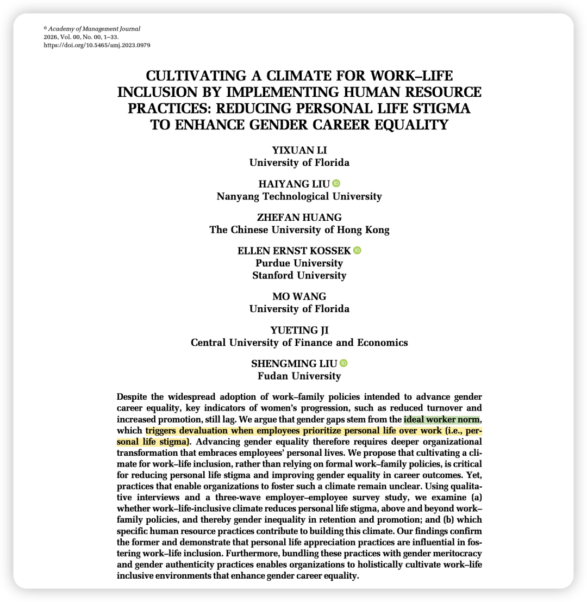
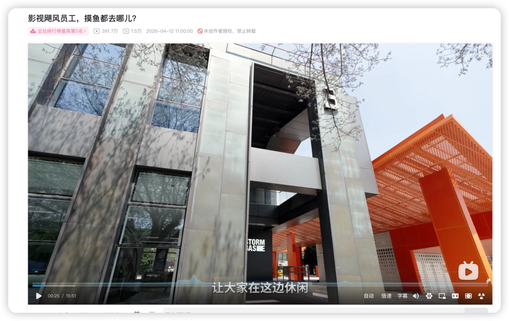
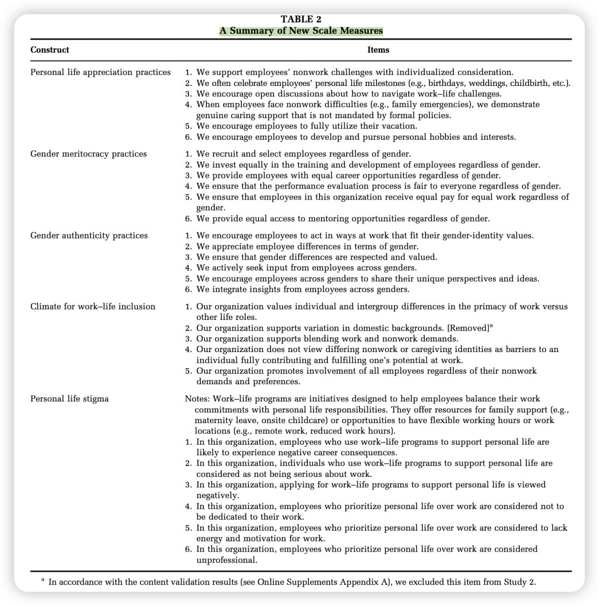
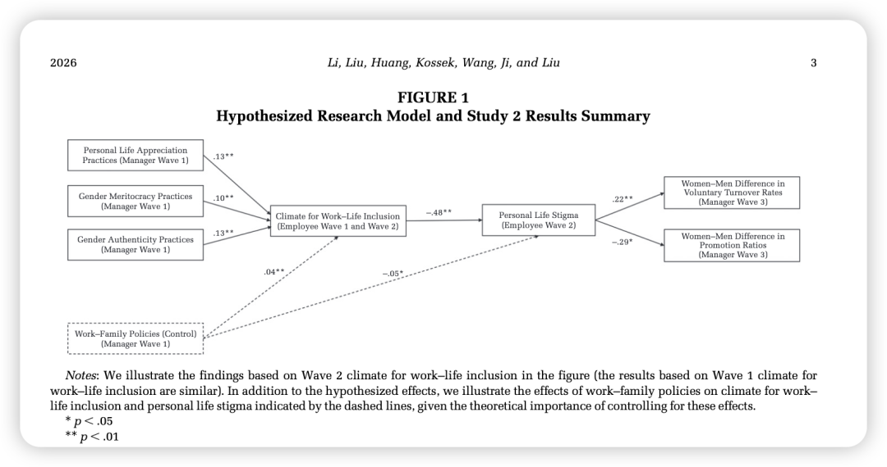

DOI: https://doi.org/10.5465/amj.2023.0979

### 写在前面

刚看完影视飓风休息区的视频，就想到了前几天看到的AMJ最新的这一篇，遂来写之。

我对于这个话题的感情在这期里写过([Bubble｜困顿的下午，写写最近的小小感悟](https://mp.weixin.qq.com/s?__biz=MzU1MzY1MjIxOQ==&mid=2247486410&idx=1&sn=25f8672126cf59936faed335441d3a88&scene=21#wechat_redirect))。在AI时代我愈发觉得这个话题重要且必要，我观察到的小红书上那些能在本职工作之外把AI用得如鱼得水、为自我赋能变成超能力的人，无一例外都是对于personal life充满着探索、好奇之人。

好吧离题了… 让我们一起看看AMJ对于这个话题的探索吧！

### 

### 推荐原因

### 

- 切入非常简单的一篇，主要的gap就是：仅靠单纯的work- family policy不足以弥合职业性别鸿沟，改变「ideal worker norms」才是解决问题的根源。
- 实践价值高于理论价值的一篇，对于组织设计会很有帮助。比如创建了很多与实践相关的量表（如个人生活欣赏实践、性别绩效主义实践、性别真实性实践），这些对于企业的HRBP们有很大的参考价值：

### 

### Puzzle

**1. What broad management question does this research project address?**本研究探讨了组织如何通过实施人力资源实践来有效推进职业发展中的性别平等，并实质性地支持员工的非工作生活。

**2. Why is this puzzle important?**尽管许多组织为了推进性别平等广泛采用了工作-家庭政策，但女性在留任率和晋升率等关键职业指标上依然落后。性别差距的根源在于职场中普遍存在的**理想工作者规范（ideal worker norm）**，该规范要求员工将工作置于生活的绝对优先地位。当员工将个人生活置于工作之上时，这种规范会引发对他们的贬低和惩罚，即**个人生活污名（personal life stigma）**。由于社会观念通常默认女性承担更多的照顾家庭责任，女性在这种强调“工作第一”的环境中遭受了更严重的职业负面影响。

**3. How does prior research address the puzzle?**

- **先前研究：**以往的研究和企业实践主要依赖于引入**正式的工作-家庭政策**（例如：弹性工作时间、远程办公、产假、提供托儿服务等），以帮助兼顾家庭需求的员工，并试图借此缩小性别职业鸿沟。
- **现有研究的假设及其潜在问题：**现有研究通常假设，只要组织提供了这些工作-家庭政策，就能自动促进平等的职业成果并提升组织有效性。然而，这一假设并不准确，因为存在“政策与实践脱钩（policy–practice decoupling）”的现象。政策写在纸面上并不意味着员工敢于使用，使用这些政策往往被视为违反了“理想工作者规范”，会引发职业报复和惩罚。此外，以往关于多元化氛围的研究往往过于宽泛，缺乏对工作-生活领域具体内涵的关注，未能直接针对性别不平等的根源提出解决方案。在污名化研究方面，过去的文献多局限于个体层面的因素和政策使用者本身，忽略了可以系统性缓解污名的宏观组织氛围，以及污名对整个组织层面的性别职业差距的影响。

### 

### Research Question

### 

**1. What specific question does this research answer?**本研究解答了两个具体问题：

（a）工作-生活包容性氛围（climate for work-life inclusion）是否能超越单纯的工作-家庭政策，更有效地减少个人生活污名，从而缩小组织在留任和晋升方面的性别不平等？

（b）组织应采用哪些具体的人力资源实践组合来成功培养这种工作-生活包容性氛围？

**2. WHY should we expect these relationships between constructs? (Mechanisms)**

- **理论视角：**本研究结合了组织中的性别理论（Ely & Meyerson, 2000）、工作-家庭相互依存视角（work-home perspective）、制度理论，以及污名化过程理论（Link & Phelan, 2001）。

- HR实践如何促进包容性氛围：

(1)个人生活欣赏实践（Personal life appreciation practices）通过支持和庆祝员工非工作领域的里程碑，直接挑战了理想工作者规范，为包容性氛围提供了强烈的象征和工具性支持。

(2)性别绩效主义实践（Gender meritocracy practices）确保性别中立的公平对待，比如公平的招聘与发展支持.

(3)性别真实性实践（Gender authenticity practices）积极肯定并整合性别差异，这两者通过保障公平与包容多样性，共同促进了员工对工作-生活包容性氛围的集体认知。

- 包容性氛围如何减少污名：

在工作-生活包容性氛围下，组织珍视并支持员工在工作与生活优先级上的差异。这种氛围打破了“奉献于工作是唯一标准”的叙事，使得将个人生活置于工作之上的选择不再被贴上“不专业”或“缺乏奉献精神”的标签，从而削弱了引发个人生活污名的刻板印象和群体隔离.

- 减少污名如何促进性别平等：

一旦通过包容性氛围消除了个人生活污名，女性寻求工作与生活平衡的障碍被打破，她们因非工作原因（如家庭顾虑）离职的意愿会降低（从而缩小男女自愿离职率差距）；同时，她们更少遭受绩效评估中的系统性偏见，凭借独特的视角和价值获得认可（从而缩小男女晋升比例差距）。

### 

### 方法Package简介

本研究采用定性与定量相结合的混合研究方法。

- **研究1（定性研究）：**对中国跨行业的36位人力资源经理进行了深度访谈，采用主题分析法（Thematic analysis）验证并提炼了能够促进包容性氛围的三种核心HR实践包。
- **研究2（定量研究）：**对来自中国231家企业的雇主与员工进行了三阶段（时间跨度）、多源匹配的问卷调查（共有2290名员工参与）。此外，还使用美国样本完成了新量表的开发和内容效度验证。采用多层线性模型检验了HR实践组合、工作-生活包容性氛围、个人生活污名，以及组织层面男女自愿离职率与晋升率差距之间的中介机制。

### 

### 结果简介

### 

- **工作-生活包容性氛围的前因：**在控制了正式的工作-家庭政策后，**个人生活欣赏实践、性别绩效主义实践以及性别真实性实践均能显著正向预测工作-生活包容性氛围**，且这三种实践包在提升包容性氛围方面的解释力远远超出了单纯提供工作-家庭政策。
- **氛围与污名的负相关：**工作-生活包容性氛围对个人生活污名具有显著的负向作用。
- **中介效应（缩小性别差距）：**工作-生活包容性氛围通过显著降低个人生活污名，最终产生了两个有益的组织结果：**缩小了女性与男性在自愿离职率上的差距（负向间接效应）**，以及**缩小了女性与男性在晋升比例上的差距（正向间接效应）**。

### 

### 理论贡献与实践贡献

**理论贡献：**

- **推进了工作-家庭与性别不平等的文献：**指出仅靠工作-家庭政策不足以弥合职业性别鸿沟，并确立了“工作-生活包容性氛围”是解决系统性性别偏见深层障碍（个人生活污名）的核心路径。
- **揭示了工作-生活包容性氛围构建机制：**识别了三种有效对抗污名的新型HR实践组合，打破了多元化管理中盲目追求“绩效主义”或“多元文化主义”非此即彼的固有权衡视角，提出了兼容并蓄（both-and）的新框架。
- **丰富了多元化与包容性氛围研究：**克服了以往研究未将“工作-生活问题”纳入多元化探讨的盲区，验证了针对性极强的工作-生活包容性氛围在解决性别不平等方面具有独特优势。
- **拓展了污名研究：**从宏观组织视角系统化了“个人生活污名（personal life stigma）”的概念，将污名的后果从单纯的个人影响扩展至组织层面的群体（性别）不平等现象。

**实践贡献：**

- **反思纸面政策：**领导者必须认识到，单纯堆砌“工作-家庭政策”是不够的；如果没有工作-生活包容性氛围作为基础，这些政策不仅无法发挥潜力，甚至可能对使用者带来污名化反噬。
- **关注员工整体生活：**组织应推行“个人生活欣赏实践”（例如：庆祝员工的个人里程碑、支持个人爱好、提供针对性的支援），将支持员工非工作领域的诉求视为理所应当，展现真正的人文关怀。
- **确保透明与公平：**实施“性别绩效主义实践”，在招聘、培训和绩效评估中保持性别中立、基于能力的透明决策，并让决策者承担消除偏见的责任。
- **鼓励真实自我：**采用“性别真实性实践”，鼓励跨性别群体的员工发声，尊重不同的工作与处事风格，破除将特定的个人生活优先次序与“不专业”挂钩的有害刻板印象。将上述三种实践协同运用，能全面重塑组织生态，打破阻碍女性发展的玻璃天花板。
