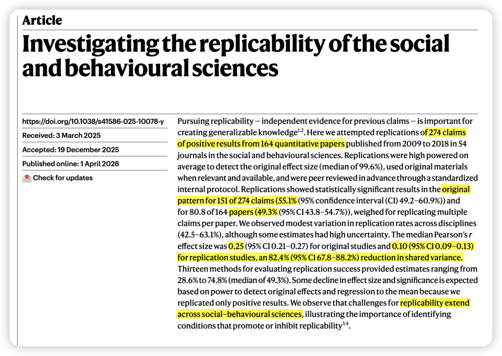
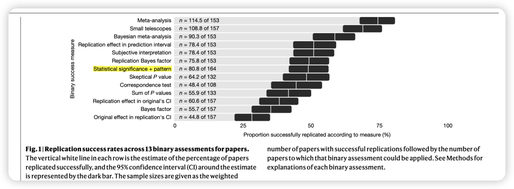
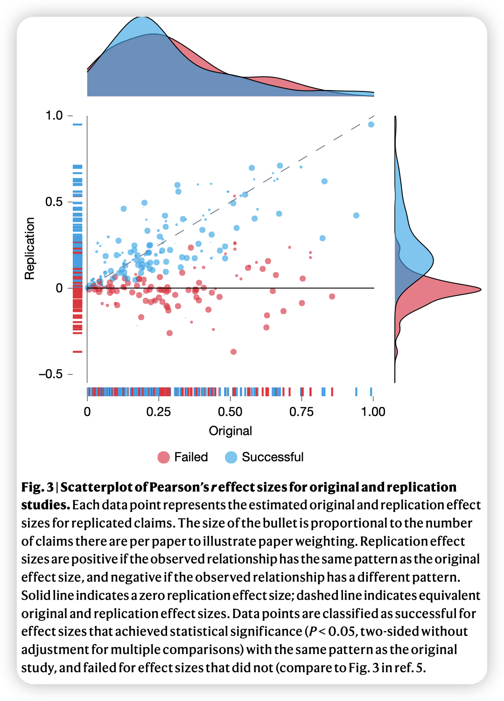
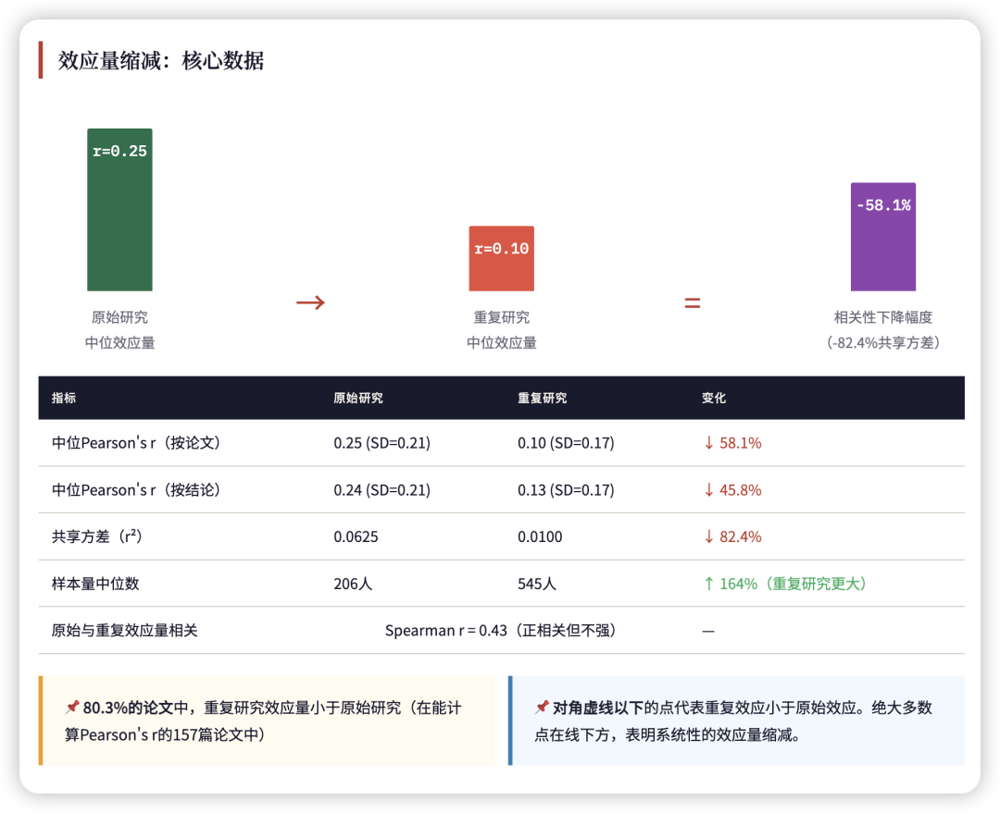
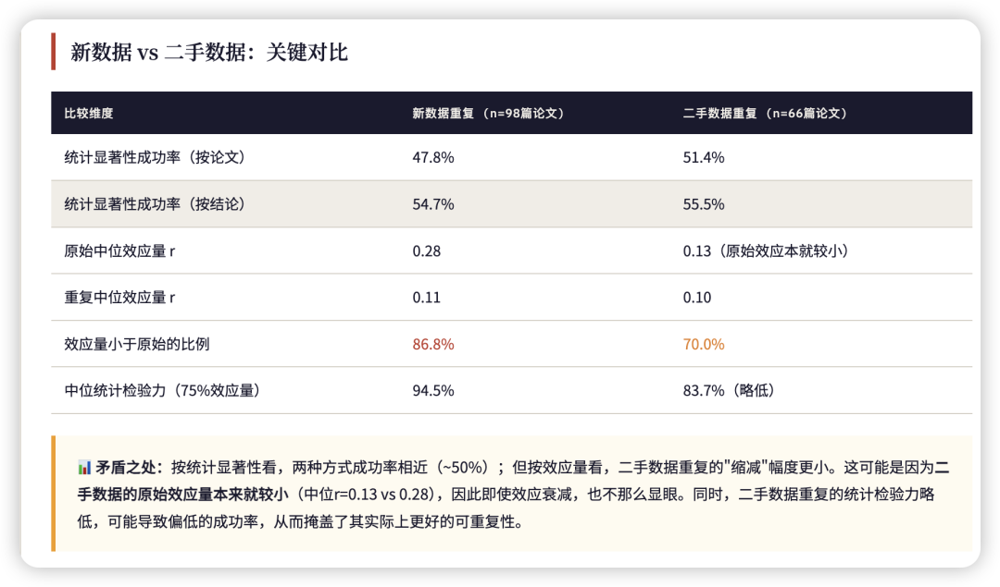
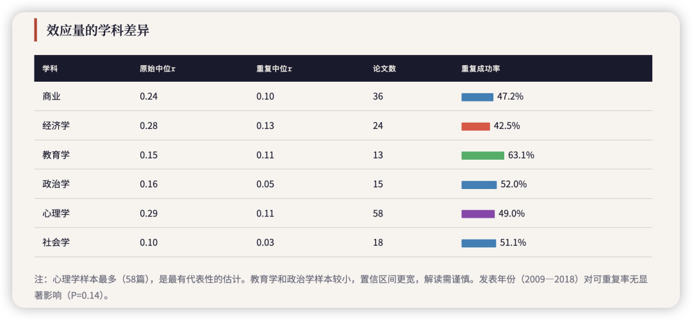
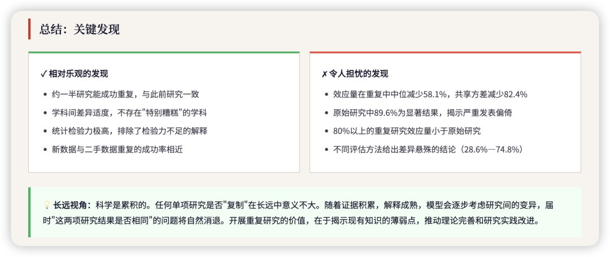
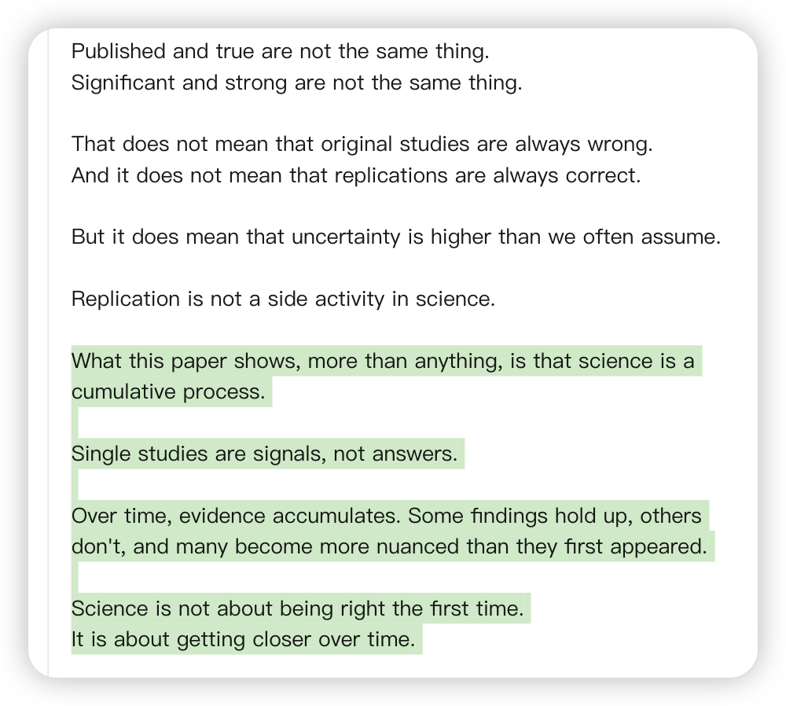
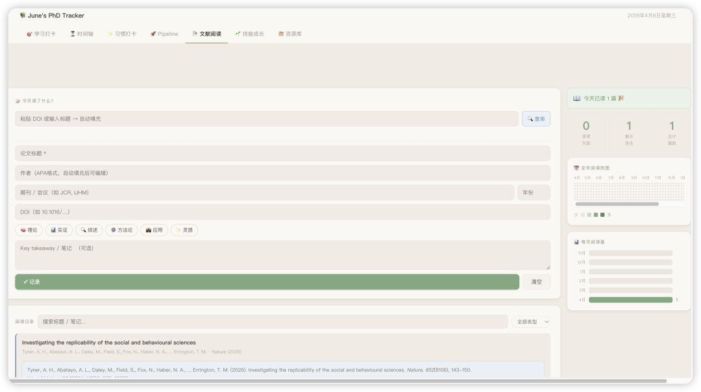

> Tyner, A. H., Abatayo, A. L., Daley, M., Field, S., Fox, N., Haber, N. A., ... Errington, T. M. (2026). Investigating the replicability of the social and behavioural sciences. Nature, 652(8108), 143-150. https://doi.org/10.1038/s41586-025-10078-y

### 

1. 整体可重复率约为一半（受评估标准影响波动大）: 在最常用的“统计学显著性（P < 0.05）且效应方向一致”标准下，按声明（claim）计算，有55.1%的重复研究取得了成功；如果按论文（paper）加权计算，成功率为49.3%

2. 重复研究的效应量（Effect Size）出现显著缩水：即使重复实验成功复现了原始研究的趋势，其测得的效应程度也通常大幅下降。原始研究的皮尔逊相关系数（Pearson's r）中位数为0.25，而重复研究的中位数仅为0.10。这意味着变量间的共享方差（shared variance）平均减少了82.4%

该图为claude生成的可交互html；

我觉得比notebooklm更好用！

（我提议：好的课题组 将舍弃ppt这种低效的方式！）

3. 各学科之间存在适度差异，但挑战是普遍的：该项目涵盖了六个子学科：商业、经济学、教育学、政治学、心理学和社会学。在按论文加权的统计显著性标准下，各学科的可重复率存在一定差异（42.5%到63.1%之间），例如经济学最低（42.5%），教育学最高（63.1%）。

文章指出：**科学界当前真正面临的问题并非“不可重复”本身，而是对已发表结论的“过度自信（****overconfidence****）”**。“已发表”并不等于“绝对真实”，单项研究的确定性往往被高估。科学研究需要建立在累积证据的基础上，正视研究结果在不同情境下的不确定性，并建立鼓励自我纠错和重复验证的研究文化。

# 转自哈佛的一位博士生Kai Krautter的Linkedin：

### 

### Science is not about being right the first time.

### It is about getting closer over time.

### 

### 科学不是说第一次就对。
而是随着时间的推移越来越接近。

# 

# 

# 彩蛋：

# 

# 我也有自己的牛马监测系统了哈哈哈 真的好方便！

# vibe coding真的是J人的新玩具了😻

# 等我再不断迭代一下这个管理系统（虽然感觉每天都可以有新的优化思路哈哈）

# 就来写一个帖子分享！！！

# 

# 

###
