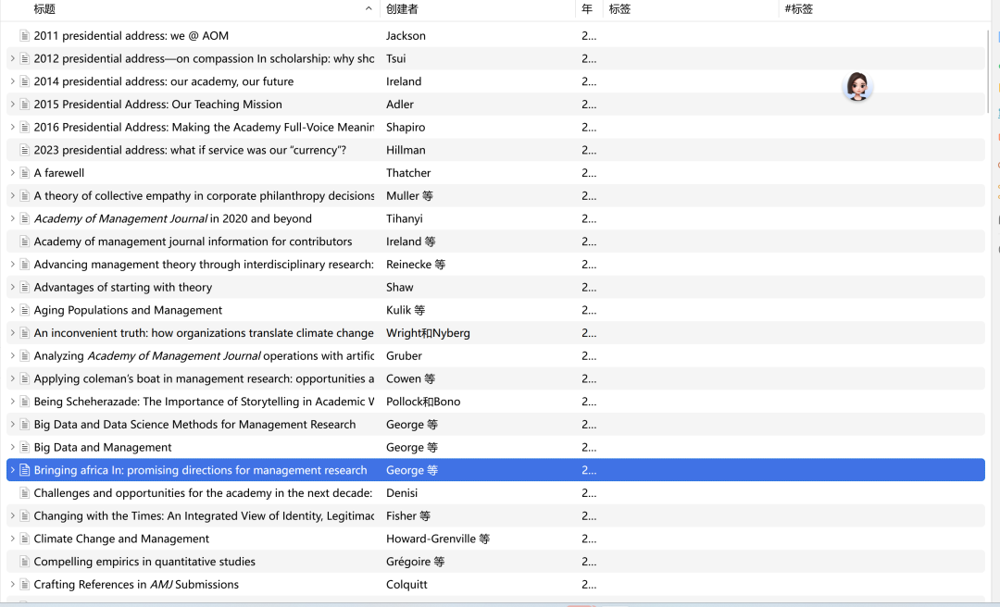

# 2010-2026年AMJ/AMR FTE papers 索引

> - AI主导，按AMR、AMJ 各个Issues的第一篇文章来形成FTE papers pool（共搜集到140篇pdf全文）。
> - 删除那些明显不是FTE paper的论文。
> - 使用Notebooklm进行主题划分，整理成稿。
> - 最终分类列出126篇文章。

## 分类大纲（7）

- **顶刊发表指南与评审实务** (Publishing Guides & Editorial Standards)：投稿技巧、避坑、编辑部评审逻辑。
- **研究方法论与理论构建工具** (Methodology & Theory Building)：研究设计、理论构建风格、方法论文与可视化等。
- **期刊使命、学科趋势与知识生产系统** (Journal & Disciplinary Trends)：期刊功能、学科走向、知识生产体系（含部分「期刊编务与评审流程」视角文稿，见条目标注）。
- **重大挑战与新兴内容领域** (Grand Challenges & Emerging Areas)：社会议题、转型时代、跨学科与新视角等编辑部倡议与研究议程。
- **学术职业、教学与包容性** (Academic Profession & Inclusivity)：评审文化、教学与理论建构、全球与边缘群体学者、多元包容。
- **即时研究范式与算法时代的学术重构** (AI in Scholarship)：生成式 AI 等对知识生产全过程的影响与规范讨论。

## 1. 顶刊发表指南与评审实务

- Barney, J. B. (2018). Editor’s comments: Positioning a theory paper for publication. *Academy of Management Review*, 43(3), 345–348.
- Barney, J. B. (2020). Editor’s comments: Publishing an AMR dialogue paper. *Academy of Management Review*, 45(1), 1–4.
- Beugelsdijk, S., & Bird, A. (2025). How to avoid a desk reject: Do’s and don’ts. *Journal of International Business Studies*.
- Byron, K., & Cardon, M. (2026). New submission or repackaging?: Determining when a revised paper warrants fresh review. *Academy of Management Review*, 51(1), 1–4.
- Campbell, J. T., & Aguilera, R. V. (2022). Why I rejected your paper: Common pitfalls in writing theory papers and how to avoid them. *Academy of Management Review*, 47(4), 521–527.
- Cardon, M. S., & Lam, C. F. (2025). Navigating the gray areas: Ethical considerations when writing and publishing conceptual papers. *Academy of Management Review*, 50(3), 485–492.
- Colquitt, J. A. (2012). Plagiarism policies and screening at AMJ. *Academy of Management Journal*, 55(4), 749–751.
- Colquitt, J. A. (2013). Crafting references in AMJ submissions. *Academy of Management Journal*, 56(5), 1221–1224.
- Colquitt, J. A. (2013). Data overlap policies at AMJ. *Academy of Management Journal*, 56(2), 331–333.
- Geletkanycz, M., & Tepper, B. J. (2012). Publishing in AMJ—Part 6: Discussing the implications. *Academy of Management Journal*, 55(2), 256–260.
- Gruber, M. (2025). Analyzing Academy of Management Journal operations with artificial intelligence (2006–2022). *Academy of Management Journal*, 68(1), 1–10.（与第 6 类 AI 主题交叉，见该节说明。）
- Hideg, I., DeCelles, K. A., & Tihanyi, L. (2020). From the editors: Publishing practical and responsible research in AMJ. *Academy of Management Journal*, 63(6), 1681–1686.
- Methot, J. R., & Kaul, A. (2024). What is next? Moving beyond a rejection from AMR by repurposing your “theory.” *Academy of Management Review*, 49(3), 475–486.
- Ragins, B. R. (2012). Editor’s comments: Reflections on the craft of clear writing. *Academy of Management Review*, 37(4), 493–501.
- Ragins, B. R. (2015). Editor’s comments: Developing our authors. *Academy of Management Review*, 40(1), 1–8.
- Rockmann, K., Bunderson, S. J., Leana, C. R., Hibbert, P., Tihanyi, L., Phan, P. H., & Thatcher, S. M. B. (2021). Publishing in the Academy of Management journals. *Academy of Management Review*, 46(3), 421–430.
- Smithey Fulmer, I. (2012). Editor’s comments: The craft of writing theory articles—variety and similarity in AMR. *Academy of Management Review*, 37(3), 327–331.
- Thatcher, S. M. B., & Fisher, G. (2022). From the Editors—The nuts and bolts of writing a theory paper: A practical guide to getting started. *Academy of Management Review*, 47(1), 1–8.
- Tihanyi, L., & DeCelles, K. A. (2021). Publishing original research in AMJ: Advice to prospective authors. *Academy of Management Journal*, 64(3), 679–683.
- Campbell, J. T., & Conlon, D. E. (2021). From the editor: It takes a village: A practical guide to reviewing for AMR. Academy of Management Review, 46(2), 221–225.
- Dencker, J. C., Gruber, M., Miller, T., Rouse, E. D., & von Krogh, G. (2023). From the editors: Positioning research on novel phenomena: The winding road from periphery to core. Academy of Management Journal, 66(5), 1295–1302.

## 2. 研究方法论与理论构建工具

- Bansal, P., Smith, W., & Vaara, E. (2018). New ways of seeing through qualitative research. *Academy of Management Journal*, 61(4), 1189–1195.
- Bansal, P., & Corley, K. (2012). Publishing in AMJ—Part 7: What’s different about qualitative research? *Academy of Management Journal*, 55(3), 509–513.
- Bliese, P. D., Certo, S. T., Smith, A. D., Wang, M., & Gruber, M. (2024). Strengthening theory–methods–data links. *Academy of Management Journal*, 67(4), 893–902.
- Cornelissen, J. (2017). Editor’s comments: Developing propositions, a process model, or a typology? Addressing the challenges of writing theory without a boilerplate. *Academy of Management Review*, 42(1), 1–9.
- Cowen, A. P., Rink, F., Cuypers, I. R. P., Grégoire, D. A., & Weller, I. (2022). Applying Coleman’s boat in management research: Opportunities and challenges in bridging macro and micro. *Academy of Management Journal*, 65(1), 1–10.
- DeCelles, K. A., Howard-Grenville, J., & Tihanyi, L. (2021). From the editors—improving the transparency of empirical research published in AMJ. *Academy of Management Journal*, 64(4), 1009–1015.
- Delbridge, R., & Fiss, P. C. (2013). Editors' comments: Styles of theorizing and the social organization of knowledge. *Academy of Management Review*, 38(3), 325–331.
- Dorobantu, S., Gruber, M., Ravasi, D., & Wellman, N. (2024). The AMJ management research canvas: A tool for conducting and reporting empirical research. *Academy of Management Journal*, 67(5), 1163–1174.
- Ertug, G., Gruber, M., Nyberg, A., & Steensma, H. K. (2018). From the editors—a brief primer on data visualization opportunities in management research. *Academy of Management Journal*, 61(5), 1613–1625.
- Fisher, G., Mayer, K., & Morris, S. (2021). From the editors—Phenomenon-based theorizing. *Academy of Management Review*, 46(4), 631–639.
- George, G., Osinga, E., Lavie, D., & Scott, B. (2016). Big data and data science methods for management research. *Academy of Management Journal*, 59(5), 1493–1507.
- Grégoire, D. A., et al. (2024). Mobilizing new sources of data: Opportunities and recommendations. *Academy of Management Journal*, 67(2), 289–298.
- Gruber, M., & Bliese, P. (2024). Expanding AMJ’s manuscript portfolio: Research methods articles designed to advance theory and span boundaries. *Academy of Management Journal*, 67(1), 1–4.
- Howard-Grenville, J., et al. (2021). From the editors—Achieving fit and avoiding misfit in qualitative research. *Academy of Management Journal*, 64(5), 1313–1323.
- Lange, D., & Pfarrer, M. D. (2017). Editors’ comments: Sense and structure—the core building blocks of an AMR article. *Academy of Management Review*, 42(3), 407–416.
- Langley, A., et al. (2013). Process studies of change in organization and management: Unveiling temporality, activity, and flow. *Academy of Management Journal*, 56(1), 1–13.
- Langley, A., et al. (2023). Opening up AMJ’s research methods repertoire. *Academy of Management Journal*, 66(3), 711–719.
- Makadok, R. (2022). Guidance for AMR authors about making formal theory accessible. *Academy of Management Review*, 47(2), 193–205.
- Mayer, K. J., & Sparrowe, R. T. (2013). Integrating theories in AMJ articles. *Academy of Management Journal*, 56(4), 917–922.
- Nadkarni, S., et al. (2018). New ways of seeing: Radical theorizing. *Academy of Management Journal*, 61(2), 371–377.
- Okhuysen, G., & Bonardi, J. (2011). Editors’ comments: The challenges of building theory by combining lenses. *Academy of Management Review*, 36(1), 6–11.
- Paruchuri, S., et al. (2018). New ways of seeing: Pitfalls and opportunities in multilevel research. *Academy of Management Journal*, 61(3), 797–801.
- Pollock, T. G., & Bono, J. E. (2013). Being Scheherazade: The importance of storytelling in academic writing. *Academy of Management Journal*, 56(3), 629–634.
- Ravasi, D., Zhu, J., Wan, W., Dorobantu, S., & Gruber, M. (2024). What makes research collaborations successful? Advice from AMJ authors. *Academy of Management Journal*, 67(3), 583–594.
- Rouse, E., Reinecke, J., Ravasi, D., Langley, A., Grimes, M., & Gruber, M. (2025). Making a theoretical contribution with qualitative research. *Academy of Management Journal*, 68(2), 257–266.
- Shaw, J. D. (2017). Advantages of starting with theory. *Academy of Management Journal*, 60(3), 819–822.
- Shaw, J. D., & Ertug, G. (2017). The suitability of simulations and meta-analyses for submissions to Academy of Management Journal. *Academy of Management Journal*, 60(6), 2045–2049.
- Suddaby, R. (2010). Editor’s comments: Construct clarity in theories of management and organization. *Academy of Management Review*, 35(3), 346–357.
- Wellman, N., Tröster, C., Grimes, M., Roberson, Q., Rink, F., & Gruber, M. (2023). Publishing multi-method research in AMJ: A review and best-practice recommendations. *Academy of Management Journal*, 66(2).
- Bermiss, Y. S., Farh, C. I. C., Simons, T., ter Wal, A. L. J., von Krogh, G., & Gruber, M. (2025). From the editors: Reengaging with the classics. Academy of Management Journal, 68(3), 465–474.

## 3. 期刊使命、学科趋势与知识生产系统

- Barney, J. B. (2018). Editor’s comments: Theory contributions and the AMR review process. *Academy of Management Review*, 43(1), 1–4.
- Barney, J. B. (2020). “Farewell” from the Editor. *Academy of Management Review*, 45(4), 709–710.
- Colquitt, J. A. (2011). The next three years at AMJ—maintaining the mission while expanding the Journal. *Academy of Management Journal*, 54(1), 9–14.
- Colquitt, J. A. (2013). From the editors: The last three years at AMJ—celebrating the big purple tent. *Academy of Management Journal*, 56(6), 1511–1515.
- Cronin, M. A., et al. (2025). From a portfolio of journals to a system of knowledge production. *Academy of Management Review*, 50(2), 181–188.
- Crossan, M. M., Maurer, I., & White, R. E. (2011). Reflections on the 2009 AMR decade award: Do we have a theory of organizational learning? *Academy of Management Review*, 36(3), 446–460.
- Devers, C. E., Misangyi, V. F., & Gamache, D. L. (2014). Editors' comments: On the future of publishing management theory. *Academy of Management Review*, 39(3), 245–249.
- George, G. (2014). Rethinking management scholarship. *Academy of Management Journal*, 57(1), 1–6.
- George, G. (2016). Management research in AMJ: Celebrating impact while striving for more. *Academy of Management Journal*, 59(6), 1869–1877.
- Gruber, M. (2023). From the editors—An innovative journal during transformational times: Embarking on the 23rd editorial term. *Academy of Management Journal*, 66(1), 1–8.
- Gruber, M. (2025). Passing the baton to the 24th editorial team. *Academy of Management Journal*, 68(6), 1163–1167.
- Haveman, H. A., Mahoney, J. T., & Mannix, E. (2019). Editors’ comments: The role of theory in management research. *Academy of Management Review*, 44(2), 241–243.
- Hernandez, M., & Haack, P. (2023). Theorizing for positive impact. *Academy of Management Review*, 48(4).
- Hillman, A. (2011). Editor’s comments: What is the future of theory? *Academy of Management Review*, 36(4), 606–608.
- Howard-Grenville, J., et al. (2022). From the editors—That’s important, interesting, and generative winners of the AMJ 2021 best paper award and 2022 research impact award. *Academy of Management Journal*, 65(5), 1417–1423.
- Ireland, R. D. (2015). 2014 presidential address: Our academy, our future. *Academy of Management Review*, 40(2), 151–162.
- Kim, P. H., Ployhart, R. E., & Gibson, C. B. (2018). Editors’ comments: Is organizational behavior overtheorized? *Academy of Management Review*, 43(4), 541–545.
- Ployhart, R. E., & Bartunek, J. M. (2019). Editors’ comments: There is nothing so theoretical as good practice—a call for phenomenal theory. *Academy of Management Review*, 44(3), 493–497.
- Priem, R. L., Butler, J. E., & Li, S. (2013). Toward reimagining strategy research: Retrospection and prospection on the 2011 AMR decade award article. *Academy of Management Review*, 38(4), 471–489.
- Roberson, Q. (2026). Stewardship at scale: A new editorial term at AMJ. *Academy of Management Journal*, 69(1), 1–5.
- Shaw, J. D. (2012). Responding to reviewers. *Academy of Management Journal*, 55(6), 1261–1263.
- Shaw, J. D. (2017). Moving forward at AMJ. *Academy of Management Journal*, 60(1), 1–5.
- Simsek, Z., Bansal, P., Shaw, J. D., Heugens, P., & Smith, W. (2018). From the editors: Seeing practice impact in new ways. *Academy of Management Journal*, 61(6), 2021–2025.
- Suddaby, R. (2012). Editor’s comments. *Academy of Management Review*, 37(1), 6–9.
- Suddaby, R. (2014). Editor’s comments: Why theory? *Academy of Management Review*, 39(4), 407–411.
- Tihanyi, L. (2020). Academy of Management Journal in 2020 and beyond. *Academy of Management Journal*, 63(1), 1–6.
- Tihanyi, L. (2020). From “that’s interesting” to “that’s important.” *Academy of Management Journal*, 63(2), 329–331.
- Tihanyi, L. (2022). Publishing relevant and trustworthy empirical research in AMJ: The 22nd editorial term during the COVID-19 pandemic. *Academy of Management Journal*, 65(6), 1771–1774.
- Umphress, E. E., Greer, L. L., Muir (Zapata), C. P., & Knight, A. (2021). Publishing impactful research in AMJ: Winners of the 2020 and 2021 impact awards. *Academy of Management Journal*, 64(6), 1648–1653.

## 4. 重大挑战与新兴内容领域

- Dodgson, M., Gann, D., Wladawsky-Berger, I., Sultan, N., & George, G. (2015). From the editors: Managing digital money. Academy of Management Journal, 58(2), 325–333
- Alvarez, S., et al. (2018). Editors’ comments: Should management theories take uncertainty seriously? *Academy of Management Review*, 43(2), 169–172.
- Alvarez, S., & Rangan, S. (2019). Editors’ comments: The rise of nationalism (redux)—an opportunity for reflection and research. *Academy of Management Review*, 44(4), 721–723.
- Amis, J. M., Barney, J. B., Mahoney, J. T., & Wang, H. (2020). From the editors—why we need a theory of stakeholder governance—and why this is a hard problem. *Academy of Management Review*, 45(3), 499–505.
- Barney, J. B., & Rangan, S. (2019). Editors’ comments: Why do we need a special issue on new theoretical perspectives on market-based economic systems? *Academy of Management Review*, 44(1), 1–5.
- Colbert, A., Yee, N., & George, G. (2016). The digital workforce and the workplace of the future. *Academy of Management Journal*, 59(3), 731–739.
- Eisenhardt, K. M., Graebner, M. E., & Sonenshein, S. (2016). Grand challenges and inductive methods: Rigor without rigor mortis. *Academy of Management Journal*, 59(4), 1113–1123.
- George, G., Haas, M. R., & Pentland, A. (2014). Big data and management. *Academy of Management Journal*, 57(2), 321–326.
- George, G., Schillebeeckx, S. J., & Liak, T. L. (2015). The management of natural resources: An overview and research agenda. *Academy of Management Journal*, 58(6), 1595–1613.
- George, G., et al. (2016). Reputation and status: Expanding the role of social evaluations in management research. *Academy of Management Journal*, 59(1), 1–13.
- Gruber, M., Leon, N., George, G., & Thompson, P. (2015). Managing by design. *Academy of Management Journal*, 58(1), 1–7.
- Gruber, M., et al. (2025). Special Research Forum: Our transformational era: Implications for management and organizations. *Academy of Management Journal*, 68(5), 875–880.
- Hollensbe, E., et al. (2014). Organizations with purpose. *Academy of Management Journal*, 57(5), 1227–1234.
- Howard-Grenville, J., et al. (2014). Climate change and management. *Academy of Management Journal*, 57(3), 615–623.
- Kulik, C. T., et al. (2014). Aging populations and management. *Academy of Management Journal*, 57(4), 929–935.
- Reinecke, J., Little, L. M., Simons, T., Bliese, P., Dencker, J., Roberson, Q., von Krogh, G., & Gruber, M. (2024). Advancing management theory through interdisciplinary research: Challenges and opportunities. *Academy of Management Journal*, 67(6), 1421–1427.
- Shaw, J. D. (2019). Reflections on three years at AMJ: New ways of seeing and beyond. *Academy of Management Journal*, 62(6), 1643–1644.
- Shaw, J. D., Bansal, P., & Gruber, M. (2017). New ways of seeing: Elaboration on a theme. *Academy of Management Journal*, 60(2), 397–401.
- Shaw, J. D., Tangirala, S., Vissa, B., & Rodell, J. B. (2018). New ways of seeing: Theory integration across disciplines. *Academy of Management Journal*, 61(1), 1–4.
- Simsek, Z., Vaara, E., Paruchuri, S., Nadkarni, S., & Shaw, J. D. (2019). New ways of seeing big data. *Academy of Management Journal*, 62(4), 971–978.
- Tihanyi, L., Graffin, S., & George, G. (2014). Rethinking governance in management research. *Academy of Management Journal*, 57(6), 1535–1543.
- Tihanyi, L., Howard-Grenville, J., & DeCelles, K. A. (2022). Joining societal conversations on management and organizations. *Academy of Management Journal*, 65(3), 711–719.
- Tsui, A. S. (2013). 2012 Presidential Address—On compassion in scholarship: Why should we care? *Academy of Management Review*, 38(2), 167–180.
- Van Der Vegt, G. S., Essens, P., Wahlström, M., & George, G. (2015). Managing risk and resilience. *Academy of Management Journal*, 58(4), 971–980.
- Van Knippenberg, D., Dahlander, L., Haas, M. R., & George, G. (2015). Information, attention, and decision making. *Academy of Management Journal*, 58(3), 649–657.
- Wang, H., Gibson, C., & Zander, U. (2020). Is research on corporate social responsibility undertheorized? *Academy of Management Review*, 45(1), 1–6.

## 5. 学术职业、教学与包容性

- Ashkanasy, N. M. (2013). Editor's comments: Internationalizing theory—how “fusion theory” emanates from down under. *Academy of Management Review*, 38(1), 1–5.
- Ballinger, G. A., & Johnson, R. E. (2015). From the editors: Your first AMR review. *Academy of Management Review*, 40, 1–16.
- Byron, K. (2024). Editor’s comments: Taking steps to level the playing field. *Academy of Management Review*, 49(1), 1–5.
- Byron, K., & Thatcher, S. M. (2016). Editors’ comments: “What I know now that I wish I knew then”—teaching theory and theory building. *Academy of Management Review*, 41, 1–8.
- Chen, M.-J. (2014). Presidential address—becoming ambicultural: A personal quest, and aspiration for organizations. *Academy of Management Review*, 39(2), 121–136.
- DeCelles, K. A., Leslie, L. M., & Shaw, J. D. (2019). From the editors—disciplinary code switching at AMJ: The tale of Goldilocks and the three journals. *Academy of Management Journal*, 62(3), 635–640.
- Fisher, G., Thatcher, S. M. B., & Makadok, R. (2023). The AMR origins series: Demystifying the theory-building process. *Academy of Management Review*, 48(2), 173–180.
- George, G. (2012). From the editors: Publishing in AMJ for non-U.S. authors. *Academy of Management Journal*, 55(5), 1023–1026.
- George, G., et al. (2016). Bringing Africa in: Promising directions for management research. *Academy of Management Journal*, 59(2), 377–393.
- Lam, C. F., Lazzarini, S. G., & Stephens, J. P. (2025). Editors’ comments: Voices from the periphery: Barriers to publication in AMR and opportunities for inclusion. *Academy of Management Review*, 50(1), 1–6.
- Morris, S., et al. (2023). Theorizing from emerging markets: Challenges, opportunities, and publishing advice. *Academy of Management Review*, 48(1), 1–10.
- Ragins, B. R. (2015). Editor’s comments: Celebrating our award-winning authors and reviewers. *Academy of Management Review*, 40(4), 495–496.
- Ragins, B. R. (2016). Editor’s comments: The celebration continues—honoring our award-winning authors and reviewers. *Academy of Management Review*, 41(4), 571–572.
- Ragins, B. R. (2017). Editor’s comments: Raising the bar for developmental reviewing. *Academy of Management Review*, 42(4), 573–576.
- Shapiro, D. L. (2017). 2016 Presidential Address: Making the Academy full-voice meaningful. *Academy of Management Review*, 42(2), 165–173.
- Thatcher, S. M. B. (2023). A farewell. *Academy of Management Review*, 48(4), 593–596.
- Umphress, E. E., Rink, F., Muir (Zapata), C. P., & Hideg, I. (2022). Insights on how we try to show empathy, respect, and inclusion in AMJ. *Academy of Management Journal*, 65(2), 363–370.
- Dodgson, M., Gann, D., Wladawsky-Berger, I., Sultan, N., & George, G. (2015). From the editors: Managing digital money. *Academy of Management Journal*, 58(2), 325–333.

## 6. 即时研究范式与算法时代的学术重构

- Grimes, M., von Krogh, G., Feuerriegel, S., Rink, F., & Gruber, M. (2023). From scarcity to abundance: Scholars and scholarship in an age of generative artificial intelligence. *Academy of Management Journal*, 66(6), 1617–1624.
- Gruber, M. (2025). Analyzing Academy of Management Journal operations with artificial intelligence (2006–2022). *Academy of Management Journal*, 68(1), 1–10.
- Von Krogh, G., Roberson, Q., & Gruber, M. (2023). Recognizing and utilizing novel research opportunities with artificial intelligence. *Academy of Management Journal*, 66(2), 367–373.

