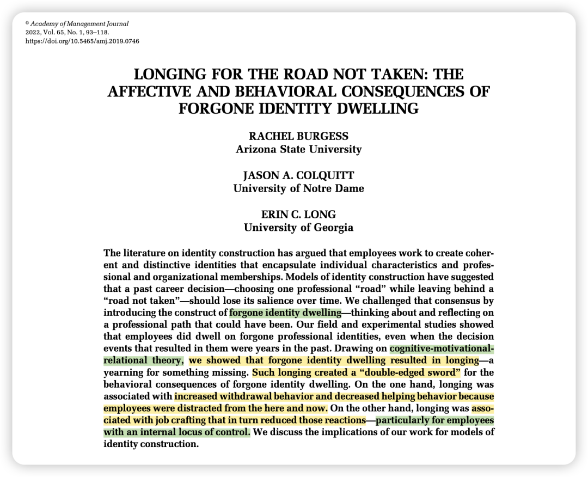
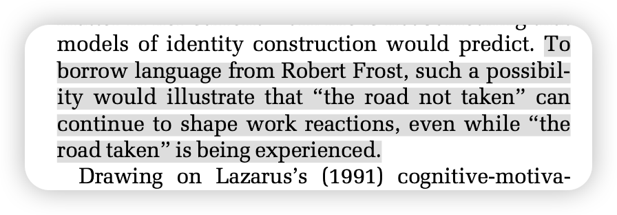
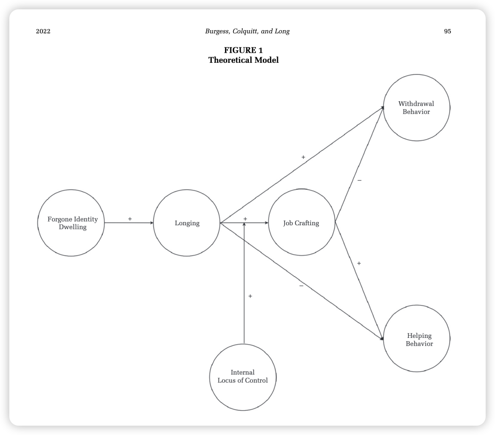

### 

> Burgess, R., Colquitt, J. A., & Long, E. C. (2022). Longing for the road not taken: The affective and behavioral consequences of forgone identity dwelling. *Academy of Management Journal*, *65*(1), 93-118.

### 

### 🫧写在前面

过年回家是一次巨大的怀旧，最近和朋友们聊天也会说起过去的事情：过去没有选择的方向、曾经喜欢但没有在一起的人……  于是想起这篇文章，之前因为标题足够有趣下载下来只读了摘要，如今细读感觉确实精妙绝伦，我想也就是靠这篇伟大的作品、作者能找到ASU的教职吧！

### 

### 💡推荐原因

### 

1. 主题和切题方式有趣。 人人都会思考“那条没走过的道路”，感觉代入一下AMJ的AE，看到这个选题切入就已经爱了爱了；另外总结出了过往研究中「forward progress」的consensus、并挑战了这个共识！提出了identity echo这个视角。

2. 模型构建有趣。同样是双刃剑，这篇是从来没有见过的双刃剑的模型构建哦。

3. 写作灵动。比如还会在intro中引用诗人的话：

### 

### 

### 下面开始论文解读～（尝试用AMJ Canvas的框架来拆解这篇论文！）

### 

### 🧩Puzzle

### 

**1. What broad management question does this research project address?****当员工持续反思或沉浸于他们曾经放弃的职业身份（forgone professional identities，即“未选择的路”）时，会产生怎样的情感和行为后果**。

**2. Why is this puzzle important?**

从理论视角来看，现有的身份建构（identity construction）文献普遍存在一种“向前看（forward progress）”的共识假设，即认为过去的职业选择或经历随着时间的推移，在个体建立了当前连贯且独特的身份后，应该会逐渐失去显著性。

然而，本文挑战了这一共识，指出即使决策已经过去了几年，过去的“身份回响（identity echoes）”仍可能持续存在并对员工当下的工作产生深远影响。探究这一现象有助于打破现有文献对“身份连贯性”的过度理想化假设。

**3. Which audience should find your research interesting and relevant?**

本研究的受众主要是关注工作身份（work identity）和身份建构/身份工作（identity construction/work）的组织行为学与管理学学者。比如Ashforth, Corley, Obodaru 等人。

该领域一直在探讨员工是如何通过意义建构、实验和叙事来塑造身份的，但他们的基础假设往往是“身份建构最终会消除碎片感并达到连贯性”。

**4. How does prior research address the puzzle? (现有研究如何解决这个谜题？)**

- **先前研究与共识：**最相关的先前研究是 Obodaru (2012, 2017) 提出的“放弃的职业身份”概念，发现人们确实会构想并保留这些替代的自我。
- **现有研究的假设及其准确性：**先前文献假设身份建构主要是一个“认知（cognitive）”过程，一旦做出决定，过去的纠结就会被合理化并抛之脑后。作者认为这个假设是不准确的，因为许多员工不仅保留了这些记忆，还会反复“沉思（dwell）”它们，即情感过程。
- **现有研究的空白与局限：****1. 缺乏情感机制：**现有的身份建构文献具有强烈的“认知倾向”，严重忽视了情感的作用。

**2. 方法论视角：**之前的研究绝大多数是定性研究（qualitative）或概念性论文，严重缺乏定量测试（quantitative methods）和对个体差异的关注。

**3. 片面强调积极后果：**Obodaru之前的理论化倾向于关注这种身份带来的积极面，而忽略了沉思“未选择的路”可能带来的负面职场行为。

### 

**🤔Research Question**

**1. What specific question does your research answer? (你的研究回答了什么具体问题？)**

本研究回答了：**对放弃的职业身份进行沉思（forgone identity dwelling）如何通过激发“渴望（longing）”情绪，进而引发员工在职场中的退缩行为、助人行为以及工作重塑行为，以及个体的控制点（locus of control）如何调节这一过程**。

包含了以下构念：

- 自变量：放弃的身份沉思（Forgone identity dwelling）

- 中介变量（情感过程）：渴望（Longing）

- 因变量（行为结果）：退缩行为（Withdrawal behavior）、助人行为（Helping behavior）、工作重塑（Job crafting）

- 调节变量：内控点（Internal locus of control）

**2. WHY should we expect these relationships between constructs? (Mechanisms) (为什么预期构念之间会有这些关系？机制是什么？)**

- **理论视角：**本文的理论框架主要建立在 Lazarus 的认知-动机-关系理论（cognitive-motivational-relational theory）之上。
- **关系解释（机制）：****- 初级与次级评估（Appraisal）：**沉思未选择的路涉及到个人的目标、价值观与未来期望。由于过去的选择不仅关乎损失，且未来（从心理或现实上）似乎并没有被完全封死（即次级评估中的“改变预期”），这使得员工的情感反应并非单纯的“悲伤（不可挽回的损失）”，而是产生了“渴望（Longing）”。

- 行动倾向（Action tendencies）：

Lazarus 理论指出每种情绪都会激发特定的生理能量或冲动（行动倾向）：因为“渴望”是悲伤与快乐/唤醒的混合体，它具有双重行动倾向：（1）其悲伤成分（回避倾向）使员工心不在焉、逃离当下，导致退缩行为增加、助人减少；（2）而其唤醒/快乐成分（趋近倾向）类似于希望，促使员工主动采取行动去靠近或弥补他们所向往的价值观，从而引发工作重塑行为。

- 调节变量解释：

相信自己能掌控命运的员工（高内控点），自然更有可能将这种“趋近倾向”转化为实际的重塑行动。

### 

### 📦方法Package简介

研究1开发了**forgone identity dwelling和longing的新量表，用multi-source mulit-wave的方法测量了全模型。**

研究2是两阶段的因果实验，其中2a操纵**forgone identity dwelling，探索其和longing的关系；2b操纵longing，探索其和工作重塑的关系并探究**内在控制点的调节作用。

### 

### 🧐结果：

结果证实了身份沉思会正向引发“渴望（longing）”情绪。这种渴望一方面导致了**退缩行为的增加**（支持H1）和**助人行为的减少**（支持H2）。另一方面，它能间接促使员工**增加工作重塑行为（Job crafting）**（支持H3）。

进一步分析表明，工作重塑能够显著降低退缩行为并增加助人行为。因此，身份沉思通过“渴望 -> 工作重塑” 最终能够对退缩行为产生负向的间接效应（支持H4），对助人行为产生正向的间接效应（支持H5）。

员工的内控点（Locus of control）显著调节了渴望与工作重塑之间的关系。简单斜率分析显示，**对于具有高内控点的员工，渴望转化为工作重塑的正向关系更强**；而对于外控型员工，这种转化效应较弱（支持H6）。

本文的理论贡献就是intro里那些啦。但是实践贡献非常有意思！

也发表在了HBR上：

> Burgess, R. (2023, March 24). *Are You Hung Up on That Career Path You Didn’t Choose?* Harvard Business Review. https://hbr.org/2023/03/are-you-hung-up-on-that-career-path-you-didnt-choose

**1. 了解员工的“未选择之路”：**

随着职业选择的增加，员工拥有放弃的身份变得前所未有地普遍。**管理者应该通过辅导或职业发展对话，主动去了解员工的过去和向往，从而更深刻地理解他们的背景和抱负。**

**2. 提供重塑工作的空间：**

管理者**可以通过提供更高的工作自主性和灵活性，或者有意识地分配一些符合员工“放弃身份”特质的任务**，来鼓励员工进行工作重塑。这有助于防止他们陷入单纯的“退缩行为”。

**3. 培养内控思维：**

由于内控点能帮助员工将渴望转化为积极的工作重塑，组织可以通过压力管理或培训干预，培养员工的“内在思维模式（internal mindset）”，让他们相信自己能够掌控工作命运。
