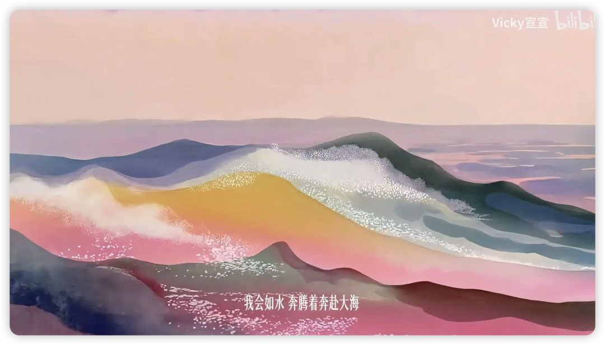
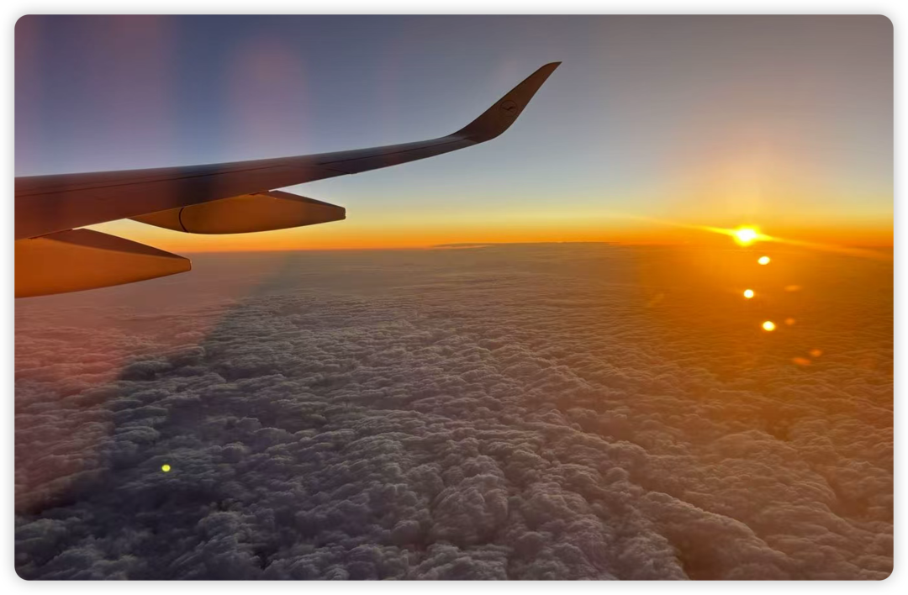
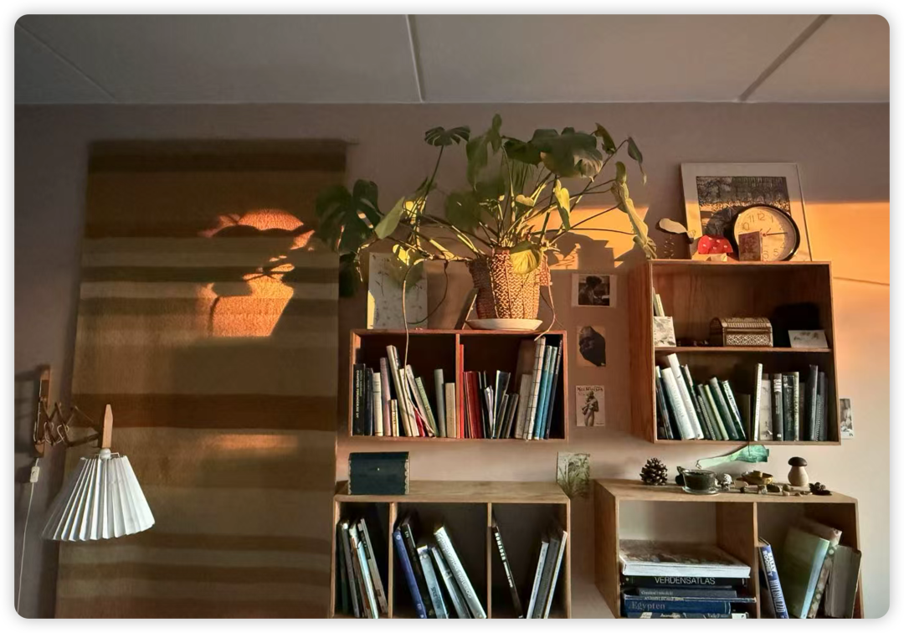
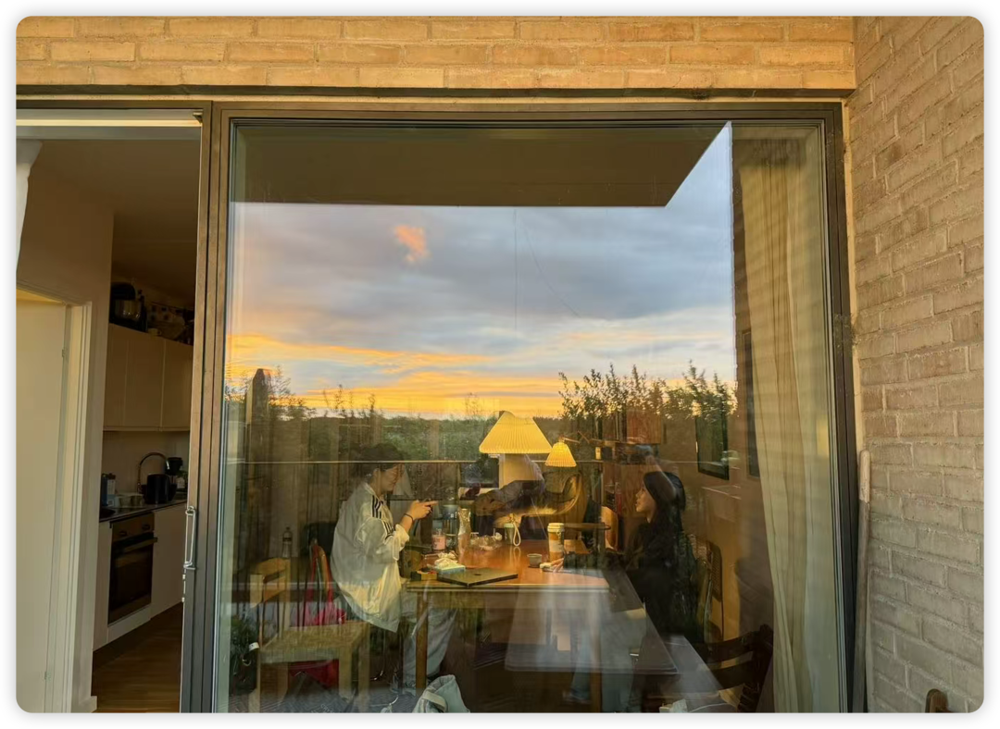
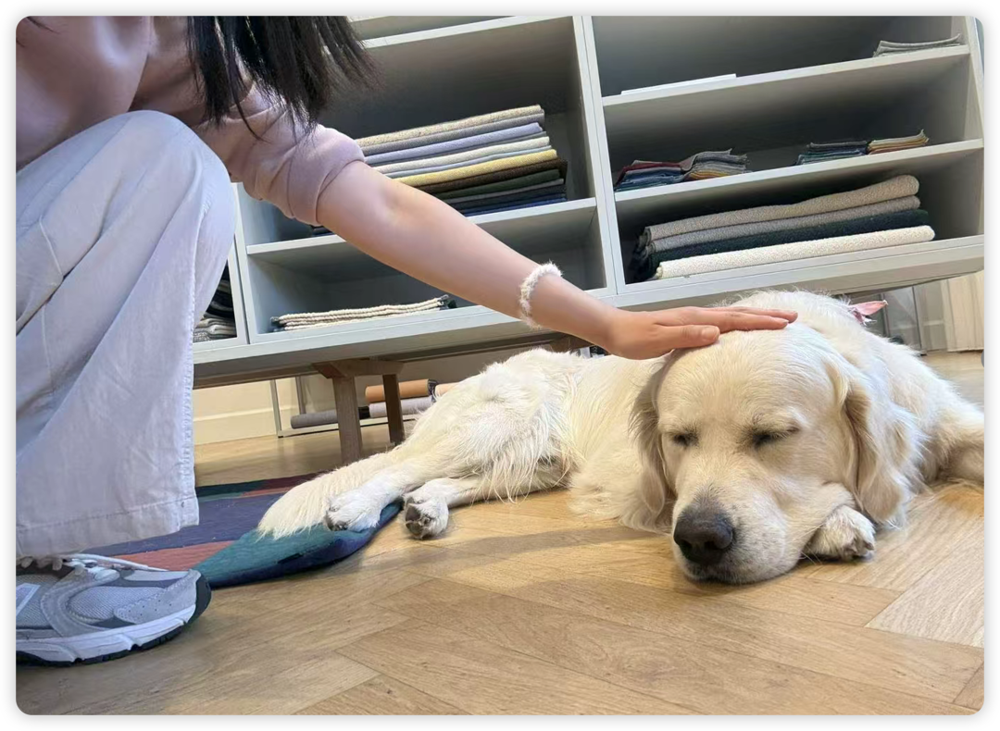
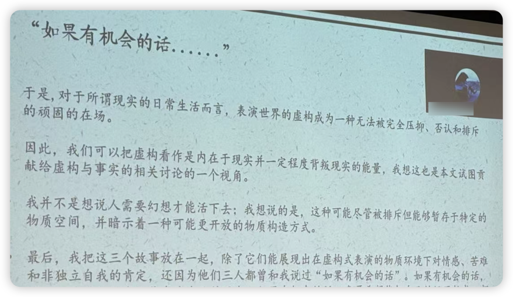
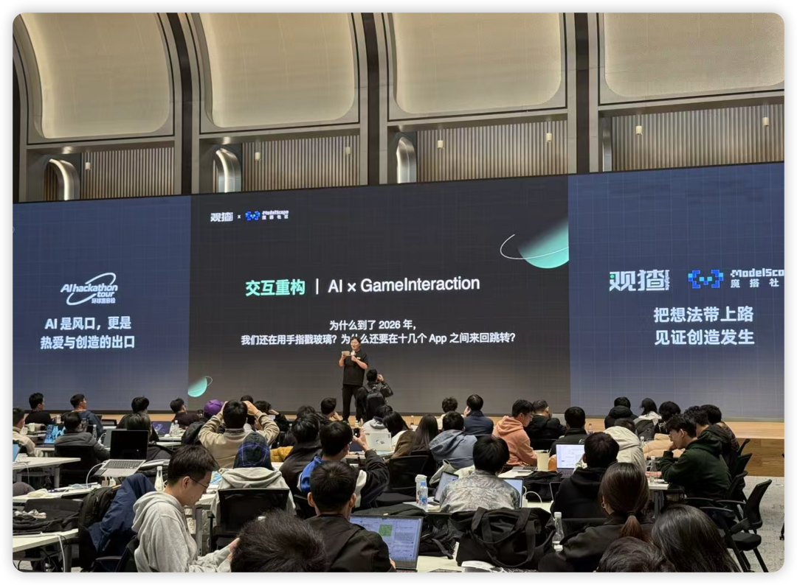
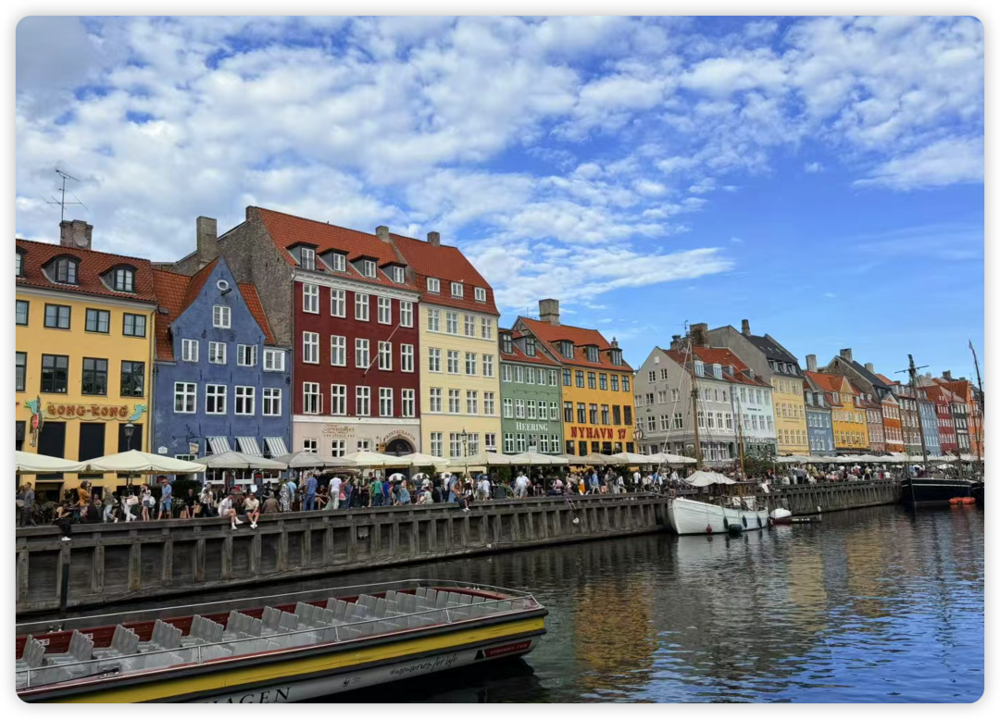

大体上很平静的一年，以至于无从说起。于是学着张zara的方式让AI来问我问题，按照它的思路也算留存下了一些今年的痕迹。

今年的主题是：Be Water，奔腾着奔赴大海。

cr. B站上Vicky宣宣的新歌《女娲》

“Be water, my friend”是我小时候看《李小龙传奇》时就感到震撼的话，而直到今年才终于明白其中含义。

原话是：

Empty your mind. Be formless, shapeless like water. You put water in a cup, it becomes the cup.You put water in a bottle, it becomes the bottle. You put water in a teapot , it becomes the teapot. Water can flow or crash. Be water, my friends!

在2025年，我似乎也逐渐习得了be water的心态。以nobody的心态，流淌过每一寸的时间，享受着每一分的岁月；同时我也即将结束硕士阶段的学习，从在心理学院学小众OB到转向商学院，也算是小水滴汇入大海，嗯～还是挺期待的！

在开始唠嗑前，提前用世界上最珍贵的12个字祝愿公众号的朋友们：祝你们新的一年可以无痛「规律作息 健康饮食 坚持运动🎉」！

能无痛做到此12字，基本上就可以情绪稳定地享受生活了😄！

/ Somebody OR Nobody /

往年的年终总结里，我讨论了很多关于自我的探索。但今年，我彻底不会去思考这些话题了！对于一个学心理学这么多年的人，这可真是神奇哦！

各种缘由在于，我想与其把时间放在讨论自己是怎样的somebody，不如用nobody的心态，如野草、浮萍、孢子生物一样，不戴着任何一种面具、不试图迎合任何一种刻板印象而生活，快乐、自由地生活与探索。

其实是因为在今年经历的很多事情和选择中，我终于意识到，很多的选择之所以让人觉得踌躇，或许是因为背后暗含着太多的社会评价和比较。而在年末，我似乎可以把自己完全从社会比较中抽离，更关注的是"我选择如何度过一段时间"。不是为了获得什么power、status、reputation，仅仅是按照自己喜欢的方式「度过时间」。

/ 浓与淡 /

今年我真是变成了淡人中的淡人。依然从不感到孤独，一个人在宿舍和在家也可以自娱自乐。安静又心流地享受书影音播客，也真是INFJ的一大顶级快乐了。

但依然和好homie们快乐social！在北京、上海、无锡、南京、苏州、武汉、荆州和好多朋友们快乐见面。这些见面愉快又自然，是因为我们都不是那种“把自己当回事儿”的人，于是可以自然地、没有任何包袱、不扮演任何一种社会角色地享受美食、人文与风景，好幸福呀！

/ 点与面 /

在科研上，我终于能开始把孤立的点拼接成面了。只是我尚未能用语言说出这些变化，也许还要沉淀一番。

我一边在心态上觉得自己尚在OB入门的边界，一边在事实上却真的在和许多成熟的学者一起做研究。我逐渐意识到，做OB科研似乎更像是学徒制。 做研究的时候有太多细节，这些都无法在非常泛泛的推文和公众号中获得，而只能跟着资深学者learning by doing。

而在2025年的年末，虽然我依然无法崇高地说自己有啥科研理想，但至少我感受到做科研是我可以接受的一种“度过时间的方式”，即使是那些dirty work我都可以平静对待。

我对自己没有什么高要求，我觉得能在博士阶段也用这样平静的心态对待科研就已很好。

/ 面与反面 /

今年听了无数场talk，但到此刻让我回忆最动容的，反而是两次与OB毫无关系的活动。

一次是学校社会学系的学术年会。听了一位在横店做关于群演的田野研究的姐妹分享她的民族志调查。她讲到那位因长相而永远只能演农民工的大哥的故事，说着就开始哽咽。最后在她的哽咽中，以"如果有机会的话……"为开头给那些群演的故事一个幻想的结尾。我觉得那一刻 艺术已成。

研究者和研究对象之间的那种empathy、那种"I see you"的moment便是做社科研究最珍贵的部分。这也就是我的「想做活人，做活的研究」的研究格言的具象化吧。不只是关注data和theory，不只看到孤立的data point，而是想真正触碰到人的生命，超越纸面研究回到立体的人。

新的一年，祝我们继续听到像这样动人的故事！

第二次是在杭州的hackathon比赛。在比赛最后一天的产品展示环节，我见到了很多人用两三天做出来的app，遇到了很多靠vibe coding solo参赛的文科生（我还去询问了他们的经验，也因此挖掘了最近最喜欢的互联网偶像张zara）；更震撼的是遇到了一些05后的学生，无论是在哥大的姐休学创业做AI产品、还是复旦的姐大二就找不同年龄层的人组队开发产品，这些人的故事都让我意识到，在学术界之外的旷野也宽广无比。

我选了学术这条路，但并不意味着这是什么高级或者唯一有价值的路。各行各业，英雄英雌，无处不在。

生命的活法真是多呢。我喜欢这群有活力的人们，在比赛现场就好像进入了一个巨大的bubble。这和听播客的感受很相似：仿佛外面的世界在下沉、在焦虑，但是在这些bubble里永远有蓬勃向上的热情。

/ 新年快乐！ /

2026年，希望继续保持Be water的心态。

流到哪儿，就在哪儿安心停留。也按照舒服节奏奔腾着，奔向更大的海洋🌊

新年快乐，朋友们！

愿我们都能像水一样自由，也像水一样强大！

