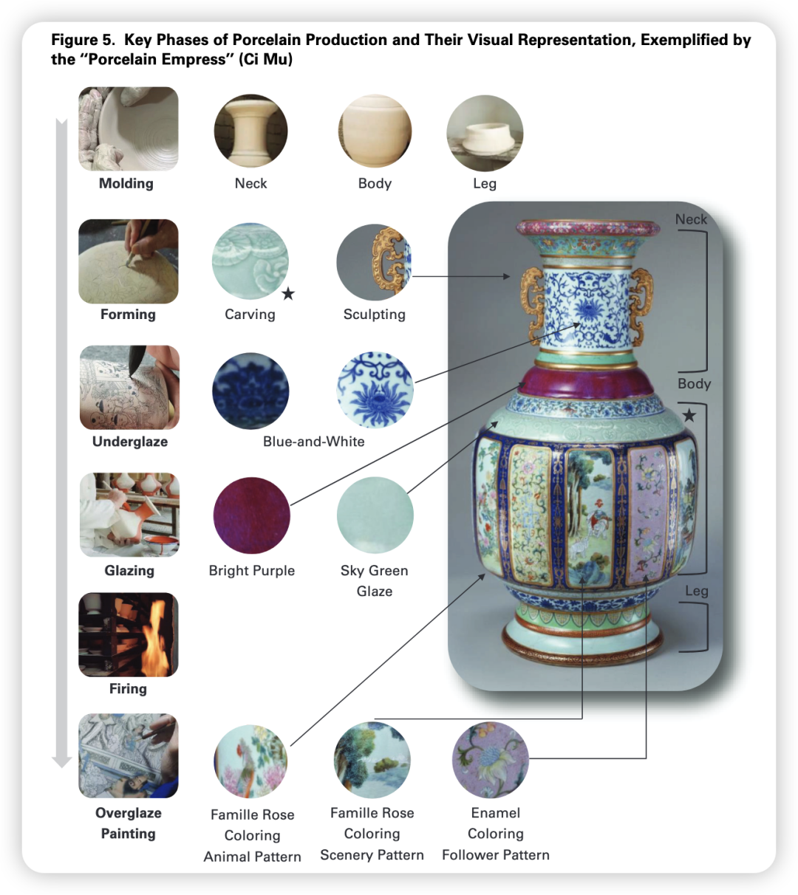
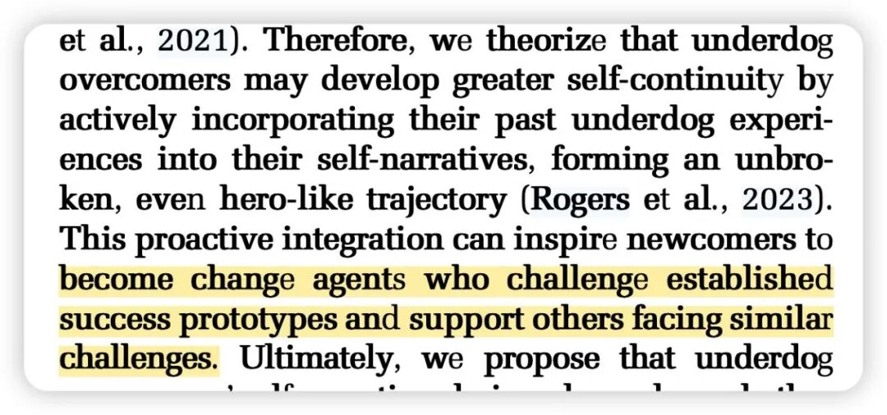
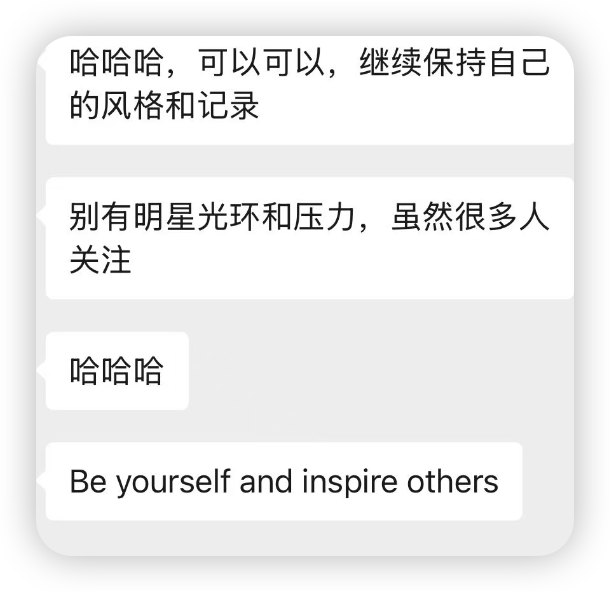

AOM投完之后休息了几天，然后又去湖北玩了一周。回来之后进行了一些报复性科研（当然也是因为最近的事情一件接一件；于是我也持续了几天「做完你的做你的」的工作状态...）

其实我已经好久没有晚上科研了，而这几天因为任务太多，晚上也在思考，甚至绞尽脑汁改intro... 本来就会因为过多自由联想而失眠的我，最近睡得更不好了。于是到了今天下午，终于脑袋转不动一点儿，进行了宕机模式。

好吧，真的要对我的脑子好一点了，于是我开始进行一些freewriting，亲爱的大脑，请你好好dance吧——

## #最近有点爱我的研究方向哦！

记得wendong老师说过，identity这种事情不是design出来的，而是frame/package出来的。

进入OB的第三年，我似乎渐渐感受出来了这一点。过往做的研究突然connecting the dots，变成了2个较为整合的研究方向：

一个是work-nonwork interface。在其中，我并不是看传统的WLB等变量，而是希望探讨nonwork experience/activities如何溢出到work domain；另外我也单独关注其中的recovery这个领域（呃呃差点就要从这个领域退出了，因为发现没有太多新的可以做了。直到最近又有一个小idea勾住了我:)

另一个是social perception，也就是人际感知。

我现在回想会发现，研究这两个方向潜移默化之间改变了我的许多生活方式与思考方式。

前一个方向让我在娱乐时更松弛，而不会产生休闲羞耻，毕竟我会告诉自己「嗯～现在的娱乐都是会增益我的工作的呢！」（而事实真的是这样，很多科研灵感均来自于我的生活！）

而后一个方向则让我更能意识到人际关系中的「傲慢与偏见」，从而能用更peace的态度觉察自己和他人、和世界的关系。

## 

## #最近的workflow变化

相比于之前的散漫科研，从2026年初开始的科研显然更有秩序感了。

之前开始工作时是知道「我要做这个项目喽...」，但往往这样模糊的命令会让我觉得难以开启，从而导致了无尽的拖延，以至于那些最该pay attention的项目被我一拖再拖。

而今年开始是变成了「我要做这个项目的这个任务喽!」，也就是我更加知道科研的stages是什么了，比如literature review也可以根据论文所处的阶段、所需要的内容而有不同的形式，比如data analysis也需要为了transparency设置清晰可重复的流程，从而让下次check dataset的时候一目了然。

想来这也是ASQ这篇文章里景德镇手工艺人所具有的Decomposing  Expertise吧！😁

(Chen et al., 2025) in ASQ；这篇也是年度paper之一了！

嗯 做科研也如做瓷器，一步一步分清楚，慢慢来～～

## #感谢ta们创造了我心中新的学术原型！

(Yan et al., 2025) in AMR；

我最喜欢change success prototypes！成功不仅只有一种叙事！

最近在和学术上的一些师长前辈频繁交流，每天都在感慨“她好好啊！” “好人好人！” “天呐 他真是好人！” ......

确实三生有幸，在学术初期没有遇到老登，而是一群阳光、鲜活且无敌正常的老师&合作者们！

比如硕导对我的公众号的态度是：be yourself。

在此之前，也许所有的中国学生都会担心自己的social media被导师发现会不会觉得是不务正业云云。

有时候我也在这种刻板印象下，觉得自己放在别的组一定是导师最讨厌的学生，因为我总是喜欢自由，而在自己不认可的事情上很难服从（我总是想象我在toxic的组里一定会马上退学！）。感恩硕导大恩大德，没有把我逐出师门，还一直鼓励我 :)

还有其他一些老师们，抛开我对他们学术专业度的佩服，我最喜欢的一定是他们的活人感。
（如果仅仅有学术专业度 而风格上非常nerd或者非常push非常死板 是完全无法成为我的role model的！）

写到这里，想到今年总结出的peace&love的人生原则就是：

别把自己当回事儿了！

我不过就是在和不同人、在不同地方、做着不同的事情而已罢了～

我没有一个恒久不变的identity，我只是在生活、在经历，我不持有任何一种特权——我可以坐在电脑前看（貌似）高深莫测的学术文章，也可以去早餐店和正在扯面做油条的阿姨聊闲天，还能和小狗一起跑步呢！

努力活在每一个当下的瞬间，不要将自己在别的方面所谓的title or priority带到当下的场景中 （似乎就是三个字：别装了），这样就会很轻松、很专注、简直气定神闲（对了 最近我总是在各种地方闭目养神 感觉非常能够让自己调整状态 回到当下）。

而到人际关系上，我也总是在和那些「不把自己当回事」的人相处时最愉快、最轻松！

我记得第一年参加SIOP时我感觉自己误闯天家，似乎每个人见面都要非常专业地自我介绍一番，用规范化的语言、说着1分钟后就会忘记的内容😅。那时候我感觉学术世界真是八股且superficial啊。

知道直到后来我又见到、了解到了那么多可爱的老师们：

比如老师A会在meeting时给我看ta可爱的小狗，最近甚至她把头像也换成了ta的小狗哈哈；

老师B说ta也会在学累了换个地方休息休息然后学习，快乐地流浪学习；

老师C 我则是要和ta一起在杭州打上壁球了哈哈哈，谁能想到曾经也是看着ta写的学术内容长大的呢。

也是我在跟ta说，所有人都跟我说还是去美国读博吧，可我还是想去hk诶。ta跟我说，所有人都选择的路 不是也很无聊吗？创造自己独特的路多好玩呀。

That’s it！

新的一年 让我继续另辟蹊径！ 即使是在一片芦苇荡里 我也可以像一只小狗一样 躺出自己的一个舒服的小窝窝 然后快乐地、悠哉地晒太阳！

（脑海中莫名其妙蹦出这个意向 取自于我们家乡下的狗阿黄的躺平画面🦮）

就写到这里吧，不然亲爱的大脑又要累着喽——
