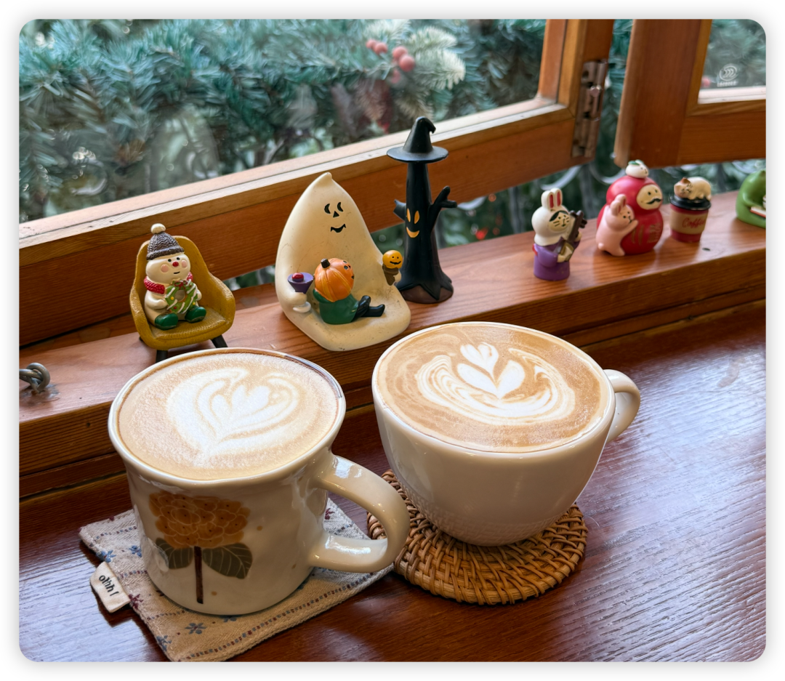
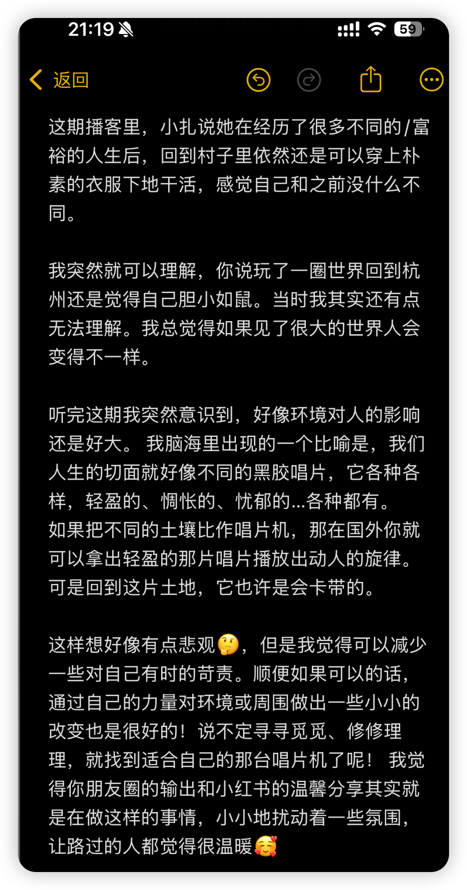
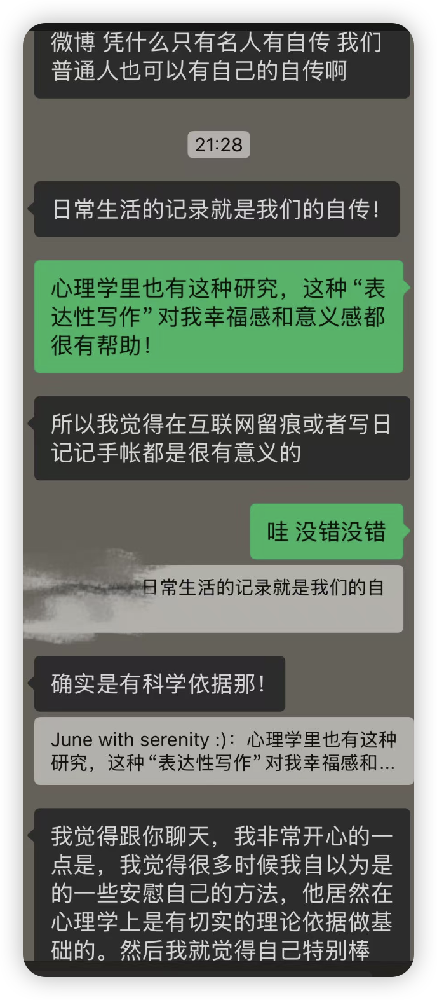
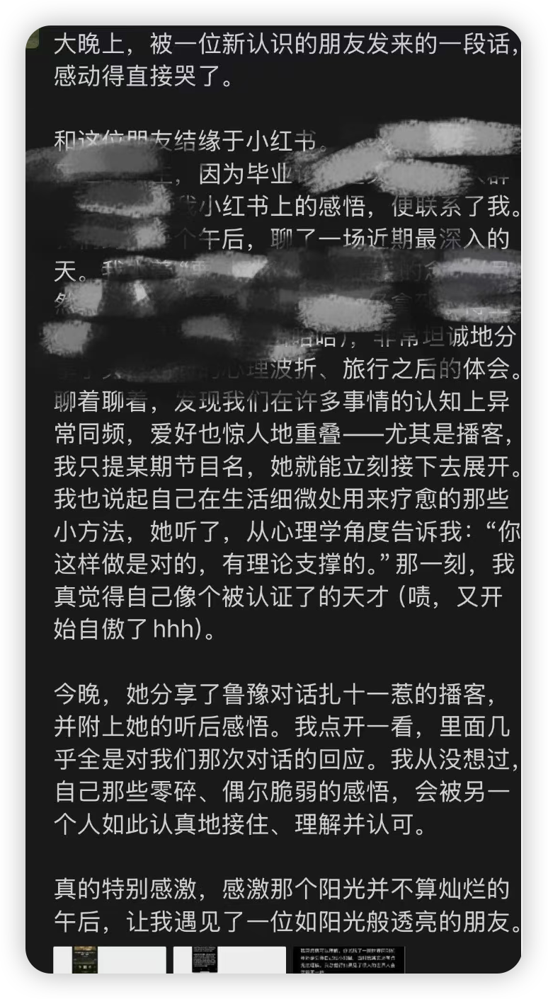
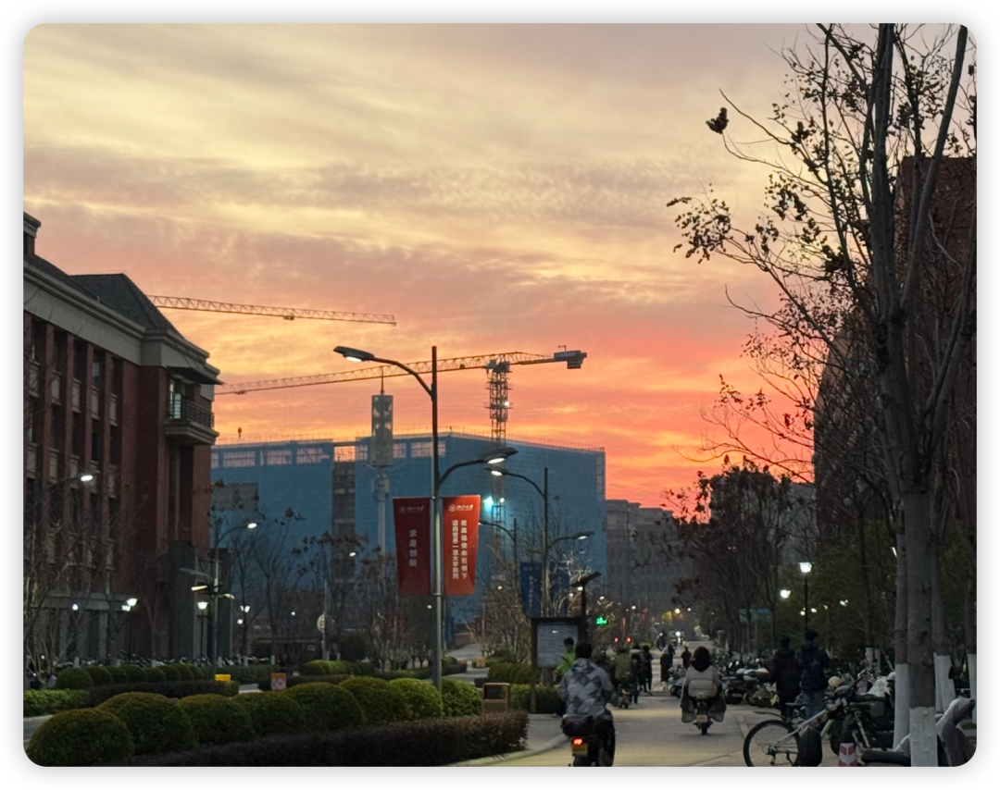

想用文字留存下今日的温暖。希望未来在我质疑研究意义的时候，可以回想起这个时刻。

事情是这样发生的——

前段时间在小红书看到一位和我研究话题相关的姐姐，于是想着「coffee chat如此流行，让我也来一试！」的心态勇敢邀约。幸运地得到了姐的满口答应。

于是我们在一家这两年来我一直刷到但还没去过的咖啡店相约。寒冷的阳光，静谧的窗景。

然后发现其实我们是很像的人。本来开着录音录制着访谈对话，后来该聊的聊完了我们干脆结束录音，直接敞开又聊了两三个小时。从在国外旅游见证历史的发生，聊到回到现实中的一切，聊到家庭的滋养与束缚，聊到30岁的人生才刚刚开始。

我为她的人生经历感到丰富而连连感叹，她说可她觉得我的生活也同样不平凡。

在说了一段长长的话后，我们安静地看着窗外的落叶，突然的话尾是：

“认识你好开心哦！”“我也是！”

“下次你来我家里玩哦！我家里可漂亮了！”  “好呀！”

回到今天，我白天激情review paper+writing，晚上在跑步时听完了岩中花述鲁豫对话扎十一惹的后期。其中有一个片段又让我感受到了「connect the dots」的感觉，像蜘蛛侠里的peter tingle一样，突然又串联起来了前段时间和姐的对话。

我其实很少发一长段话给别人，总觉得有些煽情、也会给对方造成阅读负担（但其实我又是喜欢收到小作文的人hhh）。但我看过她的朋友圈，知道她也喜欢长段的文字，于是就分享给了她。

然后我们又开始了聊天，再次relate to each other。我今天还正好看到expressive writing的paper顺便分享给了她核心结论，没想到她觉得这个印证也意义非凡。

于是她又在她的朋友圈这样分享：

看完我又想： 上天呀，你对我可真是不薄。让这样偶尔有些离群的我，总能遇上同频的、如此好的人。

想起通过公众号认识的一些朋友，现在我们居然也总是频繁对话着，逐渐变成对方的「one of six smart friends」。我也总会生发无限多感恩。

Hey，你说，人文社科的意义要怎么描述？

我只能像这样，给你写这样一段温暖的故事。就像写下[Bubble｜我们该如何理解OB 研究的意义？—— 记录最近两点感悟](https://mp.weixin.qq.com/s?__biz=MzU1MzY1MjIxOQ==&mid=2247486087&idx=1&sn=338df7ba2808a1be14f3810fff32a97d&scene=21#wechat_redirect)这篇时感受的一样。

我只能说，是从此有些自我探索，因为有了科学研究的验证，而有了遥远的共鸣，发现自己小小探索和感悟竟然是科学的，或者至少是和那个研究中几百个几千个被试的平均效应一致的。这样的小小肯定在这个不确定的时代也很难得。

是本来觉得自己不适合心理咨询，但还是发现心理学的视角让我在看待很多问题时都能串起一条逻辑链，认知、情感、行为、自我、人际、群体，这些视角和那些人生经历相碰撞，突然就可以让人生的马赛克又消失一些，变得清晰一切。

是此时此时我依然可以在AOM的投稿压力中觉得松弛，管理好自己的时间和压力，记录下今天的这一切。

是我可以像鲁豫一样，能对很多人的人生经历保有天然好奇。是意识到自己的特权、偏见、狭隘，然后慢慢地修正这些，用更宽广的视角看待彼此。是今年坐在大运河边，看着来来往往的人，仅仅是看着人类，我都觉得可爱。过了这么多年，我依然像高中时第一次读心理学的书那样爱着人类，真是一件无比幸运的事情。

是本来我与你并不相识，可我们在世界上同属一个领域，关注同一个人群，好奇同一个现象，于是我们可以跨越地理、学校、年龄而展开就学术本身的对话。它让我们以意想不到的形式链接。是从此我的天马星空，也有了你的ball back。

是本来我与在各个领域中的人从不相识，却可以借着访谈的契机，感受那些真诚流露的瞬间，触达彼此生命的脉络。从此，在我的记忆中，又多了一个可以关联起来的人生故事，某一刻，它将和其他很多故事在某些瞬间共同构筑起新的看待世界的方式。

你说，人文社科的意义要怎么描述？

我无法用一句话描述，我无法用功利的语言描述。

我的脑海中是很多很多个画面。是很多很多的好人们。

由衷地祝愿大家，能和我一样幸运。在下一次再问出这个问题的时候，都能回想起做人文社科学者时，触动自己的那一个个画面，那一个个好人。

和姐分开的那个傍晚，久违地看到了很美的夕阳，是她给我发微信让我抬头看时候，我才马上放下餐盘走出食堂看到的：）

