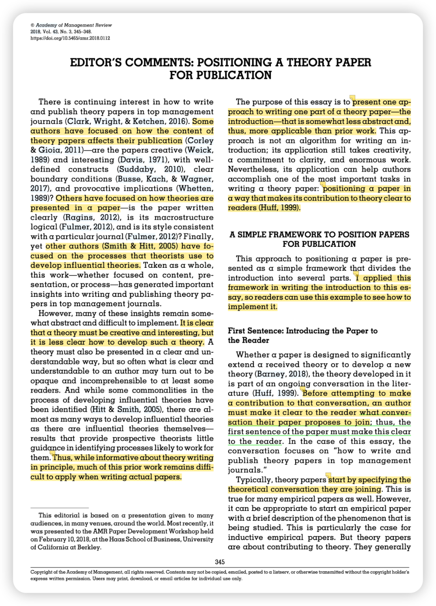
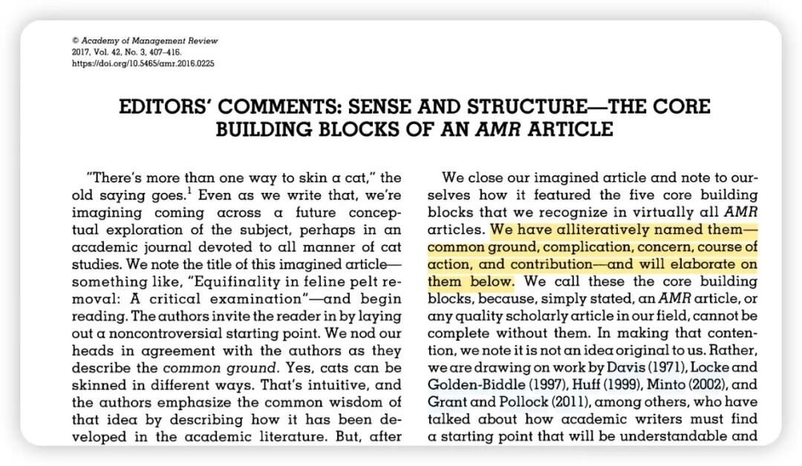
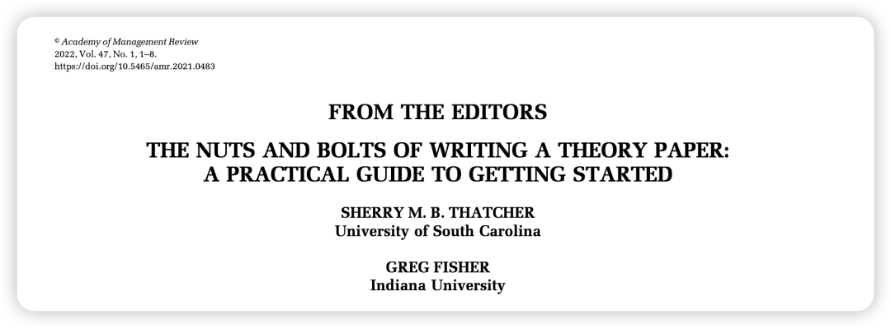

AMJ的editorial虽然还有很多好文章，但我印象深刻的就只有所写的两篇了，之后等到「拍案叫绝」的时刻再补充吧～

这篇来总结一下AMR中精彩的几篇editorial，因为理论文章对于写作要求功底更深，所以AMR的editorial很多是关于writing的，真的非常细致，对于我们写实证文章也非常有帮助！

1. Barney, J. (2018). Positioning a Theory Paper for Publication. Academy of Management Review, 43(3), 345–348. https://doi.org/10.5465/amr.2018.0112

- 这是我最早读到的一篇，完全是手把手、句把句的教学，详细介绍了Intro每段要写什么、篇幅大概是多少，可以看我这篇推送的详细解读：

[读顶刊｜AMR-管理研究的写作中如何铺垫理论探讨](https://mp.weixin.qq.com/s?__biz=MzU1MzY1MjIxOQ==&mid=2247484625&idx=1&sn=c80d4d5ca230dd2d573ce7b40f8339cf&scene=21#wechat_redirect)

2. Lange, D., & Pfarrer, M. D. (2017). Sense and Structure—The Core Building Blocks of an AMR Article. Academy of Management Review, 42(3), 407–416. https://doi.org/10.5465/amr.2016.0225

这篇是今年我才了解到的、也是很多学者提到的「5C法则」，正如作者所说，命名为5C法则是为了让研究者更容易记住这些core building blocks，在想idea、写作、甚至审稿的时候都可以时不时想想这个5C：Common ground, complication, concern, course of action, and contribution。

3. 【🌟集大成者】Thatcher, S. M. B., & Fisher, G. (2022). From the Editors—The Nuts and Bolts of Writing a Theory Paper: A Practical Guide to Getting Started. Academy of Management Review, 47(1), 1–8. https://doi.org/10.5465/amr.2021.0483

- 和AMJ 2024的Research Canvas一样，这篇拥有word文档作为附件的editorial也是诚意满满的集大成者（它里面的很多部分当然也延续了前面这两篇文章中的精华），完全也是可以把全文和word附件打印出来放在书桌旁的实用程度。详细解读可以看我的这篇推送：

[顶刊阅读计划 20｜AMR From the editors：一份如何写好理论论文的实践指南](https://mp.weixin.qq.com/s?__biz=MzU1MzY1MjIxOQ==&mid=2247485830&idx=1&sn=a8963c0627197e896b9d98b89e984456&scene=21#wechat_redirect)
