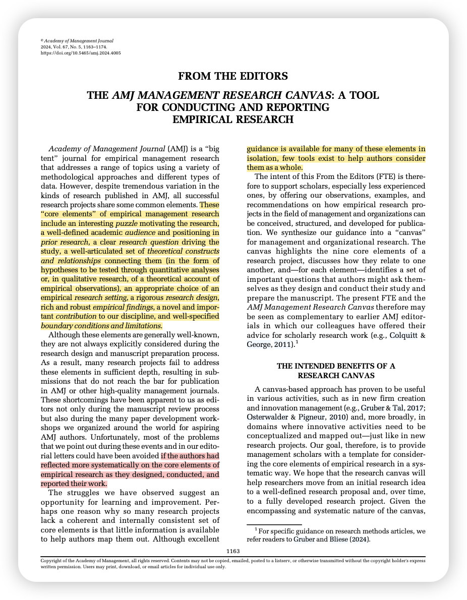
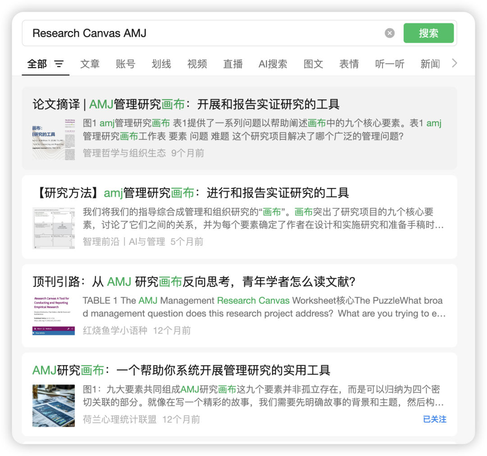
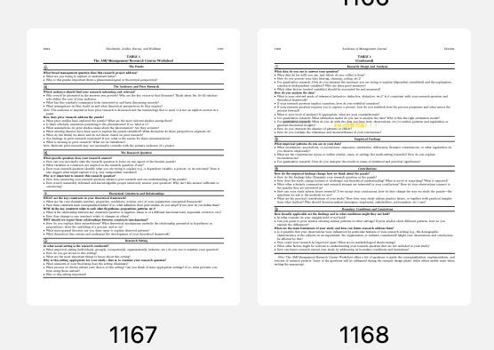

Dorobantu, S., Gruber, M., Ravasi, D., & Wellman, N. (2024). The *AMJ Management Research Canvas*: A Tool for Conducting and Reporting Empirical Research. *Academy of Management Journal*, *67*(5), 1163–1174. https://doi.org/10.5465/amj.2024.4005

这一篇无趣多言，其实就是我这一条里所提到的：[顶刊倡导也是一种对熵增的抵抗呀！](https://mp.weixin.qq.com/s?__biz=MzU1MzY1MjIxOQ==&mid=2247486246&idx=1&sn=dd5654064eaf626d1cca820505bce841&scene=21#wechat_redirect)之前它online的时候我只浅浅下载了看了一下图，上上周一字一句品读才发现实在是精妙绝伦！

如果说AMJ只看2个系列的editorial，那我觉得就是上一篇提到的早期系列（[走出OB新手村02｜Editorial篇：AMJ 2011-2012年集中发布的7篇Editorial文章](https://mp.weixin.qq.com/s?__biz=MzU1MzY1MjIxOQ==&mid=2247486283&idx=1&sn=e3c3c9d783100da2504c61c2f6ee7e78&scene=21#wechat_redirect)）和去年这一篇集大成者。详细看完这两个系列，就几乎了涵盖80%的AMJ Editorial精华！我想如果一个研究能回答清楚这里面提出的问题，一定是非常不错的研究了！

对于这篇文章我就不做过多解读了，毕竟一检索其他公众号早就已经解读过十万八千遍：

而我觉得这份资料可能的用法就是：打印出来！（特别是这两页！

做研究的时候就放在手边，随时拷问拷问自己上面的几十个问题！ 而且如果可以对着里面的问题烂熟于心，以后去评审论文啥的也就有了参考！

◽️又是一年AOM 可以试着报名去做一下AOM Reviewer。厉害的话还可以像我的朋友一样拿一个「AOM Best Reviewer」的奖； so cool！

◽️ 记得早点投稿，千万不要卡在最后一刻投！！
