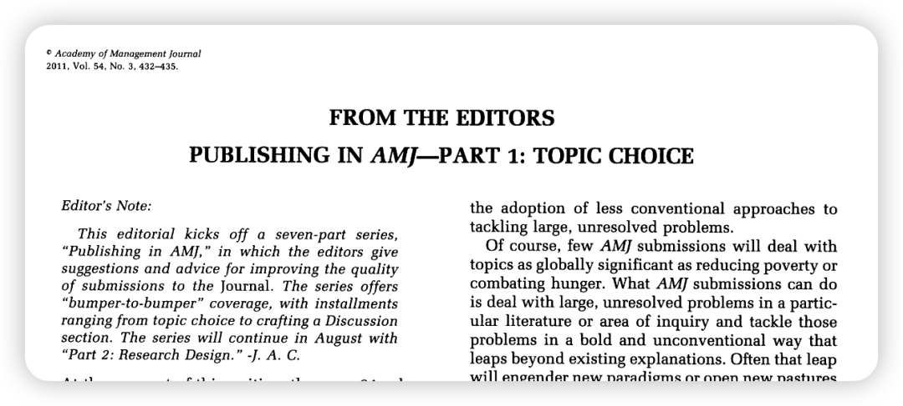
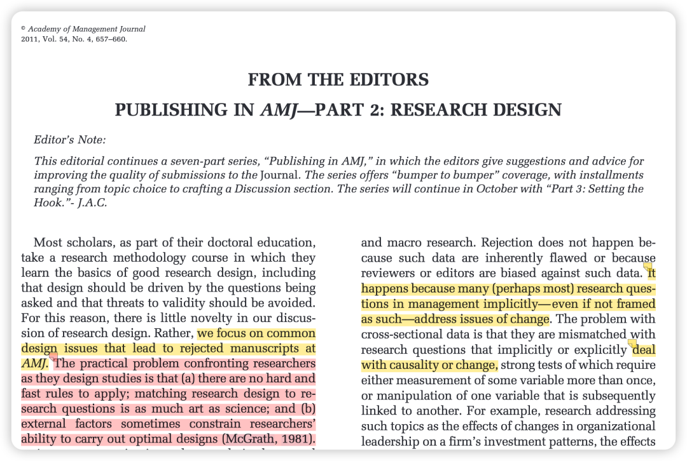
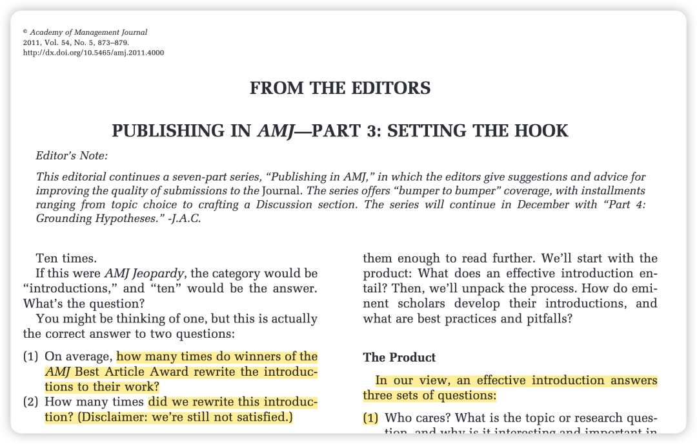
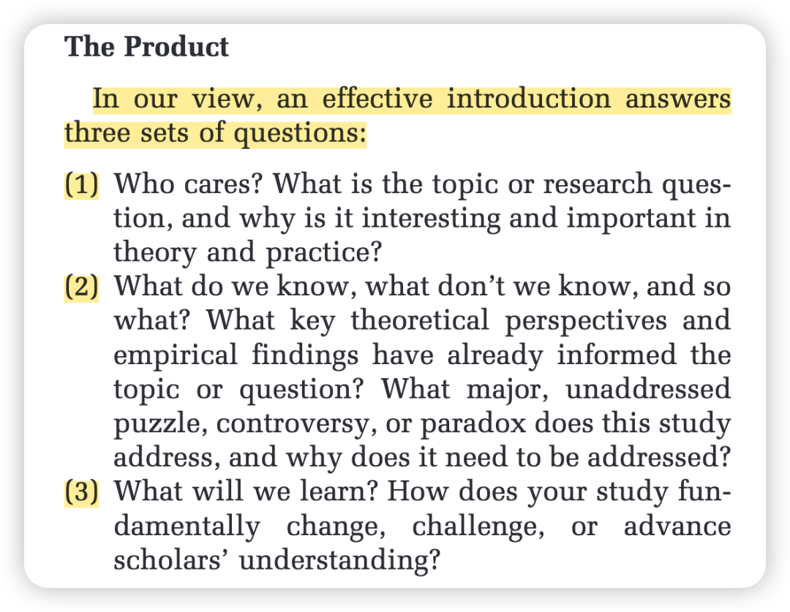
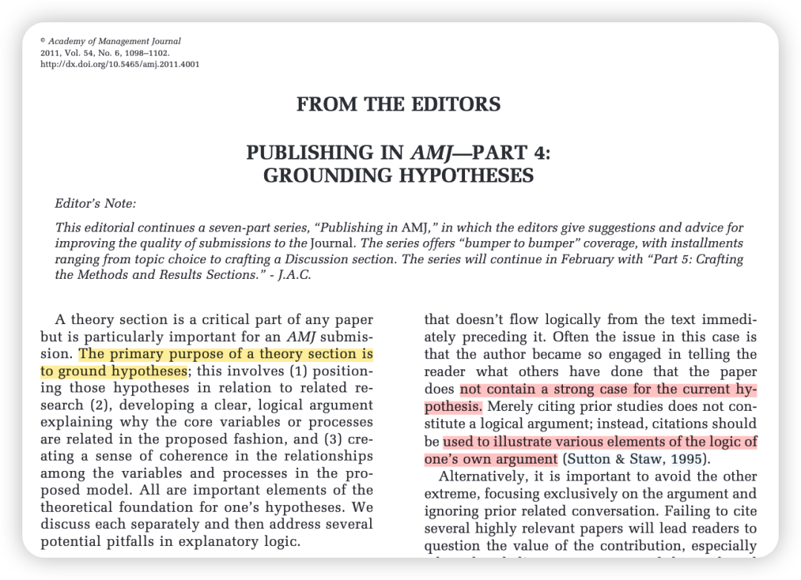
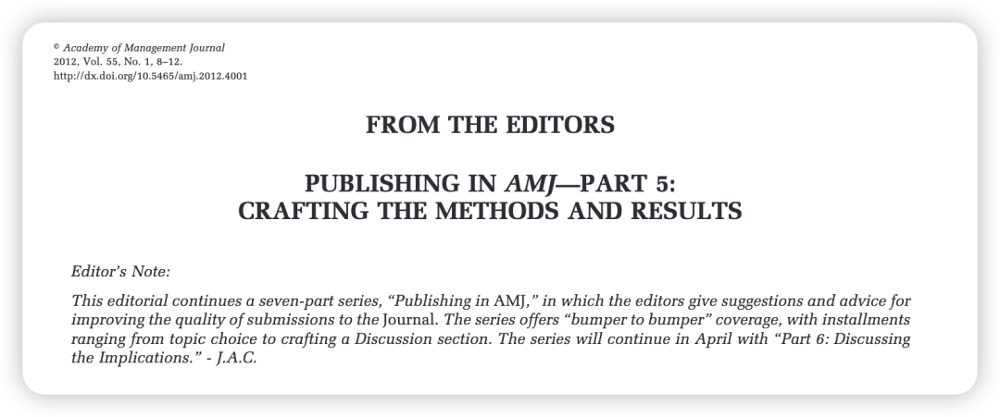
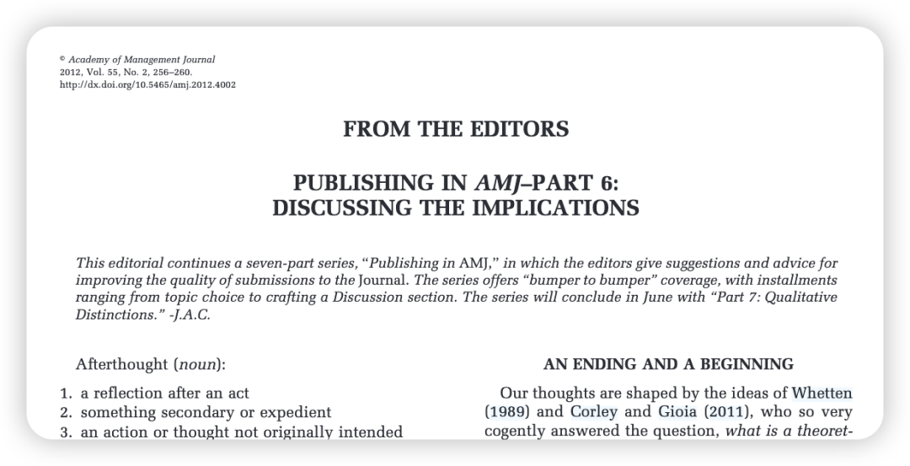
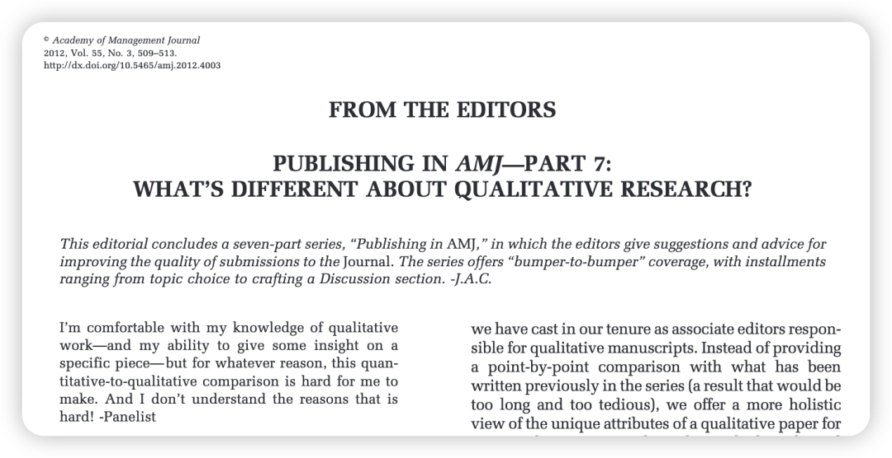

相信这个系列是有品位的课题组都会去让学生品读的！（比如我们组hhh）这里面的一些文章也是我无数次在讲座中听教授们提到、甚至在一些公开的北美syllabus上都必会出现的！

总之我觉得，开始做真正的管理学研究之前，必须读完这7篇！

### 第一篇：选题

教你从Significance、Novelty、Curiosity、Scope、Actionability五个维度去评判选题

### 

### 第二篇：研究设计

告诉你如何避免研究问题和研究设计的脱节

### 

### 第三篇：引言

是非常重要也是被提到最多的一篇，如何用setting the hook的方法来写好引言。

你是否回答清楚了下面这些问题？

### 

### 第四篇：假设

同样很关键，让我们区分了literature review和hypothesis development的区别，到底怎么样进行假设演绎，如何结合多个理论？

### 

### 第五篇：方法和结果

这篇比较基础，近年来其实有更多对于方法严谨性的要求的editorial文章。

### 

### 第六篇：讨论

详细介绍了discussion该怎么写，而这个其实是经常被作者忽略的一部分（所以钱岳老师在修改稿子的时候有时候会修改顺序，比如这一版可以先从讨论改起），如何总结你的结论（An Ending）：如何给theory和你对话的领域提供新的见解（An beginning），又如何避免写一些重复的废话？

### 

### 第七篇：质性

由于暂时没有深入做一个质性研究，所以这篇印象不深。之后做的时候再回到这篇来回味一下。

### 

### 这个系列我的使用方法是：

-在**一定文献阅读的基础上**先去读第一遍，同时每读一篇都去**结合顶刊上的最新研究**去品味，把principle和文献进行**对照**，从而更好理解editor的深意；

-第一遍品完之后，可以慢慢开深入思考自己想做的研究，然后在做的过程中**learning by doing**，时刻锚定这些文章中的要点，然后你就会意识到知易行难…；

-最后在写作的时候，再把每个manuscript中的不同部分和这里的每篇文章进行对照，看看自己有没有做到这些最基础的要求。

就写到这里！晚安！
