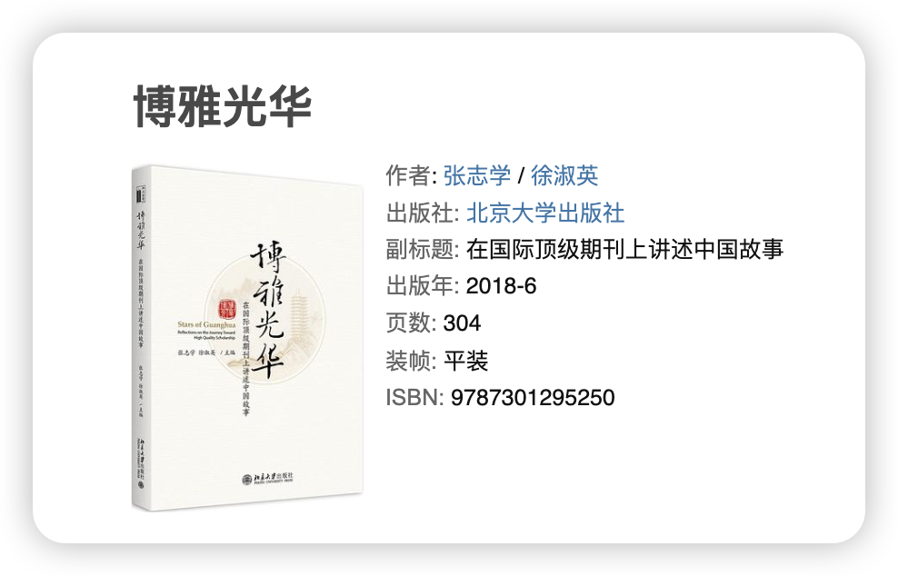
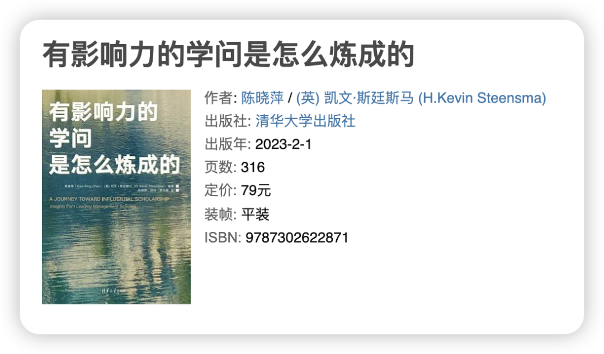
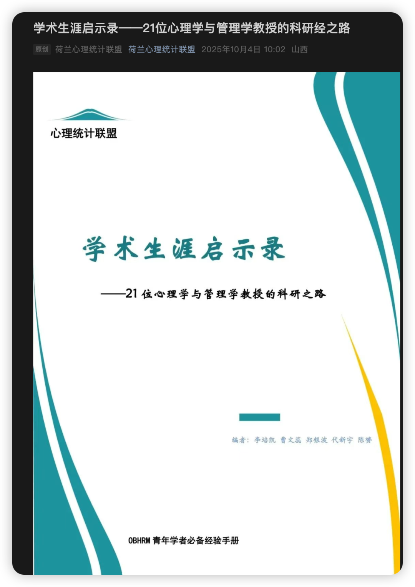
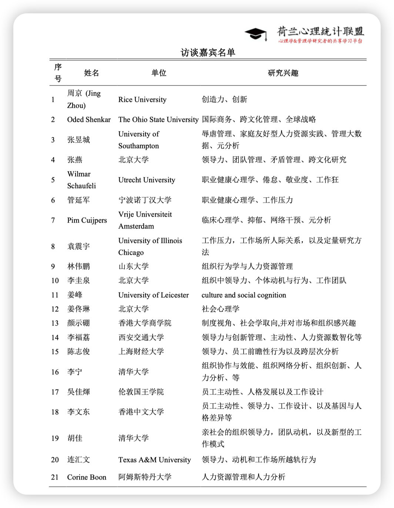
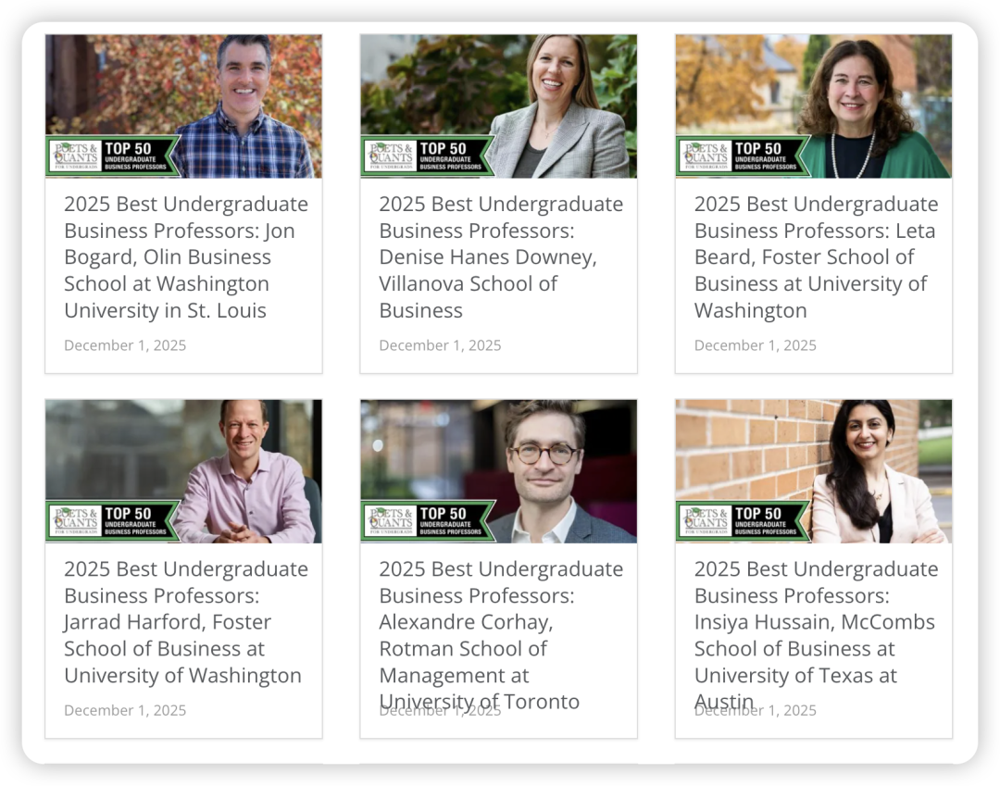
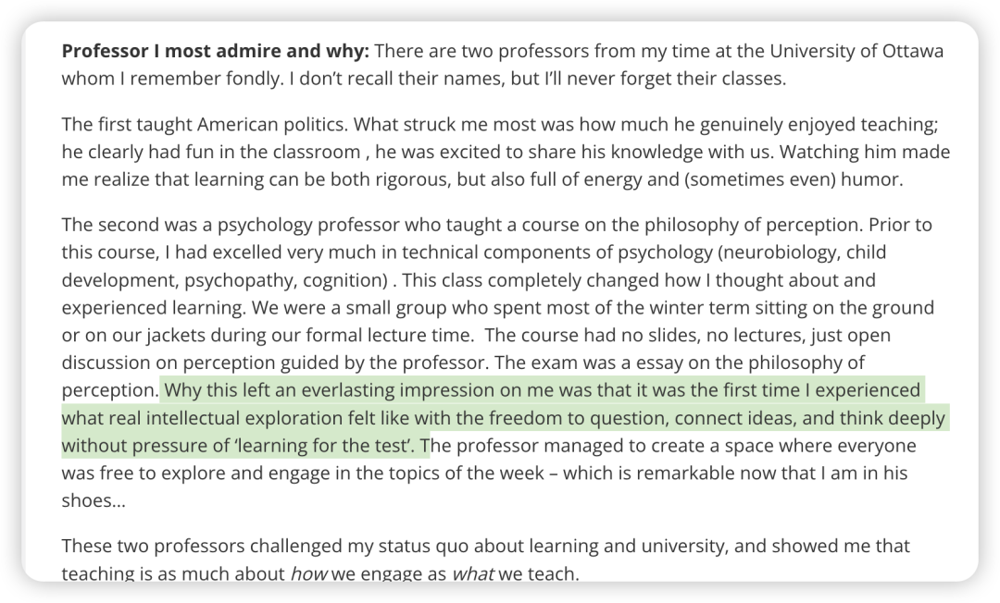
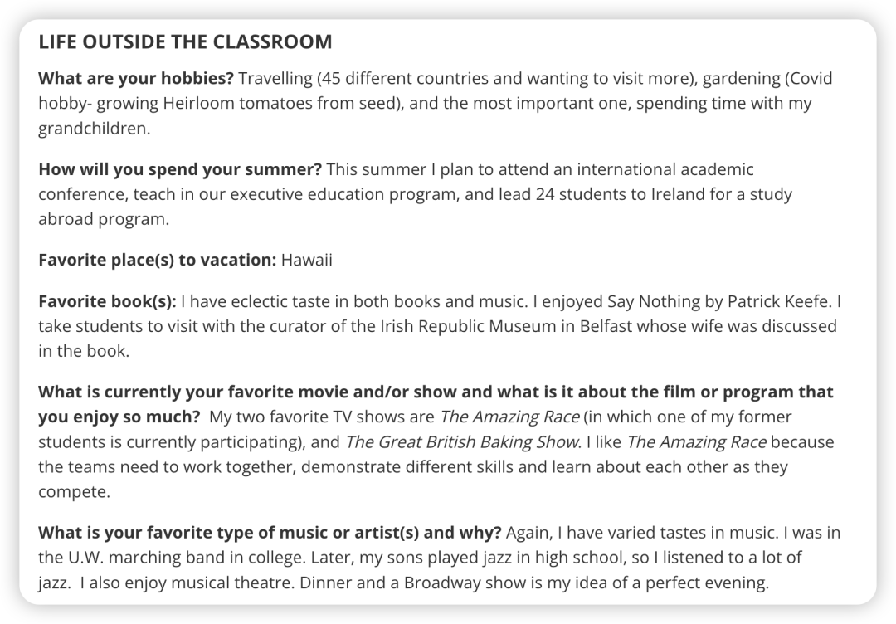

介绍：

作为经常被诟病storytelling的商科专业，入门当然也要从故事看起 :)

而且对于在新手村村口徘徊的人，一上来就读AMJ确实会让人昏天黑地，一开始属实难以理解一篇论文怎会如此之长！（仍记得我读第一篇AMJ时，仍然不知道能从学校的EBSCO下载，于是用scihub下到的是还没有排版好的单列版本，整整有80多页！我看了一周才从头到尾看完，然后第二天全部忘光。） 这个时候先不从“论文”的角度切入，而是从“人”的角度切入会相对来说好接受一些。

毕竟，如果未来真的要走学术道路，你确实得知道已经在这条路上行走的前辈们是如何走到那里的。当然这除了能让你了解这个领域的学者主要是怎么做研究的，也是借由他们自带的人格魅力让你逐渐爱上这个领域。就像是曾经有一束光照在ta们身上，而ta们发出的光又会照在你的心里。

好的，废话不多说，直接开始！

### 1️⃣《博雅光华：在国际顶刊上讲中国故事》

### 

这本书我觉得是最适合低年级研究生（在心态上）入门的书籍，讲述的是北大光华IPHD项目培养出的博士们在顶刊上发表研究的经历。

我已读了2遍，第一遍当故事读，了解这些无比卓越的博士生都有什么共性（主动合作、执行力强、不卑不亢…），也了解到顶刊发表之不易（比如AMJ 3轮被拒...）；第二遍读就开始品味他们的研究了，穿越回过去，看看他们是如何提出研究问题、如何把idea变成可执行的研究、如何寻找合作者、审稿人提出什么疑难问题而他们又是如何解决的——从这个角度上来说，其实你很难找到一本集「作者做研究的心路历程、审稿人的处理稿件复盘、作者导师的评价」于一体的书籍了。因而，若是能边看作者当时发表的论文，边对照此书品味作者的心路历程，或许也能摸清一些研究逻辑！

这学期我在修改我那篇改了几十遍的论文时就把这本书带在身边，每次开始前都要读一个故事给自己一个改论文的心理准备… 合上书想着，嗯… 不容易啊不容易，大家都不容易...都是得经历很漫长的路才能看到曙光的。我也继续再改再悟吧…

### 

### 2️⃣《有影响力的学问是怎么炼成的》

### 

这本书相比于上一本则是next level，是邀请那些在自己领域有突出贡献的学者来讲述他们是如何对这个领域开始好奇、又是如何一步步为这个领域添砖加瓦的，包括identity领域的大牛blake ashford、creativity领域的大牛Jing Zhou…当然也有general地去讲述自己的学术历程、给年轻学者的建议等等。

读这本书你就会发现，即使是在学术界这样路径相对固定的领域，大家的人生道路其实是千奇百怪的，切入问题的视角也各不相同，因此我觉得这本书是非常适合在确定研究领域前研读的一本书。

然而我暂时只读了这本书一半跟OB更相关的章节，剩下一些偏macro希望在之后也能有时间品味！

### 3️⃣「荷兰心理统计联盟」21位心理学与管理学教授的访谈

### 

这个系列可谓是我从本科追更到现在，每期公众号上的访谈都会看，之前还会复制到自己的notion里收藏，现在荷心出了一个集大成的PDF更是功德无量！大家可以去荷兰心理统计联盟公众号自取！

至此，我相信如果能把上面说的三个材料看完，你大概已经80%知道了「how to be an excellent OB scholar」中那些最基础的共识；也会发现在看完这些后，很多讲座中的要点其实都已是老生常谈。

然后发现，更重要的其实是在骨架上填起血肉。而往往，填起血肉的过程才是最难的，无人可以教你，因为没有人能帮你把看完过的几十篇几百篇文章按照你头脑中的逻辑进行组织，也没有人能帮你把文献和你现实中最关心最触动的问题连接起来，只有你自己去读去品去悟去碰撞。So just do it！

### 4️⃣Website：poets and quants - 2025 Best Undergraduate Business Professors

### 

最后这个其实是我刷linkedin发现的，是这个网站评选出的每年50个优秀商学院教授们的采访，也可以借由采访看看他们平时的生活～ （属于是我收藏夹吃灰系列，可能偶尔喝咖啡的时候会打开瞎看一下…）

但其实点进去，这些访谈都挺有意思！比如他们欣赏的professor是怎么样的、他们的personal life等等，里面还有对于教学的思考，也许对一些青椒会有帮助。

祝您读故事读得开心！欢迎补充！晚安！
