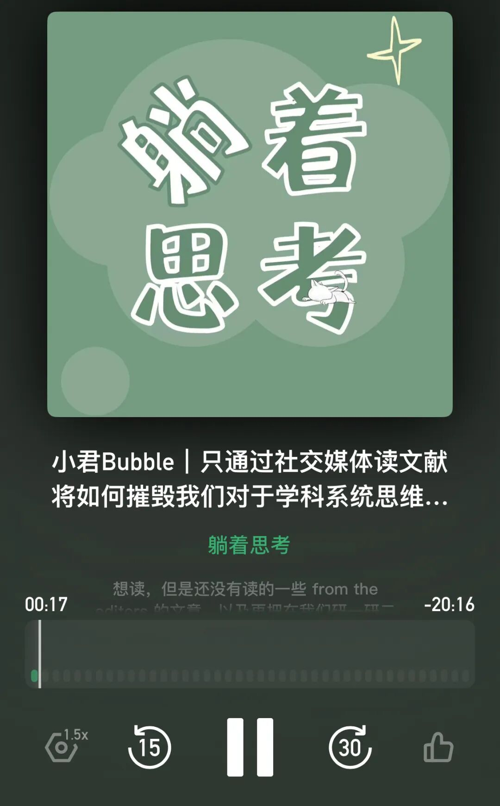

最近忙于PhD的申请和笔面试准备，无暇更新。

但也借着这个过程梳理了“我的来时路”、复习了AMJ最重要的那些from the editors的文章，从而对于 “有了NotebookLM这样的AI之后，我还需要如何去生产有价值的内容？” “如果只是通过小红书和公众号去读paper，将会如何影响人对学科系统思维的构建？”这些问题有了新的思考。

先用一期小宇宙音频记录下一些碎片的感受，下周面试完我将写一期推送好好论证一下！

我还想整理一下我过去对于自己的“training”、比如我觉得研究生时期必读的OB material有哪些等等（绝对不会鸽！！）

from 小宇宙App
