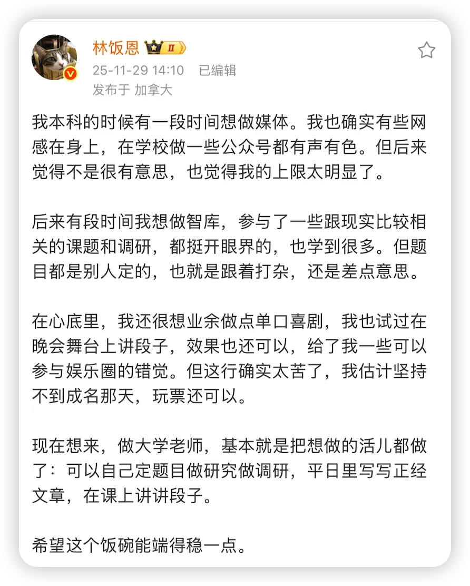
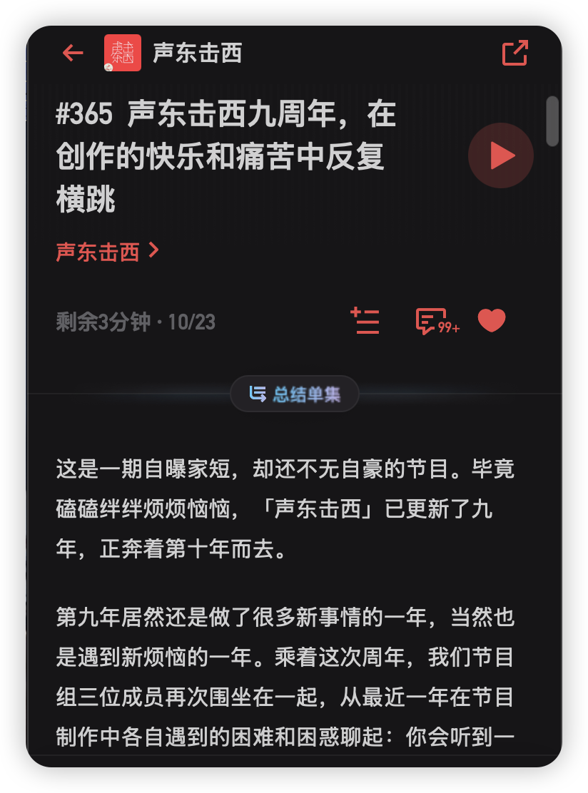
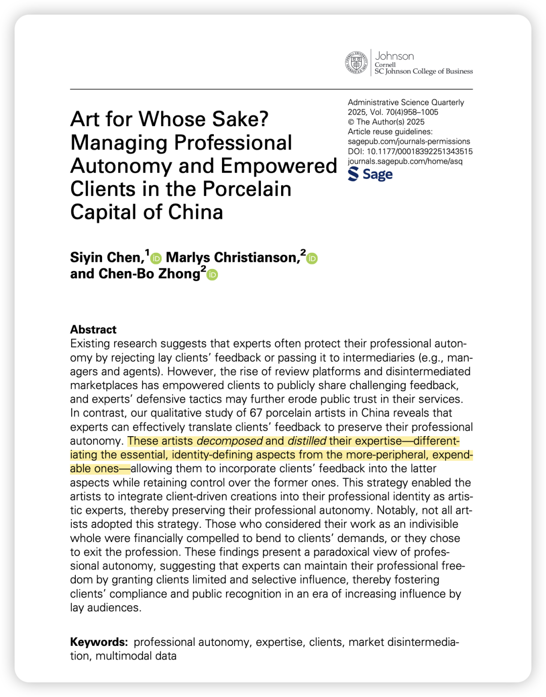
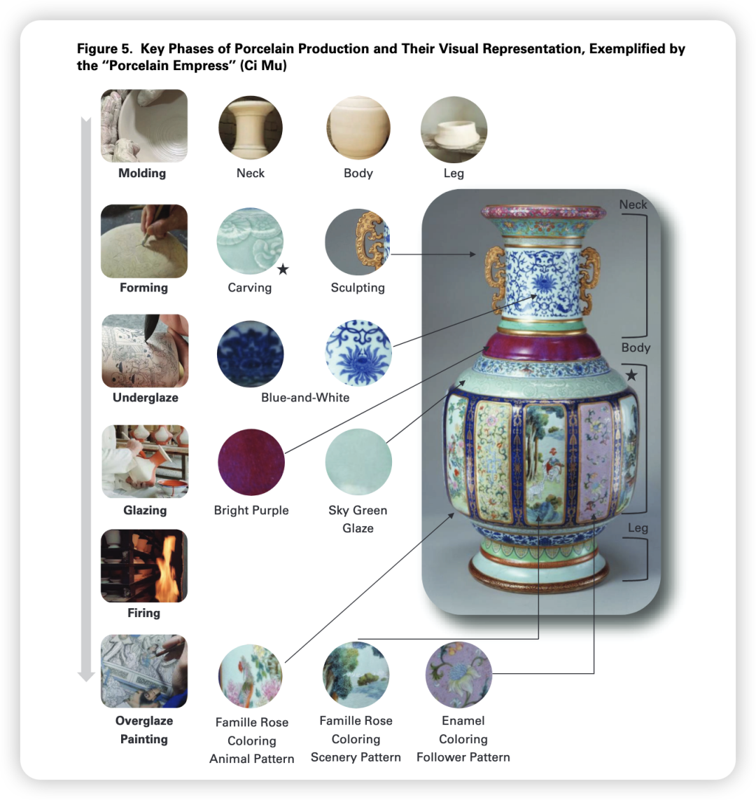

看到林老师这条微博真的深有同感！似乎也可以作为我面试时「Why PhD」这个问题的答案！

上周推进了多个项目，每个项目处于不同阶段。在不同项目切换时，我就在那儿想象其实我是个“人格分裂”，或者说我在管理一人公司，因而我需要承担多种角色：

### 项目A（写作润色阶段）

我想象自己是个无情的copy editor，这一次我先不再去想那改了千百遍的逻辑和理论，而是就做一些枯燥的文字编辑工作。这样进行一下课题分离，稍微可以降低一点修改这篇文章的心理抵触。

同时，在最后的阶段我还需要check citation以及补充citation，之前我总觉得这个过程好麻烦。现在我尝试把这个过程理解为：这是在给reviewer展示我丰富全面的文献阅读！

这样一想我就充满了热情，在审读每句话的时候我都会思考一下整个literature中是哪些有所支持，甚至定位到哪个段落。心中想：Dear Reviewer 让我来cite这篇文章 给你好好推荐一下这篇好文章哟！（虽然中二 但是有用）

我记得研二上学术写作的时候，我们系rising star的老师会说，他在cite参考文献的时候对文献都是门清儿的，会知道每篇文章都在讲啥，要引用哪个部分，所以他就用文件夹管理文献，非常原始。当时我还觉得大为震撼！——直到和厉害的合作者把手上的文章改了n遍，才发现如果要aim high的话，确实要做到这样...

### 项目B（访谈阶段）

想象自己是个快乐的记者，或者是一个正在思考播客选题的主播！

（想到这个是因为我最近刚听了这期「声东击西」的播客 发现他们做一期播客和我们做一个项目所经历的过程还挺像的！都是要思考：别人做过的你为啥要做  你的选题咋能出彩 你上哪儿找到独特的访谈嘉宾... ）

把自己想象成记者，就可以把自己从学术世界抽离出来！站在受访者的角度思考有哪些是特别的，再站在自己的角度去看哪些部分是自己特别感同身受或者好奇的。

思考完这些，再回到学者的identity中，看看目前的现象如何用学术的语言解释（往往这个时候就会意识到自我的匮乏 比如你只知道这个学术概念 但你其实对这个领域的发展一无所知  所以根本不知道怎么推导整个过程…) ，哪些部分无法被解释——这种无法被解释的部分还要继续去看文献。

最后提炼出学术界无法解释、而在现实世界中却很重要的现象，也许就能成为paper的切入点。

之前我只是乱七八糟地进行着这个过程，直到这周听了HKUST Siyin老师在IACMR的talk（太喜欢了！超级无敌推荐！B站有录屏） 她做那篇ASQ paper的时候就是这样不断地迭代：自己去景德镇wander around深入了解当地艺术家的工作日常，同时读paper和分析目前的数据，再不断地讨论和重新确定下一个要观察和访谈的方向。

### 项目C（数据分析阶段）

化身无脑的Data Analyst！

一旦这样代入data analyst而不是PhD的角色，你就会对整个流程有更大的耐心和有一种构建structure&package的意识。

比如，如果你只觉得自己是一个想验证自己假设的PhD，那么你就会很想跳过前面严谨但繁琐的data clean、而直奔结果看看能不能验证假设。

但代入data analyst的角色后，你就把自己从做研究的角度抽离出来，想着自己的任务是保证每个工作的清晰、可重复、留痕。 所以会认真编码、认真制作codebook、认真写code和注释、认真copy每份文件、写research log。其实这个过程很重要，毕竟slow is fast，在数据分析的开始，严谨地对待每一份数据，其实是为了给后面的工作省事儿。

### 项目D（研究设计阶段）

这个时候，就是无脑的paper machine！

一般不可能只看一两篇文章就确定研究设计，我的习惯是把keywords输入WOS，筛选顶刊中的文章，然后看看他们是如何设计研究的。然后每篇其实只要划拉到method部分去看。（其实我也挺喜欢这个过程 因为之前读论文只看个大概 但说实话对于精细的研究设计总是一笔带过  现在能够专精于method部分 反而能有一种踏实感！）

写到这里，突然发现我今天唠里唠叨说的这些，简直就是Siyin老师这篇ASQ paper里提到的decomposition process！

就如做瓷器一样——会分成砌型、刻花、釉下彩、上釉、烧制、釉上彩等阶段，PhD的工作也是一样的。

之前大家把PhD看成是一个整合的、庞大的、艰难的任务，但其实decompose一下也会有很多不同的阶段——有无脑的阶段，有dirty work的阶段，有去思考theorizing而冥思苦想的阶段。

有时候好像就是需要自己人格分裂一下哈哈哈，不要把自己当成的Phd，甚至可以完全抛去这个世俗意义上总是牛马的、苦哈哈的人格。 而是当成一个记者/一个data analyst/一个paper machine/copy editor！这样想，生活就多姿多彩了起来！（比如现在写公众号的我自己  现在就变成了一个writer！）(我实在是太会自我pua///）

又想到，我所喜欢的活人感，好像也就是一种「在不同场景下能随意切换的松弛」，我绝不是稳定的、刻板的、一成不变的，我活在很多个不同的切面之中，和不同环境的不同人都有着奇妙的碰撞。而我那么讨厌的“爹味”，似乎也是因为那些人把「爹」这个identity深入骨髓，以至于在任何一种情境中都保持一贯的、无趣的做派。

好吧，这篇free writing就写到这里！

记录下我此刻的积极心态，说不定可以拯救未来做科研很痛苦的我自己！

如果to some extent能给你一点慰藉和一丢丢灵感，也是荣幸之至哦！
