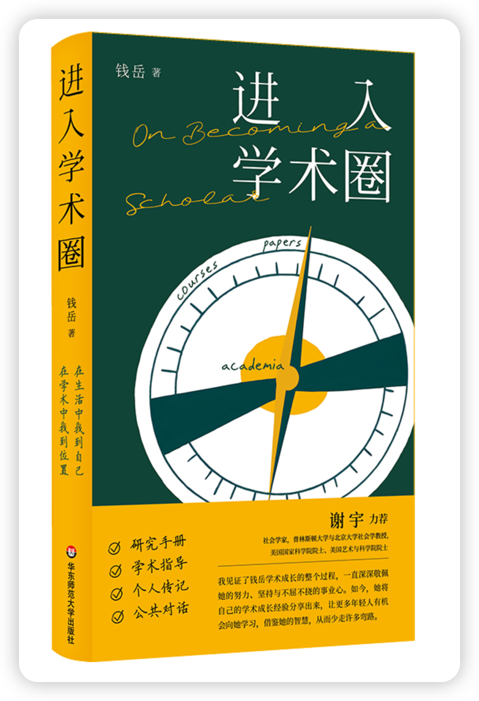
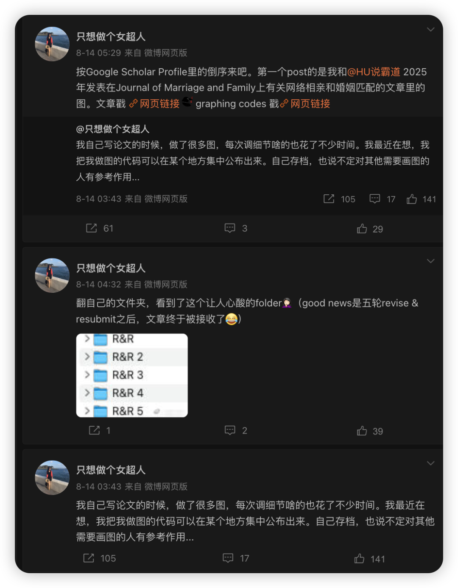
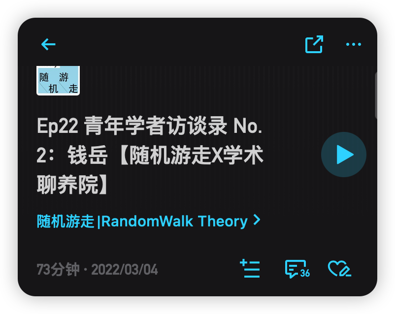
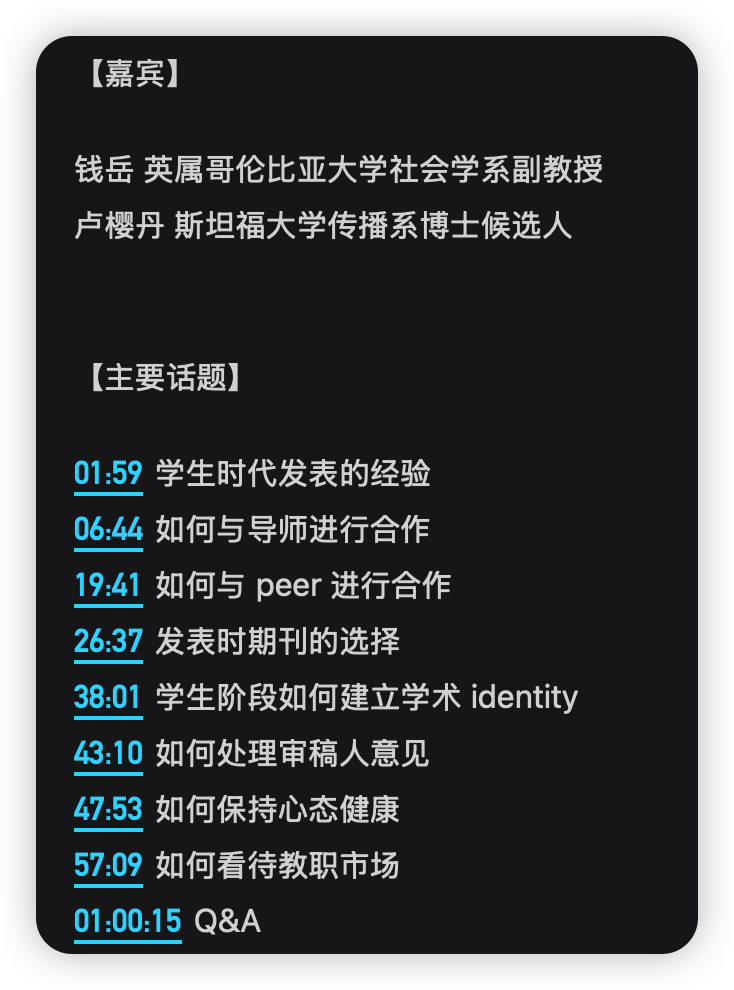
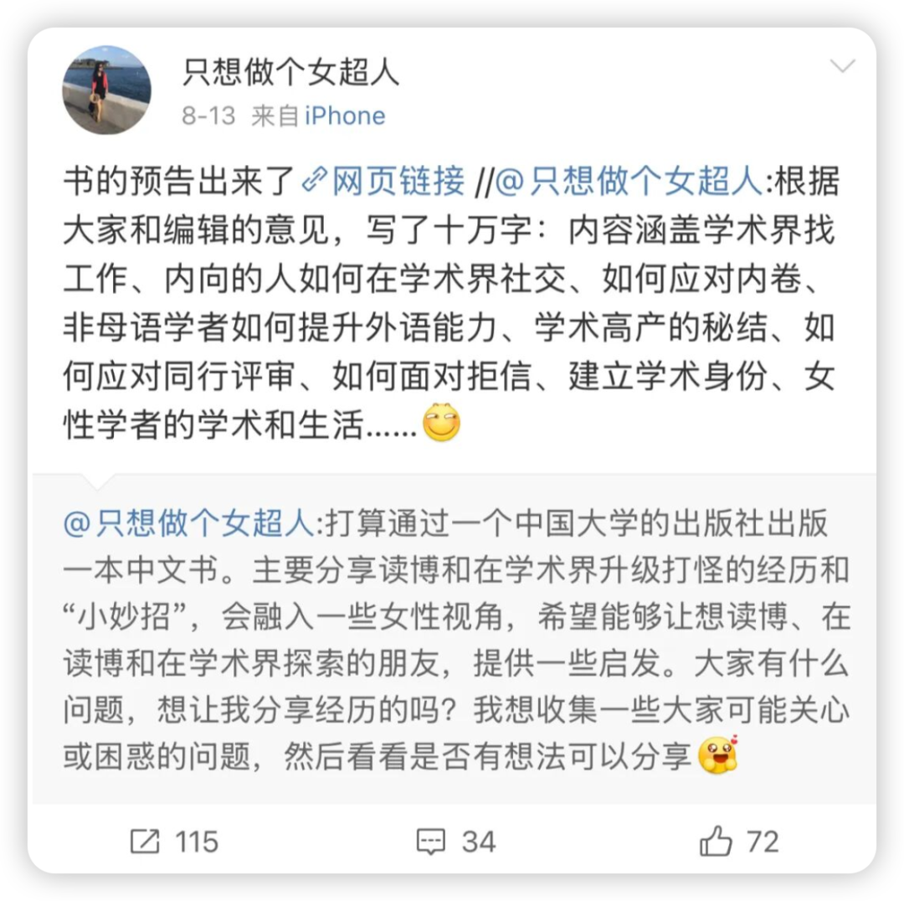
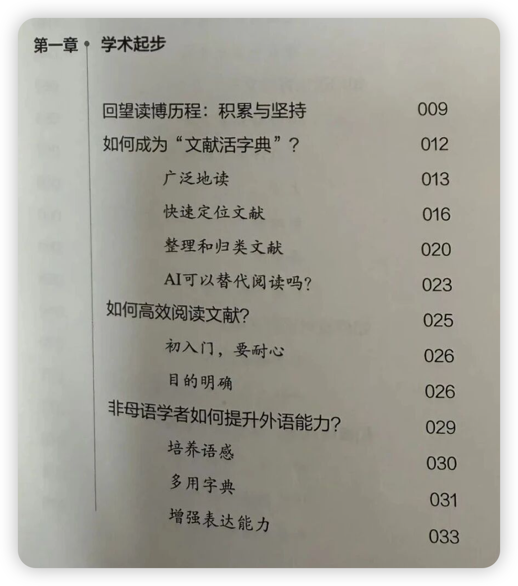
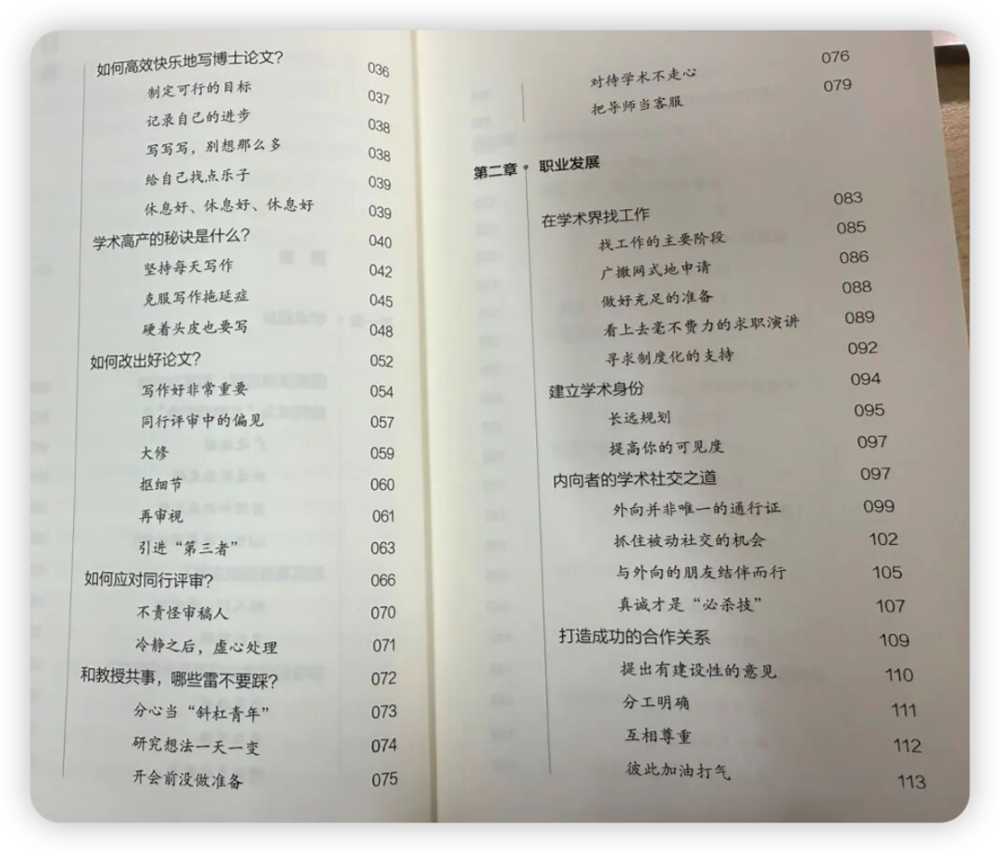
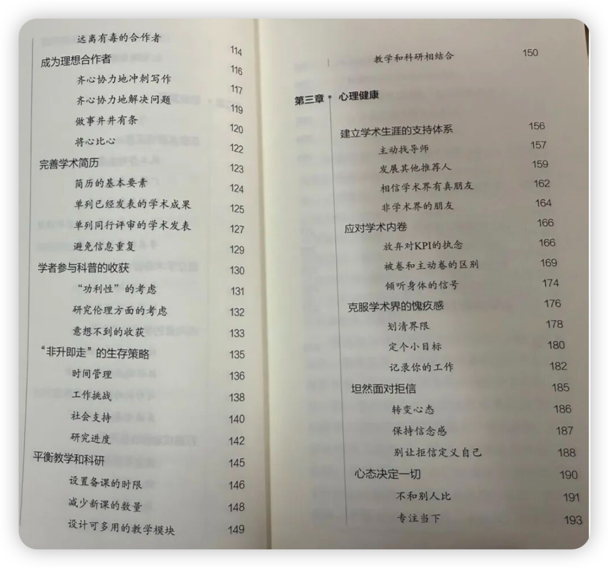
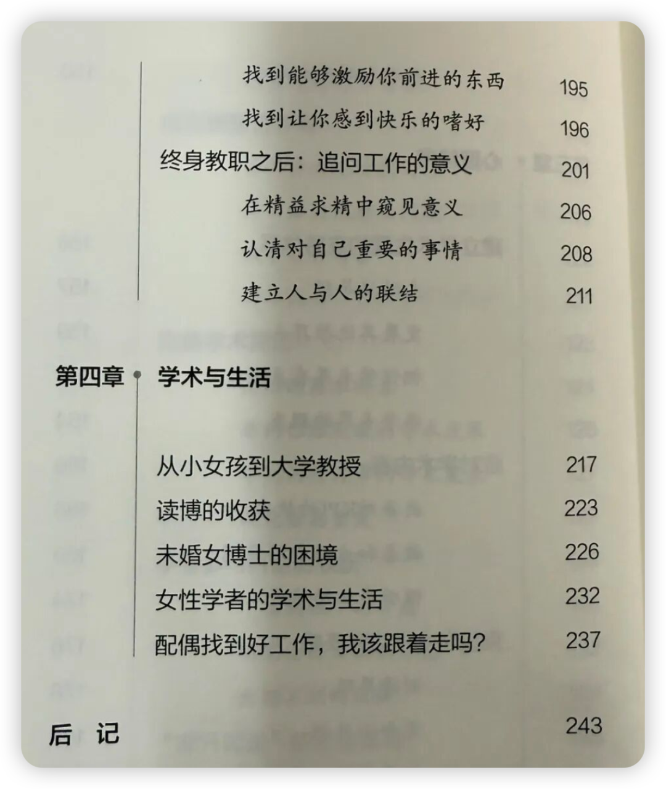
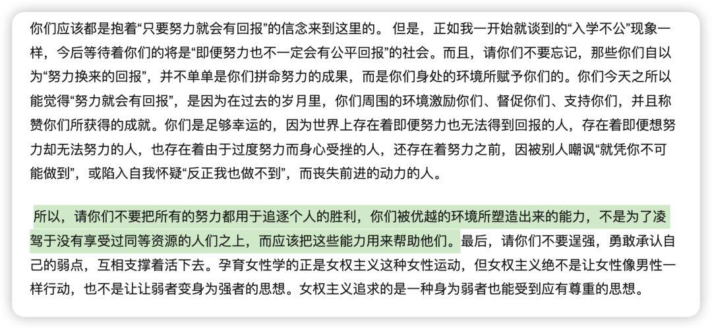

连续两天在晚饭时间边啃三明治边看完了这本书，特别好读，特别喜欢，完全就是一种读偶像传记的激动！

常听人说，规划学术道路的时候可以看看一些前辈们的“来时路”，看看到底要什么样的学历、发表、会议、获奖、教学等等。甚至是找一个榜样去模仿ta的经历。

然而我也总是看了一眼大佬们的CV就忘了。唯有对于钱岳老师，我总是能不断地被她传递的力量感染（即使她不是我这个领域的 而是社会学的学者。但社科总归是共通的嘛！）。

也可能是因为钱岳老师一直在勤奋地做着公共表达——

最开始我应该是无意关注了她的微博，看她的学术日常就觉得这是我未来想成为的样子！

后来我又在播客上听到了徐轶青、樱丹和钱岳老师的一期访谈（这三位都是积极的公共表达者 后来也都成为了北美top高校的学者），才发现她是一位如此高产的学者，同时还运营着「缪斯夫人」公众号，积极把学术研究转化成通俗易懂的文字。

这样回看，我如今乐此不疲地进行学术分享好像也是受到她潜移默化的影响。

最近我在读女作家们的传记，我发现原来弗吉尼亚·伍尔夫是受到了夏洛蒂三姐妹、简·奥斯汀的影响，而波伏娃又是受到了弗吉尼亚的影响（看得出我真的很不想用冠夫姓的名字...）。每到老一辈谈及唯有生育才是传承时，我就会想到这些作家们以文学为载体，把精神力量不断传递给后人，这何尝不是一种更为永恒的传承。（这么说来 如果我们能做一个好的研究  那在肉体消失后 我们的思想也会通过paper的形式被代代引用 也是一种传承哈...)

回到书本身，2023 年 7 月钱岳老师有了这个想法，结果两年后书就出版了。永远敬佩她的执行力！

下面是书的目录：

写到这里，有一种好歹我也有点关注者、所以承蒙大家厚爱 我也得回馈一下大家的感觉🤩！

那就随缘找一下「明晚10点前本推文下面留言点赞前三的朋友」每人送一本吧！可以表达任何你对学术、对生活、对社会、或者是对我这个公众号的想法！

复杂的世界，复杂的学术界，让我们一起做简单、真诚的人吧！

少一些戾气，多一些深度输入和思考。

提出意见的同时也能给一些解决办法吧（就像邓红老师点评学生研究的时候那样！），在获得一些资源后积极给一些分享吧。

以上野千鹤子2019年在东京大学的话结尾：

“请你们不要把所有的努力都用于追逐个人的胜利，你们被优越的环境所塑造出来的能力，不是为了凌驾于没有享受过同等资源的人们之上，而应该把这些能力用来帮助他们。”

