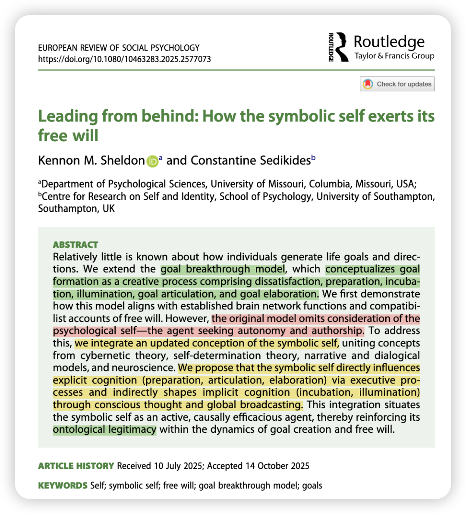
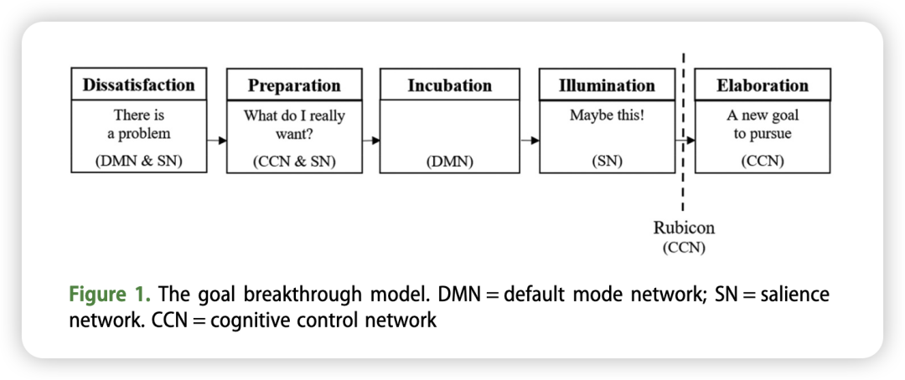
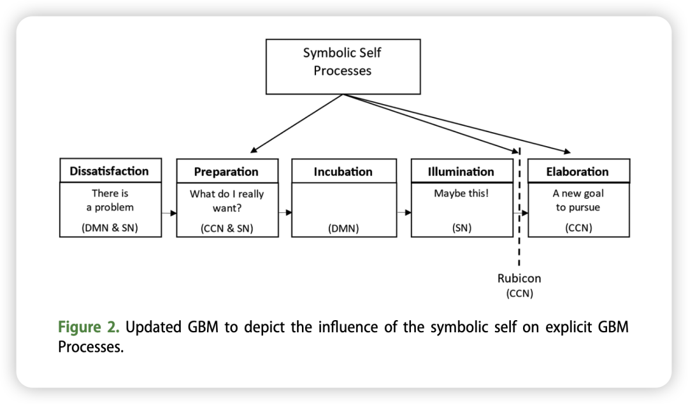
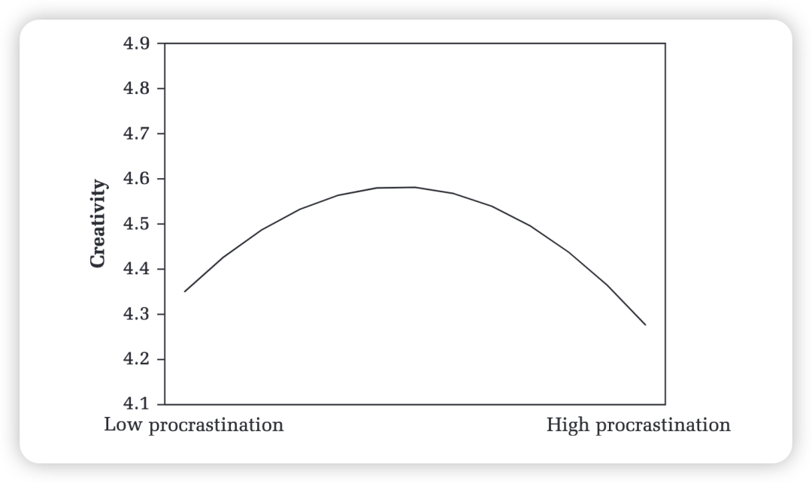

*Reference：*Sheldon, K. M., & Sedikides, C. (2025). Leading from behind: How the symbolic self exerts its free will. *European Review of Social Psychology*, 1–43. **https://doi.org/10.1080/10463283.2025.2577073**

### 

### 写在前面：

又是一篇让人惊叹的理论文章。OB文章读多了之后，再回去读psych里面的理论文章，有一种「哎呀还是我的老本行更美一些！」的感觉。正如Ke经常跟我谈论起他学到的关于psych和OB的区别：这就如同是基础医学和临床医学的区别一样，psych的理论总是走在前面（比如JPSP上的文章很多就是自己去「构建」理论 而不是「运用」某个理论）。而OB就更像是对于psych理论的运用。

So 让我们一起来看这篇关于目标和自我的理论文章！学习两位理论大佬如何在过往一个established theory上，再去提出一个新的忽略的成分，然后重新frame到原有框架中。

另外，如果你也和我一样喜欢Shin&Adam (2021) in AMJ 那篇关于procrastination和creativity的文章，那我觉得看完这篇文章后你会觉得那篇的结论更合理了，同时这篇文章的理论角度还可以补充那篇文章中仅仅局限于incubation mechanism的解释、而是从self这个角度去解释结果！

Shin, J., & Grant, A. M. (2021). When Putting Work Off Pays Off: The Curvilinear Relationship between Procrastination and Creativity. Academy of Management Journal, 64(3), 772–798. https://doi.org/10.5465/amj.2018.1471

### 引入：

我们似乎生活在一个选择过剩的时代，耳边总是有各种各样来自外界的声音，比如做自己、比如追求旷野而非轨道的人生。

面对这些声音时，偶尔也会迷茫，不知所谓的「自我」和「旷野」到底是什么，也不知道下一步的目标是什么。在迷茫时，我们总会期待着那些aha moment、期待着在颓废之时能够重新获得力量去move on。但这些瞬间从何而来？我们又能做些什么来迎接它？

这篇理论文章提出，那些“灵光一闪”并非出自偶然，而是由我们的**“象征性自我”**所指引：这种象征性自我通过有意识地“提问”和“反思”，来激活潜意识的巨大能量，最终做出真正忠于自己价值观的选择。

这整个过程，正是个体自由意志的体现。

### 过往理论回顾：

心理学对于人们如何追求目标已经有了很多研究，**但对于人们如何选择或产生新的、重要的生活目标却知之甚少**。

传统的**“期望-价值”理论认为，我们会在众多选项中会选择那个最有可能成功且价值最高的。**但作者认为这个理论不够完整，因为它忽略了：（1）目标的产生过程：很多时候我们感到“卡住了”，根本想不出有什么新的可能性。（2）创造性维度：新目标的出现，往往不是一个简单的理性权衡，有时更像一个“灵光一闪”的创造性过程。

而作者在2022年提出的**“目标突破模型”（Goal Breakthrough Model, GBM）**就很好地解决了过往理论的局限，把创造性过程也融入到了目标理论中。这个理论将目标的形成分成5个阶段：

**（1）不满意（Dissatisfaction）：**个体意识到现状（例如，当前的目标、工作或生活方式）无法满足自己内心深处的需求和价值观，感到不快乐。

**（2）准备（Preparation）：**个体开始主动思考和提问，例如“我到底想要什么？”“出了什么问题？”。这个阶段是意识层面的努力，但可能并不能立刻找到答案。

**（3）孵化（Incubation）：**在刻意思考无果后，问题会进入潜意识层面。个体不再主动纠结，但大脑的默认模式网络（Default Mode Network, DMN）在后台持续进行无意识的、发散性的信息整合与联结。

**（4）豁朗（Illumination）：**在某个不经意的瞬间（比如洗澡、散步时），一个新颖且有前景的想法或解决方案会突然涌现到意识中，带来“啊哈！”的体验。

**（5）阐述（Elaboration）：**个体抓住这个新想法，对其进行评估和加工，最终形成一个明确、可执行的新目标。这个阶段也被称为“跨越卢比孔河”（crossing the Rubicon），意味着下定决心，从思考转向行动。

### GBM模型中关于Self的缺失

作者进一步精益求精，他之前提出的这个GBM虽然解释了过程，**但忽略了最重要的主体——“自我”（Self）。明明**Self才是感到不满意、去提问和反思、最终做出决定的主体！

为了填补这一空白，作者引入了“象征性自我”（**Symbolic Self**）的概念。这指的是我们每个人内心那个持续存在的、作为经验主体的“我”。它具有以下特点：
-是一个能动的主体：它不仅仅是被动地拥有一堆关于“我是谁”的知识（“Me”），更是一个持续体验、思考和行动的“我”（“I”）。

-追求自主和掌控感：这个“我”渴望成为自己生活的主人，这与自我决定理论中对自主性的基本需求相呼应。

-扮演执行官角色：象征性自我像一个公司的CEO，负责设定方向、做出决策和监督执行。

然而作者也指出，象征性自我**无法直接控制**潜意识的运作和新想法的产生。它的角色更像一个CEO，“从高层”进行引导，而不是亲自操作每一台机器。而这也是标题叫“leading from behind”的原因了。

### 将Self融入到GBM模型中

**Preparation阶段**：当感到不满时，self通过**叙事身份**（反思人生故事）、**自我觉察**（发现内在标准与现实的差距）和**反思性目标设定**（主动提问），来启动整个目标突破的过程。

**Incubation-**Illumination**阶段**：有意识的思考（比如思考人生价值、总结经验），会将相关信息“广播”到大脑的各个非意识模块中，引导它们在后台进行更有针对性的信息处理。这个过程可以提升后续潜意识加工的质量，使得最终涌现出的“灵感”更有可能切中要害，带来真正有价值的突破。这就像CEO通过阐明公司愿景，来激发员工产生符合公司方向的创新点子。

**Elaboration阶段**：当“顿悟”时刻带来新想法时，self会负责评估这个想法是否符合自己的价值观，并最终决定是否将其转化为一个新目标并为之努力。

### 

### Self的防御功能可能会影响目标突破

然而目标突破并不总是那么容易。作者指出，象征性自我的防御可能会成为变革的阻力：

-改变会带来不确定性，需要放弃旧的、熟悉的身份。因此，自我中寻求稳定的部分会与寻求成长的部分产生冲突。

-如果一个人的外显动机（例如，认为自己应该追求成就）与内隐动机（例如，内心深处渴望人际连接）不一致，那么其自我调节能力就会受损，并且很难实现真正的整合。

-克服障碍需要勇气。要完成GBM的整个过程，个体需要敢于面对不舒服的真相，质疑旧的自我概念，并拥抱不确定的新方向。

### 

### 优化自由意志需要有意识的努力

论文最后给出了一些极具价值的实践建议，告诉我们如何更好地做出人生选择！

- **培养对内心信号的敏感度：留意那些微弱的不满、不安或厌倦的情绪，它们是“更深层次的自己”在与你沟通。**
- **养成反思性提问的习惯：即使感到不适，也要勇敢地问自己深刻的问题，并对各种可能的答案保持开放。**
- **认真对待“灵光一闪”：当新的想法出现时，要给予足够的重视，并思考如何将其转化为具体的目标。**
- **将洞见转化为承诺：将新目标写下来，与人讨论，使其变得明确和坚定，并付诸行动。**

### 写在后面：

1、真的可以感受到两位大佬的理论功底和思考深度，感受到作者作为最初理论的提出者在不断地对其迭代和完善。他们把“自我”、“自由意志”、“创造力”和“脑科学”这些领域巧妙地融合在一起，共同解释“人作为主体 如何推动目标进程”这一问题。

2、这篇文章我觉得是INFJ人都会喜欢的一篇！记得我在研一的时候还尝试做了一下关于顿悟的研究（虽然后来觉得当时自己的理论功底没有那么深入 所以中道崩殂…maybe之后我可以再想想这个研究！）

当时想做这个研究，就是因为我也总是在各种散步、洗澡的瞬间突发灵感，而我也会有意识地让自己浸泡在不同的生活中去感受自我和他人，这种diverse的感觉也确实让我总是产生很多新的想法（虽然也总是会想一出是一出…) 。

所以我为啥总是那么强调nonwork和休闲的重要&不要总是盯着那么点屏幕前的论文过这精彩一生——其实就是这篇文章所说，在对现状感到不舒适时我们会问自己很多问题，这些问题可能一时半会儿无法解决，需要Incubation，那Incubation的过程中就需要我们的self去在天地万物中感受，这会锻炼出Self这个CEO总体的能力，这种能力会引导着我们把零散的思绪进一步聚焦，让Incubation最终走向 Illumination，然后再去Elaboration！

3、可以为shin&adam那篇研究补充一个来自于self的视角：

那篇文章总体在说，中等强度的拖延是最好的，因为中等拖延可以促进问题重构和新知识激活，也就是有一种incubation的过程；相反，低拖延表明没有经历incubation的过程，所以会选取脑海中最先跳出来的方案，这样就缺少了更多具有创新性的探索，而高拖延则是会产生一种时间压力下的思维窄化，时间有限也无法经历incubation的过程。—— 总之shin&adam解释结论就是从incubation这个角度。

而从这篇理论文章的视角出发，可能self也发挥了非常重要的作用：

-中等拖延的人，恰恰说明他们的self有非常明晰的规划意识，也能了解到自己的思维习惯，从而能够给incubation和elaboration设置恰到好处的时间区块，在孕育创造力的同时管理好ddl，是一个非常成熟的CEO！

-低拖延的人self是缺少构建叙事身份、自我觉察、反思性目标设定这些能力的（大脑皮层是相对平滑的 没有那么多褶皱），因而无法产生后续的积极结果。

-高拖延的人的self 则可能受到self防御性功能的限制，想的太多，内耗过多，反而缺少了去行动的勇气。

（可能是我在强行解释哈哈哈 但我觉得这个self的角度还是挺好的 可以解释很多研究了！）
