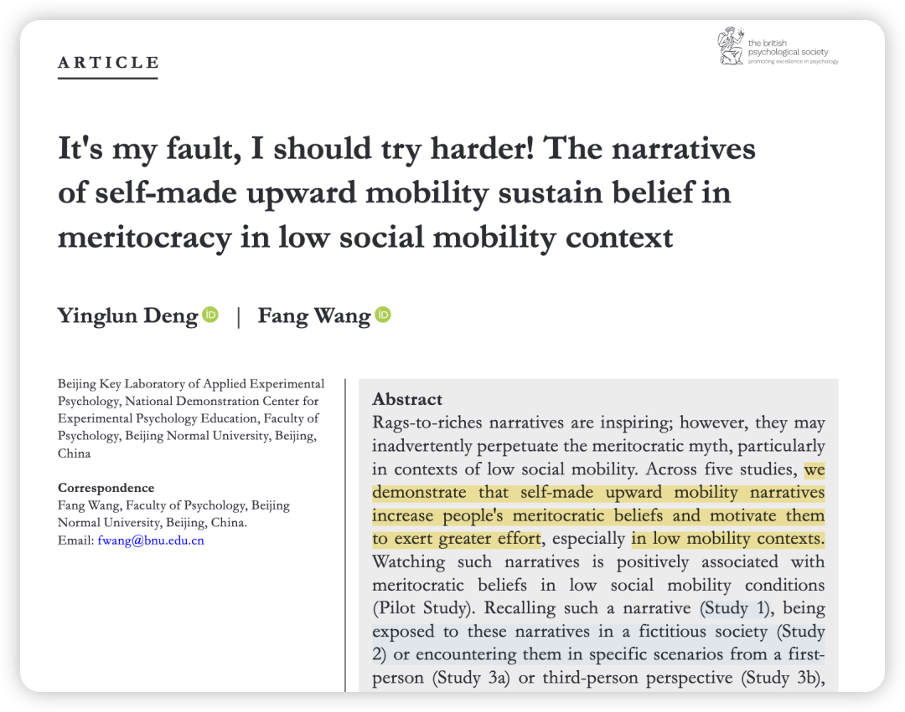
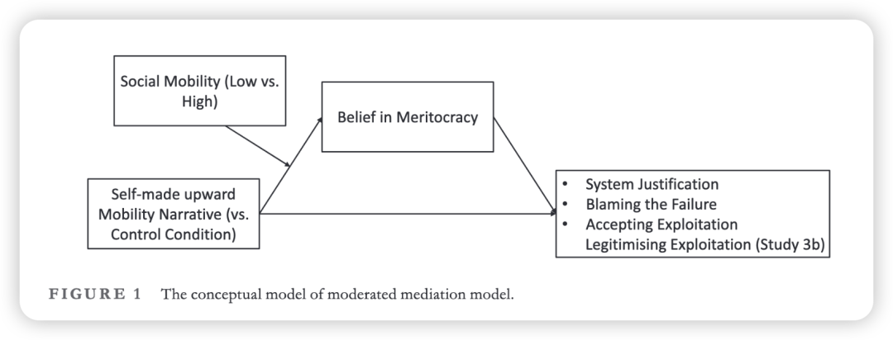
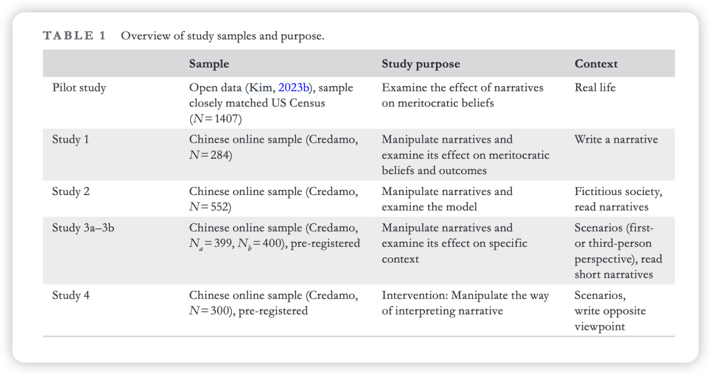

***Reference：***Deng, Y., Wang, F. (2025). It’s my fault, I should try harder! The narratives of self‐made upward mobility sustain belief in meritocracy in low social mobility context. *British Journal of Psychology*, bjop.70015. https://doi.org/10.1111/bjop.70015

### 写在前面：

- 又是来自群友的推荐！太爱我们的community了！不然就要错过一篇这么精彩的文章了！

- 必须读这篇文章的理由：
- 如果你也觉得李佳琦说的那句“买不起要反思一下你自己有没有努力工作“感到不悦，或许这篇文章的intro会给你一些解释。
- 探讨的话题有非常鲜明的时代属性：“寒门贵子”的励志故事，听多了真的是好事吗？这如何影响我们对于精英主义/优绩主义的理解？最后又对我们的行为产生哪些影响？我们会push ourselves too hard吗？
- 来自我们都爱的BNU王芳女神团队！

### 引入：

从小到大，我们浸泡在各种励志故事里，比如寒门出贵子、比如岩石中开出的花。这也往往是我们初高中作文精彩会出现的主题，很多人也会把这种信念迁移到大学和工作中。

然而这些“从贫穷到富有”（rags-to-riches）的励志故事虽然鼓舞人心，但可能在无意中巩固了不公平的社会现状，尤其是在一个社会阶层固化、向上流动困难的环境中。

而这篇文章提出：当人们（尤其是在低社会流动性环境中）接触到这些“白手起家”的成功故事后，他们会更加相信“精英主义”（meritocracy）——即认为成功完全取决于个人努力和才能。这种增强了的精英主义信念，会进一步导致人们不去质疑一个不公平的系统，反而更加苛责自己和他人，并忍受剥削。

有意思吧！！

### Research Motivation

我们正处在一个全球贫富差距日益扩大、社会阶层日益固化的时代。按理说，当上升通道变窄时，人们应该感到愤怒，去挑战这个系统。但现实恰恰相反，很多人不仅没有责怪系统，反而把矛头指向了自己：“是我还不够努力”。**过去的理论很容易解释为什么成功者相信“努力就能成功”，因为这能让他们的特权显得合情合理。但最大的谜团在于：为什么那些被系统困住的人，也深深相信这一套？**

作者想要回答的，正是这个问题：**在社会流动性极低的情况下，到底是什么样的力量在麻痹大众，让他们心甘情愿地维护这个并不友好的系统，甚至主动加码剥削自己？**

作者是**从「叙事」这个角度切入，**特别是“白手起家的向上流动故事”。作者认为，这些故事是传播和维持精英主义信念的关键载体，它们通过情感共鸣而非理性逻辑来影响人们的认知与行为。

### **理论推导**

这篇文章主要运用了两个理论来解释其内在机制：

**1、系统合理化理论 (System Justification Theory,)：**该理论认为，人们有一种内在的动机去捍卫、支持并合理化现存的社会、经济和政治安排。即使这些安排对自己或自己所在的群体不利，人们也倾向于认为它是公平和合法的。这样做可以减少不确定性和威胁感，带来心理上的慰藉。

**理论推导：** 当系统受到威胁时（例如，当人们意识到社会流动性很低，系统似乎不公平时），他们的合理化动机反而会更强。此时，“白手起家的故事”就如同“救命稻草”，为人们提供了“证据”来相信“系统其实是公平的，只要努力就行”，从而满足了他们合理化系统的心理需求。

**2、叙事传输理论 (Narrative Transportation Theory)：** 当人们沉浸在一个故事中时，他们会感觉自己被“传送”到了故事的世界里。在这种状态下，他们的批判性思维会下降，更容易被故事中蕴含的信念和价值观所说服。

**理论推导：** 该理论解释了“为什么励志故事如此有效”。因为人们在阅读或观看这些故事时，更多的是情感上的代入，而不是理性的分析。故事的感染力使得“努力就能成功”这一核心信息被轻易接受，而忽略了现实世界中复杂的结构性障碍。

### **研究假设、方法与结果**

**核心假设:**

接触“白手起家”的叙事会增强人们的精英主义信念。

这种信念的增强会进一步导致系统合理化、指责失败者和接受剥削。

上述效应在低社会流动性的条件下会更强。

**研究方法:**

文章共包含**5个研究：**

**Pilot：**分析了一个大型美国代表性样本数据，发现经常看“白手起家”类真人秀节目的观众，其精英主义信念更强。

**研究1-3：**通过实验法，在中国和美国被试中，随机分配他们阅读或者书写不同类型的叙事（励志故事 vs. 日常生活故事），并操控他们对社会流动性的感知（通过阅读虚构的新闻文章告知他们当前社会流动性是高还是低）。

**研究4：**探索干预措施。研究发现，如果引导人们用非精英主义的方式（即考虑个人努力之外的因素，如运气、家庭背景等）来解读励志故事，可以有效减弱其负面影响。

**结果：完全支持核心假设——**“白手起家”的励志故事确实能显著提升人们的精英主义信念，并导致后续的负面社会后果。并且，这种负面效应在被告知“社会阶层固化、流动困难”的条件下最强。

并且证明了该效应在具体的、与个人利益相关的职场情境中同样存在，并且无论是作为当事人还是旁观者都会受到影响。

### 

### **研究贡献**

**理论贡献：**

- 实证揭示了“叙事”作为一种强大的文化工具，在维持不平等的社会结构中所扮演的关键角色。

- 将叙事理论与社会心理学理论相结合，为理解意识形态的传播和维持提供了新的微观基础。

**实践贡献：**

这里作者强调地真的太好了！完全应该被人物/三联采访报道一下哈哈！

- **对媒体和教育的警示：提醒我们警惕那些过度简化成功路径、只强调个人奋斗的“心灵鸡汤”式励志故事。媒体在报道成功案例时，有责任呈现一个更全面、更多元的画面，承认运气、社会支持和结构性因素的作用。**
- **对组织管理的启示：帮助管理者理解，为什么在晋升机会有限、内部流动困难的组织中，宣扬“奋斗文化”和“狼性精神”可能不仅无法激励员工，反而会让他们将失败归咎于自己，并默默忍受不公平的待遇，最终可能导致职业倦怠和人才流失。**
- **对个人的启示：鼓励公众在面对励志故事时，保持一种审慎的、批判性的解读，认识到个人努力的重要性，但绝不应忽视结构性的力量。**

### 

### 写在后面

- 很喜欢这篇文章，它真的反映了我近年来心境的变化：不再相信18岁之前被灌输的「effort等于rewards」，而是会稍显悲观地看到有时候个人努力未必可以撼动结构性不平等。这样也就会放弃对自我的苛责，同时也会放下对他人的苛责。人生苦短，活着就行。 —— 然而正是这样一种放下与接纳，才会让我少了很多内耗与纠结，不去羡慕任何人，而是安于自己的幸福人生，享受每一件自己喜欢做的事情，而不去衡量这是否会让我成为所谓的精英。

- 看到这些文章，几乎就可以去回答「为什么选择做学术」这个问题。想做学术的发心，最初并不是我真的要对社会产生什么贡献，而是真的恰好足够幸运地看到了这些有意思的文章（就像大三看到姜老师关于awe的文章那样）。这些文章告诉我：研究者用自己的观察来放大社会的一个切面，仿佛用一面放大镜一样揭示一个我们隐隐能感受到、但暂时无法言明的问题。读完这些研究，那些结论和小红书上的碎片信息不一样，它会一直伴随着我们、警醒着我们，甚至会出现在我们和朋友的对话中，继而让很多人产生共鸣。未来我也想做这样的文章。

- 做研究，做好的研究，做有灵魂的研究，相信它一定会抵达共鸣之人，产生无法用世俗标准量化的力量。

- 昨天睡觉时想到，一直漫天推送也不是很好，我觉得可以每周都聚焦一个系列。比如这周我就会想聚焦这种**具有时代属性和现实意义的文章**！让我们一起了解：求助时产生的心理错位、符号自我与自由意志、工人阶级与人文主义、「himpathy」与道德指控。

Dodson, S. J., Goodwin, R. D., Graham, J., & Diekmann, K. A. (2023). Moral Foundations, Himpathy, and Punishment Following Organizational Sexual Misconduct Allegations. *Organization Science*, *34*(5), 1938–1964. https://doi.org/10.1287/orsc.2022.1652

Seegars, L., Lee, S. S., Reid, E. M., & Ramarajan, L. (2025). Subordinating Humanism: How Colliding Beliefs about a Living Wage Shape Personal Fulfillment and “Professional-Class” Identities in Working-Class Jobs. *Academy of Management Journal*, *68*(5), 939–970. https://doi.org/10.5465/amj.2023.1289

Sheldon, K. M., & Sedikides, C. (2025). Leading from behind: How the symbolic self exerts its free will. *European Review of Social Psychology*, 1–43. https://doi.org/10.1080/10463283.2025.2577073

Zhao, X., & Epley, N. (2022). Surprisingly happy to have helped: Underestimating prosociality creates a misplaced barrier to asking for help. *Psychological Science*, *33*(10), 1708–1731. https://doi.org/10.1177/09567976221097615

开启超有意思的一周！！（但周二有事 鸽一天！）
