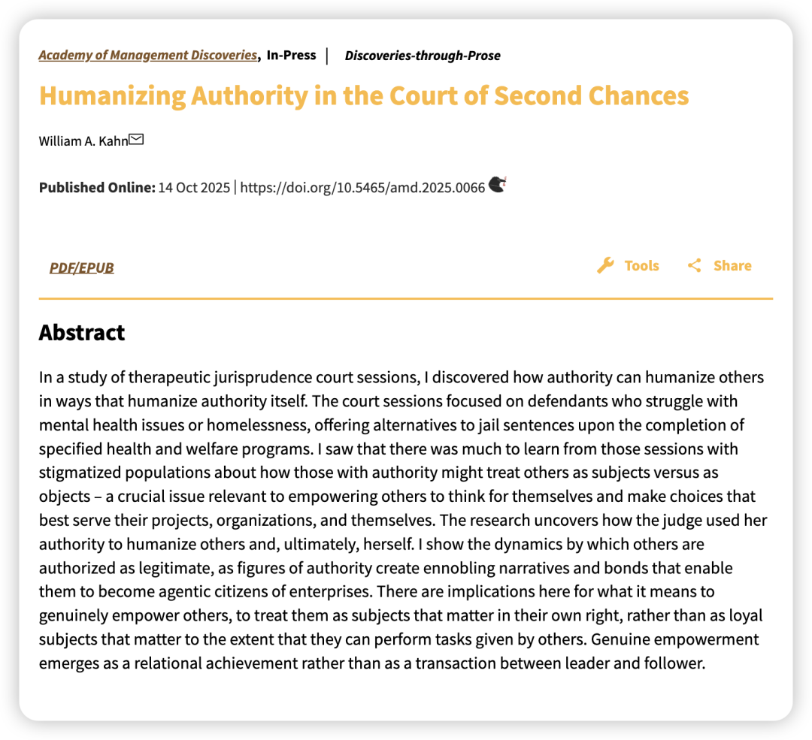
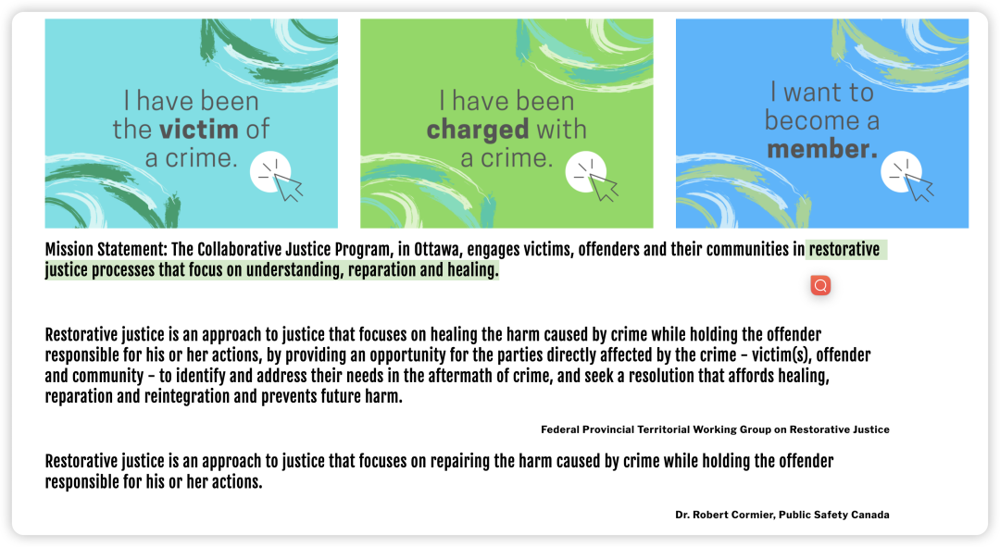
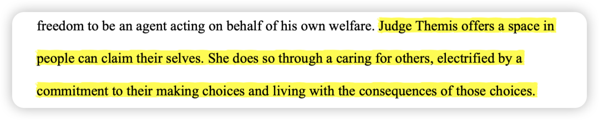
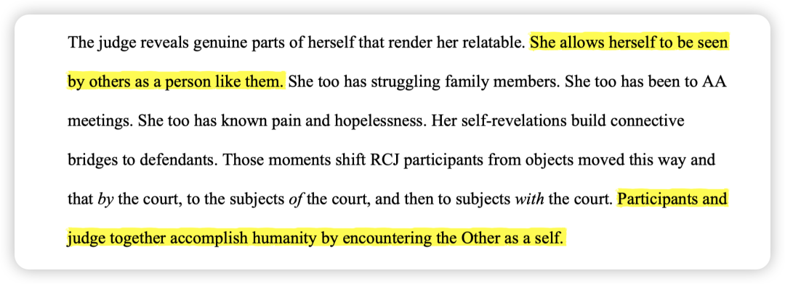
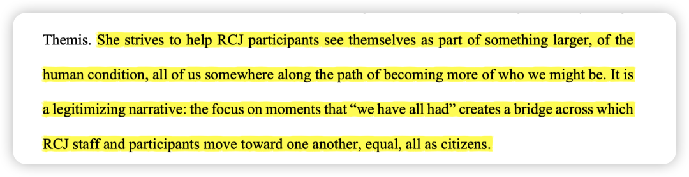
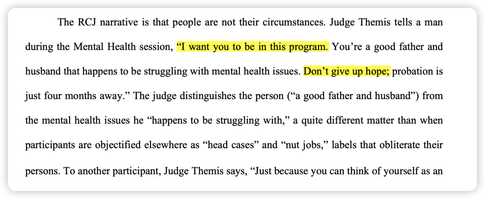
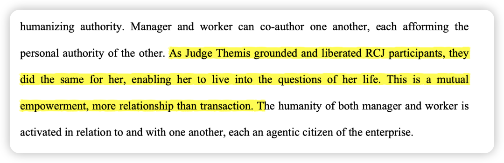

***Reference：*** Kahn, W. A. (2025). Humanizing Authority in the Court of Second Chances. Academy of Management Discoveries. https://doi.org/10.5465/amd.2025.0066

### **写在前面：**

-昨天好友给我分享了AMD的「Discoveries-through-Prose」这种文体的文章，第一次见，太神奇了！感觉有一种疯感：很多人说管理学就是story telling，那我们就彻底用写散文的方式来讲点管理启示！

-打开一看，作者William A. Kahn正是我的论文中第一句话对于Work engagement定义所引用的那位（Kahn， 1990），再一看他近年来的文章也是非常有意思，so让我们来看看这篇文章中，他如何从主体和客体的角度来理解授权这件事！

### **引入：**

OB中研究授权（Empowerment），是说领导者会赋予下属权力和自主性。**但Kahn指出：很多时候，所谓的授权只是一个微妙的骗局。它的本质，不过是让员工成为一个更热情的工具，以便更高效地完成组织的任务。**员工的个人价值和真实的自我，并未得到真正的尊重。他们从一个被动的“客体”，变成了“更积极的客体”。（太真实了）

那么，什么是真正的授权？ 权威人物（比如领导）如何才能将下属从一个被动执行的**客体**，转变为一个能够为自己的人生和工作做主的**主体。**

### 质性材料及发现

为了回答这个问题，Kahn走进了美国一个非常特殊的“治疗性法庭”（Recovery with Collaborative Justice，后文统称为RCJ)。

RCJ是一个专门处理因精神问题或无家可归而犯罪的边缘人群的法庭。这里的目标不是惩罚，而是救赎与康复。这里的被告，是社会上最容易被非人化、被当成“麻烦”或“案子”来处理的群体。作者想知道，在这个特殊的环境里，那位叫Themis的法官，是如何运用她的权威，去改变这些被社会遗忘的人的命运的。（最近我正好在读RBG的书，这些女性大法官们可真厉害！）

为了全面地理解RCJ法庭的运作，作者采用了多种数据收集方法，包括**76小时**的法庭现场观察，**38次**访谈以及法庭中的官方文件。并提炼出以下主题：

**主题1:授权 (Authorizations)**

**在传统法庭，**被授权的是**司法系统本身**。法官、律师是这个系统中的特权行动者，而被告知只是被流水线处理的“案子”（客体）；而在**在RCJ法庭：** 被授权的是**这个人本身**。法官Themis运用她的权力，不是为了高效地处理案卷，而是为了将**被告人性化，让他们成为有能力为自己发声的公民，成为主体。焦点从“这个案子该怎么办”转向了“这个人该怎么办”。**

**主题2. 能动性与连接 (Agency and Connection)**

帮助他人获得agency的关键，在于**建立连接**。为了让被告敞开心扉，法官Themis会主动分享自己的脆弱和不完美。她会说自己也曾参加过戒酒互助会，自己的家人也有过挣扎。通过这种自我暴露，她打破了权威的冰冷外壳，将自己也呈现为一个有血有肉的人。**这种人性化是双向的：当她人性化被告时，她自己也被被告视为一个可以共情的人，从而也被人性化了。**

**主题3. 创作自我与他人 (Authoring Self and Others)**

在传统法庭，法官给予被告的是判决；而在RCJ法庭，法官给予参与者的是一个叙事，帮助被告重新创作一个关于自我救赎和希望的新的人生故事。

她帮助参与者摆脱社会给他们的“瘾君子”、“罪犯”等标签，为他们“创作”一个新的身份。例如，她会说：“你是一个**恰好在与精神健康问题作斗争的好父亲**。” 这句话就巧妙地将人和他的问题分离开来。

这个过程也是双向的。**当法官帮助参与者“创作”他们的新生时，参与者的积极转变也反过来证实和“创作”了法官作为“救赎者”的自我叙事。**

**主题4. 一种人性化的权威 (A Humanizing Authority):**

法官Themis所展现的，是一种超越了马克思·韦伯传统分类（法理、传统、魅力）的权威。

作者总结出了**个人权威 (Personal Authority)**这个概念：这是一种源自个人内在价值观、信念和生活体验的权威。

对Themis法官而言，她的个人权威就源于她对“救赎”的深刻信仰（她本人就是信奉天主教的）。**正是这种真诚的“个人权威”，渗透并转化了她作为法官的制度权威，使其不再冰冷，而是充满了人性的温度和力量。**

**她不是在扮演一个法官，而是在以法官的身份，实践她作为“人”的信念。**

### 管理启示

- 管理者必须首先看到并承认员工是一个完整的、有情感、有渴望的人，而不仅仅是一个执行任务的工具。这需要管理者有**意识地去了解员工的个人故事和内在世界。**

- 为他人创造一个安全的空间，让他们可以做出自己的选择，并为之负责。管理者需要保持一种微妙的平衡：**既要足够近以提供支持，又要足够远以避免干涉。**

- **鼓励员工摆脱外部的束缚和标签，去寻找自己内在的罗盘，并据此行动。管理者需要相信，当员工学会为自己思考时，组织并不会因此失控。**

总之，真正的授权是一种**相互的、共同创作**（co-authoring）**的过程**。当下属被授权去活出自己的人生时，领导者也同样被赋能，去实践自己的人生信念。**这是一种关系，而非交易。**

### **写在后面：**

-完全是我喜欢的humanness主题的文章，但所描述的RCJ法庭真的仿佛是一个乌托邦，就当是《窗边的小豆豆》里的巴学园一样品读吧！让我们知道世界上有一片这样的土壤也是好的。

-最后对于管理者的启示感觉现在的企业中也很难有领导可以做到。sad …

-虽然是乌托邦，但这篇文章中有非常多可以进一步研究的主题，比如构建个人叙事（甚至是如何进行双向构建）、领导暴露脆弱等等，我在这里只是稍微总结了一下自己看的过程中觉得不错的点，还有更多可以回原文细品，反正就当是在读外刊提升英语阅读能力了！
