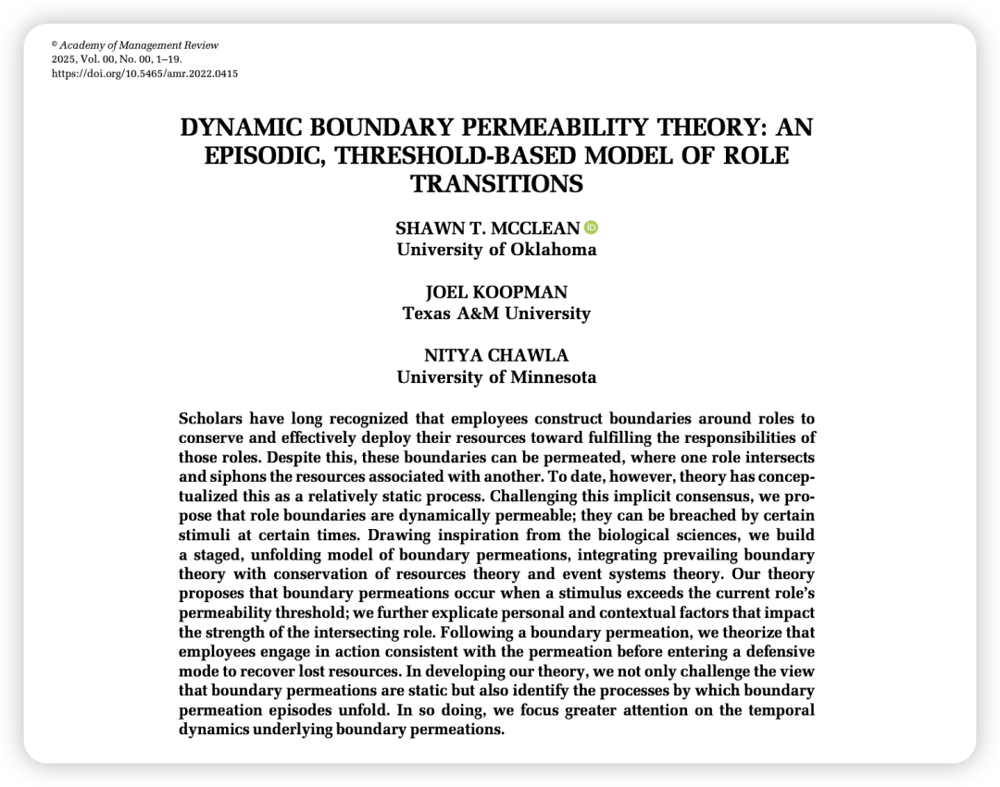
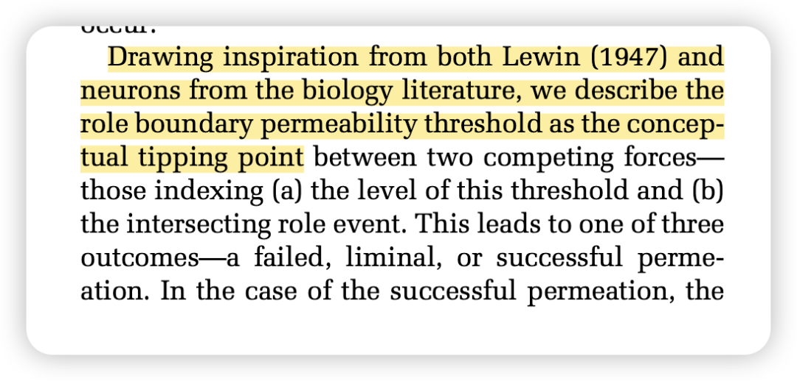
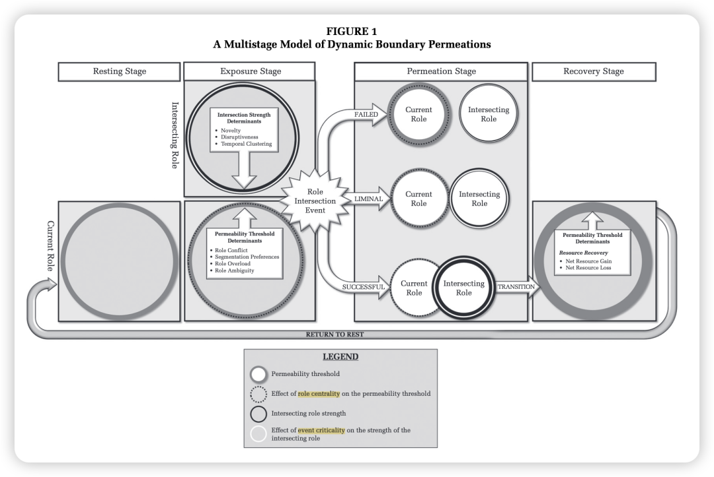
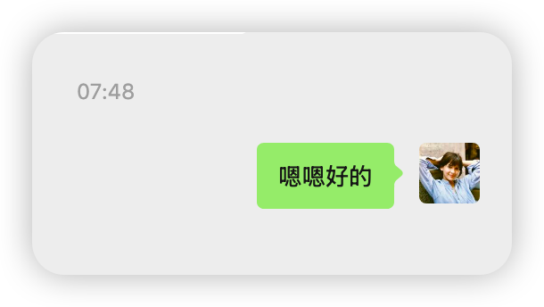

McClean, S. T., Koopman, J., & Chawla, N. (2025). Dynamic Boundary Permeability Theory: An Episodic, Threshold-Based Model of Role Transitions. *Academy of Management Review*, amr.2022.415. https://doi.org/10.5465/amr.2022.0415

### 

### **写在前面：**

-Google scholar同时给我发了3条新论文快讯，说明完全是我follow的作者+主题了。必须读！

-看这个主题让我想到了AMR去年那篇我也很喜欢的domain switch theory，让我们看看有什么差别吧！

### 引入：

这篇文章提出了一个全新的理论模型，旨在解释一个常见的现象：为什么在某些时候，人们会因为一个外部刺激而从当前的角色切换到另一个角色，而在其他时候，面对同样的刺激却选择忽略。

💭比如有时我在玩耍的时候会马上回复导师信息，有时先暂且搁置几小时。

### Research Motivation：

过去的研究普遍将角色边界的渗透性视为一个相对静态（static）的特质，认为要么取决于个人偏好（喜欢整合还是分割），要么取决于角色本身的性质，或者边界的强弱。

然而这种静态视角无法解释**为什么同一个人在不同时间点对同一刺激会做出不同的反应**。

本研究认为，角色之间的边界不是静态的，而是动态变化的。每个角色边界都有一个“**渗透性阈值**”（permeability threshold），这个阈值会根据个人和情境因素随时变化。当一个来自外部的“**相交事件**”（intersection event）的强度超过了这个阈值时，边界就会被“渗透”，从而发生角色转换。反之，如果事件强度未能达到阈值，个体就会维持当前角色。

### 

### 理论整合：

这篇文章整合了以下四个理论视角：

- 边界理论：该理论认为，人们为了管理不同生活领域的角色和要求，会有意或无意地在这些领域之间建立物理、时间或心理上的边界。这些边界的灵活性（flexibility）和渗透性（permeability）决定了角色间的隔离与整合程度。
- 资源保存理论：不多说了
- 事件系统理论（Event Systems Theory, EST）：该理论认为，组织中的行为和结果不仅受持续性环境的影响，更受到离散的、有时间性的“事件”的影响。事件的强度（strength）由其新颖性（novelty）、颠覆性（disruptiveness）和关键性（criticality）等特征决定。
- 生物学/神经科学的类比（Analogy from Biology）：妙啊！这篇研究还借鉴了**神经元放电的“全或无”阈值模型**。神经元只有在接收到的刺激信号强度超过其静息电位的阈值时才会放电，否则就不反应。放电后还有一个“不应期”，此时阈值会暂时升高。这个模型为本文的“阈值”概念提供了完美的理论类比。

### 

### **理论框架：**

### 

### 

**第一阶段：静息阶段 (Resting Stage)**

个体正安心地处于当前角色中，角色边界完整，处于一个相对平衡的状态。此时，边界有一个基线水平的“渗透性阈值”。

💭举例：我昨天晚上打完壁球，快乐地回到宿舍，准备早早洗漱早早睡觉！

**第二阶段：暴露阶段 (Exposure Stage)**

当一个来自其他角色的“相交事件”发生时，个体就进入暴露阶段。

💭举例：刚准备拿起牙刷，发现导师突然拉了一个群聊！

此时，将会有两个力量进行博弈：

**渗透性阈值 (Permeability Threshold)：这个就是我自身的一些行为模式**

- **决定因素（使其升高）：**角色冲突、分割偏好、角色过载、角色模糊。这些因素都意味着维持当前角色边界能更好地保护资源。
- **调节变量：****角色中心性（Role Centrality）**。当前角色越重要，上述因素对阈值的提升作用就越强。—— 💭比如，我觉得现在是我的下班时间，我要早早洗漱睡觉了，我现在的角色是：一个11点继续进入梦乡的健康人，这个角色对我来说更重要，因此我可以把科研人这个角色先搁置。此时我的「回复导师消息」的阈值就会上升地很高。

**相交事件强度 (Intersection Strength)：这个就是导师要说的这件事情**

- **决定因素（使其增强）：**新颖性、颠覆性、时间聚类（短时间内多次打扰；比如导师一下子打你5个电话！）。这些特征使得事件更难被忽略（据EST理论）。
- **调节变量：****事件关键性（Event Criticality）**。相交事件越重要，上述因素对事件强度的提升作用就越强。—— 💭比如，如果导师发信息说组里要发劳务费了，大家必须5分钟内回复不然就不给钱了！这个时候Event Criticality就非常高！必须马上回复！然而如果是一些第二天早上回复也没事的寻常工作通知，就还是先洗洗睡了吧:)

**第三阶段：渗透阶段 (Permeation Stage)**

- **渗透失败 (Failed)：**事件强度 < 阈值。个体忽略打扰，继续留在当前角色。-💭我继续洗漱睡觉第二天早上再回复。

- **临界渗透 (Liminal)：**事件强度 ≈ 阈值。个体可能尝试同时处理两个角色的任务（如一边接电话一边做饭），处于模糊的过渡状态。-💭我边刷牙，边回复老师：好的收到！
- **渗透成功 (Successful)：**事件强度 > 阈值。个体决定转换角色。-💭我马上放下牙刷，打开电脑，开启数据分析。（不可能发生在我身上——）

**第四阶段：恢复阶段 (Recovery Stage)**

角色转换完成后，个体进入恢复阶段。根据COR理论，由于资源损耗，个体会启动防御机制。

- **阈值暂时升高：**在此阶段，角色边界的**渗透性阈值会暂时变得比平时更高**，以保护剩余资源，防止连续的打扰。这就是为什么在处理完一件紧急工作后，人们可能会对下一个打扰更加不耐烦。
- **恢复时长：**恢复所需的时间取决于渗透阶段的**净资源损益**。如果转换带来了资源增益（如解决问题后的成就感），恢复期就短；如果造成了巨大的资源损失，恢复期就长。

—— 💭比如如果这个数据分析得我酣畅淋漓完全验证假设，还想再来几份数据一起分析，那么我会在下次收到导师信息时飞快回复（夸张手法）；然而如果分析出来不显著，我会多缓个几天。

**最后：返回静息 (Return to Rest)**

当资源恢复，阈值回到基线水平，个体再次进入稳定的静息阶段，等待下一次循环。

### 

### 理论贡献：

-贡献部分除了上面写道的从静态到动态的扩展，还能用来解释为什么角色之间的渗透往往不是双向对等的。 比如过去的研究很难解释为什么工作角色常常能轻易地渗透到家庭生活中（例如，在家接到老板的电话），而家庭角色却很难渗透到工作中。本理论认为，这是因为从工作到家庭的“相交事件”强度往往更高，而从家庭到工作的阈值可能更低。这种非对称性是静态模型难以捕捉的。

-最后的阈值提醒进一步把general的COR细节化了！在一次消耗资源的角色转换后，个体为了保护剩余资源会进入一种“防御模式”，其直接后果就是暂时性地提高边界的渗透性阈值。这为“为什么在处理完一件麻烦事后，人们对下一个打扰的容忍度会降低”提供了坚实的理论解释。它也揭示了“恢复过程可能被新的强力事件打断”的可能性，这在以往的恢复研究中很少被提及。

### 

### 实践贡献：

这篇的实践贡献也是无敌耐人寻味！

为组织管理员工灵活性提供指导： 如果组织希望员工在需要时能更灵活地进行角色转换，那么管理者应该致力于降低员工的边界渗透性阈值。具体措施可以是：减少角色过载（避免给员工分配过多的任务，让他们有足够的资源储备来应对突发事件）或者降低角色模糊（清晰地界定角色职责和期望，减少不确定性带来的资源防御需求）。

提醒管理者注意员工的“恢复期”和接受度：该理论提醒管理者，员工的可用性不是无限的，在一次角色转换后，他们需要时间恢复！管理者需要认识到，当一名员工刚刚处理完一项紧急任务（经历了一次成功的边界渗透）后，ta很可能处于“防御模式”，其边界阈值会暂时升高。此时，这名员工对新的、非关键性的打扰会非常抵触。因此，管理者应该明智地对请求进行优先级排序，并将最重要的任务传达清楚，而不是期望员工能够无差别地响应每一次打扰！！！

揭示“滥用”打扰策略的风险：通过“时间聚类”（即在短时间内反复联系员工），管理者可以人为地增强事件强度，迫使员工做出响应。然而，文章警告说，这是一种高风险策略。如果员工响应后发现事情并不如管理者描述的那么紧急或重要，他们就会产生“狼来了”的感觉。这会削弱管理者未来请求的“事件关键性”，导致员工在未来对真正的紧急事件也变得麻木或抵触。

为员工进行主动边界管理提供策略：员工可以主动采取措施来提高自己不希望被打扰的角色的渗透性阈值。比如下班后直接退出工作账号等等。

### 

### 写在后面：

又是非常美的、很“灵个”的理论模型！整个模型像是小说一样刻画了事件从开始到结束到循环迭代的过程。特别是引入biology science那段的理论，简直太佩服了。想到本科的时候我也学过生理学也学过什么动作电位，但现在根本想不到还能把这些做结合。就像树老师的播客里总是把哲学和做饭等联系在一起也总是让我震撼于这一颗颗美妙的串联起不同领域的智慧大脑：）

疑惑是，之前我也看过EST理论还尝试用过，不过阅读下来这是一个偏宏观的理论，原来也可以这样运用在微观的视角中吗🤔？
