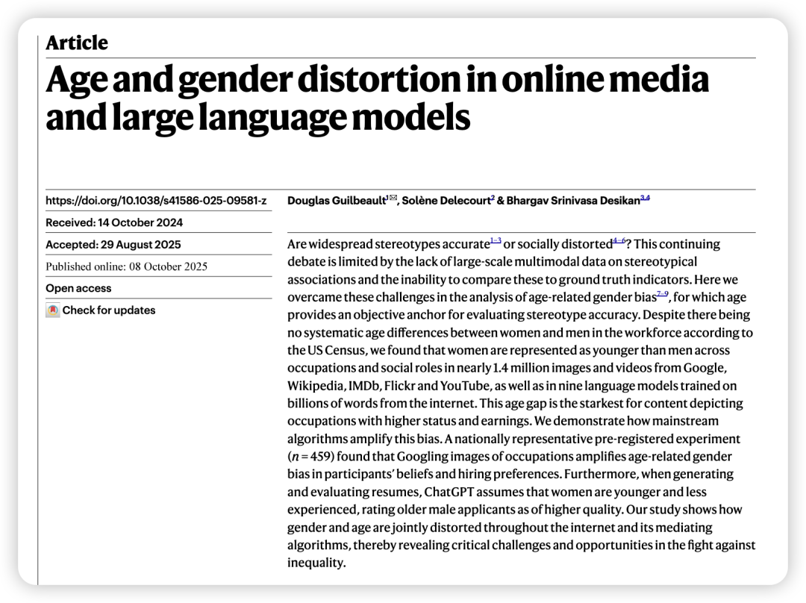
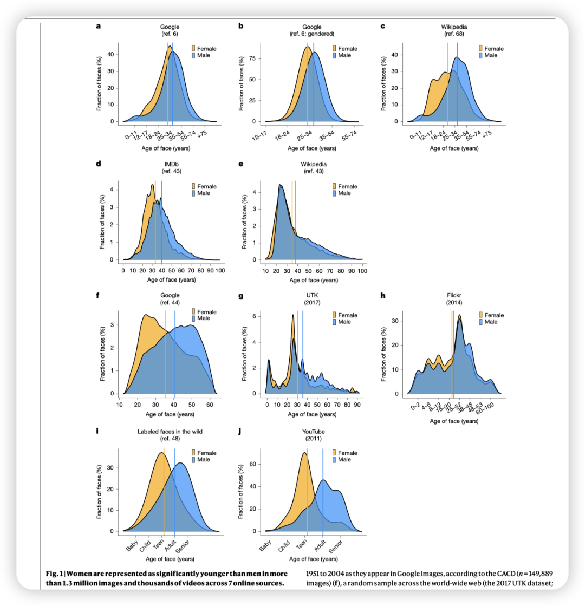
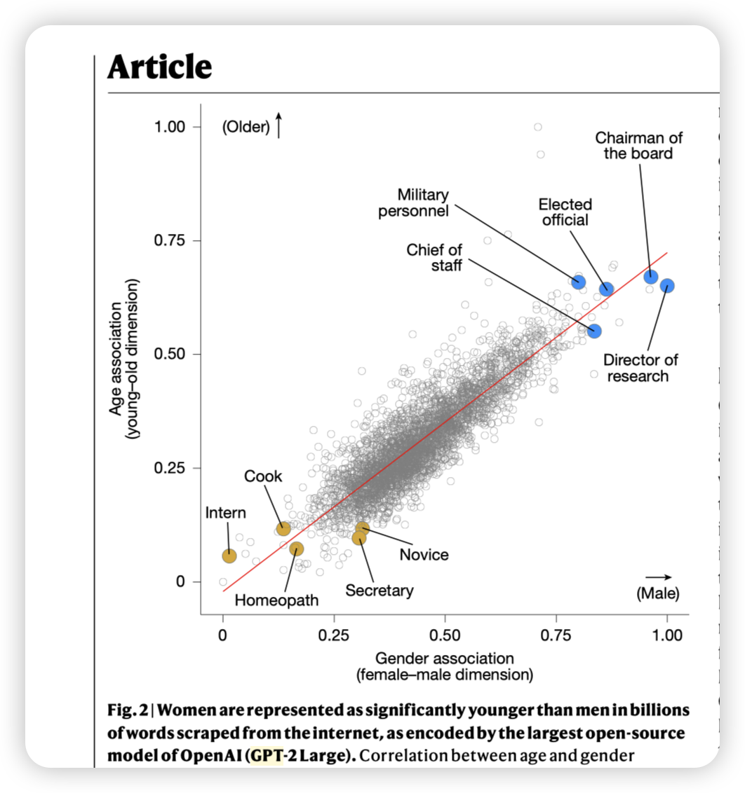
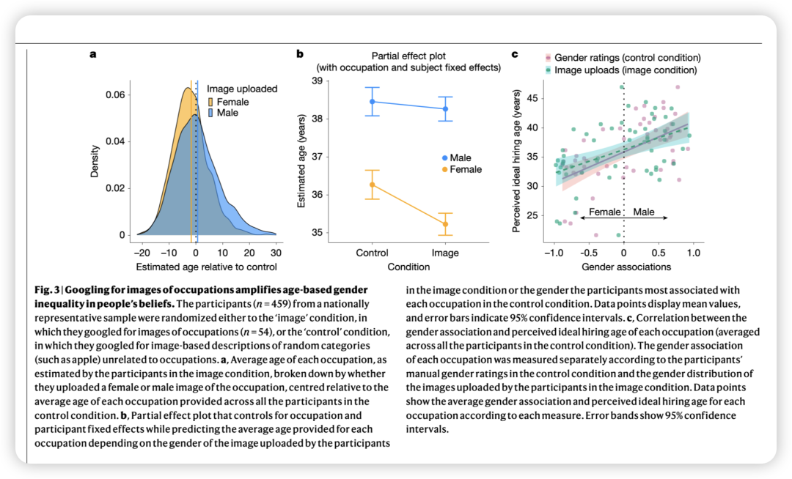
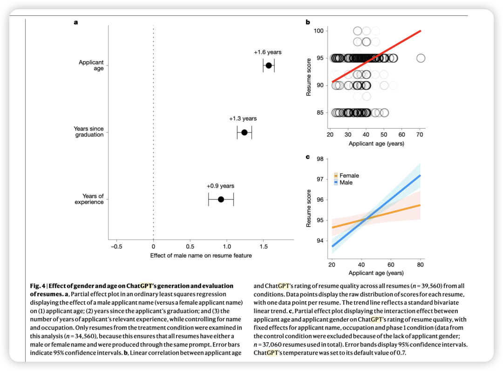

Guilbeault, D., Delecourt, S., Desikan, B. S. (2025). Age and gender distortion in online media and large language models. *Nature*. https://doi.org/10.1038/s41586-025-09581-z

**写在前面：**

终于开始继续品读顶刊了！不出意外地话，准备放在每天吃完午饭后的时间边喝咖啡边品读～ 并准备减少篇幅，尽量能用最少的字让大家记住这篇文章，让感兴趣的人能回原文阅读，让不感兴趣的至少能记住结论增加一些知识积累。

（对于非OB的文章我就完全只介绍结论了）

**视觉内容中的偏见**：

通过分析来自谷歌、维基百科、IMDb、Flickr和YouTube等七个在线来源的140多万张图片和数千个视频，**研究者发现女性的形象始终比男性年轻。例如，在IMDb的名人数据中，女演员的平均年龄比男演员小6.5岁；在谷歌图片的名人数据中，女性比男性年轻5.35岁。女性形象最常见的年龄通常在20多岁，而男性则在40或50多岁。**

**文本内容中的偏见**：

这种偏见同样存在于大型语言模型（如GPT-2）中。在这些模型里，与男性相关的社会角色通常也与年长相关。例如，“董事会主席”（Chairman of the board）和“民选官员”（Elected official）在模型中既与男性高度关联，也与年长高度关联；而“秘书”（Secretary）和“实习生”（Intern）则与女性和年轻高度关联。

**对现实的扭曲：**

**当把谷歌图片的数据与美国人口普查数据对比时，扭曲现象更加明显。在销售、资源和管理等行业，谷歌图片中男性比女性年长的差距远大于现实，甚至在现实中女性从业者平均年龄更大的生产和服务行业，谷歌图片也错误地将男性描绘得更年长。这种年龄差距在社会地位更高、收入更高的职业中最为严重。**

算法的偏见放大：

研究-谷歌搜索影响人类决策：

实验证明，仅仅是让人们看谷歌搜索到的职业图片，就会加剧他们头脑中“女性更年轻”的偏见。更重要的是，这种偏见直接转化为招聘偏好：人们倾向于为与女性相关的职业设定更低的理想招聘年龄，为与男性相关的职业设定更高的理想招聘年龄。

研究-ChatGPT在生成和评估中均存在偏见：

-生成偏见：当为女性名字生成简历时，ChatGPT会系统性地设定更年轻的年龄、更近的毕业日期和更少的工作经验。

-评估偏见：ChatGPT在给简历打分时，明确偏爱年龄更大的申请人。更糟糕的是，这种对年龄的偏爱存在性别差异：年长对男性申请人简历分数的提升效果，要显著大于对女性申请人的提升效果。这完美复现了现实世界中对年长男性的优待和对年长女性的歧视。

**对现实世界的影响**：

研究指出，**这种偏见会强化“性别化的年龄歧视”（gendered ageism），在招聘和晋升中对年长女性造成歧视，限制了她们的职业发展。**

**写在后面：**

对我来说，这篇研究有在回应我心中的2个问题：

- 训练AI用的是人类语料，但结果真的就代表人类世界的全部现象吗？ 未必。会产生扭曲，会放大人类世界中的歧视。或者是说明，训练AI的那部分数据是有偏的。

-AI真的可以用来筛简历吗？未必。提升效率的背后，是那些中年女性被算法歧视的心酸😔。

so... 所以我真的不喜欢做AI，也不太喜欢读OB里和AI有关的研究。我只想把AI作为一个协助我做dirty work的工具（还有润色润色论文语法：），永远不会把它作为我的partner。我不想掉入无意识的漩涡，不想被AI背后的潜在价值观所影响。人类书籍中有万千智识去品味，而这些内容往往是训练AI时未能输入的、具有版权的、高质量的内容。

分享一段最近读书时看到的细思恐极的话。希望我们（当然最好还有企业）都不要“无声地和AI一起坍塌”：

福柯：如果我完全没有强迫你，并使你处于完全自由的状态，你却依然选择了我为你预设的道路，那就是我开始运用权力之时。
