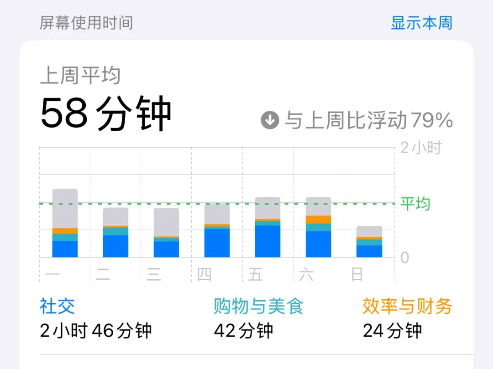
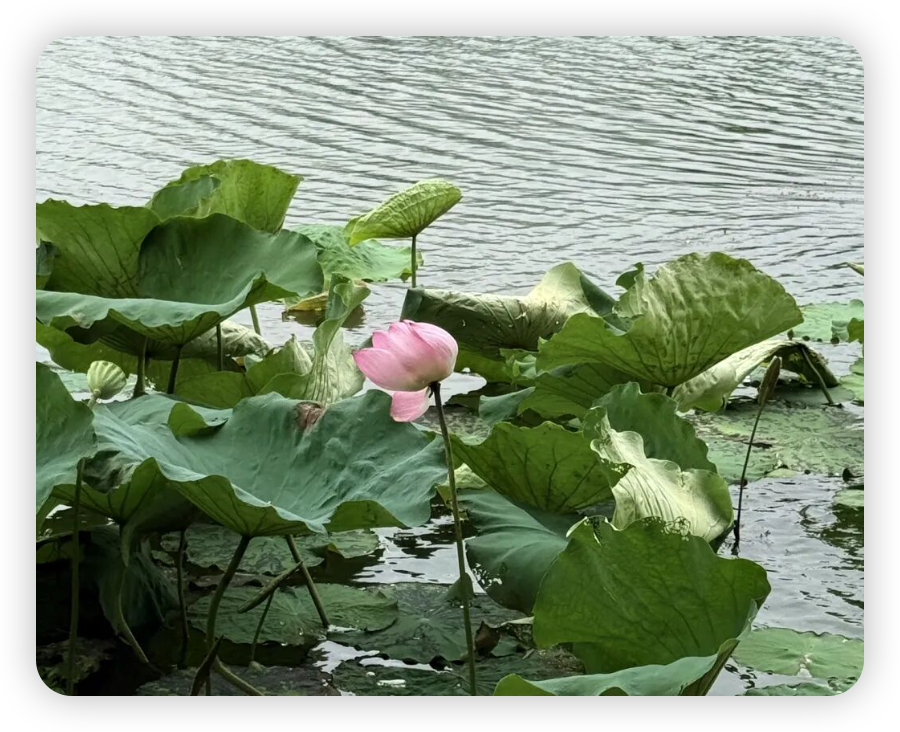
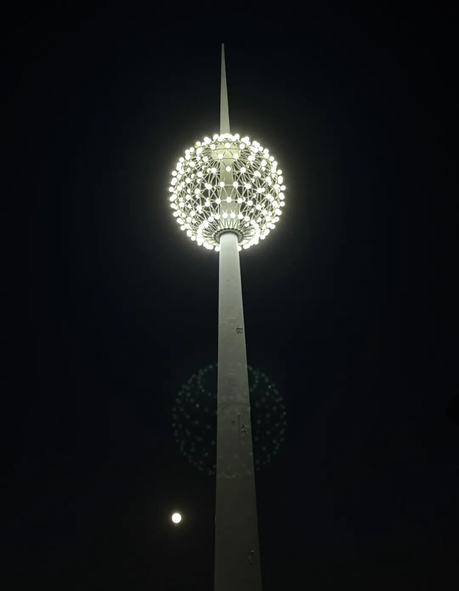
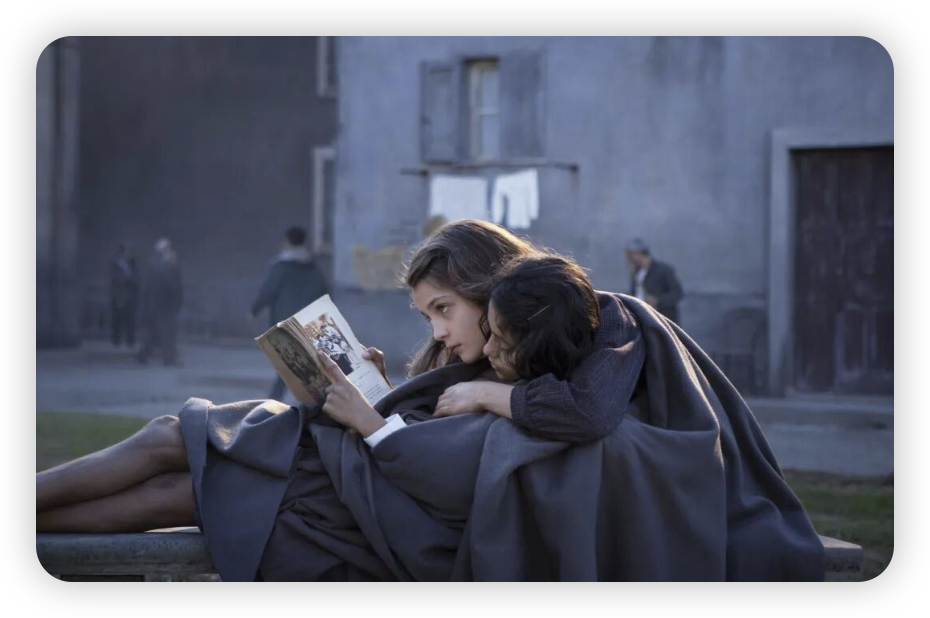
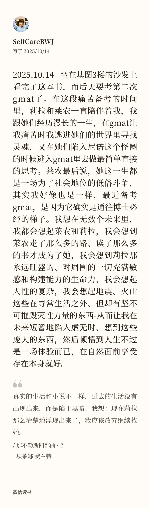

终于终于，GMAT终于考过了。我终于可以和这个几乎花费2个月之久的标化考试再见了。如果这是心理学转商科的必经之路，那这段路走的也有点太痛了😭

而在备考的每一天、在独自走在路上的很多时刻，我的脑海里就在疯狂写着下面这些文字，现在我终于要把他们记录下来、把我在痛苦中浸泡出的感悟展开，记录下这段艰难岁月。

**#日常**

这段时间仿佛再次体验了一遍高考岁月：用小学生计划本来安排每日学习内容，手机日均使用时间<1H，每天的快乐只剩下在食堂看看要选什么样的食物才能在保持荤素搭配的情况下价格最低，然后再去启真湖散步或者坐在长椅上发呆（但是需要掐着时间 不能一下子发呆太久）。

原始人的生活——只发挥功能性作用的手机

备考期间，我时不时在我的《考完 gmat 要做的 100 件事》list 中添加一些小事项来让自己有点盼头。然后发现，那些在之前看起来最为平常的活动在备考期间都成了一种奢侈：比如仅仅是去草地上躺超过半小时、听一些其他学院的讲座、逛逛博物馆的新展 … 想起那句总被人说的，考研考公考标化的痛苦就在于，外面发生的一切与你无关，你只能按着规划好的轨道生活。

启真湖的最后一朵荷花：就是硬撑

而我向来是多么讨厌这种只能运行在轨道里的生活呀！黑暗的、逼仄的、没有退路的、只有标准答案的。

我是如此喜欢到处发散、喜欢逆着社会时钟的人。而在考 gmat 的时候，却只能去迎合出题人的那套规则——而这套规则和学术表达的逻辑又是完全不同的：学术论文讲求简单直接，希望能把意思喂到读者嘴边让ta 能理解，甚至文章都几乎是模块化的八股文了；而 gmat 则是“五彩斑斓”的“弯弯绕绕”，读那些不知所云的句子时我都能感受到我的脑神经好像拧成了麻花，抬头纹都加深不少 : (

好了，痛苦的日子就写到这里吧！分享一段在图书馆一楼看到的话，是浙大西迁时期《教师日记》里所写的，和大家共勉：

> 往年走的都是平路，今年走的路很崎岖。站在崎岖的丘壑中回顾过去的康庄，觉得太过平坦，竟变成了平凡。过去的生活，犹如一片大平原，长路漫漫，绝少变化，最多不过转几个弯，跳几道沟，或是渡几乘桥梁而已。这一年间的崎岖之路，增加我不少的经验，给我不少的锻炼。然而我决不是赞美崎岖之路而不乐康庄大道。
> 谁不愿在康庄大道上缓步徐行呢？但走崎岖之路也有它的辛劳的报酬，并非全然不幸，尤不必视为畏途而叫苦连天。这一点精神，是我四十一岁生辰的退省中可以自勉的一事。至少希望我的孩子们将来能接受我这笔遗产。

**#灿若星辰灯**

这段时间我经常去基图学习，走过无数遍从基图到临湖餐厅的路。晚上抬头看着在平常日子并不会亮起的灿若星辰灯（这个灯只会在入学、毕业、校庆和一些大型节日回亮起），突然发现这也是一种奇妙的隐喻 ——

在一年365天里，大多数日子都是平淡的，那些亮灯的、璀璨的日子只是寻常生活的点缀。大部分时候，我们都要去习惯孤独、品尝乏味，再尽力用自己创造力把平凡的生活过出花儿来。

**中秋那天拍下的**

**左下角是苹果吞掉的糊糊的满月🌕**

**#相对静止**

因为饭后散步成了一天中仅有的悠闲时光，习惯快步走路的我开始走得很慢很慢。然后发现我喜欢这种相对静止、而不是绝对静止的感觉。我似乎并不喜欢空无一人的那种静谧，我喜欢在人群边缘的静谧，就好像周围那些川流不息能形成一种空气的惯性，这种惯性也能带动我的思考，让我能在缓慢的步调中也保持大脑的高效运转而不至于在静谧中宕机。于是，我又为自己未来大概率会去香港开启博士生活多找到了一个理由。

**#《那不勒斯四部曲》**

这段时间我一边备考，一边在读《那不勒斯四部曲》。在进入莱农和莉拉世界后，我发现我再也不用在走路时、在睡觉前用播客陪伴我了，在那些走在自然里、走在漫长的宿舍楼梯上的时间里，我总会回味起她们俩的故事：

-在我经历CR部分做10错8的惨痛时，我想到莱农。就算学霸如她，也会在一开始学拉丁语时无法及格，直到莉拉启发了她正确的方式，于是我暗暗想如果我找对方法，我也会悟了的（最后CR在某一天还真的有点顿悟了）；

-在我读那些毫无头绪的考古/金融/地理等主题的文章时，我想到莉拉。她在很多时刻里，都抓住每一个机会、找任何一个可能可以给她传递知识的人去求教，她对知识有着原生的好奇。我想象着，莉拉对着这些陌生的知识，她应该不会畏惧吧，而是会觉得新鲜吧。于是我也尝试把这些文章当成是老师，我品味他们，以期我又可以扩展一点对世界的宏观的认知；

-在本可以欢度中秋、国庆、生日、但却还是要待在屋内老实学习的日子里，我想到那不勒斯的大海，想到莱农最后会来到比萨、米兰。而在此之前，她也走了那样一段漫长的、混乱的、迷茫的、孤独的道路。更何况，我已比她幸运太多。

-当然了，在读到第二第三部时，我也频频被她们和尼诺的纠缠给无语到！这个时候，我就又想头也不回地投入gmat的世界，不要管她们这些莫名其妙的堕落、走不出的情感泥潭，而进入我更加纯粹、简单的逻辑世界。真的是互相positive spillover了！

**#再见夏天**

最后，想用金爱烂的语气问出，你的夏天还好吗？

我的夏天炎热、漫长、令人恍惚，漫长到让人以为去丹麦已经是去年的事情，恍惚到在看到糕点想到可以给爷爷带的时候，才想起爷爷已经离开了我。

这个夏天也足够难熬，以至于我在博士申请和老师交流时，我幼稚地、无厘头地向老师询问：“如果之后夏天太漫长、我能不能逃到欧洲去过夏天？我可以这样自由吗？” （但目前来看，好像遇到心软的神了🥹）

不管怎么样，今年的夏天在我心中终于结束了，随着杭州终于褪去的暑气，随着 summertime sadness 的旋律很少在脑袋里想起。就像每次到秋季学期的组会或者党支部会议说起新学期的目标时，我会说的唯一目标也就是，我要好好去享受一下杭州的秋天🍂。

不要温和地走进那个良夜，但现在我要温和地走进最喜欢的秋天了———

在这里记下2025年夏末的心理历程，以期未来每一次看到这条，都能品味这一刻翻越了近期人生最大挑战后的雀跃，以求未来还能有如今应对难题时的坚韧、稳定、有苦中作乐的创造力，过万境，见心境。
