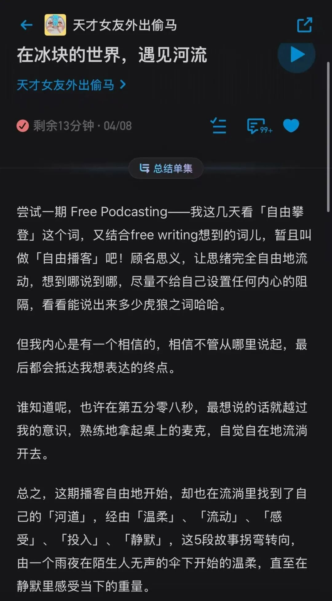
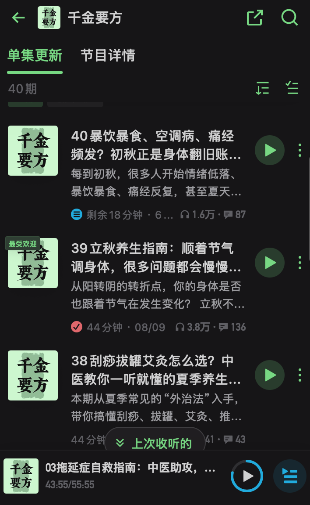
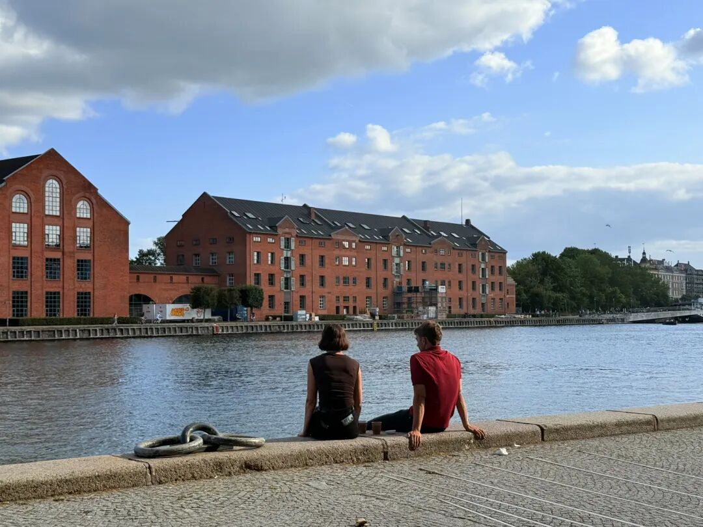
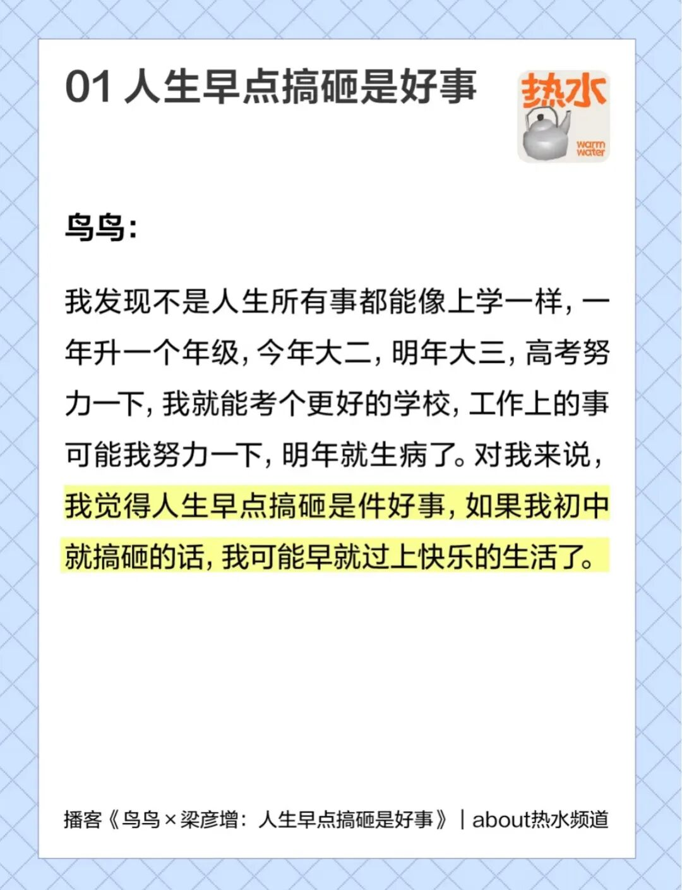
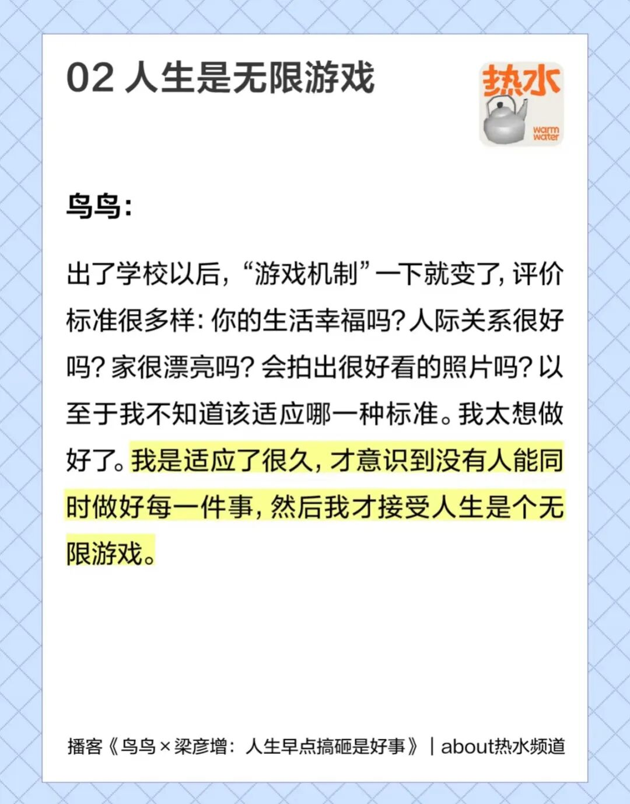
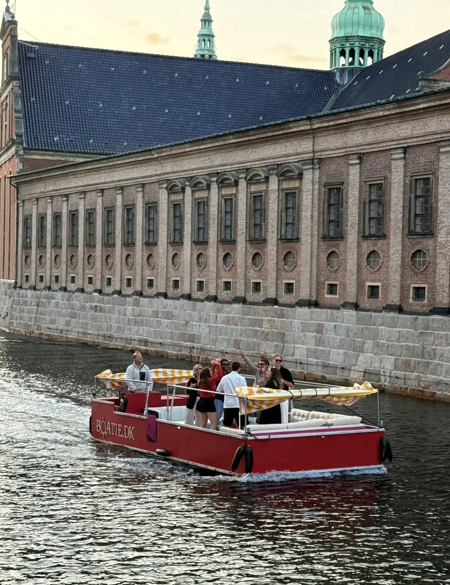
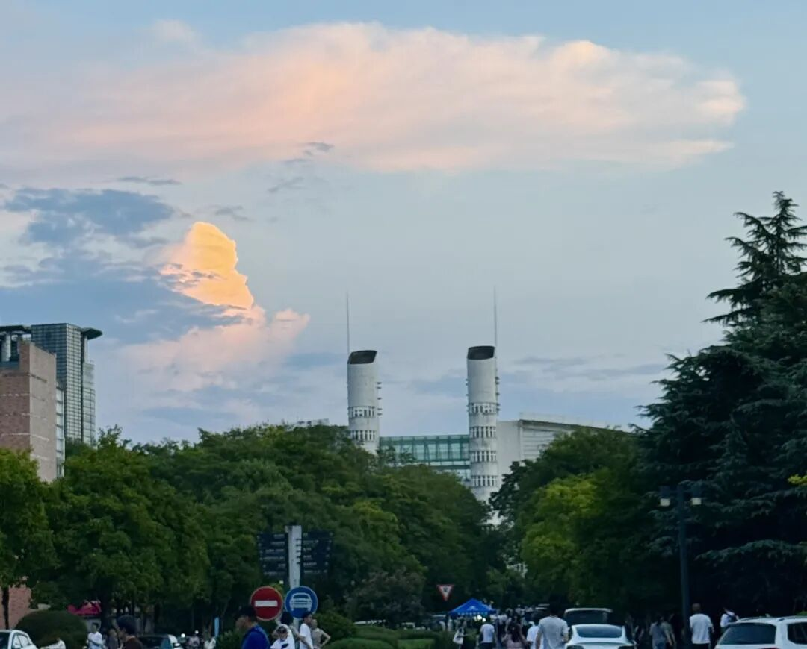

最近忙得很（终于要考上次取消的Gmat+n个科研项目+组里组外的工），但到了周五晚上人就会直接怠惰下来，给自己很多歇一歇的理由。

于是趁着毫无心理负担的周五夜晚开始久违地freewriting。

说到freewriting必须要推荐一期我很爱的幸福的播客

播客届的散文诗～

**#一个神奇的事实**

这次回家和亲戚们聊天，恍然发现：很多哥哥嫂子在我这个年纪的时候都已经有了孩子，甚至有的孩子都两三岁了。而他们的母亲在我妈妈这个年纪的时候都已经当上外婆或者奶奶了。

知道这个神奇的事实并没有让我产生所谓社会时钟的焦虑。它反而是让我想的更开了：我突然意识到我这个年纪的很多人，已经早就不是学生了。以前我用学生心态对自己的要求（比如在淘宝上买几十块钱的衣服）或许可以舍弃了。

我开始意识到自己是一个具备赚钱能力、拥有独立决策能力、具有知识和智识的真正的成年人了（不过主要还是从经济自由开始），所以我可以稍微过上一种「自我决定」的人生了，也可以偶尔买买经济范围能接受的有品质的东西了哈哈！

**#继而想到我近期对于读博的思考**

在意识到我已经是一个独立的成年人之后，我进而意识到，我已经具备了用自己的感知、兴趣、价值观来构建我未来世界的自由。

在本科期间，也许看到“趁着年轻，我偏要勉强”的鸡汤还会想着逼一把自己做一些事情。

但到现在这个年纪，我想的已经是：逼一把自己，就会逼出一颗结节；再逼几次，可能肿瘤都要应运而生了🚬

说到健康和养生

我又要推荐一个最近我每天放着催眠的中医播客！

因而，对于如此佛的我来说，「在读博期间我想过什么样的生活」已经完全无法被某个人、某篇文章的某些倡导所轻易左右了，而是全然地听从我内心的呼唤。

于是这一个月来我一直在思考，我内心的呼唤到底是什么。

**#内心的呼唤**

-朋友与家人。

意外地发现，我已经到了一个这样依恋朋友们的年纪。这并不意味着每天都要粘在一起，只是每周或者每两周都见一见都会让我感受到社会联结的温暖。这也许是因为现在的朋友都是很好的人！和她们在一起的时刻会让我觉得一切都充满希望，让我觉得「原来世界上会一直存在着这样美好的人们」呀！我喜欢跟学术和学术外的活人朋友们待在一起！

而家与家人也永远会意味着是底气、是信任、是由衷地希望我好、是永远可以缩回去做一个只会点菜还不会自己切水果的智障儿童 :)

-紧密的学术交流网络。

硕士期间做研究，更多地靠自己瞎品瞎领悟，无人能告诉我我的想法是对是错。直到后期才非常幸运地靠着一些网络朋友开始谈论研究，但显然能在线下聊会更好。

我想如果做micro的研究是为了多多少少改变一点人们对周遭世界的认知，那至少也应该多去和人进行思想碰撞，这样才能荡漾出以你为中心的一圈涟漪，再传递给更远方的人。

而这种思想碰撞的底层逻辑还是「如何给他人提出有建设性的意见」的能力。我感觉目前大陆的培养似乎只有「挑出他人研究中的问题」，以至于很多人只能看到研究就想吐槽，而很少思考「如果是你你会怎么改进、你能比ta做的更好吗」这些问题。

因此在博士期间，我希望能学到的是真正的批判性思考、提意见的能力，而非仅仅是“批判”。我想和一群真正志同道合、热爱研究的人一起训练大脑，塑造认知。

比如，我想弄清楚的问题是：如果理论贡献如此重要，那怎么样才能做精细的理论推导/我测量的变量和理论中的构念要多相近/如果这个理论已经足够稳健，我要怎么做才能拓展它而不是运用它…/如果要做实验，到底什么样的实验材料是好的是有效的/如果每天早上都要先用1小时进行写作，而我对文献不熟悉，怎么样才能确保我在“写”而不是在“归纳文章和引用”…

对于研究，我还是有很多问题想得到解答。希望未来能和真正懂研究的学者学到这些细节上的东西！

-方便的生活。

我觉得非常幸运的是，我在这两年分别去了美国、欧洲开会。但我也没有想到，这两段经历让我产生的对于国外生活的感受竟然是：嗯，待七天半个月很好，待五年好像不行。

而在此之前，我无数次幻想过国外生活地广人稀的宽阔、北美的大house、欧洲work life balance的松弛…可真正到了那里待了一周就会发现，我还是想念国内方便快捷高效的生活。或许是杭州把我养的太好了，我喜欢那种走几步就可以到盒马、或者大热天就可以点菜送上门的便利，喜欢到晚上10点也可以轻松出门散步或骑行的心理安全感，我也爱国内相比于国外低廉的物价，甚至连国内的商场我都觉得好玩，吸吸人气、对路过的小狗行注目礼、品尝店铺里的试吃，这种朴素的幸福真的让我很满足…

写完这三点，我惊讶地发现，我居然完全没有思考过研究话题或是学校排名…

对于前者，我是觉得硕士在做的方向未必一定要持久去做，毕竟这个阶段的我还没有真正走入OB大门，也就是说硕士阶段谈论research identity其实毫无必要。同时，OB中每个大领域中一定会有某个小领域戳中心趴，因此其实不必局限自己的研究话题，PhD的时候完全可以再尝试新的！

而对于后者，这更是身外之物。 学校不等于专业不等于导师，更不等于你，最重要的你对于这片土地、这个系的风格等等的**契合**。这是一个与你有关的相对值，而不是像QS这种无聊的绝对值。

—— 所以，原来我潜意识中内心的呼唤就是更关注生活、和生活中的人与连接，我只有在这样的环境中才会每天都很开心，就算是坐在电脑前打字，也会突然觉得「现在的生活真好」！（就像我现在这样）

写到这里，我突然意识到，原来在我选择读研去处的时候就已经这样想的了。

比如虽然那时候也有学长学姐推荐我去读认知神经科学方向，毕竟那是近几年来国内心理学的热门方向，可我还是听从本心，本着“不想一直做实验”“不想看全是脑神经的论文”的心态放过了自己；比如虽然当时在北京也有两所学校可以选择，但我仅仅是因为“那里住宿太差”就可以完全放弃掉。

—— 而这样「很叛逆地听从本心」最终的结果是：我确实更喜欢这里！每次返校想到我又要回到杭州，甚至都会有些激动。总之，一个好的城市真的会大大降低人的厌学心情（当然夏天的杭州太不让人激动了 只会让人觉得小杭你怎么可以这么热=.=）。除了脚下的土地之外，我也在一个“温和”的研究领域里，津津有味地读着研究，读着读着还突然发现我这个方向在PhD的时候还能去申请商学院，这是我在当初选择的时候从未想过的，命运的走向真是神奇呢！因而愈发觉得当初的决定如此正确，听从自己的本心就是会有这么多的好处呢！

有时候会觉得是因为幸运，但其实转念一想，那些听从本心的决定一定会让你过的开心自在，而开心自在自然就会联结到很多好的能量与气运！

#我几乎从不感到焦虑与无意义

打下这串字，都有点不好意思。但我确实一直都心态平和，啥都无所谓…

最大的原因我也在聊天的时候说过很多次，那就是我高考考砸了。

所以我完全赞同鸟鸟说的：“人生早点搞砸是件好事”。

我在18岁的时候就已经搞砸了对于江苏小镇做题家来说整个生命最重要的事情了。

于是在未来的日子里，我相信不会有比这更砸的事情了:) 未来我所经历的羞耻、尴尬、抬不起头的自卑，都不会比这件事情更糟了。

当然在那段时间里，我也用了两三年的时间进行了心理重建：

从觉得“我是一个垃圾”到觉得“我是一个垃圾又怎么样”到“垃圾是谁定义的？我得有我自己的定义”，我意识到人生真的是无限游戏，永远不要陷入世俗上最无聊、最抑制人的灵气和创造的、最荒诞的优绩主义评价体系中去。我也永远会远离这类人，跟他们在一起总有一种喘不上气的感觉…

所以我现在的心态是：

-发不了顶刊？ 无所谓，发了顶刊的人也是要吃饭喝水做饭、也有一天要死的。大家都是平凡人。「发表顶刊的这个瞬间」和「我周遭具有弥漫性切持久的幸福感」比起来不值一提。做研究是发现问题和解决问题本身，很多人也会发现在一遍遍打磨论文、修改审稿意见的时候当时那份激动就快要被磨灭了，等到accept的那一刻内心早已毫无波澜。所以如果把人生的意义建立在“发顶刊”上我总觉得是很可悲的。（虽然这么说，但还是会用顶刊的标准要求自己去做真正严谨的研究，对过程严丝合缝，对结果随遇而安）

-未来找不到好的教职？无所谓。活着就行了，能找到一份较为体面的工作够我养活自己了。我是为自己而活的，不是为他人的目光而活的。

-OB研究没有意义？无所谓，和很多工作一样，这也就是一份工作罢了，就像在企业中也可能存在做了5年、10年的项目到头来一场空。意义自在人心，自己开心就行。当然自己开心的同时是以不损害他人为前提，同时偶尔也多做善事！（思想上与物质上都是）

似乎任何纠结与顾虑对我来说都可以用“无所谓，不会死的，活着就行啦”来回答。 除了健康，所以健康活着约等于就是最大的意义（健康且矫健的身体才能产生澎湃又积极的身心能量！） 任何违背我身心健康的事情我都可以随时say no！

（好吧说了这么说 好像就是那句“生死之外 都是小事”）

**#感谢**

叽里呱啦说了一大堆，脑海里此刻很多想要感谢的人。

感谢在我本科那样普通和黯淡的时候，有人给了我机会，让我来到了更大的舞台。

感谢在这里遇到了很多同样追求朴素但幸福生活的朋友们，我们一起幸福滴温存着、探索着这个城市的美好。

感谢互联网牵起了很多和我一样纯粹的理想主义者，我们一起不为了证明自己是谁/能做什么、而仅仅为了求知欲本身而思索着一些抽象的问题。

感谢OB领域的很多学者，让我意识到成为世界上是可以存在着这样的给你指导、又给你自由、又希望你高飞的老师的，原来学生是可以被当成平等的人交流的。而不是像很多某些大陆老师的经典做派一样「禁止合作、禁止摸鱼、禁止实习、禁止你不给ta干活」。

感恩那些脱口而出的肯定和赏识。感恩很多意料之外的联结。

这篇里提到了好多次联结，但真的，这是对我来说最好的词。联结代表着共情、感同身受、机会、创造、温暖、相信、意料之外、幸运…

**#继续学吧！**

今天出门发现大一新生居然已经来报道了，校园里又涌入了新鲜的血液。这也意味着我真的要研三了。以前研一研二的时候总有人会说“天呐你还这么年轻 未来可期呀“。到现在，未来就在脚下了，我不能用我还是研一研二的小孩儿来遮掩我的无知和短浅了，唯有继续训练自己的大脑，去学去做，那研一研二时那些“知易行难”的事情慢慢搞懂。

**#之后的安排**

一直到9.18我应该还是会很忙碌，但希望那天之后我会空一些！能够继续更新。

毕竟最近我又和好朋友一起在快乐读文献，有非常非常值得分享出来的共同督促读文献的方法！只是没有空再上传笔记了，到时候可以一股脑倾倒。

最近还和很多喜欢做研究的朋友们meeting了，效果太好了，跟厉害的peers能学到很多tacit knowledge！我们也想计划着之后可以组建很小规模的讨论，一起讨论论文和自己的研究！期待期待！（感兴趣的朋友们欢迎提前在后台报名！！）

🙏最后祈祷gmat一次过啊啊啊！那样我的生活真的会更幸福的！！！
