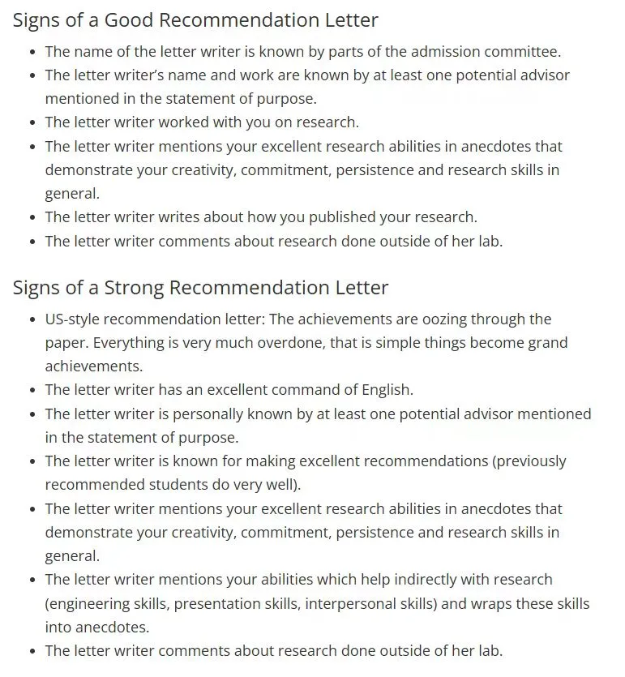
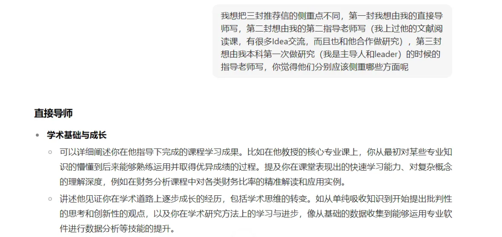
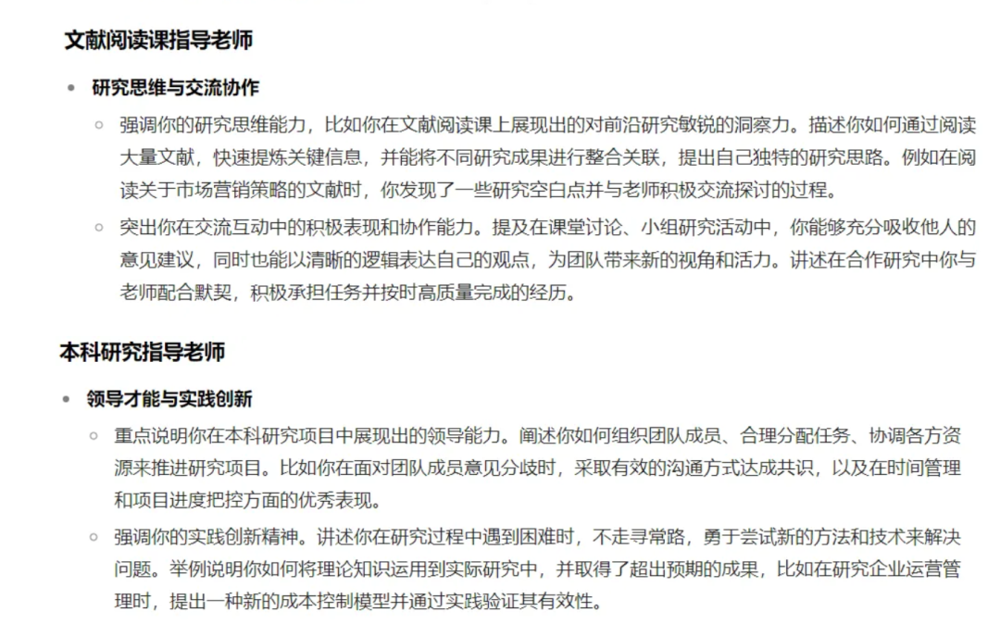
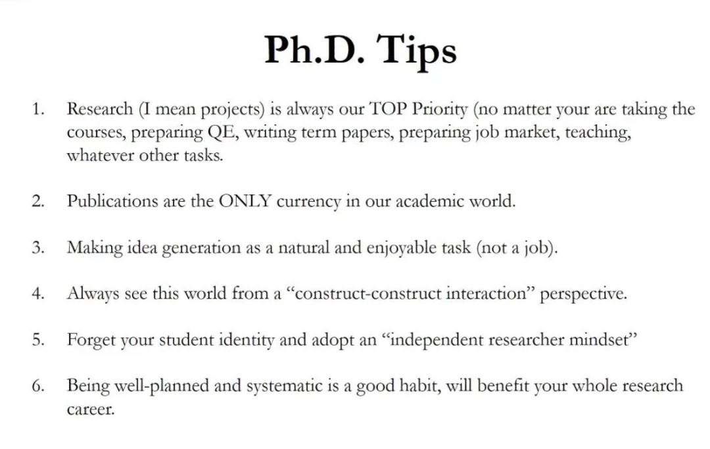

百味鸡的介绍：

自Keke收到PolyU商学院offer起，我们就准备搞一篇申请心得分享给有需要的人（当然包括今年申请的我自己）。于是从2月拖到4月拖到7月拖到现在，Ke老师（想更了解他请看他精心制作的个人主页请看→ https://zhangke-malcolm.notion.site/research）一度难产，我一度离线而难以帮他接生，而终于在今天生出来了！！ 感人！！

我和Ke难得的都是“云淡风轻”那一挂的人（我觉得帅老师也是这样哈哈），而这在优绩主义盛行、人人精英、非常professional的商学院就更为难得。我们是完全的理想主义者，一会儿说说垃圾话做做天地间的吟游诗人，一会儿又爱着很美的研究好像是个学者。比起追名逐利去一个世俗意义上的Top学校Top项目，我们都更想自由畅快地书写自己的故事、去真正合适的地方。

我总说“理想主义者要多多上桌”，那Ke的整个申请简直就是“理想主义者找到了最好的桌子”的故事 —— 不必精英，无需奉承，很少内耗，只要明确自己想走一条什么样的路，你就可以坚定地走向你要的未来，也会最终和懂你的、赏识你的人一起快乐共事，你可以做一个independent scholar而不必做很多杂活。—— 我想这是很多人在硕士期间从未感受过的幸福。

废话不多说，请大家开始收看这一份坦诚的、干货满满的幸福！！

## 

## 

## 

## 写在前面

## 

在经过了很久的考虑后，终于还是决定来写一个申请博士的经历和分享了。

一直让我犹豫的点在于：我一直认为自己算是一个非常“不求解”的生活玩家，在我申请的时候有很多的攻略帖子和很多朋友的建议。但不知为何，我始终觉得申请博士这个过程，或许不需要这么多的“解法”和非常一板一眼的内容。

很多精英会追求用自己已有资源换得最大资源的态度去申请博士，衡量博士申请结果的方式成了拿到QS排名多高的学校，发offer的老师有多大牛。

但不知为何，我始终觉得，这套规则对我而言有一些太难去实践和追寻的地方。就像是很多我感兴趣的研究者并不都在Top学校中，也有很多Top学校中导师的研究话题，或许对我而言并没有那么的有吸引力。

我始终觉得做研究有多种方式——得益于学术界的包容和非实用性的考量，有很多不同的学者都在做着他们认为有意义的研究：有的人天赋非凡，抓住风口，发布无数的顶刊引领着学术的风向；但也有的人，坚持着自己认为重要的课题（无论大小），对许多非流行的话题持之以恒做着研究，也在非顶尖的大学持续为人类添置着不知道什么时候才会被用上的知识。

因而，我的目标从来不是申请一个顶尖的大学，在“选择去哪里读博”这个命题的背后，我的诉求或许永远都是找到一个最适合我的大学。在那里我的才华和思考能被尊重，我与导师能够积极合作，并能够用我的方式持续地做着我认可的研究——毕竟我选择读博的目的只有一件事，那就是我想知道如何用更好的方式开展我所感兴趣的话题与研究。

Before We Start… Who is Ke?

我是一个来自国内大学的心理学本科毕业生和硕士生，并不算多么的精英和出众，但却对做研究充满了浓厚的兴趣。我没有多么好的背景，没有多么顶尖的发表，更没有来自大牛老师的背书和推荐信。在整个申请过程中，我都选择了自己DIY的方式，靠着自己的一腔热血支持自己走完整个申请，并有幸在过程中得到许多老师的认可和赏识。

我的申请成绩（8投3面2中）也不算是怎样优异（但其实这个问题有点奇妙，如果中的几率很高有概率是因为自己选了太多自己overqualified的学校，太低又是比较投的超过自己的能力范围，所以我觉得这个比率还算不错）。但令我高兴和开心的是，最终拿到的两个Offer，我都收到了导师极大的认可和支持，并且也在这一场漫长而艰难的申请过程中，收获了非常多有关自己未来道路和成长的思考——而这或许比什么都要更加的重要。

有许多博主实际上已经做过了非常多的PhD申请分享，但等到自己来踏足这件事时，你又会发现自己的情况是如此多的不同。这恰恰是因为，PhD的申请远远比拿到一个好的本科或是硕士Offer要更加主观和奇妙——这是一次真正开始非成绩至上的考核，也是第一次会让人真正感受到，最好的不一定是最适合的，最适合的不一定是成绩上最好的。

我想把我的思考分享给所有人，无关背景和已有的资源，而是更多从一个真正对研究感兴趣的、想要踏足学术界的、怀抱梦想的起步者的视角去分享我在这个过程中体会和看到的一切。

希望我的这些分享能够帮助每一个想要去申请博士的小伙伴找到最适合自己的项目和学校，祝永远都有数不完的灵感和感悟！

目录：

Chapter 1 —— 读博到底意味着什么？（亲身体会版）

### 1.1 读博的 “奢侈”与“不确定”

### 1.2 读博的乐趣

Chapter 2 —— 申请博士的基本流程与介绍

### 2.1 用“推销”自己到最合适的”买家”的视角看待申请博士

### 2.2 推销自己的手段——哪些材料需要准备

### 2.3 了解潜在“买家”及其需求——哪些项目/地区/组可选，他们的需求是什么

## 

## **Chapter3 —— Step by Step 开始你的自我推销**

## 

## **Step 1 明确自我和目标——撰写你的SOP/PS以及CV**

## **Step 2 明确你的目标买家——搜索项目/学校信息**

## **Step 3 准备你的标化成绩——TOEFL与GRE**

## **Step 4 准备你的推荐信——谁是你的sponsor**

## **Step 5 写在最后的有关PhD申请过程的感悟和思考**

### 

### 

## 

### 

### 

## **Chapter 1 —— 读博到底意味着什么？（亲身体会版）**

### 

### 1.1 读博的 “奢侈”与“不确定”

在真的要开始申博之前，所有的申请人都应该好好思考读博，甚至说申请博士这件事到底意味着什么，尤其是其糟糕的部分。

**对我而言，首先一点是，读博是一个很奢侈的选择。**

博士的大部分时间里需要靠着奖学金过活，很多时候很难有自己的收入和兼职工作，尤其是在科研压力和学习压力都很大的时候，很难分出额外的时间和精力去做一些其他的事情，更不用说赚一些外快或是别的情况，而这一点在国内尤甚。就比较常见的三个博士去处而言，在各个问题也有或多或少的情况：以美国为例，美国的假期没有奖学金，需要用RA/TA等方式来赚钱换取奖学金。与此同时还伴随着非常多的消费——无论是吃/住/行方面都有相当不菲的一笔开销。

而读博会将这样勉强糊口的日子延续至少四到五年的时间。这种刚好够自己生活的收入并不只是养活自己这么简单，与之共同伴随的还有看着同龄人在社会上逐渐自立和财富逐渐自由的过程。以笔者为例，毕业时已经快要三十岁，而谁能想到此时职业生涯才刚刚要开始；与之相对的，如果将读博的五年时间投入工作，得到的经济增长和职业发展机会明显要比读博多得多。

当然我并不是为博士叫苦，而是想说明一个非常重要的事实：如果是为了钱或是觉得读博可以自理生活就加入这条路，是很危险和鲁莽的。这其中伴随的经济压力（还没有计算家庭的期望等等）可能比想象的要多很多很多。

另一方面，申请季的开销也并不是一笔说给就能给的小数目。以我自己的DIY申请为例，为了申请需要参加的各类标化考试的报名费不菲（托福报名费打折后还需要1260RMB，GRE报名费打折后要1165.5RMB），每个学校申请费（只是提交申请材料以及要求考试机构送分）也是很大的一笔开销（例如UC Berkeley，只是申请报名费就需要1100多人民币，还没算上GRE和托福送分加起来的400多），这笔花销会随着申请学校数目而翻倍；除此之外如果还要找一些中介服务以及学习语言/标化成绩，价格又可以往上翻很多倍。笔者自己用了最DIY、所有标化成绩只考一遍和申请了尽可能最少所学校（8所）的情况下，依然花费了将近12000RMB左右。而我自己身边学校申请多一些的朋友，基本上都会有将近到2W左右的开销。

这不是一笔很容易就拿出的资金，尤其是对于大部分没有自己收入的学生来说更是有些难以承担，何况这笔钱还有概率颗粒无收。

**第二点是读博是一个极其“不确定”的过程。**

外出读博代表了很多方面的挑战：

·生活方面，新的文化环境和氛围需要学习和适应，并常常附带着很多与时政有关的不确定性；

·学习方面，清退考试的存在使得博士期间的学习压力是暴增的；

·生涯方面，读博的时间如何规划好自己的学术产出，如何面对做学术天然的高不确定性等等…

读博的方方面面都需要与不确定性打交道，从某种意义上讲就连最开始申请的结果都是充满不确定性的，并且也将贯彻到这个学术生涯之中。

因此在读博之前必须要认清楚这条道路的重要特点——即不确定、模糊以及不一定有所谓的一分耕耘一分回报。

### 1.2 读博的乐趣

前文说了非常多读博的缺点，但笔者其实并不是想劝退或是抱怨，相反，也正是在认清这些客观存在的困难后，才能真正明白这条道路带来的是什么。

就我而言，读博有两点是最吸引笔者，也最能激励笔者的特点：

第一，学术工作像是一跳永不停歇的创业道路。

学术和知识是永无止境的探索，几乎每一次学术工作都需要从头开始，几乎每一次都是踏入完全未知的领域去进行探索，这份永远在路上，永远在学习和探索的过程充满挑战和困难，却也让人感到激动万分，也能够永远去填充并扩展自己的知识与好奇心。

第二，就我自己从事的学科，心理学而言，从事心理学学习的过程是一次对人和世界深入探索的机会。

虽然很多学科抨击心理学结论的不稳定和摇摆不定，但它恰恰就是人最精妙的部分——那就是永远都充满了不确定性和难以预测性，但其背后的原因也恰恰是因为我们都是人。对我而言，心理学是一次试图简化人再到重新还回人复杂性的过程。虽然难以捉摸，但几乎每一个与人相关的事情在被人们了解了背后的背景和故事以后，都能被我们理解（但不一定是谅解），这种共鸣恰恰是我认为心理学中最美妙的部分。这门学科仿佛是一个精妙的棱镜，能够帮助我看到不同人身上独有的特点与色彩，也正是这份体验让我想要加入其中，去发现人们身上更多更独特的色彩。

我会想告诉每一位想要申请博士的同学必须**要明白这条道路必须付出的代价和成本**，它并不像是普通硕士的道路那样是一个可以用于延长自己决策时间的机会，而是已经下定决心要开始踏入学术界的正式实习工作期，如果没有想明白自己想要读博的原因和动机，一方面在未来4-5年的时间内大量的科研压力可能无法让自己喘过气，另一方面这也是在申请阶段会被着重审查并且会被老师反复拷打和询问的重点——因此从各个方面来说，如果没有明白这条道路的含义和艰辛，我还是不会建议选择读博，如果想要体验科研的工作可以只需要做短期的研究助理就好了，而如果想要赚钱的话，前往就业市场一定能比这五年的时间成本带来的回报多得多得多。

## **Chapter 2 —— 申请博士的基本流程与介绍**

在你已经想明白好自己读博的利弊以后，事情会简单得多，或者说你已经有了自己申请Ph.D最重要的一份底气，接下来我想从我的经验说起，谈一谈我所经历的Ph.D申请流程。

先简要做一个概括，整个Ph.D申请阶段需要：

·找到适合自己的Ph.D项目以及老师（而不是学校）

·查询该项目的申请流程/咨询老师相关的名额和流程信息

·准备申请材料

·推荐信

·Statement of Purpose

·CV

·Test Grade (语言+GRE/GMAT等）

·其他材料（Personal Statement/Diversity Statement, 学术发表论文/writing sample等等)

·提交材料

·第一轮面试

·和意向导师交流/visiting day （其实也是第二轮面试）

·选择offer

·入学

### 2.1 用“推销”自己到最合适的”买家”的视角看待申请博士

我非常乐意把申请博士的过程当做是一个找一个合适的岗位，或者是推销“自己”这个产品的过程。

这并不是说需要把自己自我物化成一个产品，而是一旦这么思考以后，是否能申请到一个好的博士项目就不再是一个简单的、有高分GPA、有发表、有推荐信的非常细化指标的决定过程，而是一个像是我们会去购买产品一样的非常整合的判断，你只有**挖掘出自己的特色**，并且**把自己的特色尽可能的展现出来**，并**推销给最喜欢这一特色的人**才算是真正的成功。

这意味着，你不能去强卖给不喜欢你这一特色的人——不是所有的项目都适合你，不是最好的项目都是适合你的。

也意味着，无论你当前的情况如何，你都有机会挖掘自己的特色并找到合适的人——无关你的发表，经历，年龄，甚至是GPA。

还意味着，你的销售材料准备是要围绕你的特色来打造，而不是“高分”来打造——不要拘泥在完整申请proflie中的某一个点上，而是要关注整体是否传达了你的特色。

### 2.2 推销自己的手段——哪些材料需要准备

基于此，再次回顾到申请的材料部分，似乎就能更加理解各个材料分别代表了什么部分，以及它们如何来讲述你的特色：

·Statement of Purpose：是你的核心自述，需要着重在，为什么要选择读博这条路（动机），我在这条路上做了什么准备（经历，成就，学习和工作的经验）以及未来我想在这条路上做什么（未来的计划）三个最大的方向上去统合你的内容

·CV：其实只是上面的佐证

·推荐信：除了自评，你的他人评价如何？以及你与人相处的情况如何？是否已经有人在你还没有开始能拿出成绩之前就看到你的潜力并且愿意用自己的声誉来推荐你？

·Test Scores：某种意义上只是一种硬指标但是也对应一部分能力

·其他材料——用于补充上述材料的佐证或额外信息

到此处，或许就能理解到了，单纯揪着上述内容的某个part死抠细节绝对不是正确的处理思路，例如Test Scores多几分是不是会更好，当然会，但是不一定能在你的“特色”上增加太多分数，一定要从死抠某个部分的profile内容上的思维脱离出来，比起做那些几乎是鸡蛋里挑骨头的工作，重新思考自己的特色和优势并以此为主要锚点修改其他内容或许才是更有价值的部分。

### 2.3 了解潜在“买家”及其需求——哪些项目/地区/组可选，他们的需求是什么

顾客是否会购买你的产品，除了产品自身之外，还与顾客自身的需求有强关联。

在过去的很多经验帖子里其实都很少提到了这点，那就是，大家都很优秀，但是各花入各眼，可能不同的老师/学校/项目的目标群体就是不一样，需求也是不同的，而不只是我足够优秀我就能够进入到这里。

因此，选择一个合适自己的学校不仅仅是在思考自己是否达到了这个学校的申请标准，更应该考虑的是，自己是否在这个学校“适配”和“被珍视”。

一个非常重要且很多人忽略的观察是，其实有的时候强行进入的所谓TOP的学校不一定是对自己最好的，也不一定会是最能发掘和发展自身最大优势的地方（鸡头与凤尾之分）。

除此之外，在地区和学科上也有一些比较大的笼统的区别，以下做一些比较小的分享

从笼统的项目上来分，OB研究者可能会考虑的项目包括两个大类：

**A. 商学院项目**

——商学院中的OB/Management以及Marketing领域对心理学的学生接受度很不错，不过如果想在商学院里面做非常心理学的研究，几乎只能在最TOP的学校里面找（例如能明显看到美国只有TOP 20的商学院会做心理学的研究，发表也主要集中在Social Psych领域)，其余学校则着重关注UTD这类传统管理学的研究。

——商学院下的项目，通常是委员会制度，由商学院整体出资支持学生，导师制度相对弱一些(尤其是北美，相比之下香港会更导师制度一些)，也就意味着和导师的绑定关系弱，更需要从整体上与学院老师的研究方向匹配而不只是一到两个导师，提前联系导师的意义会更弱一些；申请人的背景会更多元，不只有学生，也会有很多工作了一段时间的申请人

——申请时Profile会被拿到整个Faculty中进行讨论，需要被认为是匹配整个Faculty才有可能入选，提前联系导师的意义不算非常大

——除了学术能力，更在乎候选人的领导力；其目标是培养商业领域的精英和领导者，而不只是简单的学术研究者，所以它对候选人的要求非常多面，不仅仅是你的学术背景和经历，而是会关注很多其他部分的内容，例如工作能力，合作能力，领导能力，自我展现的能力，自信程度，创业精神等等

——尤其在意学生毕业之后的Placement, 相比之下毕业后工作的薪资水平比较高，门槛也比较高，比较算是窄进宽出，申请难度相对较大

**B. IO心理学/社会心理学项目**

—— 心理学系下项目，导师制度强，通常是导师从自己的经费中拿出一部分作为奖学金招募Ph.D,因此和导师的绑定关系会更强，也更需要提前联络导师；申请人主要都是心理学专业的学生更多一些，背景相对类似和相同一些，大部分都是本科生或硕士毕业生

——尤其对于实验水平和数据水平好的学生有青睐，有自己研究兴趣和主题的人更加分； 除此之外要注意Social Psych和I/O Psych的发表侧重有差异，资源分配上也有较大的差异

——培养上更专注在学生的研究能力培养上；申请难度适中，门槛不算太大，比较宽入，但在找工作的时期竞争就会响应更加激烈一些

从地区上看，通常出国留学会考虑的地域包括:

**北美**：竞争最为激烈，候选人来自全球，最为看中推荐信的人脉关系以及个人研究“特色”，奖学金不算多，学科氛围顶尖，资源上整体丰富但是细分到学校存在差异（参考国内情况，顶尖资源基本是在顶尖高校，其他高校资源相对会弱甚至较少），学制五年（无论是否有硕士学位）

**香港/新加坡**：竞争适中，候选人一般来自亚洲，优绩主义倾向较强，关注本科/硕士学校及GPA，奖学金优渥，学科氛围较好，资源丰富且因为境内高校数目相对较少，每所学校分到的资源都比较充足和自由，学制通常4年

**欧洲**：笔者了解较少，通常为岗位制，更像是工作岗位而非是学习，岗位数量较少，更看重“匹配”。欧洲的方向（可能）相对来说比较“硬核”和工业心理学一些，和传统考虑的人文社科关系弱（但具体还是看岗位要求）。

除此之外，不同地区的申请时间线/需要的材料（尤其是字数，内容侧重点）略有差异，需要着重注意。此外也要注意不同地区的生活情况和文化环境，寻找一个适配自己生活习惯的地区就读也是一个非常值得考虑的点。

## **Chapter3 —— Step by Step 开始你的自我推销**

### 

### Step 1 明确自我和目标——撰写你的SOP/PS以及CV

在这个阶段，你必须着重回答几个重要的问题：

why phd, why this program, why you are interested in this

你需要回顾和询问自己，为什么要选择读博士而不是选择工作，为什么要选择这个项目而不是其他项目，以及为什么要选择这个研究主题而不是其他研究主题

what I can do, what have I done, what am I going to do

回顾自己已经完成的研究经历（不一定必须是发表的论文），这些研究经历中你学到了什么，获得了什么技能，这些技能如何让你获得了某种特点，且这种特点又如何成为你的优势

上述的两个核心问题将成为你的Statement of Purpose, Personal Statement以及CV时重要的出发点，你的目的并不是为了写一个完美的论文，不是让这三个文件尽善尽美，而是要尽可能让它们以你的方式回答上述问题。

因而，有几个我在撰写时的感悟和思考分享：

第一是，比起什么都有的大杂烩，着重说穿说透某个点，某个项目和某个经历会更有说服力。

你必须在尽可能精简（大部分要求是2页以内）回答完上述问题，因此你不需要把所有经历都展示出来，一定去精选你最有话说，最有感悟的去展开讲述——无论是从研究精神/方法学习还是研究兴趣培养的任意一个点上，都可以展开详细讲述

第二是，比起炫耀成就，精选那些对了解你真正有价值的部分，那些你有话说，能展开讲解你的感悟和思考的部分。

成绩不是核心关键，背后学到的知识和内容是关键；奖项不是关键，如何获得这个奖项以及你背后付出的努力和尝试是关键；发表的Paper和期刊不是关键，研究问题，研究过程和你在其中如何获得的灵感以及如何完成和探索的才是关键

那些失败/没有结果/不显著的项目也完全可以是故事中重要的一部分，甚至可以说很多时候有启示和思考的往往来自这些转折，所以不要回避和担心这些内容，更重要的是把它们背后学到的，努力过的，尝试过的执着和坚持转化为最精彩的体验

第三是，具体详实的记录比堆砌成就更好——如果研究项目不够多，就抓住其中过程最多最丰富的去写和挖掘，你甚至可以只focus在一个项目里面，但必须要把这个项目中最核心的细节进行挖掘和展示

最后是，试着多看一些自己喜欢的国外教授的主页简介。有的教授还会补充自己的research statement，学习他们如何自信地介绍自己，学习如何像是介绍一个学者一样去介绍自己，稍微有些“越界”地介绍和分享自己的研究兴趣和研究哲学，要把自己当做新兴的研究者和谦逊的学徒，不卑不亢，保持好自己的主体性，不要刻意去讨好任何老师和学校

打磨SOP的过程也是非常重要的了解自己，以及建立自己research identity的过程，所以不要害怕重来，不要让自己达到“完美”的静止态，但是每一次至少保证自己能有一个提交的版本，绝对不要因为觉得自己不完美就不写完，否则很容易拖到最后导致交出的文书不足够看… 一定要每次都有一个可行的版本

这个过程里也完全可以使用AI帮助你进行梳理和提出意见与修改，但切记AI改出的内容一定是丧失了你的个人特色的，一定要在这个基础上继续修改和思考

### Step 2 明确你的目标买家——搜索项目/学校信息

首先必须明确知道，不同学校之间的项目差异可能比学校差异还要大，比如就算学校的排名很高，但你感兴趣的专业或许不一定好，某个学校的心理学整体很好，但你感兴趣的方向也不一定就好

必须明白，**Ph.D的项目选择已经逐渐和学校排名脱钩了，大部分学校的排名只在回到业界工作时有用，但对于Ph.D来说，你的项目选择，你的导师才是真正最重要的部分。**

你需要明白，每个选择背后都要你需要付出的部分，你必须要明白你选择的项目/学校能给你带来什么，以及背后你需要付出的是什么，以一个最简单的例子举例：

——精英学校+精英老师——老师真的有这么多时间来培养你带你做研究吗？

——虽然学校很好，但我所在的项目在这个学校真的很重要吗？

我见过很多同学在精英的学校里做着和RA一样的活，也见过很多不算好的学校内的同学得到了很好的指导，博士学习期间的成长飞快。

我并不是说精英学校和精英老师不够好，但是你需要设身处地去思考，这种环境下老师对学生的付出和要求与你想要获得的支持和指导是否匹配。

好学校的确和更多资源和更多优秀的人脉挂钩，但资源未必能给你用/人脉就算不在这个学校也有机会建立——只要主动且有才能；没才能在其中也不会被认可。

对我自己来说，由于我申请时已经是一个经历过很多研究的“小研究者”，我更需要一个更有机会去施展我的才华，认可我的能力，且能在理论上给予我指导和帮助的地方——这种地方最好是一个不那么”精英“也就是不那么竞争的地方。

这里的篇幅是想告诉所有申请人，一定要考虑你最合适的和最想要去的项目，而不只是盲目地看排名和听别人的介绍，大家都有不同的情况，所以需求和侧重点就不同，当你明确自己的需求以后，你就知道什么是劝退因素，什么只是无所谓的点，以及什么才是你申请的核心准则。

接下来会分别对两类同学提供择校的一些简单建议：

**对于很快就要去申请的同学：**

**1.把自己喜欢的paper挑选出来搜索老师去找其学校以及项目**

**2.UTD排行榜（该榜的学术比重较多）从前往后依次顺着查阅**

查阅该项目的大体方针，过去收录的学生的要求（删掉过高要求的），faculty中感兴趣的老师有哪些。

例子：我自己做的小的追踪列表，从多个点记录一些自己感兴趣学校的信息以及老师的信息（核心）

【Tencent Docs】Copy-感兴趣学校汇总https://docs.qq.com/sheet/DT09EV2tQcW1Id2pv?tab=BB08J2

注：不用太把自己局限在某个小的领域之中，大方向一致，不排斥相关的主题就可以选择

**3.报名香港以及其他地区学校的各种夏季PHD预备夏令营**

了解PHD项目内容，同时能熟悉大概的英文meeting流程，准备pre

如果拿到了提前offer能极大帮助去参考到UTD排行榜上的学校（只看更好的和相近的）

**4.提前写邮件联络感兴趣的老师（尤其是psychology)**

对于商学院，至少能知道老师是否招生

着重需要关注的信息：

该学校项目中的PHD学生名录+Placement —— 大概能明白这里的学生毕业后的平均水平如何，能到什么地方去任教

导师指导的学生可能也会有PhD学生名录+Placement——可以写邮件询问他们有关实验室的工作风格和情况，以及学生求职方面的问题

如果是商学院，需要看整体的faculty的研究氛围，不只是和一个老师的研究兴趣匹配，还需要和整个faculty的研究点匹配

**对于还有很长时间才到申请的同学：**

1.做相同的事情，并且立刻开始检查自己研究中经常看到的那些学者名字

2.不要迟疑，写邮件联系和其交流。不一定能到回复但没有发一定不会有回复。以**交流研究**的方式进行联络，往往能成为合作的机会，从而能够与其共事。这其实是学术交流的日常方式，不只是套磁而已；顺理成章的获得推荐信甚至是就读机会。

3. 积极联络和合作，用共同工作的方式互相了解。这些共同工作的时间是最好的见证，比其他什么都好用

4.去找RA的机会，体验科研工作（但做好会做很多dirty work的预期）

### 

### Step 3 准备你的标化成绩——TOEFL与GRE

不管是商学院还是Psych项目，都需要英语成绩，而GRE/GMAT成绩也是非常重要的参考；英语成绩方面，不推荐刷太多次——极度耗费精力和金钱，追寻这里分数有点对博士来说舍本逐末了。

首推托福，虽然比雅思难考，但是托福的考试设计非常适合预演到海外学习的内容。除了阅读外所有的部分都需要有听力+表达自己观点的部分，内容和题库也大都和课程/学术内容有关系，把准备托福的过程作为学习英语环境的过程，作为后续去面试还有和老师交流的预演。

的确难度更大，但用心准备下来对于英语能力的提升非常非常大

GRE/GMAT 都很难考，但后者听说更简单，我选了前者。其中对全球学生最难的数学部分是中国学生的长处（但依然需要准备一下保证拿满），更多涉及到语言的逻辑推理内容，同时还需要有单词积累——最难处理的是单词背诵问题，有时间的伙伴可以开始背诵单词了，也能增加不少词汇量（推荐用墨墨背单词，先背核心词）。有种学深度的语文的感觉，能增加自己很多的英文逻辑能力；可以在咸鱼买一些录播课跟学；一般320就足够用了。

**用标化成绩来锚定自己可选的学校——不要管那些没有过线的学校**（尤其是托福110， GRE 330) 这样的学校实际上的录取线比这个分更大，并且足够优秀的话（指推荐信），这些分的影响不会很多

**与其在已经够用了的标化成绩上浪费过多的时间，不如修改自己的SOP。**

我用标化成绩（托福99，GRE324，只考了一次）帮我自己筛选了学校，其实除了最TOP的20所学校，几乎都不会有很大的卡分。战线别拉太长，因为没有太多时间（自己也很难这么的集中精力准备，何况还有毕设）。

### 

### Step 4 准备你的推荐信——谁是你的sponsor

推荐信其实就是举贤制，推荐人的身份固然重要，但比他身份更重要的是信件内容写的推荐词是否足够细致，足够详实，足够丰富。

如果时间不紧张的小伙伴，遵从上面提到的方式积极的与其他学者联系，包括不限于以下几种途经：

1. 积极参加会议 ，将自己的idea打磨一定程度后写邮件邀请学者帮忙查看和提意见，对于那些愿意给深度意见的学者可以进一步查看是否有深度合作的机会

2.阅读了对方的文章，有一些新的想法和思考，可以写邮件与其交流（不仅仅是要量表）

无论是哪一种，都是在积极的与不同学者们合作完成研究，而人们也只会愿意用自己的名声去担保推荐他们熟悉的合作者。

尽可能避免：做一些没有机会和导师交流的RA工作，这种情况下就算对方愿意给你写，写的也很口水话和没有价值，是不如一份默默无闻者但是写的详实有趣的推荐人的。

如果你已经到了申请的年份，花太多时间在推荐人身份的问题纠结上是没有必要的——这不是你能掌控的问题，时间机遇固然重要，但请相信推荐信制度在申请博士有效，在未来找工作找博后的时候，你的老板依然能继续给你推荐——你迟早能通过这些推荐网认识到你想认识的人，就像是我们常说的，最少通过五个人就足够你认识世界上的任何人了。

这里有收集到的有关推荐信的指标：

-选择推荐人时，也尽可能区别化他们能推荐你的内容，用三封一起描绘一个立体的人，而不是重复去写很多的空口夸赞

国内的老师倾向于学生提供一个sample，老师审阅后修改起草，这个sample也能帮助他们回忆起你更多的信息。

-可以用AI帮你梳理和讨论。以我自己为例：

而后续我根据这里的初步大纲对三封推荐信有了侧重点上不同的规划

·直接导师——着重体现我在学术上的commitement/统计上的主动学习/成长

·文献阅读课程导师——着重分享我的批判性思维和创新能力，在课程上的idea灵光，以及对学术社群的贡献（例如分享等）

·本科研究指导老师——完整着重分享了领导第一个研究小组完成研究的过程，包括其中遇到砍预算，初步数据不显著，修改模型，再做研究，自学方法/统计，得到结果，获奖，再写成文章发表的过程

你一定要找那些能让你想起很多互动，很多一起合作的回忆，对你有很高评价的老师，请一定注意，**一个默默无闻但是对你有极大赞赏并且能用大量细节回忆写出你的潜力的老师一定比一个大牛级别但是对你不太认识只能给流水线一样的推荐信的老师更值得选择。**

用故事和经历去串联起一封信件，而不只是在口水话的夸奖。

用词夸张一些——这是美国人的习惯，good=一般，excellent=good, extraordinary = excellent

甚至可以找自己工作的老板等人写——不局限在学术界，但体系的内容需要能和未来的研究需要的精神挂钩

### 

### Step 5 写在最后的有关PhD申请过程的感悟和思考

### 

**5.1 AI是好东西，但前提是你知道你想要的东西是什么，而不是让它告诉你什么是需要的**

可以用AI帮助你申请，但是请注意，你必须要知道自己要的什么，如果你无法评价AI为你修改的东西好坏，就不要使用

如果你不能自己找到自己的特点，就不要使用AI修改文书

**5.2 学生 VS 独立研究者**

这是在一次夏令营的过程中收获的来自已经毕业的博士——现阶段的优秀教授提供的Tips，尤其注意5，“忘记自己的学生身份，把自己当做独立的研究者来看待”

我曾经和一位教授聊过天，聊到了你觉得一个学生如何找到自己的研究兴趣，她告诉我：“你导师的兴趣是你最好的选择。因为做研究是一件非常孤独的事情，你一直要站在没有人一起前进的地方，而读书有导师的时间里，就是导师能够帮助你，陪伴你的时间，你要珍惜这段时间，在和ta一起前进的过程中学习如何独立做研究，积攒勇气，等到自己毕业以后，就轮到自己独自前行了。”

这段话给我的触动很大，作为学生，一方面要学会主动起来，以独立的研究者去与老师合作，另一方面，寻找一个研究兴趣相符，并且自己能在他深挖的领域耕耘一段时间的话，一定也能收获到最够多的支持和帮助。

**最重要的最想说的话留在最后**

1.申请是一件非常随机概率的事情，客观的看待，平静的接纳，一切都会是最好的安排

2.不卑不亢，保持好自己的主体性——

学术界之宽大可以容下万千不同兴趣的和取向的研究者，没有谁是绝对的正确或错误，不需要为了一个学校/一个老师而放弃自己认为正确和值得的事情，永远不要打黑工（RA）

3.用积极的平等的态度去和学界的研究者们沟通，不仅仅是导师，还有很多其他一样的研究学徒，共同一起前进，踏出原有的环境之后，才会发现其实天地广阔，任我飞翔

4.遇到优秀的人，不要觉得觉得自卑，不要担心对方不友善等等，着重在如何完成事情，和在如何与对方建立连接，从而使其能够和自己一起以合力去成就更大的事情

最后，在此真诚祝大家申请一切顺利！也欢迎更多的交流！(zhangke.malcolm@outlook.com, 请注明来意)

and 一个很有价值的参考资料及链接（https://businessphdwiki.com/doku.php）
