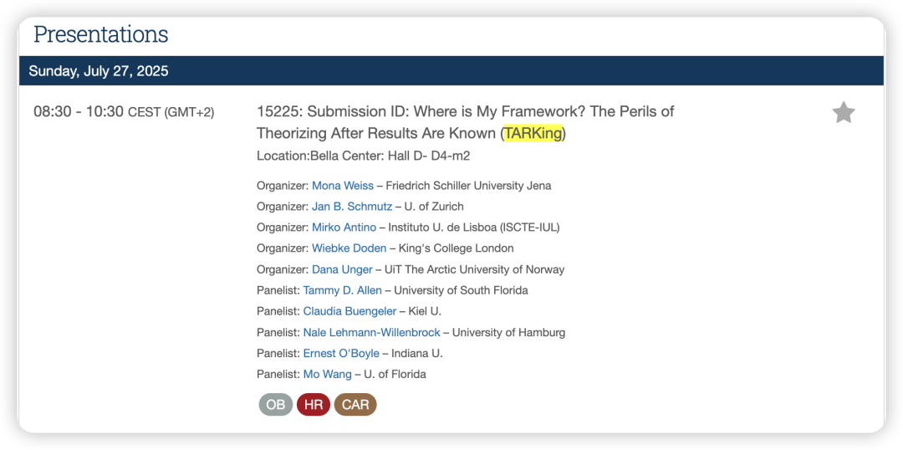
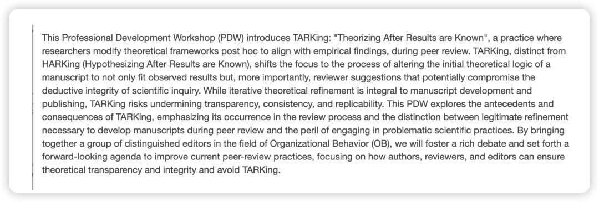
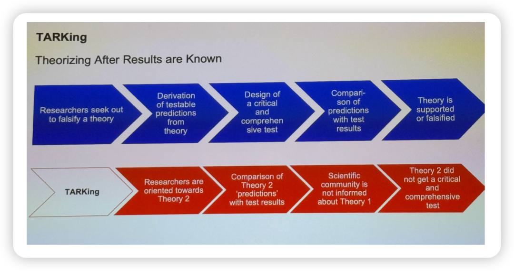
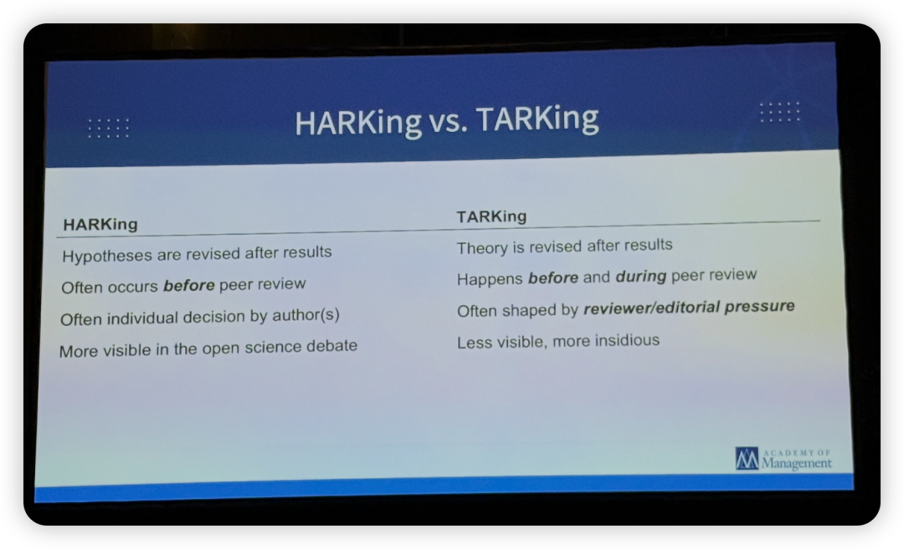
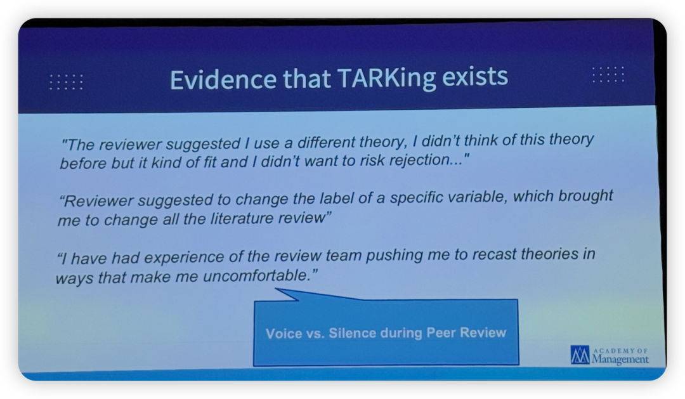
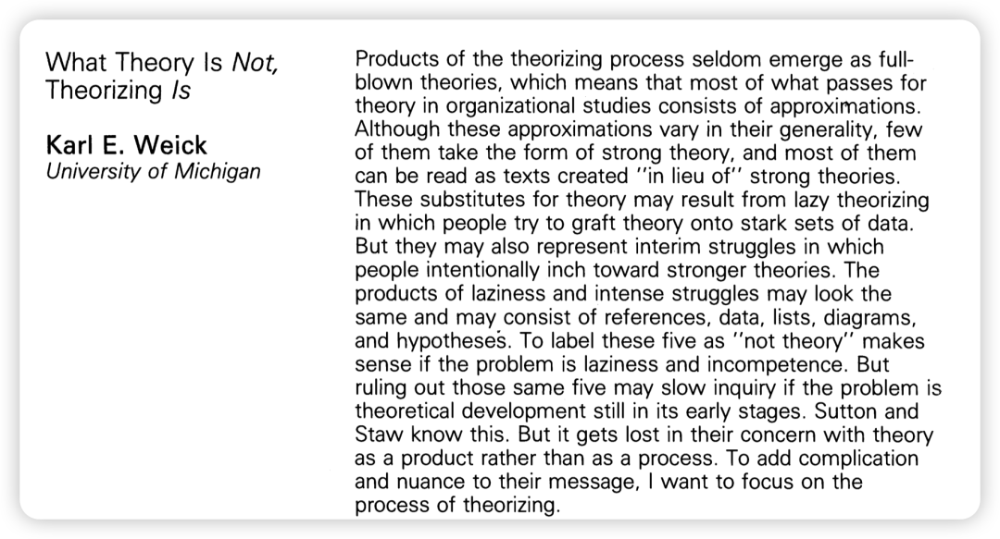
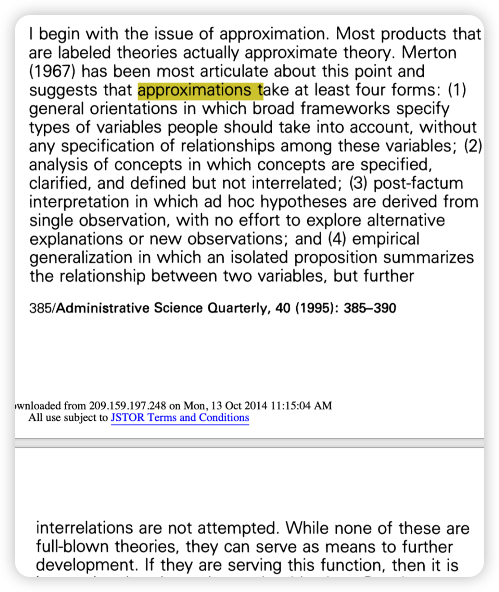

PDW简介翻译：

本次PDW介绍了“TARKing”这⼀概念，即“在已知结果之后进⾏理论建构”（Theorizing After Results are Known）。这种做法指的是，研究者在同⾏评审过程中，为了使理论框架与实证结果相契合，会在事后修改原有的理论逻辑。

TARKing 不同于 HARKing（在已知结果之后提出 假设，Hypothesizing After Results are Known），它更强调将理论逻辑调整为既符合实证结果，更重要的是迎合审稿⼈建议的过程——⽽这些建议有时可能会破坏科学研究中演绎推理的完整性。

虽然反复打磨理论框架是论⽂写作和发表过程中不可或缺的⼀部分，但TARKing 的做法可能会削弱研究的透明性、⼀致性和可重复性。本次⼯作坊将探讨 TARKing 的前因和后果，重点关注其在审稿过程中的发⽣，并厘清在同⾏评审中，哪些属于合理的理论精修，哪些则属于有害的科学⾏为。

HARKing⼀般发⽣在R&R的过程中：

PDW讨论的内容：

1. Tarking的底层原因还是“weak theories”，也就是在⼀开始theorizing的过程中就不够细致，这样才会被审稿⼈要求全盘换⼀个理论。（当然也存在就是遇到了⼀个狠⼼审稿 ⼈，根本不仔细看你的内容，就是觉得⾃⼰掌握了power想要实施⼀下🦹）

- 我想到这个可以参考Karl Weick 1995年在ASQ的⼀篇关于theory和theorizing的经典⽂章，也是属于OB⼈必读的⼀篇了。

这篇⽂章的核⼼内容是：我们不应该把“理论”（Theory）看作⼀个静态、完美、⾮⿊即⽩的最终产品，⽽应该更关注“理论化”（Theorizing）这个动态的、不完美的、持续进⾏的过程。

- Theory：是⼀个名词，⼀个“产品”，是⼀个理想化的⽬标。 在现实中，完美的、“完全成熟的”理论⾮常罕⻅。我们通常看到的都是它的近似品（approximations）。

- Theorizing：是⼀个动词，⼀个“过程”（process）， 它是⼀个“临时的挣扎”（interim struggle）。 这个过程是动态的、混乱的、充满试错的，是从模糊想法到清晰陈述的艰难旅程，包括抽象、概括、关联、选择、解释、综合和理想化 （The process of theorizing consists of activities like abstracting, generalizing, relating, selecting, explaining, synthesizing, and idealizing.）

我觉得从这篇⽂章的⻆度出发，之所以存在“weak theories”，是因为作者⽤的只是理论 的approximations，而没有进行艰难但重要的theorizing。

理论的approximations包括以下四种：

1/⼀般性导向（general orientations）：提供⼴泛的框架来识别相关变量，但不明确变量间的关系。

2/概念分析（analysis of concepts）：对概念进⾏界定、澄清和定义，但未将它们相互关联。

3/事后解释（post-factum interpretation）：从单⼀观察中推导出临时假设，不探索替代解释或新的观察。

4/经验概括（empirical generalization）：总结两个变量之间关系的孤⽴命题，但未进⼀步尝试相互关联/

其实并不是说这些approximations不⾏，⽽是需要进⼀步的发展、进⼀步的theorizing。 （⽽这⼀步到底怎么做，如何⽤可传播的语⾔进⾏表达，就是我之后要努⼒学习的！！）

2. TARKing也分成两种：

（1）Non-problematic HARKing：results出来之后并没有改变假设的逻辑，这种时候换⽤新的理论进⾏解释其实并没有问题。

建议在discussion中进⼀步澄清，可以说之前⽤的另⼀个理论同样可以解释部分这个现象，然后新⽤的这个理论更贴合目前的情境。总之就是be transparent

（2）Problematic HARKing： 结果和理论的⽅向不⼀致，这个时候如果是⾃⼰换了别的理论重新解释就存在问题了，很有可能会被拒稿。

3. ⼀定要搞清楚theory所属的领域（对应的high-level construct）：⽐如是属于 behavior/perception/attitude/motivation哪个更高维的构念。

4. 你永远可以找到⼀个理论可以来解释你的发现（*All roads lead to Rome*），但问题是，你的研究是否可以给这个理论来带来增益？

5. ⽬前management领域，对于什么是theory/什么是theorizing的培养还有待提⾼。（完全是这样！）
