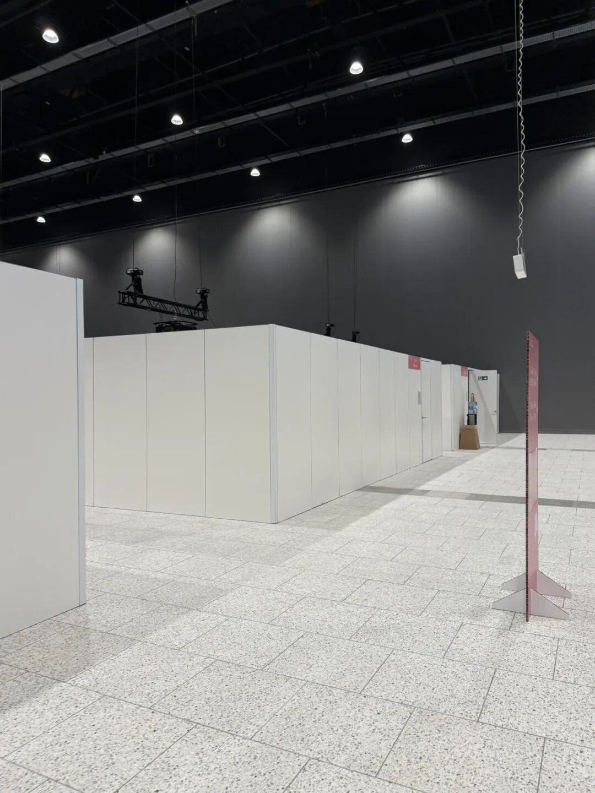

每次隔一段时间整理相册，总是发现一些要删不删的讲座ppt拍照💦

为了吸取之前的教训，这次 按照下面的方式进行整理，感觉很不错！

听talk的时候：

- 手机拍核心照片

- 电脑记笔记：使用能用markdown语法的笔记软件（如notion、obsidian；md语法可以在记录笔记结构的同时避免分心）；同时ppt上有的内容根本不需要记录，之后再次进行整理即可，当时就只要完全follow演讲者的逻辑即可。总之当时需要记录的是当时的逻辑、灵感、问题、学习到的东西。

- 检索：实时google检索演讲者的profile，更好地了解一下眼前的学者，给未来再看到ta发表的文章来建立一些链接

-如果音量足够，甚至可以录音，这样可以再次回听自己lost的点。（然后这次AOM到部分hall真的就所以临时搭建到样板房，没有天花板到那种，让人感觉像在万鱿鱼游戏....）

复盘的时候：

-图片整理：手机相册最大的问题是无法快速进行文件夹分类，这时候如果都是苹果设备可以直接airdrop到电脑，把不同场talk的内容分到不同的文件夹以供之后整理

-笔记整理：重新梳理笔记，把ppt上的内容整理到笔记中、然后就可以把原始ppt图片删除

-输出：发到公众号来让自己记忆更深刻一些，同时也是积善行德 共建peaceful and open-source community！
