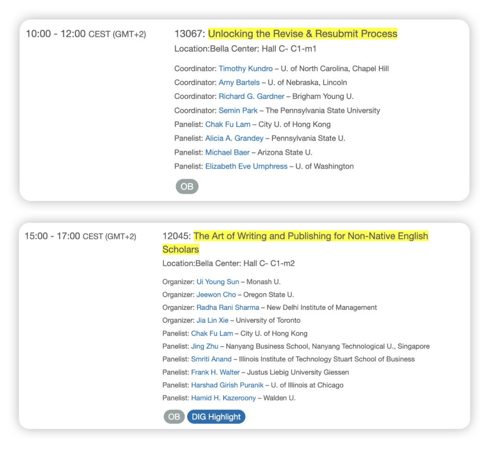

Writing：

- Non-native speaker可以read anything in english (new/novel/movie) to get the feeling of language; 当然最好还是和native speaker合作或者最后找copy editor，并要耐心花时间看文档中的每一处修订（而不是一键点击接受）

- 使用最简单的英文词汇即可 不用天花乱坠 （GPT就会经常用fancy words）- "Rejects the assumption that scholarly writing should be esoteric. Our ideas are complex, but our writing should be clear."

- Clarity is important

- 1>5 Principle: Great papers are often amazingly simple papers. They have one message, not five

AE如何挑选reviewers：

- Keywords

- Who you cite in the first 2-3 pages

- Editorial Board Members (theory/methods)

- Other experts who are well known

R&R Process：

- R&R is a intellectual conversation : 如果对于R&R有疑问，有些期刊可以直接和AE交流（比如AMR）；但有的期刊不行，但这种情况也可以通过提供多个修改版本来解决 ("- If unsure, provide options")

- 总之R&R是一个“power play”，有些人会把reviewing process当成一个gain power的过程，这种时候你更需要去体现你的工作量 - "a very dark fact"

- 论文的big picture很重要，不要因为R&R而让你原本的big picture支离破碎 - "Don't write an entirely new manuscript"

- 除了response letter，还可以再提供一个excel sheet：比如记录Reviewer's point + 你的修改计划 + Original version + Improved version/你在论文中的哪个部分体现了这些变化 （e.g., footnotes; supplementals）

- Don't explain why you did it the original way and/or why they are wrong

- Don't apologize & thank the reviewer for every point; be genuine

Friendly Review:

- 可以找一些好人们进行friendly review！

- Key questions for friendly (but not so friendly) reviewers:

1. What's the most intriguing aspects of the paper?

2. Give me 3 reasons that you would reject the paper?

3. If I needed to cut 40% of the paper, what should I leave out?

Some readings:

- 《How to Write a lot》

- 《Bird by Bird》

- 《On Writing Well》

- Grant, A. M., & Pollock, T. G. (2011). Publishing in AMJ—Part 3: Setting the hook. AMJ

- Sutton, R. I., & Staw, B. M. (1995). What theory is not. ASQ

- Weick, K. E. (1989). Theory construction as disciplined imagination. AMR
