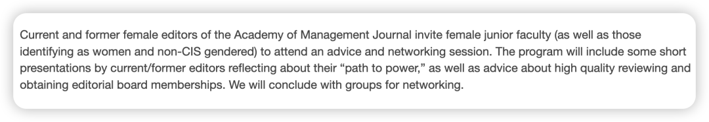

这场只听了最后几分钟，下面的内容是师妹们记录的前半部分AMJ即将上任的主编Quinetta 分享的female life story，非常值得女性们学习：

- 作为一个黑人女性，她一路上遇到了很多gender problem，也换了一些工作地点。所以她说一定要找一个地方能够“know your value” - 之后我会分享我的好朋友Ke写的商科phd申请经验贴，从他的整个申请阶段就可以感受出 ：最Top的地方未必是适合你的地方；能够知道你价值的地方就是最棒的！

- 遇到过很多tipping points - 但不管怎么样就have a try！不要给自己设限！ -  expand your toolbox；做一个 “well-rounded burger”

- 学会拒绝： If you are not saying NO, that is soft YES.

并且，当你拒绝的时候，而并不需要解释过多原因。

女性总是因为怕尴尬而解释太多，但我们要学会 just say：NO.

No Means No.
