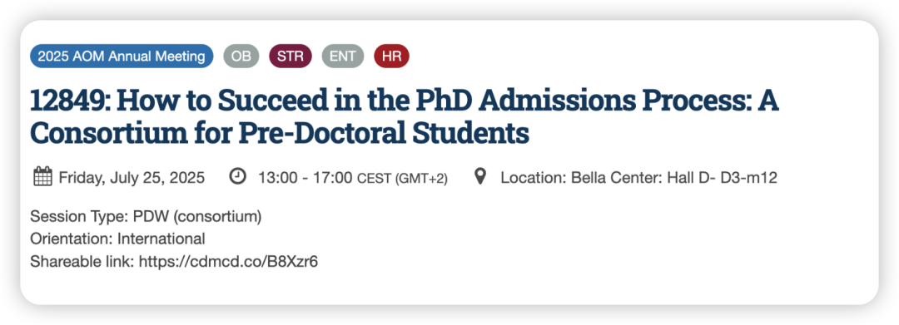
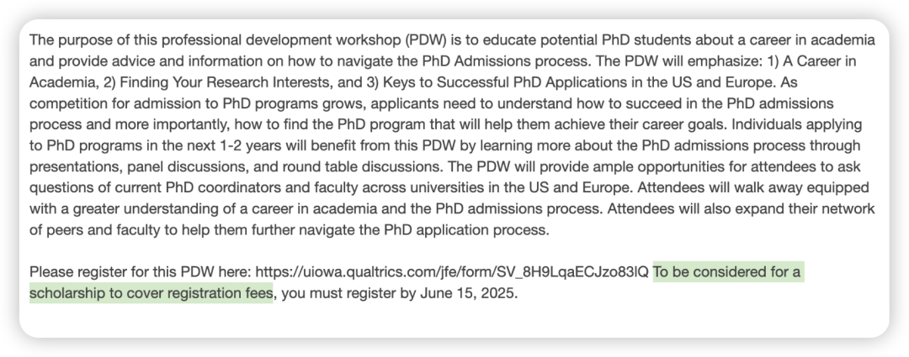

AOM第一天还听了一个Iowa主办的Phd申请PDW，真的是个宝藏活动！

不仅可以和同阶段的申请人交流，还能直接和senior facutly member直接对话，询问他们的招生标准并询问申请意见（高强度口语对话2小时）；

甚至这个PDW还有scholarship可以申请，我就填了一下问卷写了个人简介就申请上了，给的💰可以把AOM会议申请费全都cover！

这个活动每年都有，强烈推荐！！

在此分享部分笔记给同样要申请的朋友们:

如何挑选PHD program？

- 每个department有不同的招生/研究偏好（甚至有的时候每年偏好都不同，比如有些OB系可能最近当年更想招收有social psy背景的学生），要了解这个可以通过邮件询问系里的doctoral student - “this is always under-explored resource”

- 思考你的存在是否可以给这个系里add value - 从买方视角考虑

- people who you’ll surround with 很重要！

文书

- 更关注内容而不是格式，清晰地呈现你在每个项目中做的事情  - content is more important ; do not spend too much time on your CV ; 2-page is enough

- 在申请PHD阶段research interest写的too narrow不是一件好事 (even a red flag), 会觉得你对于领域中剩下的90%是不了解的

How to reach out?

如果要联系老师，只是发CV+询问招生很不好；

可以说看了ta的某某文章，非常appreciate其中的哪些部分，而自己的研究how to relate to these aspects，最后询问一下是否有some minutes for a conversation。
