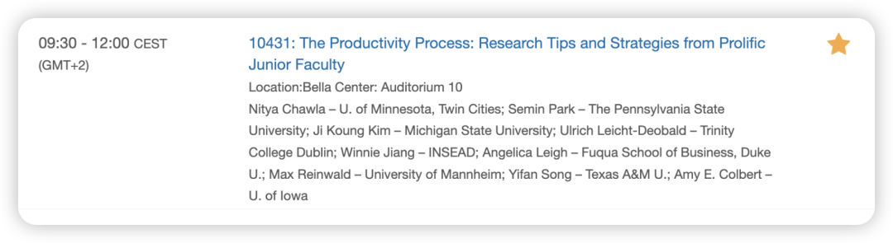

今天上午听了一个很适合分享的PDW，里面有我今年迄今为止读过的最喜欢的文章的作者winnie老师！

在此分把部分内容整理如下（1. 请谅解一下中英夹杂，懒得完全把笔记翻译成中文了… 相信这篇推送的受众肯定可以看懂这里面常用的英文表达！2.老师A/B/C仅仅用来区分不同老师的观点，和姓名无关）

### Concentration

- 老师B： 区分科研工作的脑力水平like deep work/mid-level deep work/light work - 之后可以根据自己不同的状态进行任务安排
- 老师B&C： 一开始用5/10/25分钟来激活你自己，之后慢慢进入flow state

- Reading不用太多concentration，只要follow author’s logic and story ——
- 所以她在不写作的时候就会进行reading (或者回邮件）
- 也可以做writing codes这种不用很多creativity的工作 —— 可以让人快速进入concentration状态

### 

### Reading and Writing

- 老师A：其实看了5-6 core papers就可以开始写作了，然后边写边再次进行literature review，writing is thinking
- 老师B：她有两种阅读模式：

- exploratory reading - 作用是confirm whether your idea is deserved studying
- 之后进行explicit reading: 作用是find evidence to support your arguments

- 老师C：写作之前可以先bullet out the important points
- 老师B写作的习惯：写作的时候会在一半结束，这样可以让第二天重新启动的时候更快。（记得李连江老师也有同样的观点：什么时候结束当日写作更合适？ 直到下一次打开的时候要写什么的时候最合适。）
- 老师D：一位老师推荐可以看《how to write a lot》这本书，有一些写作习惯可以学习

### 

### 区分Productive or Busy?

- 设置daily goal and monthly goal - concrete goals - 这就是给自己设置milestones，并且要多进行celebrations！
- 可以定期check your goals with others (like advisors)  —— 确保你正走在正轨上；同时确保你没有overwhelm yourself！
