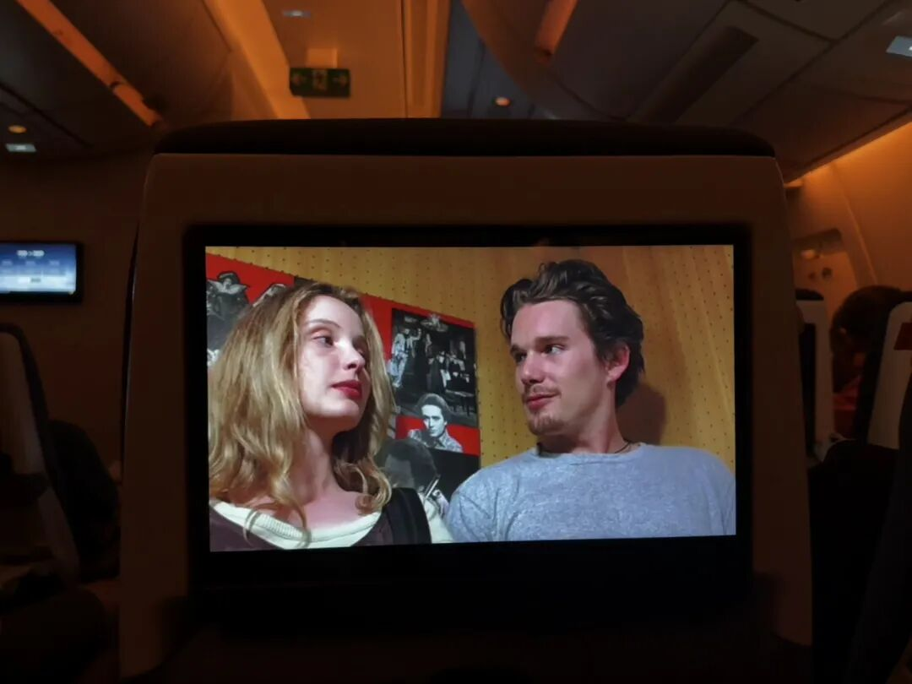
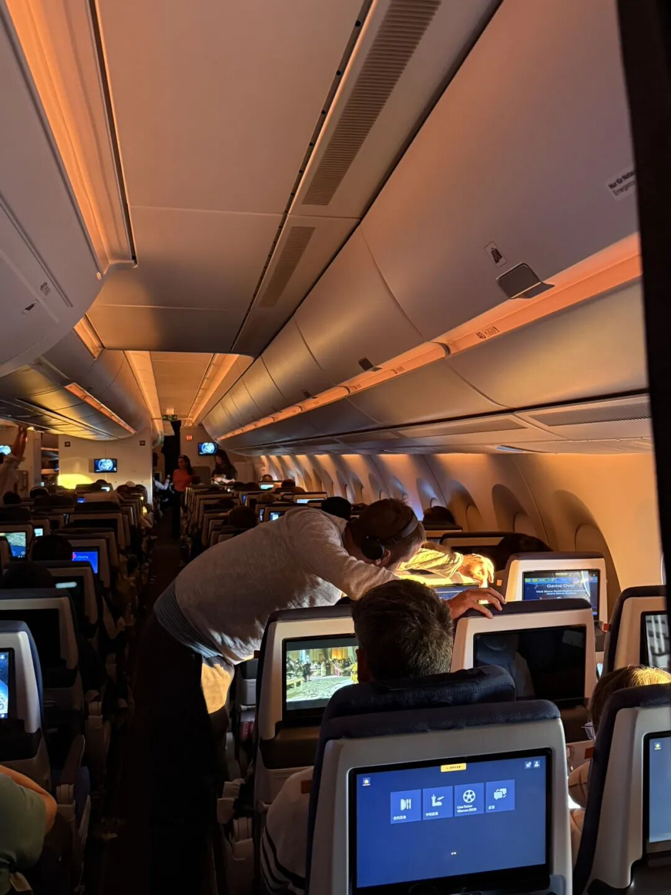
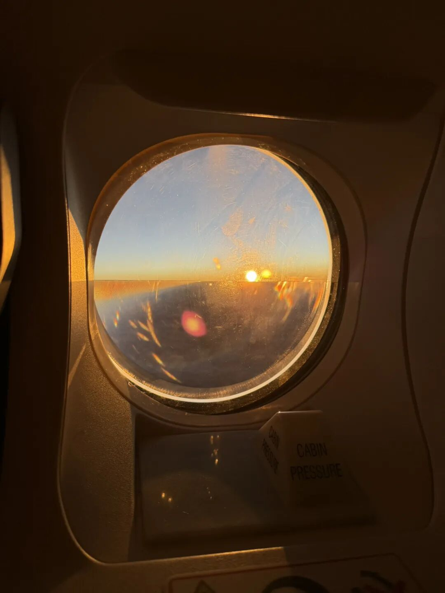
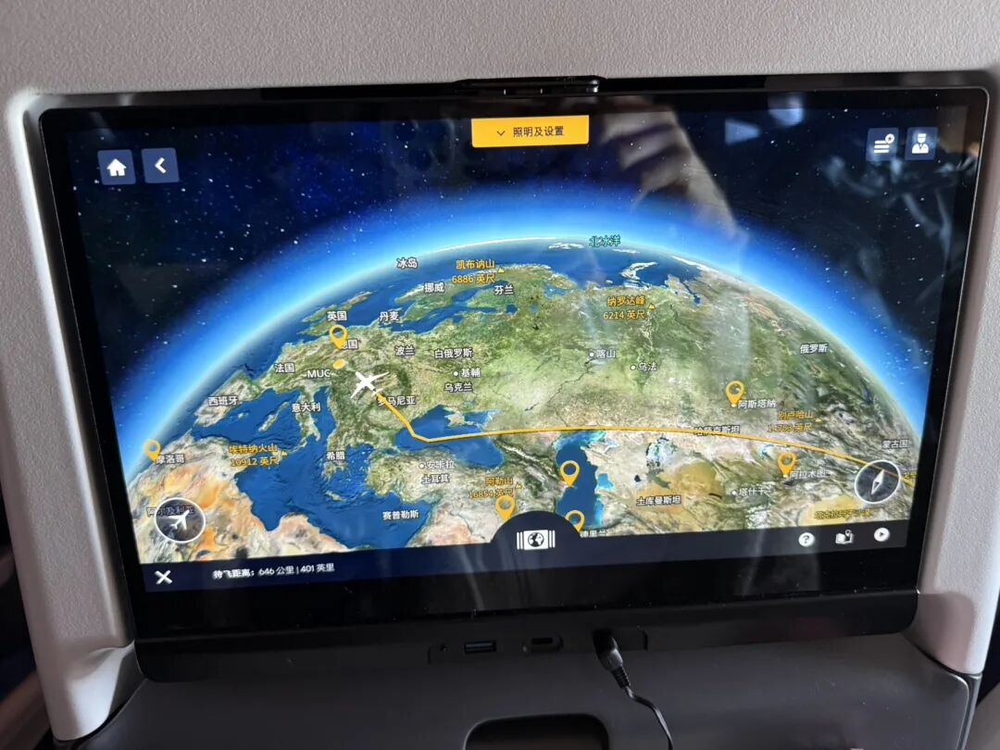
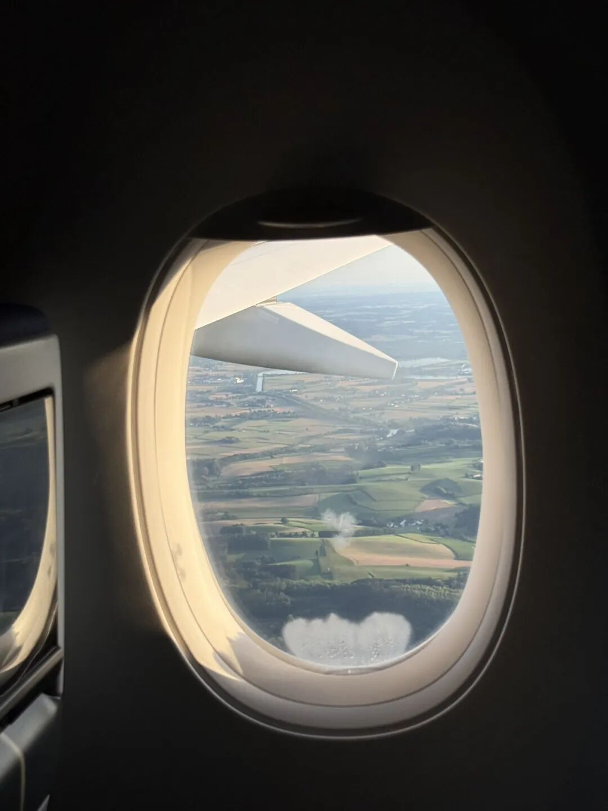

在 13 个小时的漫长航行中闲来无事，来瞎输出一些，写一下上周为 AOM 准备的一些事情：

1、购买AOM 官方交通优惠 Travel Pass：去会议官网上可以找到相关链接；买这个比自己坐公共交通便宜很多哟

目前的链接：https://prd1travelpassmvc.azurewebsites.net/Home/Information?eventid=9afa0e57-da54-4b31-89c5-6c8b81c3e800

2、因为今年要准备PhD 申请，所以上周疯狂看学校 faculty directory中感兴趣的教授，然后再去 AOM program 搜索 ta 们的名字把有他们的 session 添加进行程（结果就是，全都是重叠在一起的！）

3、下载长途飞机书影音播客

4、购物：主要是飞机上的陪伴好物，比如：

-蒸汽眼罩（感觉每隔一段时间就会睡一下，所以可能一次长途都要用掉五六片）

-膏药！这次我带上了婷姐在北京寄来的膏药，腰里贴一个、脖子贴一个，就完全不酸痛了呢

-小玉子给我带了小腿压力袜，穿着真舒服！小腿仿佛飞上了天！

-飞机上冷如冰柜！不想裹两三层毯子就要可以穿厚的外套（后悔没把我的冲锋衣直接穿在身上了；头也好冷🥶感觉下次应该带个毛线帽戴着 真是年纪大了）

-我还带了泡面和玉米，怕自己饿死在北欧了...

-长途航班座位前pad 里面的电影还挺丰富，一般只能用空乘发的廉价耳机插孔听声音。想到我的头戴降噪耳机也能插孔听音频，也许下次就可以带上它和线了！这样又能听声音更清晰还能降噪！

5、检查航司行李额度和要求，检查充电宝是否有3c标识；还可以提前去航司官网预订座位（长途飞机必须选靠走道哇！因为我每隔一段时间就要起来散步和在飞机交接处进行奇怪的拉伸运动…）

继续发呆放空喽！

期待 8 小时后打开世界的新地图😍

（如果大家还有什么行前准备和旅行好物也欢迎留言补充！）

update 已到达德国转机！

汉莎航空真不错 全程都可以连免费wifi 发信息！

开心！！
