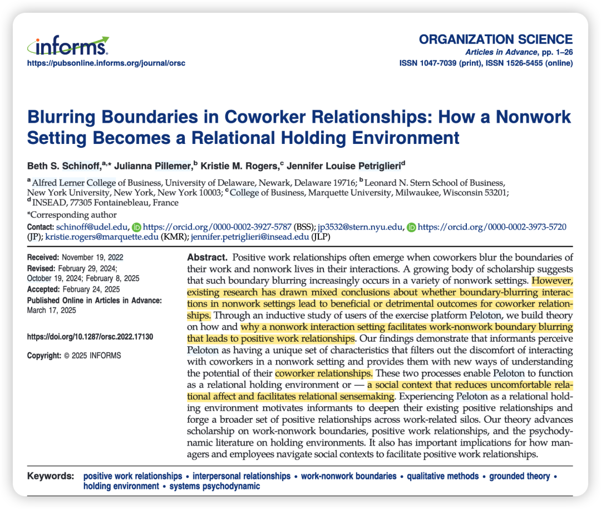
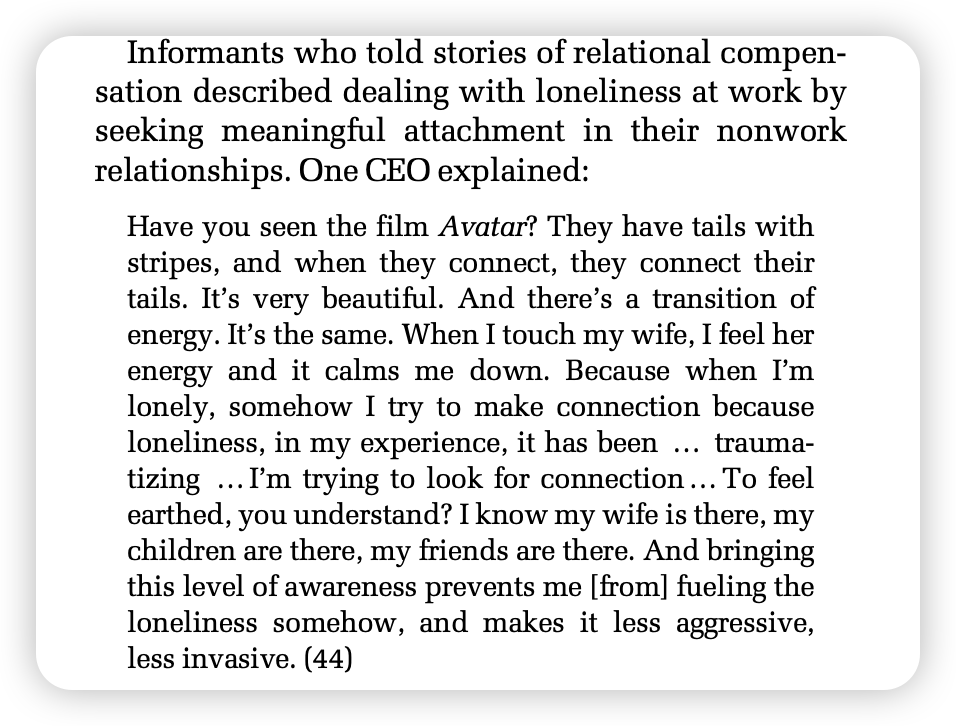
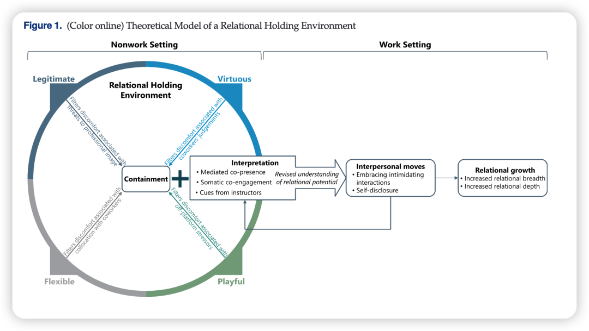

***Reference：***Schinoff, B. S., Pillemer, J., Rogers, K. M., & Petriglieri, J. L. (2025). Blurring Boundaries in Coworker Relationships: How a Nonwork Setting Becomes a Relational Holding Environment. *Organization Science*, orsc.2022.17130. https://doi.org/10.1287/orsc.2022.17130

### 写在前面：

从今年开始，逐渐感觉未来会想尝试质性研究，因为比如用mturk等平台收一些不知道对面为何物的数据，质性好像是能更距离地接触感兴趣的人群、了解他们真实想法的过程。简直是如此爱听播客的我最适配的研究方法！

最近也非常幸运地开启了一些质性项目，这个过程实在是享受！不仅可以自己亲自感受研究的情境，还能通过播客、公众号等平台中的文字音频来构建对于这个现象的广泛了解（于是听播客都合理地成为了研究的一部分），每周还能一起讨论进行思维碰撞来产生一些可以深挖的领域，真是INFJ非常享受的deep talk时刻！

同时也会意识到，做质性非常考验功底：访谈的功底、写作的功底…

比如这篇OS文章就提炼出了**关系涵容环境（Relational Holding Environment）**这个主题，而这其实是精神分析中的概念。

再比如这篇OS文章的作者之一Jennifer在AMJ上最新的一篇关于工作孤独感的研究有一段非常美的quotes：

So让我们一起开启这篇美妙质性研究的阅读吧！

### **背景简介：**

访谈了使用**健身平台 Peloton**与同事互动的员工，作者深入探讨了一个非工作场景（如线上健身）是如何通过特定的机制，促进同事之间建立积极、深入的工作关系的。

### Research Motivation

**1、过往研究存在矛盾：**一些研究表明，在非工作场景互动是**有益的**。例如，一起做运动能提升团队能量，一起做志愿服务能增进认同感；另一方面，大量研究也显示这种互动是**有害的或尴尬的**。例如，公司派对可能让人不舒服，在个人社交媒体上与同事互动可能会损害职业形象。

然而，**到底是什么因素决定了非工作场景的互动是促进关系还是破坏关系？**过去的研究没有回答清楚这个“为什么”，缺乏统一的解释机制。这使得员工不知道如何处理这类关系，管理者也不知道该如何设计有效的团队活动。

**2、忽视了对“场景”本身的主观体验：** 传统研究倾向于关注互动的类型（如聚餐、社交媒体），而较少关注员工对这个互动场景的主观感知和体验是如何塑造互动结果的。本文认为，场景的客观属性不重要，重要的是员工如何去“感受”和“诠释”这个场景。

### **方法概述：**

采用扎根理论进行归纳式研究，采访了68位来自不同行业、在工作中使用健身平台 Peloton 与同事进行联系的专业人士。主要数据来自半结构化访谈，同时辅以 Peloton 课程的文字记录、媒体文章等档案数据进行三角验证。

整个研究过程包含4个阶段：

**第一阶段：探索与聚焦**

**方便抽样法。**研究团队从自己的熟人网络中找到了 12 位 Peloton 用户进行初步访谈。最初的访谈问题很宽泛，只问用户与 Peloton 组织的关系。但研究者意外地发现，几乎一半的受访者都主动地、大量地谈论了通过 Peloton 与同事互动并改变了他们关系的经历。

—— 这个意外的发现让研究者意识到“同事关系”是本研究真正的核心。于是，他们立即调整了研究问题，将其聚焦于同事互动，并修订了访谈提纲，为下一阶段做准备。

**第二阶段：深入与编码**

**目的抽样法。**研究者通过职场社交平台 LinkedIn 招募了 29 位受访者。正式启动开放式编码 (Open-coding)。两位研究者独立编码，并与第三位（非 Peloton 用户）研究者定期讨论，以挑战和检验编码结果，保证客观性；使用质性分析软件 Dedoose 进行数据管理。

**第三阶段：理论饱和**

精准抽样。此时，研究者不再是随机或宽泛地找人，而是有目的地寻找那些最有可能为他们新兴理论提供信息的样本。他们加入了 Peloton 用户的 Facebook 职业群组，精准地招募了 27 位新受访者。

**第四阶段：理论提炼与整合**

将已有发现与更高层次的理论进行对话，完成理论模型的构建。研究者将他们从数据中提炼出的核心机制——“过滤不适感”和“提供新的关系视角”——与心理动力学中的经典理论“涵容环境” (Holding Environment)进行了创造性的连接。

### **结果概述：**

### ****

一个非工作场景能否成为“关系性涵容环境”，并不取决于活动本身，而在于员工对这个场景的**主观感知**。当员工认为这个场景具备以下四个特征时，它就能发挥作用：

1、正当性（Legitimate）：参与其中是受鼓励的、合乎情理的。

2、价值性 (Virtuous)：活动本身被视为积极、健康、有益的。

**3、灵活性 (Flexible)：参与方式和时间没有强制性，让人感到自由。**

**4、趣味性 (Playful)：过程轻松、有趣，能让人从严肃的日常中解脱。**

这个环境通过两个核心机制运作：

- **涵容 (Containment):**过滤掉互动中的风险和不适感（如对职业形象的担忧、被评判的恐惧、社交压力等）。

- **诠释 (Interpretation):**提供全新的互动体验（如身体的共同在场）和意义线索（如教练的鼓励话语），让员工重新理解和看待与同事建立深度关系的可能性。

这样的环境，会促使员工采取更积极的人际行动（比如自我揭露），从而实现工作关系的**广度**和**深度**的共同成长。

### 

### 研究贡献：

**1、对“工作-非工作边界”研究的贡献：**

它超越了简单描述现象的层面，提供了“关系性涵容环境”这一关键机制，厘清了过往分歧； 指出决定互动成败的不是场景的客观属性，而是人们的主观体验和解读。

2、对“积极工作关系”研究的贡献：

证明了高质量的工作关系可以在**非工作、虚拟化、甚至没有任务交集**的场景中被催化和建立，挑战了关系主要在工作流程中形成的传统观点。

### 

### 对管理者的启示：

**1、从关注“活动内容”转向“营造体验”：**在设计团队建设活动时，不要只想着“搞个团建”，而应思考如何让这个活动被员工感知为**正当的、有价值的、灵活的、有趣的**。

2、重视“身体性”的连接力量：研究表明，即使是线上互动，让员工有机会以相似的方式**动用身体**，也是一种强大的连接方式；管理者可以创造一些简单的机会，如鼓励午间散步，帮助员工从“头脑”回归到“身体”，这有助于建立更深层次的连接。

### Notes：

**论文全文PDF：可以直接在我共享的notion page下载：**

https://bwjzju.notion.site/403807357fa94acfb304294ba4a49ecd

这篇文章最后还有不同阶段的访谈提供哦！非常值得参考！
