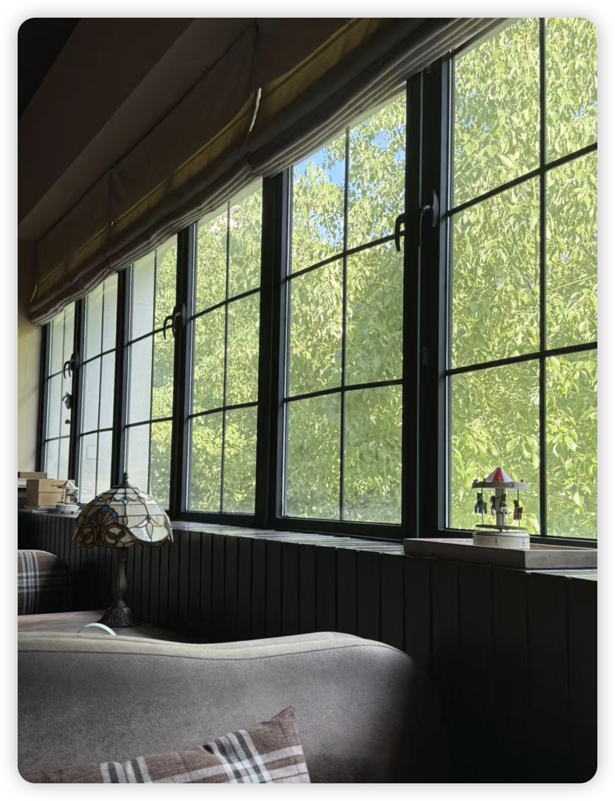
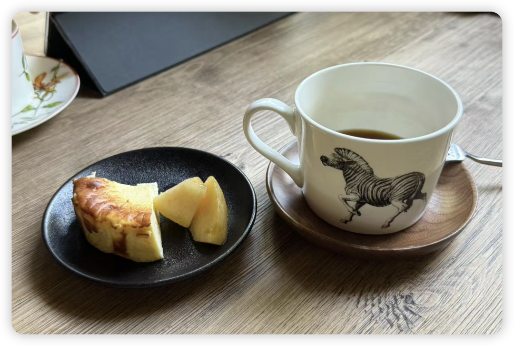

前几天隐居太久，每天就是看看文献、改改论文、做饭、运动，生活实在是有些寡淡了。

于是突发奇想准备开始杭州咖啡店探店。

坐在咖啡店里，又突发奇想，准备把我的滴答清单上收集的一些想读的好文章、一闪而过的科研想法、小红书的收藏夹、linkedin的收藏夹、微博的收藏夹进行一番整理。

相信大家一定深有同感：点收藏的速度一定大于你看收藏夹的速度！

于是想到，也许每周三下午就是一个哄自己整理收藏夹的好时间！周一周二工作了两天有点腻，也是时候该看点新东西激活一下大脑，整理整理那些积灰的内容，在不同的领域来碰撞一下大脑，然后周四周五又能开心工作了～

（如此会哄自己的科研牛马 导师看了要感动晕）

于是愉快地把周三下午定为我的收藏夹清理日！
