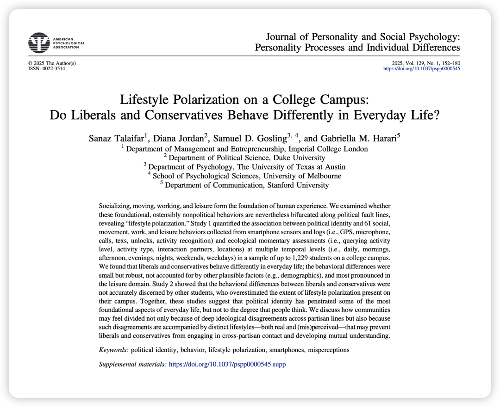
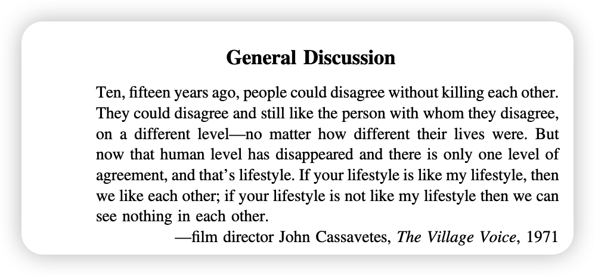
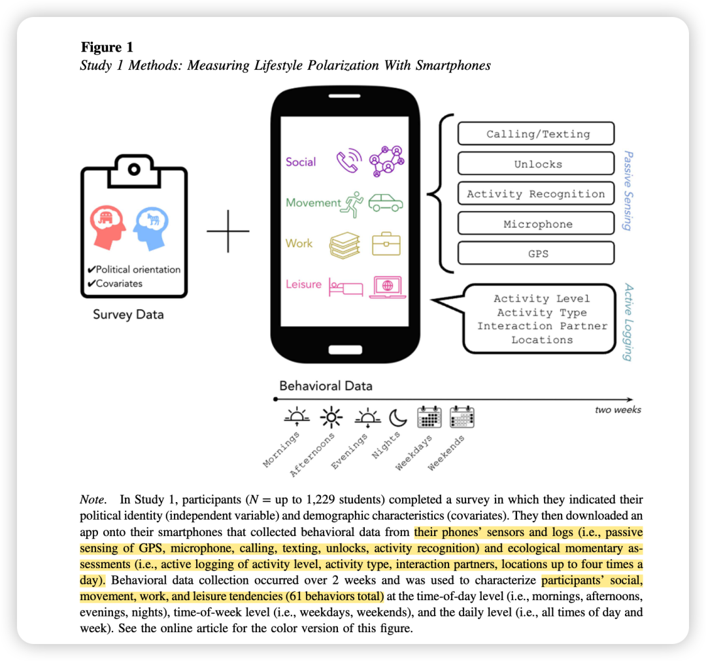
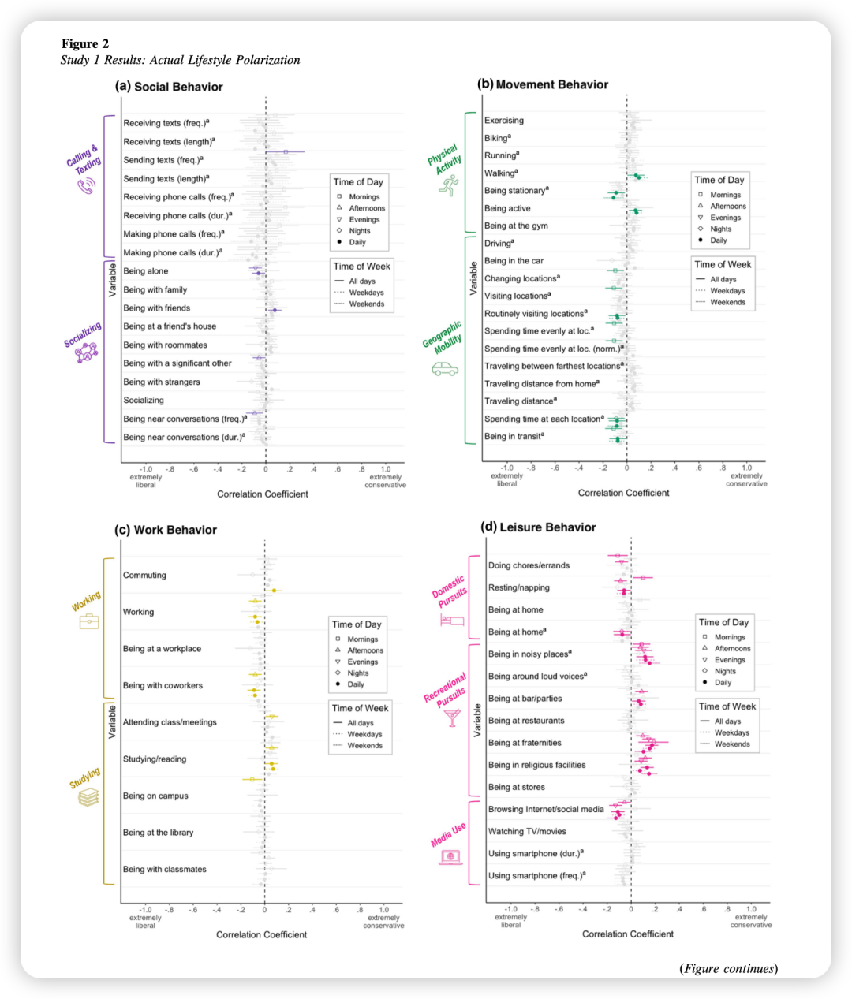

***Reference：***

***Talaifar, S., Jordan, D., Gosling, S. D., & Harari, G. M. (2025). Lifestyle polarization on a college campus: Do liberals and conservatives behave differently in everyday life?****Journal of Personality and Social Psychology, 129*(1), 152–180. https://doi.org/10.1037/pspp0000545

### 

### **写在前面：**

OB的文章读多了，再读social psy的文章，有一种“如听仙乐耳暂明”的感觉。感觉social psy的学者才配称为心理学领域里的吟游诗人，是那种漫步在生活中都可以捕捉到有趣的现象、又能用多样有趣的范式进行探索的人。希望未来有一天我也能在OB的研究中体现出social psy的美～

So 让我们一起来看这篇很美的文章！

### Research  Motivation：

政治极化是当今美国乃至世界许多国家面临的严峻问题。通常认为极化体现在意识形态（政策观点不同）和情感极化（互相厌恶）上。

但这篇文章认为，极化的影响可能更深远，已经渗透到人们最基础的**日常生活行为**中。例如，*“喝拿铁的自由派”*和*“开皮卡的保守派”*这类刻板印象就暗示了生活方式的差异。

**为什么研究日常生活中的政治极化是重要的？**

作者认为，如果自由派和保守派连日常去哪里、做什么、什么时间做都不同，他们就很难产生交集，无法建立共同的联系和理解。这会从根本上侵蚀社会凝聚力。

就像文章在discussion开头引用的导演John Cassavetes的话：“如果你的生活方式和我的不一样，那我们就没什么好谈的了。”

除了探究真实行为，作者还想知道，**学生们自己认为在不同政治倾向中这种生活方式的差异有多大？**他们的“感知”与“真实”情况是否一致？是否存在误判或夸大？

研究这一点的重要性在于，即使实际差异不大，**“感觉上的隔阂”本身就是一种强大的社会隔离力量**，它会阻碍跨党派交流，甚至加剧对立。

### 

### **方法概述：**

**研究一: 测量真实行为**

总共考察了61项日常行为，涵盖四大领域：社交、活动、工作、休闲，采用了两个来源的数据。

**来源1:手机数据收集**

研究者通过参与者手机上的App，连续两周收集了大量的客观行为数据，包括：

- GPS： 行动轨迹、活动范围、去过的地点数量。

- 麦克风： （不录音，只做音频特征分析）周围是否有谈话声、环境噪音水平。

- 通话/短信记录： 通话频率、时长、短信数量、长度。

- 活动识别API： 手机能自动识别用户是在步行、跑步、骑车还是静止。

- 手机解锁记录： 手机使用频率和时长。

**来源2: 生态瞬时评估 (Ecological Momentary Assessment, EMA)**

手机每天多次（4次）推送简短问卷，询问参与者在过去15分钟或1小时内正在做什么（如学习、休息、社交）、和谁在一起、在什么地方等。

**研究二: 测量感知行为**

研究者让另一批同校学生对研究一中的61项行为进行评价，让被试在-1（自由派更常做）到+1（保守派更常做）的量表上，评价他们认为哪一类学生更可能从事该行为。

之后将研究二的“感知”数据与研究一的“真实”数据进行对比，分析其准确度和偏差类型（高估、低估、方向错误）。

### **结果概述：**

**研究一：真实行为上存在小而稳健的差异**

- 自由派和保守派在日常行为上确实存在差异。在61项行为中，有18项（约30%）与政治倾向显著相关。

- 这种差异虽然统计上显著，但效应量较小。

- 差异在不同领域分布不均，在“休闲行为”领域最为明显（见上图中的d），而在“社交行为”上则不显著。

- 保守派更倾向于： 参加兄弟会/姐妹会活动、去酒吧/派对、待在更嘈杂的环境中、去宗教场所。——作者认为，保守派更倾向于“本地利用”（Exploitation）。

- 自由派更倾向于： 做家务/跑腿、浏览互联网/社交媒体、花更多时间在家（GPS数据显示）。——作者认为，自由派更倾向于“外部探索”（Exploration）。
- 差异还体现在时间维度上。在工作日、早晨和下午，双方行为差异更明显，这进一步减少了他们偶然相遇的机会。

**研究二：普遍不准，且严重高估**

- 学生们对这些差异的判断大部分是错误的（76%的行为判断错误）。最主要的错误是高估差异，即在双方行为一致的方面，他们放大了差异。

- 唯一的例外是在“休闲”领域，由于真实差异最大，学生们的感知也相对最准确。这说明，当行为差异足够明显时，人们是可以观察到的。

### **贡献点：**

1、证实了生活方式极化的存在： 政治分歧确实已经“溢出”到非政治的日常生活中，即使是在一个相对同质的校园环境里。

2、揭示了“感知”与“现实”的鸿沟： 这可能是本文最重要的发现。社会分裂感不仅源于真实的意识形态和行为差异，更源于人们对这些差异的夸大想象。这种误解本身就是一种强大的社会隔离力量。

3、提供了新的干预思路： 既然人们高估了差异，那么纠正这种错误认知就可能成为一种有效的去极化策略。比如，通过展示自由派和保守派在日常生活中的大量共同点，可以增进双方的理解和认同感。
