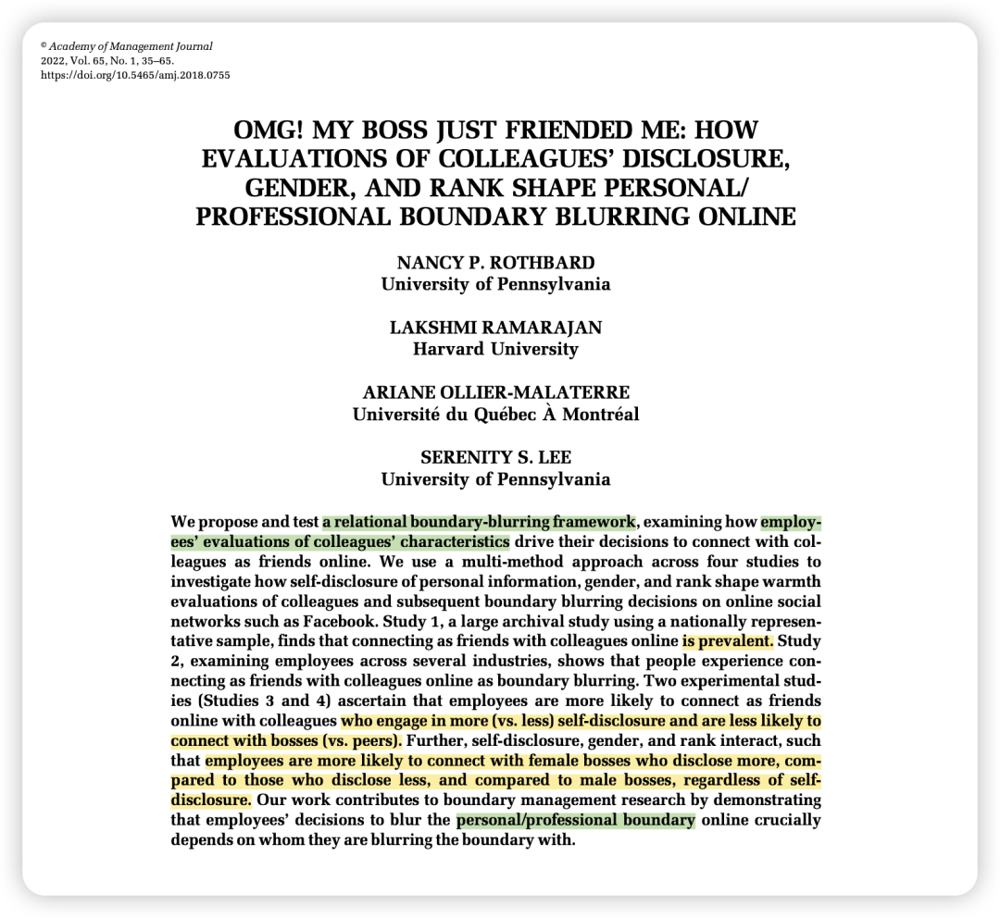
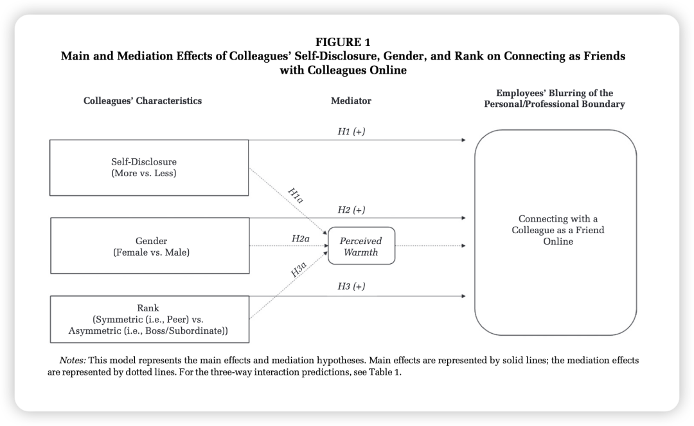
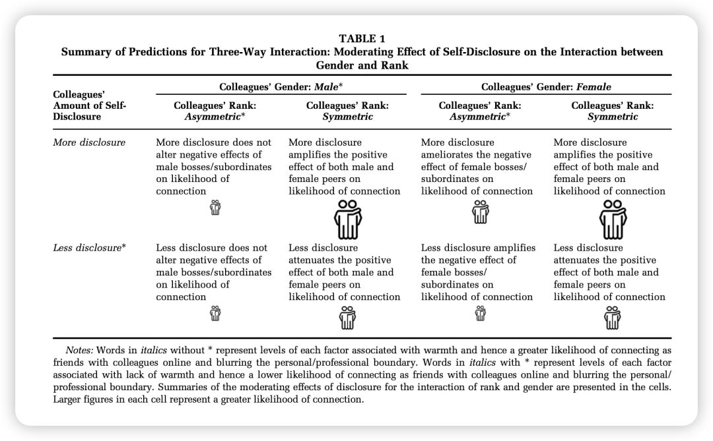
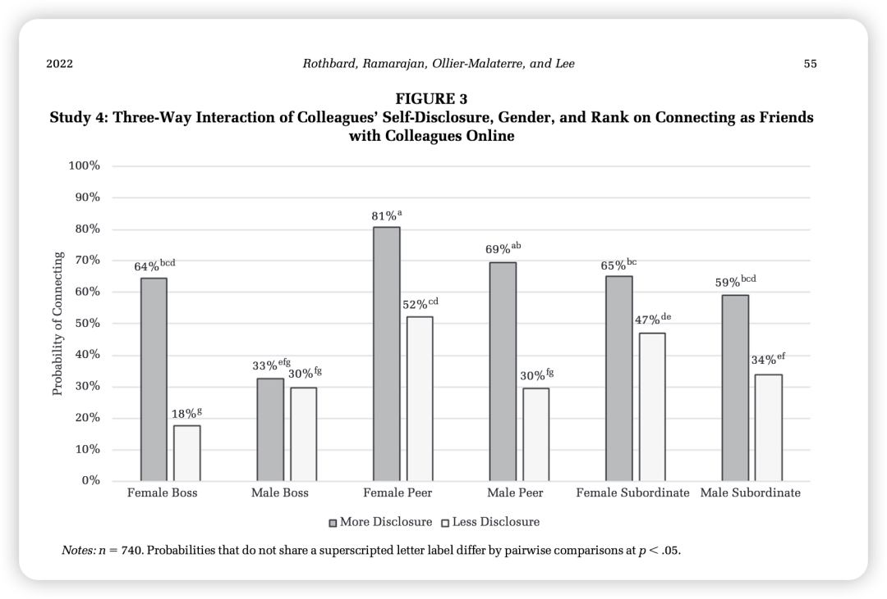

***Reference：***

Rothbard, N. P., Ramarajan, L., Ollier-Malaterre, A., & Lee, S. S. (2022). OMG! My Boss Just Friended Me: How Evaluations of Colleagues’ Disclosure, Gender, and Rank Shape Personal/Professional Boundary Blurring Online. *Academy of Management Journal*, *65*(1), 35–65. https://doi.org/10.5465/amj.2018.0755

### 

### 研究动机：

**从现实中看：**

随着世界越来越“网络化”，Facebook、Instagram等社交网络（OSNs）已经渗透到个人和职业生活的方方面面。这给员工带来了新的困境：当收到同事或老板的好友请求时，该不该接受？

——接受请求意味着同事可以看到你大量的个人生活信息，这可能带来职业风险（比如担心老板监视、留下不专业印象等）。而拒绝又可能显得不友好，破坏关系。

**而从边界管理的literature中看：**

这种在社交网络上与同事建立联系的行为，是“个人/职业边界模糊”的一种全新且极端的表现形式。它比线下的互动（如同事聚餐）更可见、更持久、更明确。因此，研究员工如何做出这种决策，对于理解现代职场中的边界管理至关重要。

**过于的literature主要存在以下两点不足：**

***缺陷一：只关注“focal employee”，忽视了“relational partner”。***

过去的研究主要关注员工*自己*的偏好和策略（比如，有些人喜欢把工作和生活完全分开，是“分割者”；有些人喜欢融合，是“整合者”）。

但这种研究忽略了一个关键问题：**员工的边界决策并不是孤立的，而是取决于他们要和谁建立关系。** 员工可能会愿意和A同事成为好友，但绝不愿意和B老板成为好友。因此，过去的研究没有回答“与谁（with whom）模糊边界”这个问题。

***缺陷二：将“工作领域”视为一个整体，内部不做区分。***

过去的研究倾向于把“工作”和“家庭”视为两个大的、内部同质化的领域。

但实际上，“工作领域”内部的关系是复杂多样的，比如有老板、下属、平级同事，有男性同事、女性同事。与不同的人建立联系，其风险和收益是完全不同的。

**本文的研究正是为了解决这两个缺陷，将研究焦点从“focal employee”转向“characteristics of relational partner”，并深入探讨工作领域内部不同关系如何影响边界决策。**

### 

### 理论概述：

作者主要是用了社会认知（Social Cognition）和他人感知（Person Perception）理论，该理论指出，人们在形成人际关系时，主要通过两个维度来评估他人：温暖（Warmth）和能力（Competence）。

温暖维度在本研究的情境中尤为重要，因为它关乎对方的意图是否友善（Benevolent Intent）：**在决定是否要冒着风险模糊个人/职业边界时，判断对方是否“温暖”、是否值得信赖，是首要考虑。**

如果感觉对方很“温暖”，员工就会觉得风险较低。因此，作者用“温暖”作为核心中介机制，将三个自变量（自我表露、性别、职级）与因变量（是否连接为好友）联系起来。

**具体逻辑如下：**

-自我表露 (Self-Disclosure): 一个更愿意分享个人生活（比如爱好、家庭）的同事，会被认为更“人性化”、更亲切，从而被感知为更温暖。

-性别 (Gender): 根据社会角色理论，女性通常被与关怀、友善等特质联系在一起，因此在刻板印象中被认为比男性更温暖。

-职级 (Rank): 与平级同事（对称关系）的互动被认为更平等、更少工具性，因此平级同事被认为比老板或下属（非对称关系）更温暖。老板和下属的关系则可能被解读为带有功利目的（老板想监视，下属想巴结）。

而除了以上三个主假设之外，作者还列出了三个双重交互的假设和一个三重交互的假设。用了一个很有意思的图来表征！

### 方法概述：

研究1 (档案研究): 使用Pew Research Center的全国代表性样本数据，证明了“在社交网络上与同事成为好友”是一个普遍存在的现象。（和JPSP的感觉有点像 第一个研究会看看普遍性）

研究2 (问卷调查): 对不同行业的员工进行调查，证明了员工确实将“在Facebook上加同事”视为一种边界模糊行为。

研究3 (实验研究): 在线实验，让参与者看一个虚构的Facebook个人资料，通过操纵资料上的姓名/照片（性别）、职位描述（职级）和信息量（自我表露），来测试参与者接受好友请求的意愿。

研究4 (关键事件技术实验): 结合实验和回忆，让参与者回忆一位真实的同事（符合指定的性别、职级、自我表露条件），然后报告他们是否已经与此人成为好友。

### 

### 结果概述：

-主假设均得到验证。

-此外，自我表露对女性老板的正面影响最大。**当女性老板不表露个人信息时，员工连接意愿很低；但当她表露更多信息后，连接意愿大幅提升。**

而对于男性老板，无论表露多少，员工的连接意愿都维持在较低水平。

### 

### 贡献点：

理论贡献：

**1、开创了关系边界模糊研究：** 将边界管理研究的焦点从“个体决策者”转向了“关系伙伴”，强调了“与谁模糊边界”的重要性。

**2、融合了社会认知理论：** 将“温暖”这一核心概念引入边界管理，解释了员工决策背后的心理机制。

**3、揭示了职场不平等的线上再现：** 发现性别和职级等传统社会地位特征，深刻影响着线上的新型人际互动，为理解数字时代的组织不平等提供了新视角。

实践贡献：

**1、对普通员工：** 在添加同事好友时，应意识到自己的决策可能受到刻板印象的影响，需更审慎地评估风险和收益。

**2、对领导者（尤其是女性领导者）：** 适度、真诚地分享个人信息，可能是一种有效的管理工具，有助于建立信任和亲和力，打破沟通障碍。

**3、对组织：** 应认识到线上互动对职场关系的重要性，不能简单地用一刀切的政策来管理，而应提供培训，帮助员工培养“数字社交技能”，创造更包容和安全的工作环境。

### 

### 写在后面：

这篇文章用的理论简单、mediator简单、DV简单，但还是不影响这真的是一篇很好的文章！

一方面，它是一个现实中存在的**真问题**，每个人时不时地会面临这种微小的决策；

另一方面，作者**对于过往研究中所存在的缺陷的提炼也非常准确**，并不是为了找问题而找问题。

学习！

论文全文PDF：可以直接在我共享的notion page下载：

https://bwjzju.notion.site/403807357fa94acfb304294ba4a49ecd
