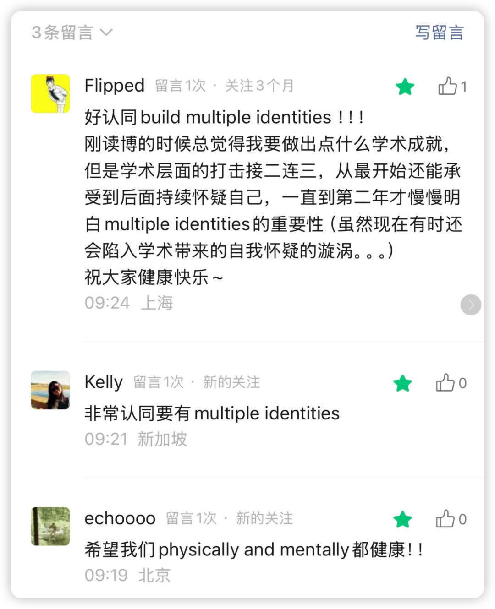

# 

以下内容整理自Luke Zhu/ Jialin Xie/ Ning Li/ Hong Deng等top scholars在圆桌讨论的部分发言：

### 身体健康

### 

**1、健康永远是最重要的！**

—— 留得青山在，不怕没柴烧。不要等到得重病了再意识到这一点。

**2、做我们这行反而应该心态上轻松：不会说你休息个一周你的项目就要完蛋了。**

**每个人有不同的能量周期，有劲儿了就努力努力，觉得累了就放松放松。—— 近年来太多学者猝死了，所以更要注意觉察自己的身心状态。**

3、虽说要保持健康，但还是需要注意在有精力的时候去**保持充分的投入和deep work！**

学术做得好就意味着你的投入肯定是充足的。特别是OB中对于literature review的要求如此之高，更是不能偷懒。—— 而做到这一点，就需要充分的“guard your time”，对于一些扰乱你安排的事情“strategically say no”！！

### 

### 精神健康

### 

**1、build multiple identities**

“one identity is not healthy”  只有一种身份认同是不健康的。

比如完全一心扑在学术上，毫无个人生活，毫无其他“支点”，这样是精神上并不健康的。（这让我想起最近网络上讨论度很高的某位教授...我是绝对不会欣赏这样的人的，即使ta的学术能力再突出）

**2、None of the evaluation systems is perfect！**

当今世界有很多评价系统，对各种角色都充满了千奇百怪的规训。但需要记住：没有一套评价体系是完美的，不要用这些评价体系来定义你。

如果你天天想着这些，只会占据你的大脑，抑制了创造力，也就没有活力和生产力了。

奉上来自top scholars的鸡汤

希望我们physically and mentally都健康！！

哎呀 一开始那条忘记改标题了  只能删除重新发！

record一下之前的留言 共勉～

