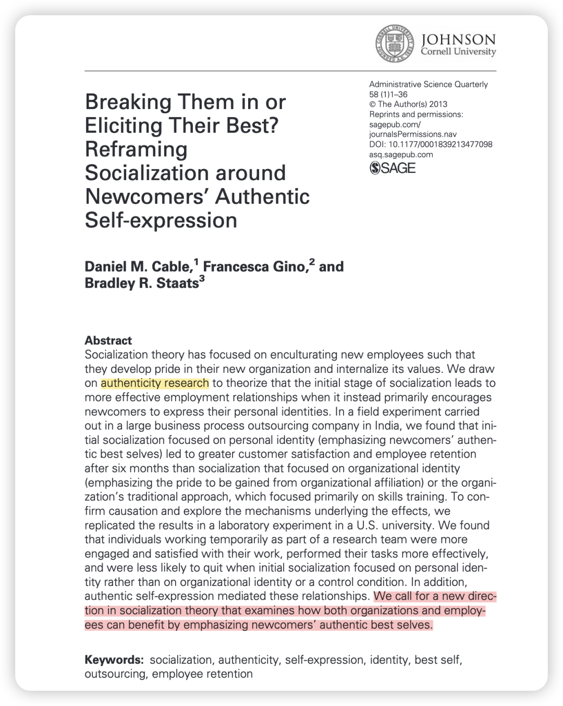

***Reference：***

Cable, D. M., Gino, F., & Bradley R. Staats. (2013). Breaking Them in or Eliciting Their Best? Reframing Socialization around Newcomers’ Authentic Self-expression. *Administrative Science Quarterly*, *58*(1), 1–36. https://doi.org/10.1177/0001839213477098

### 写在前面：

可喜可贺！这个系列终于要继续更新了！炎炎夏日 就适合开着空调徜徉文献世界～

和上次不同的是，我这次**只会写对我最有启发的点**，而不会过于详细地呈现文章全貌。

keke说对于那些想认真读的、对这个话题的感兴趣的受众，看到你的一点点笔记也会自己打开论文去读；而对于不想读的人，就算把文章从头到尾认真介绍，他们也不会认真看、或者就只是进收藏夹吃灰了。所以我之后就写点自己的感悟啦！这样写完我就继续推进自己的事情，暑假好忙！

其实我在听IACMR paper presentation最大的困惑在于：

其实我更想听**“为什么要做这个研究”、“目前存在什么现象是无法用现在研究所解释的”、”目前的文献框架是怎么样的 存在哪些缺陷“**，然而实际上很多pre都只是在介绍变量定义和研究设计。

不过！我最想关注的这个点就**可以在顶刊的intro中get！**

说起新的视角，我们可能有一种思维定势：觉得无非就是研究一下积极行为的dark side、双刃剑现象、第三方的旁观者视角、团队视角….

而这篇ASQ就扩展了我的思路——

### 启发点：

**该研究的动机主要来自人的基本需求与组织需求的冲突：**

一方面，**“做真实的自己”（Authenticity）** 是人类一种深刻的、追求满足感和幸福感的基本心理需求。人们渴望在工作这个占据大部分清醒时间的环境中，能够展现真实的自我。

另一方面，组织为了确保运营的稳定、效率和品牌的一致性，需要员工遵守规范、统一行为、表达特定的情绪（例如服务业的情绪劳动），这本质上要求员工在一定程度上**压抑个人特质以符合组织要求**。

而新员工社会化过程会**进一步激化这种冲突**：新员工一方面渴望展现自己的能力和特质，另一方面又因为不确定性而感到焦虑，急于融入环境，因此特别容易受到组织的影响。

**而从文献上来看：**

目前新员工社会化的文献更多地是在“规训”新员工，即通过让他们理解并接受组织的价值观和行为规范来传输和维护组织文化。因而忽略了新员工自身对于真实性的需求，可能会产生身份冲突、认知资源耗竭、新员工离职等负面结果。

结合现象和文献上的需求，因此，本研究的根本动机是：

**既然传统的“规训”式社会化方法存在弊端，那么是否有一种新的方法，能够既满足员工对真实性的需求，又能为组织带来更好的绩效和更低的流失率？**

作者提出了一种新的社会化策略：个人身份导向的社会化（**Authentic Best Self**），以期可以弥合个人和组织目标之间的张力，实现双赢。

### 研究方法

研究一现场实验，在印度一家大型业务流程外包（BPO）公司的**新入职员工**中进行。新员工被随机分为三组（1）个人身份认同组（2）组织身份认同组（3）控制组，在实验干预后的**六个月**内，追踪客观数据，包括员工保留率（是否离职）和客户满意度得分。

研究二实验室实验，在美国一所大学的**学生**中进行，他们被临时雇佣参与一项研究任务，旨在**复制**现场实验的结果，并深入探究其背后的**心理机制**。同样设置了上述三个组别。而测量的指标更多了：（1）**工作态度**：工作满意度、工作敬业度。（2）**任务绩效**：数据录入的数量和准确率。（3）**保留意愿**：是否愿意第二天返回继续工作。（4）**核心中介变量**：参与者感受到的“真实的自我表达”程度。

### 

### 结论概述

现场实验表明，与强调组织认同或仅关注技能的传统方法相比，**关注“个人身份认同”的入职引导方式，在六个月后显著提高了员工的保留率，并带来了更高的客户满意度**。

实验室实验成功复制了现场实验的发现：个人身份认同组在工作满意度、绩效和保留意愿上均表现最佳。并进一步证明了其作用机制：个人身份认同之所以有效，**是因为它显著提升了员工在工作中的“真实自我表达”感**。当员工感到可以做真实的自己时，他们的内在动机和工作表现会得到极大的提升。

### 

### 理论贡献

将**真实性理论融入社会化领域**，为理解如何通过强调新人的“最佳自我”来促进工作中的真实性提供了新方向，平衡了传统上以不确定性降低和价值观趋同为核心的社会化理论。

有助于组织在企业价值观融入之外，通过战略性地关注员工个人身份社会化，来利用员工的独特性，从而实现竞争优势。

论文全文PDF：

可以直接在我共享的notion page下载：https://bwjzju.notion.site/21-ASQ2013-21689978c0ae80b28d4dece10dc22525?source=copy_link
