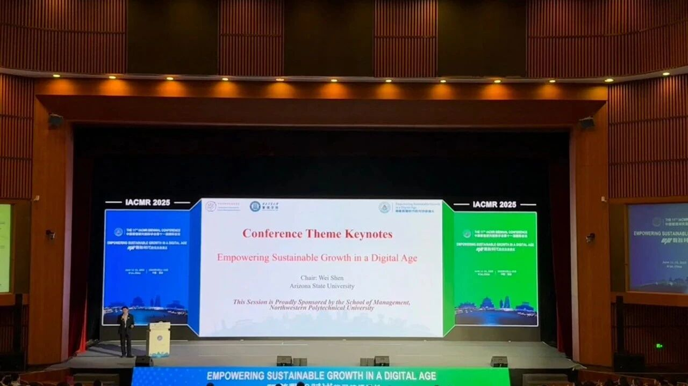

听talk的间隙坐在沙发上开始复盘这次听会议的感受。比起研一时看到OBHR领域常被提及学者的那种激动和兴奋，现在参会好像会更聚焦于研究本身。

总之，这次听这么多talk的感受是：
我的困惑比灵感更多一些。

比如，光是在会议议程PDF里面搜一些keywords，就能发现有几十篇相似的文章；听的talk里面关于leadership、leader-follow dyadic的研究也不计其数。 

于是我在想：
如果注定要做这些话题，到底哪些研究能在海量研究中破圈、成为能发在AMJ JAP上的作品？又是凭什么？
去掉所谓人脉和运气的因素，什么样的视角才能给本就庞大的literature以增益？

（我确实已经有点悟到在一个小领域找到值得研究的方向要怎么做，但如果研究的领域真的有很多文章了，那到底该如何提炼出有价值的独特的研究问题？）

Fine 就在这里记录下研二末的困惑
以期待未来有一天能回答今天的自己吧。

