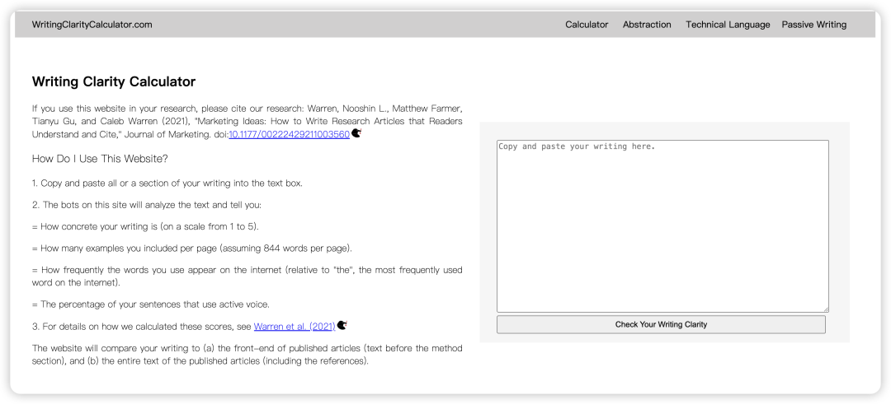
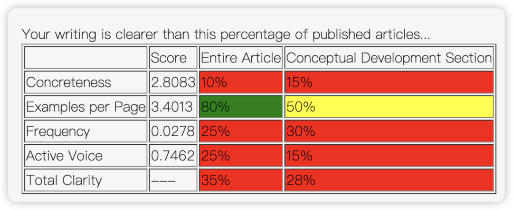
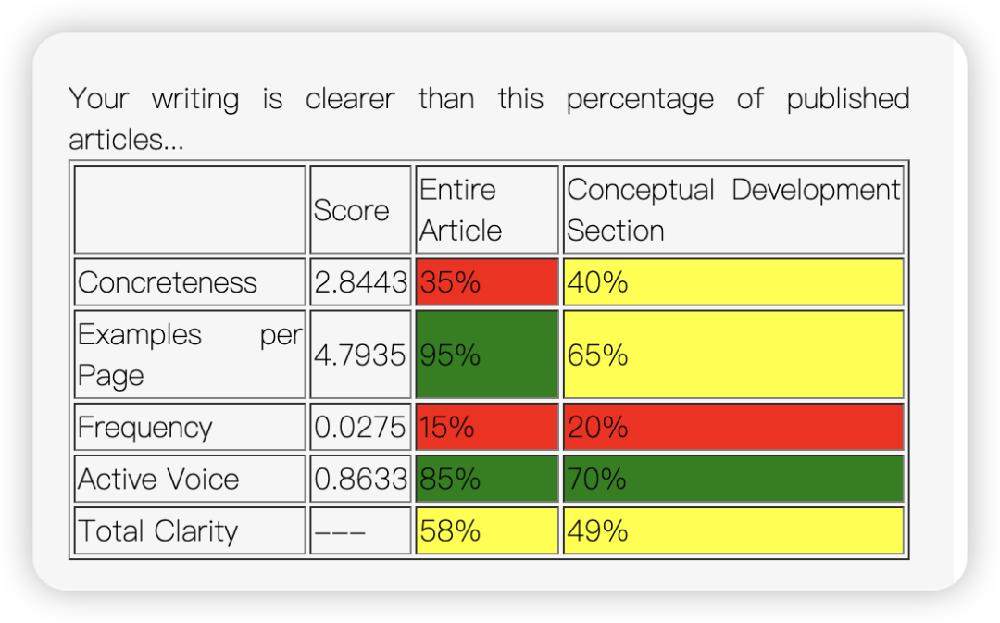

其实就是基于这篇JOM开发的一个学术清晰度计算器：

> Warren, Nooshin L., Matthew Farmer, Tianyu Gu, and Caleb Warren (2021), Marketing Ideas: How to Write Research Articles that Readers Understand and Cite; Journal of Marketing. doi:10.1177/00222429211003560

网址：

> http://writingclaritycalculator.com/

比如，我的第一版论文完全是一片红色...💦

最新一版终于颇有起色！（但离最终版还是差远了）：

总之可以用它来量化一下自己改论文的水平有没有进步！
