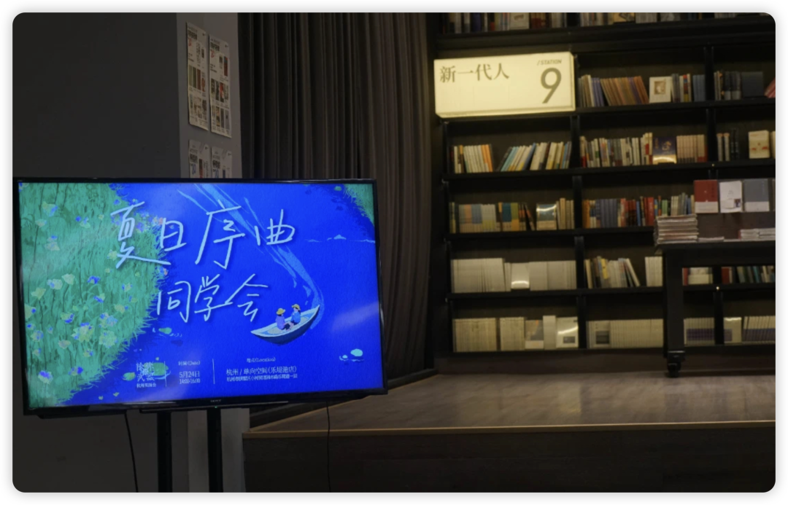
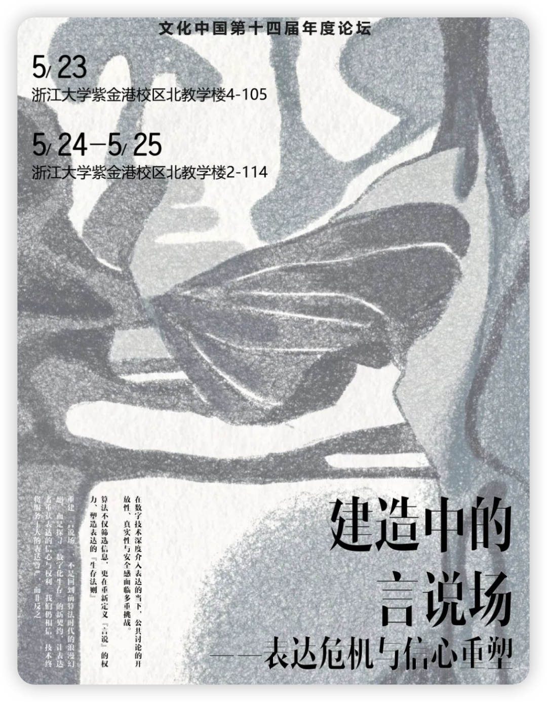
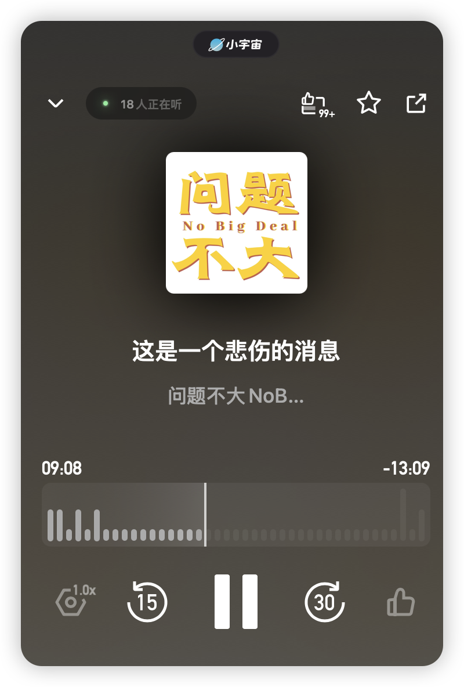
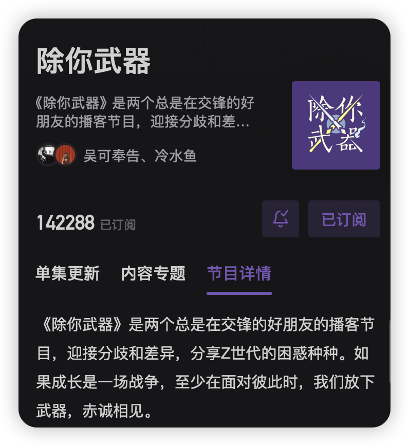
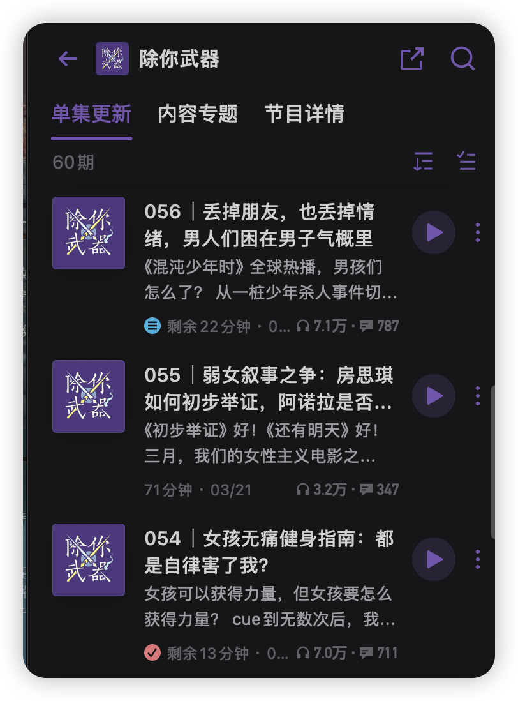
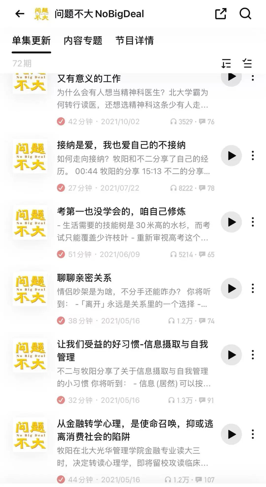
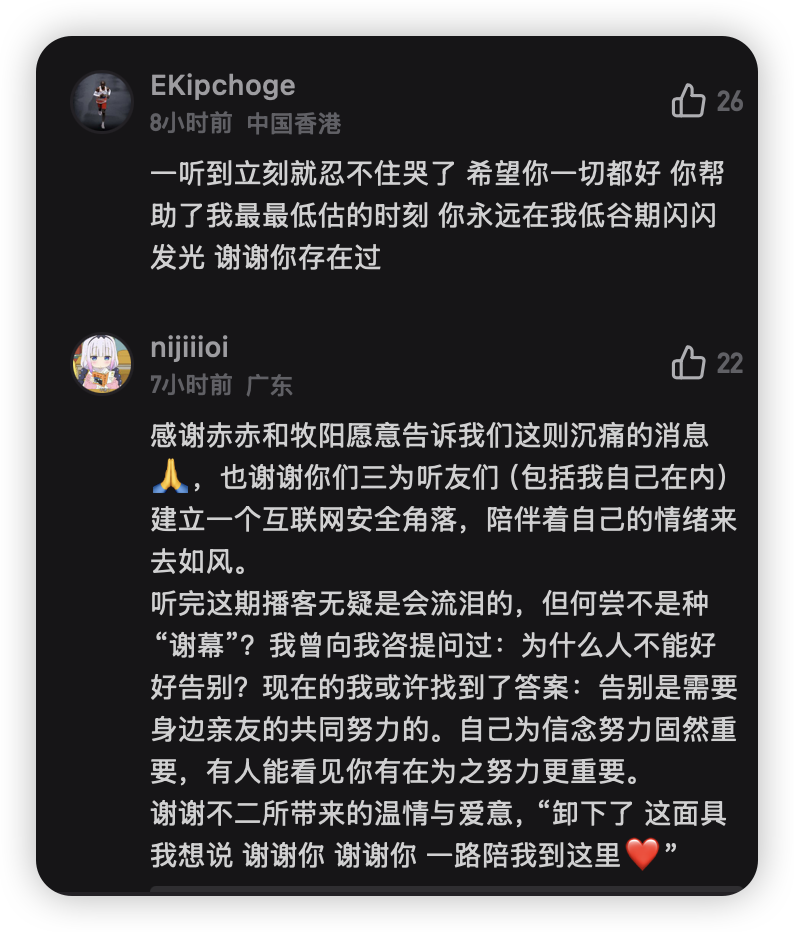

上周我完全沉浸在北京丰富的学术讲座中，而回杭的这两天我则是游走在更抽象的播客世界中：

周六上午我和朋友录了一期自己的小播客，下午我又去线下参加一档我经常听的播客《除你武器》的杭州听友见面会；

周日《除你武器》又正好有一个在浙大的活动，于是我又见到了shiyu和小吴；

而此刻，我坐在学校的星巴克剪辑昨天录制的播客，又同时听到了一个让人心痛的消息：我在小宇宙听的第一档播客节目《问题不大》的主播不二因病去世了。在我印象中她一直积极地分享着心理学知识，有幸福的婚姻，去年还刚当了妈妈。

#播客中的“看见”

很难想象，有一天我的情绪会因为播客这样的一个小世界而牵动着。

播客真的是一个真诚表达的平台。除了寻常自媒体平台带来的信息增量、理解增量之外，还有一层陪伴与亲近感——声音里有很多藏不住的信息。

有一些人文类播客更偏公众议题，我可以借由ta们的眼睛看到更大的世界；

而像《除你武器》这类播客则更像是一个比你经历的更多的朋友，你借由ta们的眼睛看到“我们”与“ta”们，我们的距离是更近的。

也许你把一个播客从头听到尾，你会比主播身边的朋友都更了解ta，更能“看见”ta。

就像我和zyy说，让我有那种“被看见”的感觉其实很简单呀，因为我是一个总是分享和记录的人，只要读我的公众号、看我的微博、听我的播客就太知道我是一个什么样的人和喜欢什么了，这简直是我自己给别人写的小抄、画的重点。

所以若是有人能突然想到我之前分享过的某些思考，我都会觉得太感动也太心动了。不过zyy说，这可并不简单哦，难得很！

现在我想也是的，能有一个人这样认真地看完另一个人的电子记录得有多爱啊。这种概率实在是太低。

#结构洞

线下听友会确实有着难以言喻的魅力。

你知道在这里遇到的大多数人都关心着同样的话题，不会有鸡同鸭讲的无奈，不会因为思考生涩抽象的话题而被觉得过于天马行空。甚至即使大多数人都是infj/infp，也因为在这里有一层温暖的情感包裹着而可以肆意开启聊天。

更神奇的是，你可以摸摸shiyu在播客里聊过的她练出来的肌肉、可以跟她拥抱、可以跟小吴和shiyu表达喜欢和感激（ta们会疯狂点头疯狂说谢谢！），这真是NF人最喜欢做的事情！

在浙大下午的活动中，北大的邱老师提到，年轻人其实并没有失去表达自由，要多去承担结构洞的角色，去链接，去发声。

我想，播客的线下听友会则是创造了这些节点，让相似的人都能因此成为其中的一部分，去链接到你从未想过的陌生人。

比如昨天的活动中每个人都会和另一个编号的人互换礼物，我和两位同在杭州读书的大一妹妹还一起吃了饭，虽然差了四年，但我们毫无隔阂地聊着在播客中经常出现的议题，这也是我第一次作为“姐”的角色请妹妹们吃饭、尝试回答一些她们这个年纪想问姐姐的问题。虽然大多数问题我几乎给不出答案，而只能鼓励她们多运动、多去走走看看、多做自己喜欢的事情，人生无限可能。

相信这样创建结构洞、成为结构洞的方式还有很多，未来也要多多探索。（其实我的公众号和创建的学术群聊应该也能算是哦）

#再见不二 谢谢你来过

问题不大是我下载小宇宙就有在听的节目。

它陪伴我度过了保研这段最焦虑、痛苦、自我怀疑的岁月，我借由它了解到即使优秀如她们这些来自北大的顶尖学子也面临着各种未被解决的议题，我终于了解到了“不接纳也是一种爱自己”。问题不大真的帮我理清了很多人生命题。

后来我不怎么听问题不大了，不是因为她们的节目质量变低，而是我真的在大三大四这两年借由这个节目形成了稳定自洽的价值观，一直持续到现在。

所以对于不二的离世，我还是无比痛心与恍惚。但一想到还有很多听友依然能通过播客再听到她的声音、看她的newsletter读她曾经表达过的思想和推荐过的书影音，这件事情也稍让我感到慰藉。我想也许几十年后也有人会用这种方式缅怀我吧。

生命的延续或者并不用通过结婚生子，你曾经通过声音、文字、相片、视频记录等等介质来表达过自己，而后这些介质也会裹挟着你的灵魂一起，永远存在着。

感恩这些电子媒介，我想，这就是互联网最美好的一部分吧。
