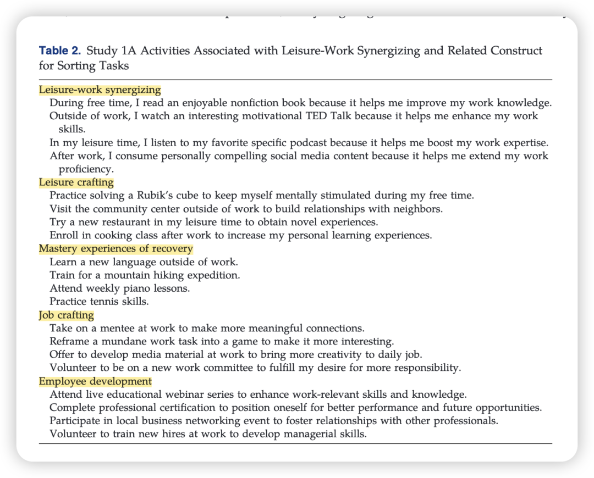
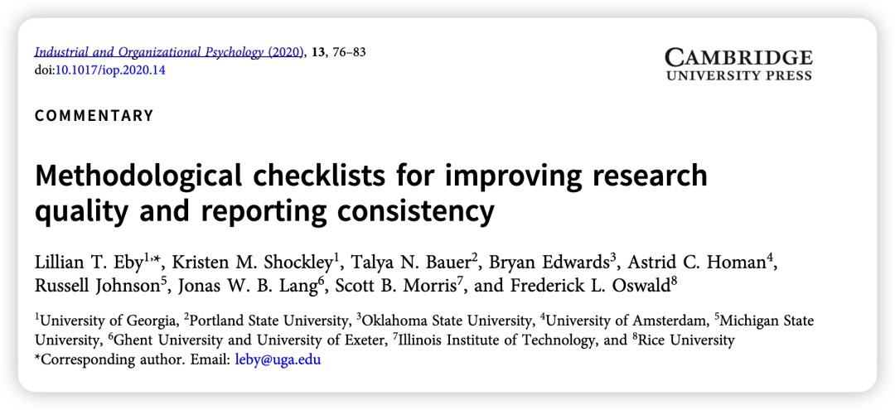

在之前听了很多top journal的AE讲座后，对于如何“发表一个好的研究”的points积累其实近乎饱和。掌握了这些“知易行难”的high-level points之后，其实更重要的是深入到你的小领域去做足literature review并保持思考，要下苦功夫。

所以这篇收获总结就只列举一些不那么常被提及的内容，像“what do we know/what we don’t know/why this important“等等就不再列举喽。

以下笔记来自于第一天Lillian在JAP PDW的”How to publish in highly impactful journals“的talk、第二天Lillian在北大光华的“Open Science in Management Research: Opportunities and Challenges”的讲座、以及在JAP PDW我们组圆桌讨论时Tammy Allen的部分意见总结。

如有错意，都是我功力尚浅，总结有误，未能吸取要点，不与讲座内容有关。也欢迎批评指正！

### 关于预注册

pre-registration很重要。这种“重要”其实并不针对于期刊发表，更多的对于自己的研究有帮助。

1、毕竟写pre-registration的过程就是一个梳理逻辑、细化材料的过程，可以让你在收集数据之前做足准备。

2、pre-registration是可以进行修改的。这种修改是完全可以理解的，诚实披露即可。

3、在任何时候（比如收数据前、数据分析前）都可以进行pre-register 。Lillian自己甚至会把OSF当成一个存放研究材料和idea proposal的库。

### 关于构念（Constructs）

Lillian用了一个很形象的比喻我觉得太妙了，就是“围起你的构念”。

在介绍你的Constructs的时候，需要澄清它和其他类似构念的区别。问问自己，如果其他相似构念也有这样的研究，那你的构念的特别之处在哪里？

比如我经常提到的这篇文章里就做了这个概念澄清的工作（Zipay & Rodell, 2024）：

### 关于理论

1、一定读original paper，梳理它这些年来的“进化过程”。一定要读原作者团队的文章，而不只是看别人cite这个理论的文章（因为别人很有可能会用错）。

2、不要堆砌理论，最好不要超过2个。如果是多个理论，一定要强调它们之间是如何整合的。

### 关于文章写作：

1、没有测量的变量就不要讨论太多，会模糊重点。

2、Do not promise things you can’t deliver.做不到的事情就不要说自己能做。比如研究问题和研究结果根本不是一个逻辑关系。（观昨日博士答辩，居然也存在这个问题。做着做着，results部分的逻辑就和假设检验的逻辑搞乱了。这个真的是大忌。）

3、By page 2, the reader should know exactly what you are doing & how it advances science.第二页一定要告诉读者你要做什么&你如何推动了这个领域。

这个倒是我自己犯过的错误：只在总结理论贡献前面浅浅总结了研究做什么，但其实还有一些变量关系没有在intro论述。导致写理论贡献的时候才突然出现一个新的概念，就会让读者摸不着头脑。

其实做到这个真的很简单，打开任何一篇JAP文章模仿就行了。可惜我也会写着写着自己的文章就沉浸其中，也没有意识再去对照自己之前听到的points。—— 为此，我真的很想整理一份做研究/写文章的checklist，这样每次写作后的自我陶醉时，就可以逐一去比对，杜绝“听了很多道理，也过不好这一生”的情况。

这个checklist希望能在我硕士开题完后开始推进！要把这两年我听到的AE的建议们写一个合集！

### 

### 关于科研项目安排

1、First-author project永远是第一优先级，其他的合作项目都要让位于此。

2、可以用一个表格来track你的项目pipeline（这个和我之前分享的notion表格不谋而合！）

### 

### 关于顶刊发表

Tammy Allen说她从来不会为了JAP而JAP，而只是想回答自己觉得很重要的科学问题、并尽全力去把研究做好，这样最终结果一定不会差。

所以希望我们不要再去问“这个研究能发JAP吗”这个问题了。

### 

### 其他的一些材料

1、OSF的TOP guidelines：https://www.cos.io/initiatives/top-guidelines

**2、关于作者贡献的CRediT：**

https://credit.niso.org/

3、IOP上Lillian和合作者们写的一篇checklist：

4、翻JAP的官网，有很多像qualitative、quantitative、meta的guidelines，必须逐一check。

祝大家学得开心！

欢迎同去JAP PDW的朋友们补充！
