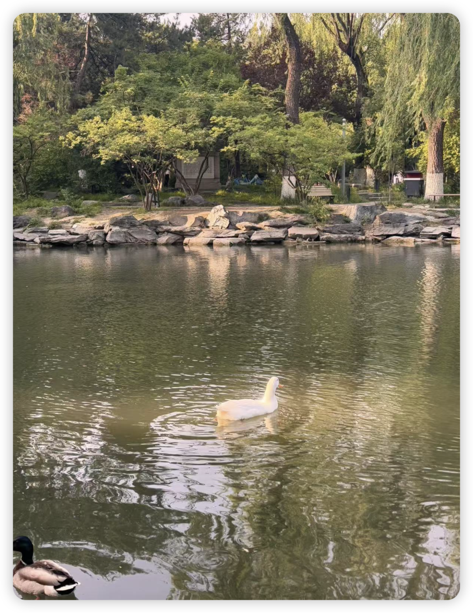
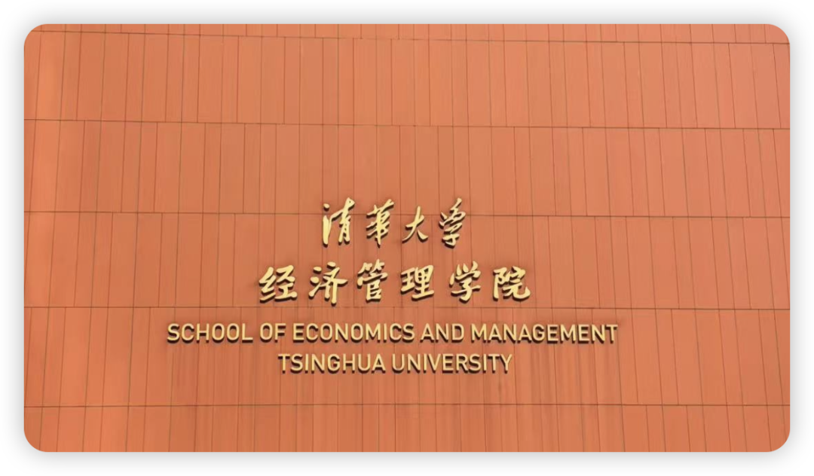
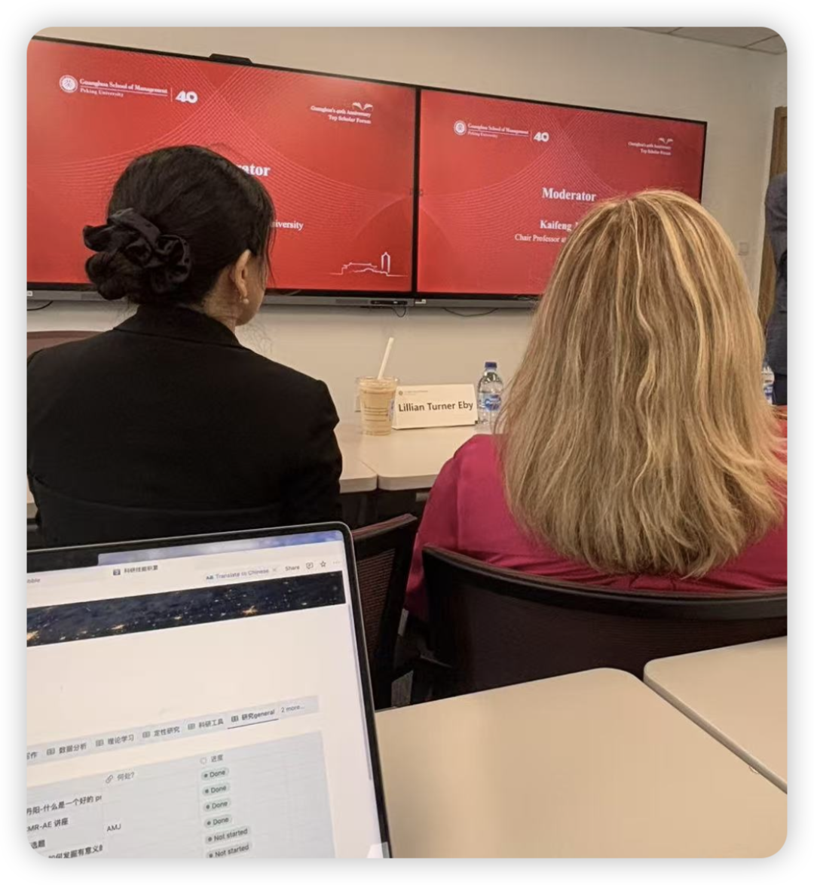

这么快就已经一个半月没更新了！

自从我的gmat考试非常drama得因为考点问题免费取消后，我就开始了漫长的recovery+补之前落下的科研进度。总之就是悠哉悠哉地过着我的小日子，完全把百味鸡的公众号抛之脑后😃

阳光下未名湖的可爱小鹅

但今天在清华参加JAP PDW的时候遇到几位PhD伙伴：

“你，不会就是那个百味鸡…？”

好搞笑，也是出息了，年纪轻轻竟然体会到了当众掉马的感觉🌝

清华经管 一年一度！

不过除了尴尬的网络认亲之外，还是获得了来自peers的鼓励，感谢她们！

能在茫茫学术公众号中“被记住”实在令人感人。我想这或许是因为，比起一些以课题组为载体的学术公众号，我乱七八糟的Bubble时刻也给了这个公众号以生命力和活人感。是“我”作为主体，去分享我的科研感悟和文献笔记；而非“论文”作为主体，我变成了背后的搬运工。

想到这里，便又觉得这个公众号充满意义了。能和OB&Psy的学者们一同学习，陪伴这条本来有些孤独的科研道路真是一件好事儿，要重拾起来继续更新！！

Lillian Eby坐在右前方——这辈子我离JAP最近的距离

之后会想更新：

1. 我在JAP PDW的收获

2. 我的好朋友Ke在25fall申请商学院的心路历程

3. 从研一到研二我在科研思维上的最大变化

4. 如何寻找校外合作者？

5. …欢迎留言您感兴趣的话题！

祝我们都越来越好！
