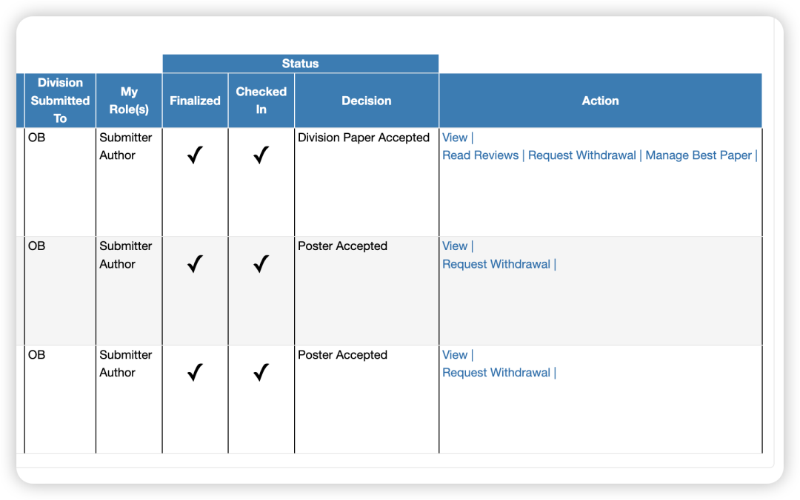
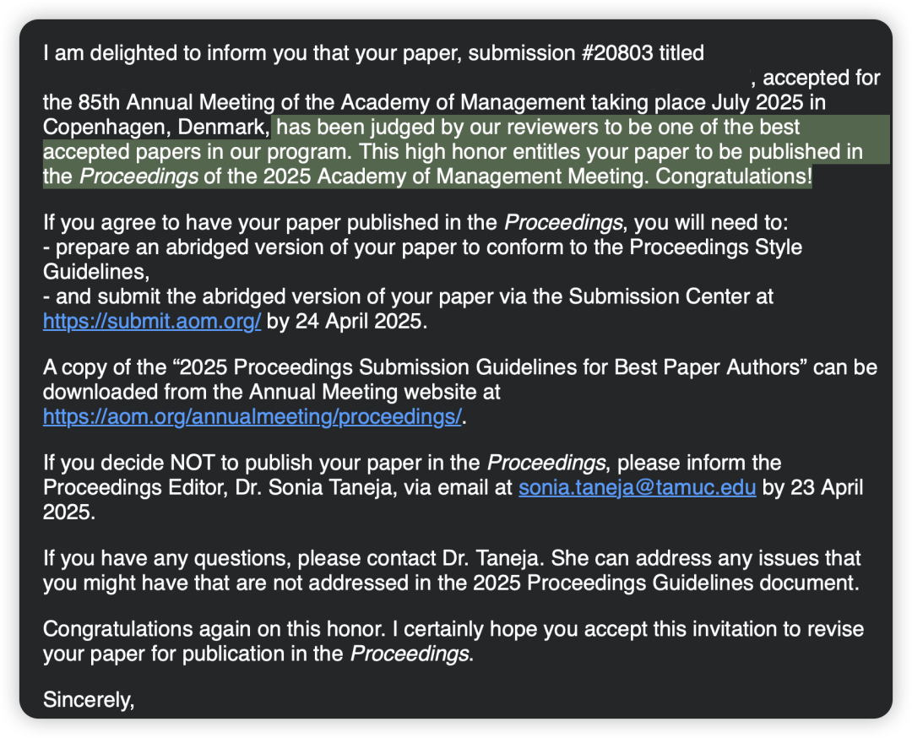

去年投的1篇paper和2篇poster都接受了，更震惊的是，第一篇paper还被选入了会议best papers系列，真的是人品大爆发！

直到现在我还是有点恍惚，总觉得不太真实。去年今日我还刚在组会上汇报过这个项目的idea呢，没想到过了一年能取得这样的阶段性成果。（当然离最终的发表还有long way to go）

但我可以感到开心地是，这样的一个小小成就至少可以证明：

1、做人文社科的科研不必像苦行僧一样闷在工位上，不必听信那些毫不注重身心健康的“专家”说一周要工作50H等等。

你可以像我一样四处“流浪”式学习（**前提是你的导师不是那种要求你每天固定工位的刻板老师。希望这样的导师少一点哈🙏**）：

在宿舍沉浸式学会儿就出去溜达一会儿、然后转战咖啡店、再去健身房运动一会儿补补身心能量、再转战图书馆沉浸式学一会儿。在流浪学习的过程中，任由思路随风飘荡和生长。

甚至可以在周中觉得累了就出去玩，吸吸外面的“人气”、可以因为夕阳和晚风过于美好而去散步逛街买蓝莓、可以心血来潮去吃一顿一人食美味日料。

心态平和地过好每一天，不要因为一些科研工作而阻止自己感受生活的机会 —— 不做完地球也不会毁灭的。更何况，生活即灵感&慢就是快，在身心能量俱足的情况下才会事半功倍。

当然也不该过度娱乐。我的习惯是，如果因为周中进行了过多的娱乐放松，需要在周末适度补上，尽量以周为单位来衡量自己的投入时间，这样可以弹性地安排每天的工作，但方差也不至于太大，从而可以保证平稳、连续的学习状态。

2、最重要的是，你可以不用go up by competing/pushing others down，不要卷生卷死，不要通过邪恶的手段来折损他人。而是 go up and ahead by building the community up！多做一些亲社会行为，功德或许就会积攒成投稿的运气！

—— 总之，成为好人，联结好人，和好人们先把周围的小世界变得越来越好，再慢慢让大世界也开始好起来！

用这篇来传递好运！

祝我们如此温情有爱的OB community能越来越好！祝大家都能在身心俱足的情况下打磨出好的研究！

也希望理想主义者们都可以靠自己的力量上桌吃饭！去写出属于我们的人生故事，去证明成功远远不仅仅局限于上位者口中的那套“硬吃苦”逻辑，也可以很自由、浪漫、充满鲜花阳光与热爱，也可以和很多志同道合之人一起躺在草地上吹风、做梦、延展认知、做自己觉得有意义的事情 而不是拘泥于他人强加的意义中！

复杂世界里，让我们继续互相陪伴吧～

**最后，停更预警😭**（但我会时不时冒一些Bubble的）

我的Gmat真的要开始加紧学了，开学的时候还学觉得4.26遥遥无期肯定来得及复习，结果到现在还没看完网课！

所以春季顶刊阅读计划暂且告一段落，等我到4.26把gmat考完（顺利的话）再重新开启奢侈顶刊阅读计划！

如果有人有gmat备考建议欢迎私信我，感恩好人们！
