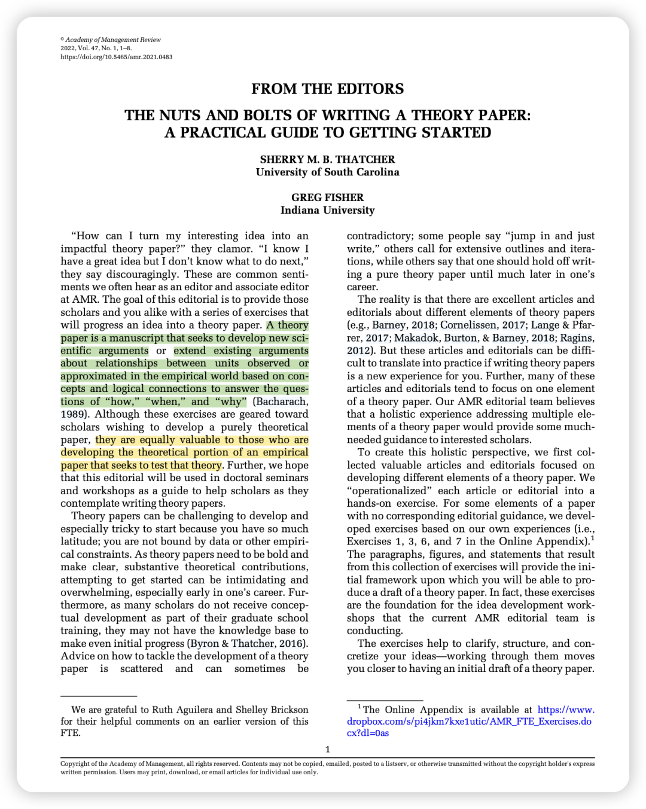

***Reference：***Thatcher, S. M. B., & Fisher, G. (2022). From the Editors—The Nuts and Bolts of Writing a Theory Paper: A Practical Guide to Getting Started. *Academy of Management Review*, *47*(1), 1–8. https://doi.org/10.5465/amr.2021.0483

### 

### **写在前面：**

特别伟大的一篇，实操性极强，我觉得是人人必读的文章！！

有了它，你的论文理论部分就有救了！

（是的，虽然这是AMR的FTE，但是AE也说了这篇文章不仅会帮助大家写理论论文，也会帮助大家写实证论文的理论部分。）

### 文章简介：

作为AMR的editors，作者经常听到学者们表达「在将有趣的 idea 转化为有影响力的理论论文时」遇到的困难。因此，作者收集了专注于开发理论论文不同要素的宝贵文章，并将每篇文章“操作化”为动手练习。

共分为7个小练习（作者还贴心的整理成了word文档）。这些练习有助于阐明、构建和具体化你的想法，完成这些练习会让你更接近理论论文的初稿。

作者**将最终的理论论文比作一个完整的拼图，而这些练习则代表了拼图的边缘部分。**先完成边缘部分可以让你更清楚地了解拼图的最终样子，并划定最终拼图的边界，从而为取得有意义的进展做好准备.

### 

### 练习1: **理论贡献的路径**

本练习旨在帮助你**确定希望通过论文做出的理论贡献类型**，并识别其他具有类似目标的高影响力范例文章。

AMR 中做出理论贡献有四种主要路径：

- **发展新理论（提出全新的理论观点）；**
- **挑战或提升现有理论（基于现有理论进行重大推进或挑战其基本概念）；**
- **综合不同的观点或文献以形成新的理论（整合不同理论领域的思想）；**
- **提出改进管理和组织研究中理论发展过程的思路和方法**

练习1包括三个步骤：

1、考虑你的idea并确定希望采取的理论贡献路径，然后**写下你的理由**，因为写作可以澄清你的想法。

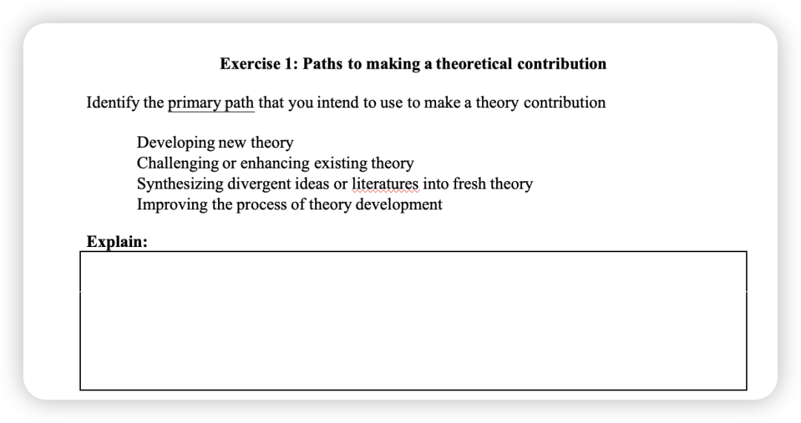

2、寻找采取了类似路径的**范例文章**；

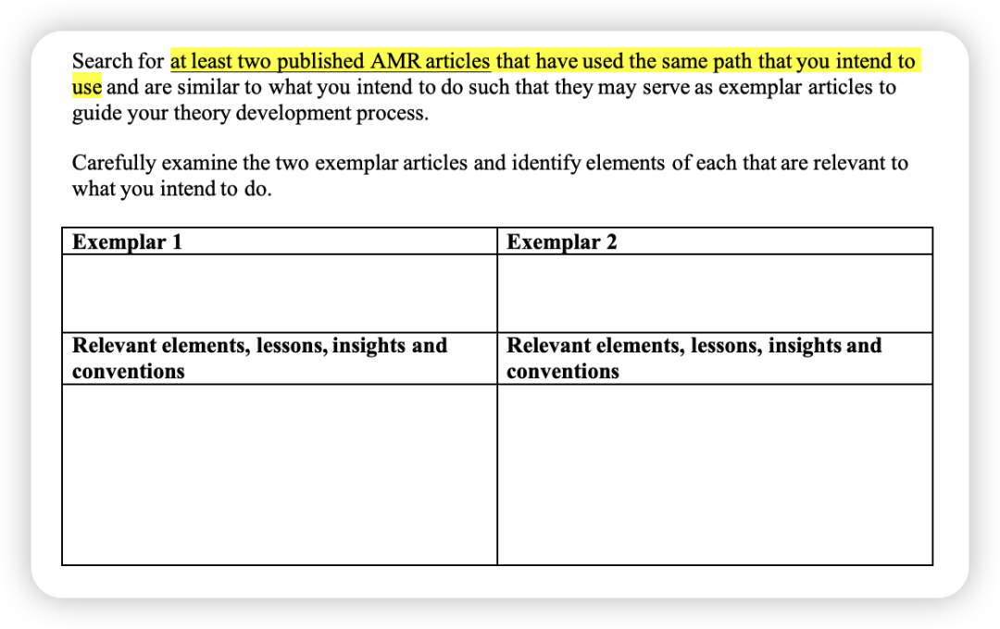

3、仔细研究这些范例文章，并记录key elements, lessons, insights, and conventions：从**宏观的结构和流程**角度检查每篇文章，然后再从**微观层面**考虑，例如过渡、用词以及图表的使用。

**不同的文章可能在不同的方面成为范例。**例如，你可能喜欢一篇文章的理论发展方法，而喜欢另一篇文章的讨论部分的组织结构。在研究你确定的范例文章时，记下你喜欢的要素。从每篇范例文章中分离出有用的要素将使你能够以自己独特的方式创作论文。

*作者建议学习范例文章，他们的博士生也这样做，并鼓励你也这样做！*

### 练习2: **理论构建的工具**

本练习旨在帮助你识别和确定你的理论贡献的主要组成部分。该练习借鉴了 Makadok 等人 (2018) 的文章。Makadok等人这篇文章表明，做出理论贡献“通常始于一个研究问题，该问题可能来自感兴趣的现象、现有理论的局限性”。然后，为了解决这个问题，理论家应该明确并利用构成理论要素的六个方面：

(1) 理论化的模式 (mode of theorizing)，

(2) 分析的层面 (level of analysis)，

(3) 对潜在现象的理解 (understanding of the underlying phenomenon)，

(4) 因果机制 (causal mechanisms)，

(5) 概念和变量 (constructs and variables)，

(6) 边界条件 (boundary conditions)。

这六个方面结合起来产生“解释、预测或规范形式的一系列结果”。

基于此，作者建议完成以下**八个陈述：**

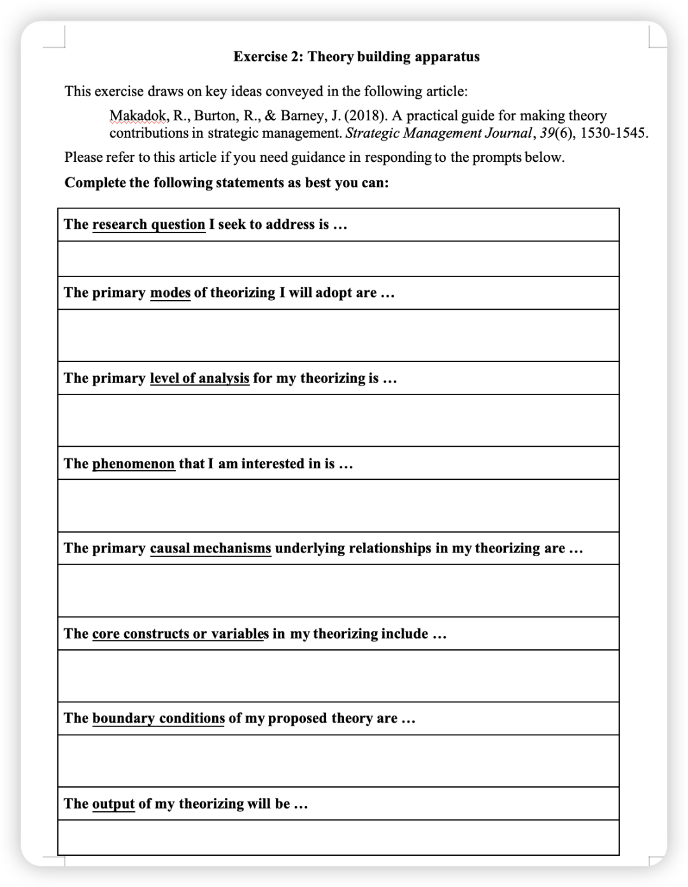

- 我试图解决的研究问题是…
- 我将采用的主要理论化模式是… (how)
- 我的理论化的主要分析层面是… (who)
- 我感兴趣的现象是… (where)
- 我的理论化中关系的主要因果机制是… (why)
- 我的理论化的核心概念或变量是… (what)
- 我提出的理论的边界条件是… (when)
- 我的理论化的输出将是… (解释、预测、规范)

注意，你可能无法立即回答所有这些问题，可能需要阅读、认真思考，并可能需要合作者和其他学者的帮助。这些陈述的答案可能会随着你完成其他练习而改变。理论发展是一个动态、协商和迭代的过程，因此一些答案随着时间的推移而变化是正常的。

*就像昨天这篇文章中 [顶刊阅读计划 19｜NHB Comment：碎片化心理学：请停止开发冗余且无用的新量表](https://mp.weixin.qq.com/s?__biz=MzU1MzY1MjIxOQ==&mid=2247485809&idx=1&sn=4f288a3c1a0e87f3da8305c1d91a38ec&scene=21#wechat_redirect) 提到量表也需要认知迭代一样。*

*以及想到昨天陈姐给我发的小红书文章哈哈，人是流动的，理论也是！*

### 练习3: **理论背景和基础**

本练习旨在让你寻找与你的理论化相关**的关键文献**。

本练习主要包括以下三个步骤：

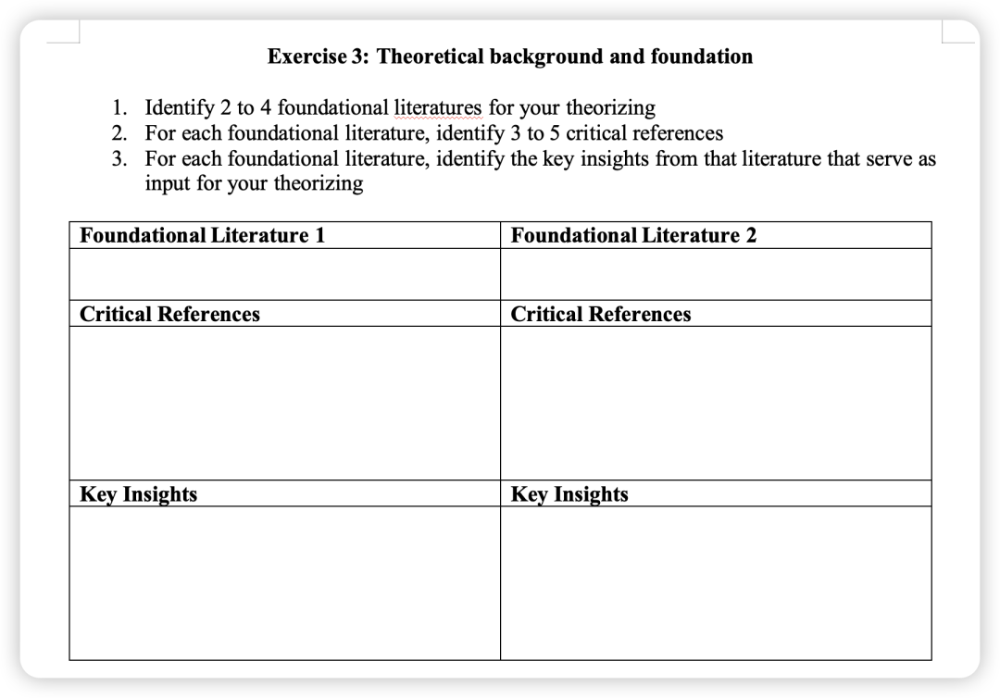

步骤 1：确定对你的理论化至关重要的2-4篇文献。

步骤 2：对于你确定的每个文献，列出其三到五个关键参考文献。这些参考文献可以是开创性的论文、综述论文或你将在理论发展部分中重点讨论的论文。

步骤 3：对于你确定的每个文献，描述其将作为你理论化输入的关键见解。明确指出你将使用每个文献中的哪些内容来发展你的理论。

*这个步骤和我们思考实证文章的贡献也是一样的！～*

注意：在进行此练习时，重要的是要记住，你找的文献是**如何帮助你加强、阐述或发展你的理论视角。**这些见解不应该只是对于论文摘要或讨论部分的**简单重复！它们应该反映出你将如何将这些文献融入到你的论文贡献中。作者说 “****Your voice should be heard.**”

另外，作者强调，几乎总能找到你主题相关的先前工作，以及可以借鉴管理和组织研究领域之外的文献！

### 练习4: **理论发展**

本练习旨在阐明你的理论贡献的形式。

借鉴了 Cornelissen (2017) 提出的观点。还有YouTube视频呢：

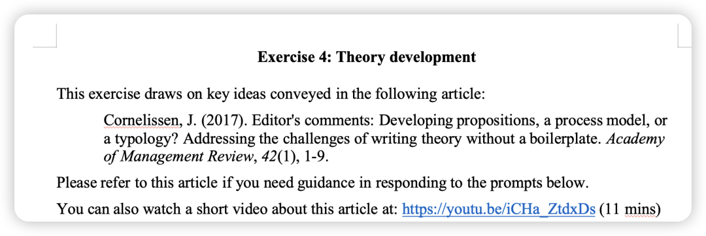

他描述了理论手稿中常用的三种常见的理论化风格：

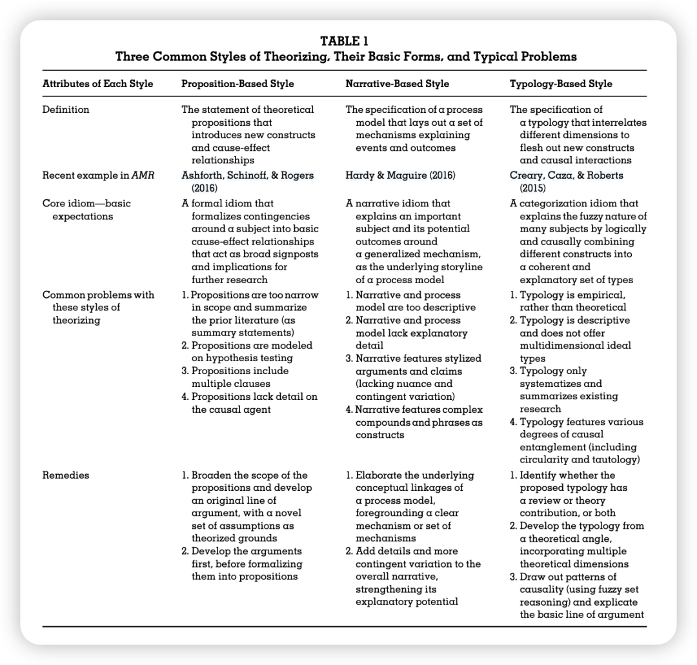

**1、命题式 (Propositional Style)**：这是一种将理论思想和论证融入**一系列正式陈述的命题**中的常见风格。比如会给出proposition 1， 2 ，3…

其核心特点是以正式的方式陈述具有清晰焦点和限定范围的**因果关系。**

*想到去年本来想分享的一篇AMR domain switch theory的文章就是这种：*

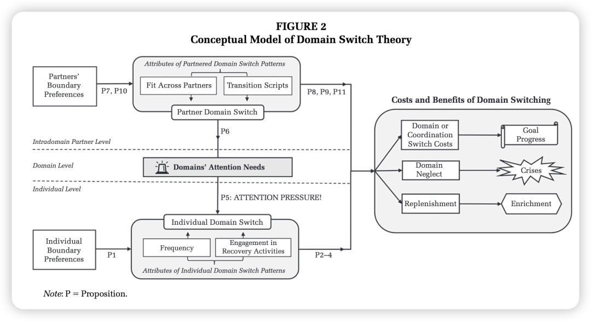

Kaur, E., Barnes, C. M., Butts, M. M., & Gabriel, A. S. (2024). Domain Switch Theory: A Deeper Understanding of Transitions Between Work and Nonwork Domains in Modern Work Life. *Academy of Management Review*, amr.2022.0485. https://doi.org/10.5465/amr.2022.0485

**2、叙述式 (Narrative Style)**：叙述式理论化风格的主要产出通常是**过程模型，**展示事件或阶段之间的**时序**关系和依赖性，以及驱动这些转变的潜在机制。

与**命题式**风格侧重于识别构念之间的因果关系不同，叙述式风格关注的是通过**时间**展开的事件序列和潜在的生成机制来解释结果。

这个没有想到太典型的，不过team process相关的文章可能都有一些时序上的关系？比如这篇AMR关于团队韧性的理论文章（但它前面其实又包含了一些因果推导）：

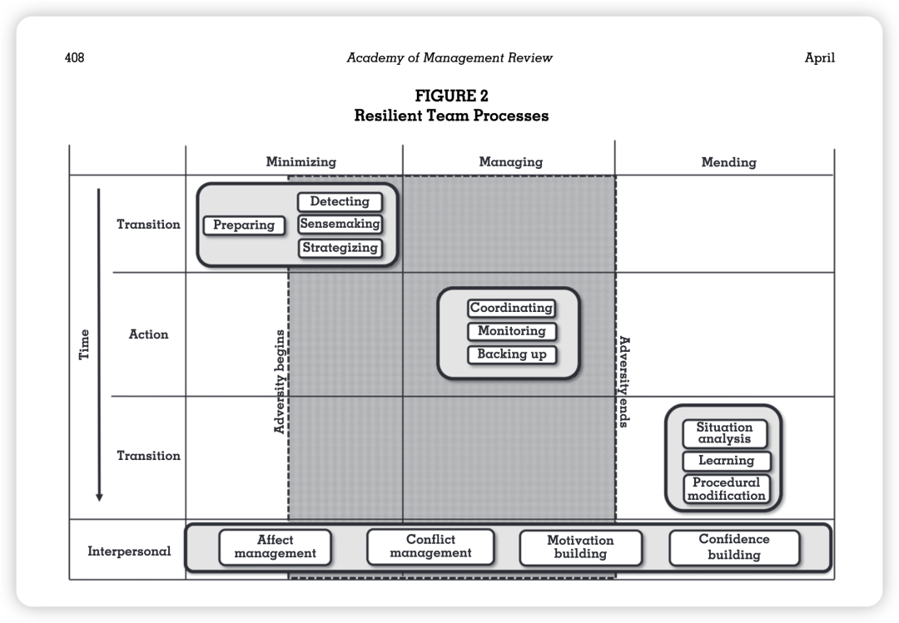

Stoverink, A. C., Kirkman, B. L., Mistry, S., & Rosen, B. (2020). Bouncing Back Together: Toward a Theoretical Model of Work Team Resilience. *Academy of Management Review*, *45*(2), 395–422. https://doi.org/10.5465/amr.2017.0005

3、**类型学式 (Typological Style)：**这是通过将特定的**理论特征或维度分类**为不同的理论概况或类型来实现的，这些类型为实证研究提供了一组理论坐标。通过这种风格，作者也可以提供更复杂的**因果模式。**

*这个类型我想到的就是purposeful work的理论了，之前也写过：[品理论 | AMR 2024-目标导向的工作行为理论](https://mp.weixin.qq.com/s?__biz=MzU1MzY1MjIxOQ==&mid=2247485320&idx=1&sn=4d37f9f2efa83d382cd7262810597f3a&scene=21#wechat_redirect)。*

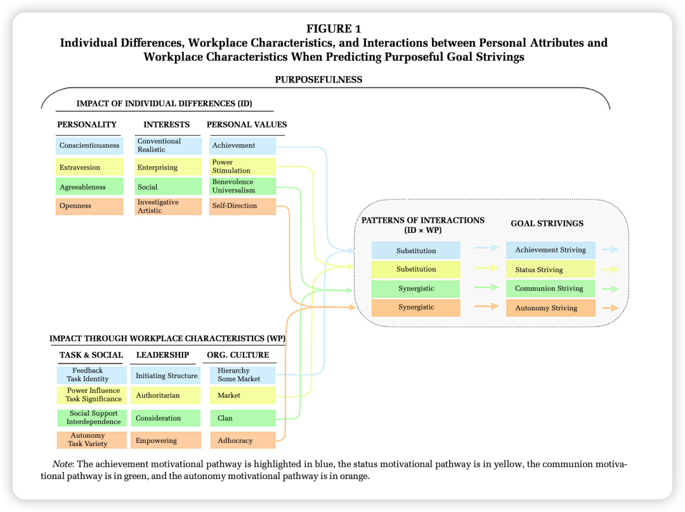

基于此，作者给出如下步骤：

**步骤 1：确定你的主要理论化风格，并讨论你选择的原因**。

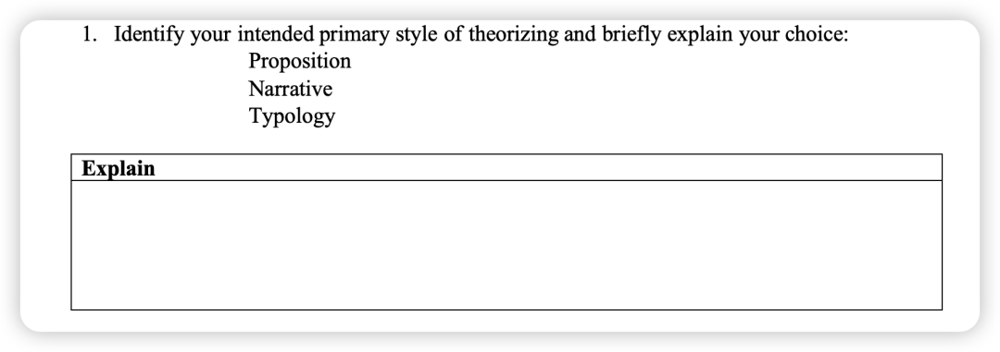

**步骤 2：绘制一个体现你理论的视觉化图表**。

对于命题式风格，需要清楚地标记概念及其关系。准备一份与你的概念相对应的单独的定义清单会很有帮助。

对于叙述式风格，你的视觉化图表很可能是一个**过程流程图**。

对于类型学风格，更可能通过**表格或带有清晰标记的轴和类别的图表**来捕捉和反映。

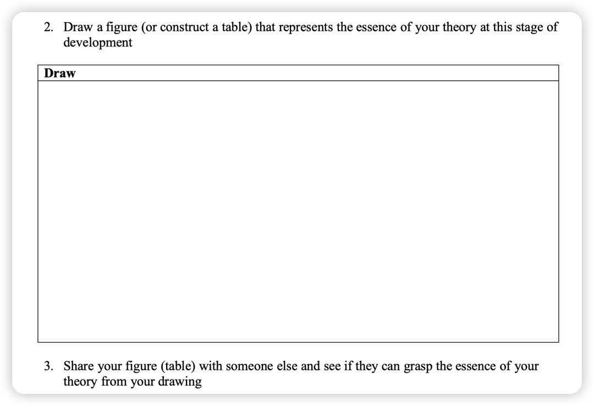

**步骤 3：与他人（例如同事或导师）分享你的视觉化图表（图和/或表）**。

要求这位同事或导师在**没有你解释**的情况下理解你的视觉化图表。如果他们的理解与你的想法不一致，就需要解释你的想法然后询问他们如何才能使视觉化图表更清晰。

通过与他人交流你的想法，你很可能会**大大推进你的思考**，并学会如何更好地传达你的想法。

### 练习5: **理论论文引言**

引言是手稿中最难写的部分之一。它们必须引人入胜、信息丰富且相对简短。因此，你必须清楚地理解你的理论贡献以及它如何融入当前的对话。因此，作者建议在完成前四个练习后再进行此练习。

两篇 *AMR* FTE (Barney, 2018; Lange & Pfarrer, 2017) 提供了关于如何为理论论文撰写清晰引言的建议。本练习基于这两篇，分为两个子练习 (Exercise 5A 和 Exercise 5B)，你可以选择完成其中一个或两个。

**练习 5A (基于 Lange 和 Pfarrer, 2017)：**

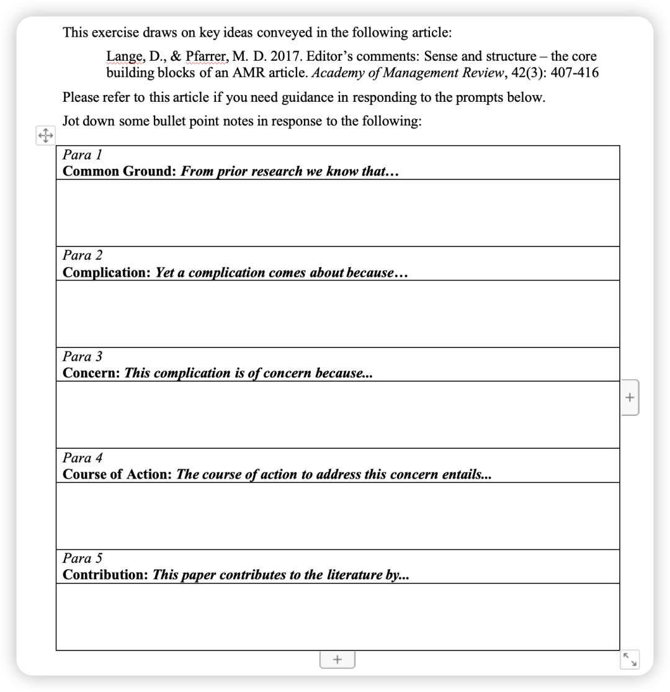

**步骤 1：针对以下每个陈述写出三到四个要点**：

1、共同基础 (common ground)——“根据先前的研究，我们知道…”

2、复杂性 (complication)——“然而，由于…，出现了一个复杂情况。”

3、关注点 (concern)——“这个复杂情况令人关注，因为…”

4、行动方针 (course of action)——“解决这个关注点的行动方针包括…”

5、贡献 (contribution)——“本文通过…为文献做出贡献。”

**步骤 2：使用你在步骤 1 中创建的要点，针对步骤 1 中的每个陈述起草一个段落**。

**练习 5B (基于 Barney, 2018)：**

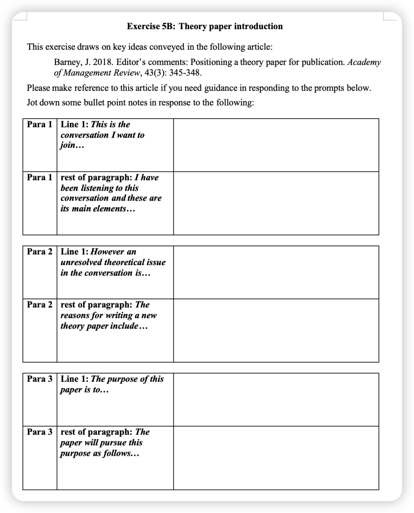

**步骤 1：针对以下每个提示写出三到四个要点**：

第一段 (paragraph 1)——“我想加入的对话是…”；我一直在听这个对话，这些是它的主要内容…

第二段 (paragraph 2)——“然而，对话中一个未解决的理论问题是…”；撰写一篇新的理论论文的原因包括…

第三段 (paragraph 3)——“本文的目的是…”；本文将通过以下方式实现此目的…

**步骤 2：使用你在步骤 1 中创建的要点来起草你的三段式引言**。

*太实操了！太不错了！再次感恩慷慨的editors！*

### 

### 练习6: **讨论与结论**

传达你的贡献**对更广泛的管理和组织领域的相关性和价值**非常重要。

因此讨论和结论部分不应该是你已经写过的内容的重复，而应该**帮助读者理解你的贡献如何以多种方式推动该领域的发展**。它们应该让读者感到兴奋并思考。本练习旨在帮助你确定讨论部分应包含的关键要素。

**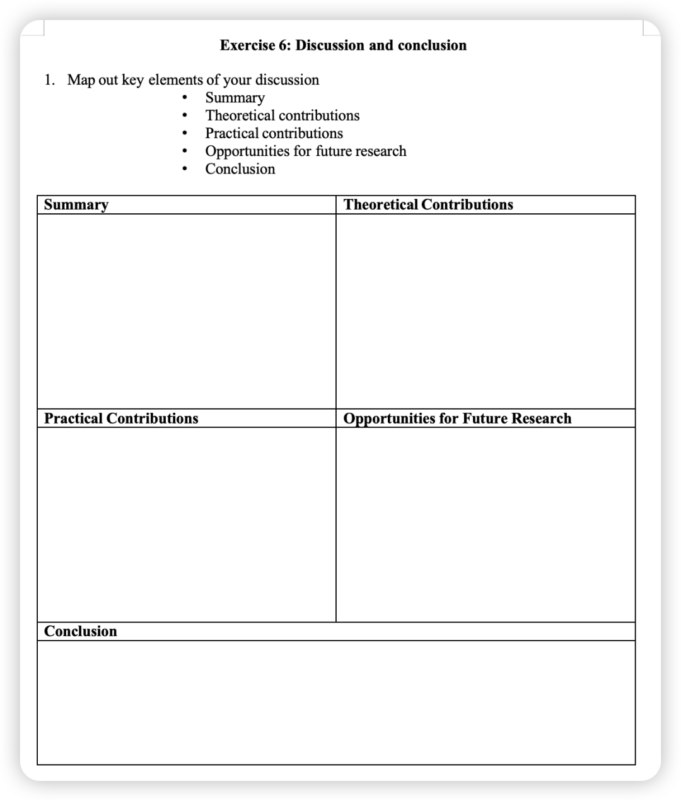**

**要素 1：总结 (Summary)：**简要总结你的理论发展。写出四到六个要点，概括论文中提出的理论思想的 essence。

要素 2：理论贡献 (Theoretical Contributions)： 使用bullet points，阐述你开发的关键理论见解。这些见解应该基于你的理论发展，**但应该描述它们如何扩展、改变或修正当前的理论观点。这是讨论部分最实质性的部分。**这些见解**应该与你在引言中列出的贡献相“匹配”。**

**要素 3：实践贡献 (Practical Contributions)：**使用bullet points，列出你的理论发展对现实生活（例如管理者、政策制定者或社会活动家）的意义。你的见解可能与你在引言中描述的关键复杂性、关注点或现象相关联。

**要素 4：未来研究机会 (Opportunities for Future Research)：**为你的读者提供潜在未来研究或探索领域的路线图。列出学者们可以基于你提出的内容进行的研究方向。让他们对在你工作的基础上进行研究感到兴奋。**你越能为读者提供基于你的理论化的想法，你的工作对对话就越重要。**

**要素 5：结论 (Conclusion)：** 对于这个要素，**准备三个包含你手稿最重要信息和一句强有力结尾句的要点，这句话将留在读者的脑海中。**

一些作者使用最后一句来联系标题或手稿中广泛使用的示例。其他作者则借此机会表达对未来从他们的理论化中产生的研究的兴奋之情。

注意： 虽然在讨论部分包含这五个要素至关重要，但前四个要素不必按照此处呈现的顺序排列。关键在于将讨论部分建立在你的理论发展的基础上，
**使其从你提出的理论思想中延伸出来，并激发人们对这些思想的兴趣。**

讨论与你的理论贡献无关的问题会导致审稿人质疑你对文献的理解，而讨论部分过于重复则会导致审稿人质疑你对文献的贡献。

### 练习7: **摘要与论文题目开发**

作者建议将此练习放在最后，因为在完成论文的所有其他方面之后，更容易创作出有影响力的摘要。

摘要的目标是让读者对论文内容有一个清晰的了解，同时也让他们渴望阅读更多。

Lange 和 Pfarrer (2017) 在他们的“Sense and Structure”AMR FTE文章中给出了帮助撰写论文摘要初始结构的一些要素。作者认为可以使用他们的结构来创建你的摘要初稿，针对以下每个提示写一个句子，然后将这五个句子串联成一个段落：

第一句，共同基础 (common ground)——“根据先前的研究，我们知道…”
第二句，复杂性 (complication)——“然而，由于…，出现了一个复杂情况。”
第三句，关注点 (concern)——“这个复杂情况令人关注，因为…”
第四句，行动方针 (course of action)——“解决这个关注点的行动方针包括…”
第五句，贡献 (contribution)——“本文通过…为文献做出贡献。”

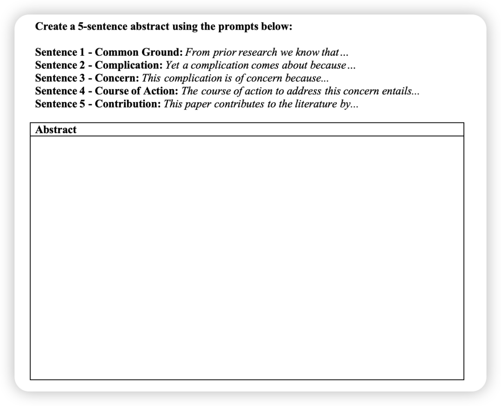

注意：

遵循这五个句子的公式只是一个起点；你需要多次修改和润色摘要，直到它准确地传达了你论文的核心内容。

你需要大声朗读摘要以确保其流畅且有意义，**请不了解你的论文的人阅读摘要并提供反馈。他们在阅读你的摘要后是否感到兴奋和好奇？你的摘要是否让他们想阅读你的全文？**

论文题目： 最后一步是创建你的论文题目。题目是吸引读者注意力的宝贵机会。想想过去吸引你注意力的题目，并考虑如何模仿这些题目的要素。

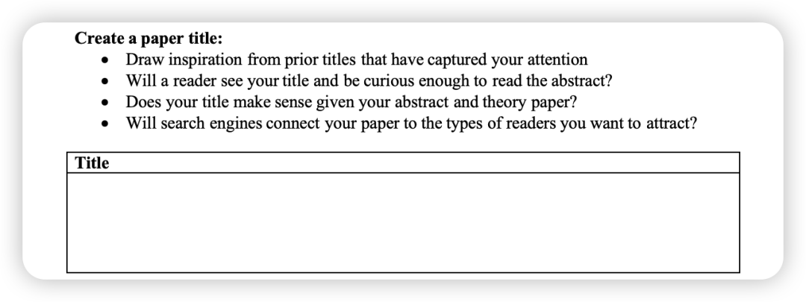

读者看到你的题目后是否会好奇地阅读摘要？你的题目是否与你的摘要和理论论文相符？它是否太长？**它是否足够准确，以便搜索引擎将你的论文与你想吸引的读者联系起来？**

请其他人评估你的题目是一个重要的反馈机制，可以让你知道你是否想出了一个成功的题目。

**写在后面的碎碎念：**

祝大家都能按照这份实实在在的操作指南，至少先把核心“要素”这些积木找到，然后再慢慢搭起自己的小房子！
