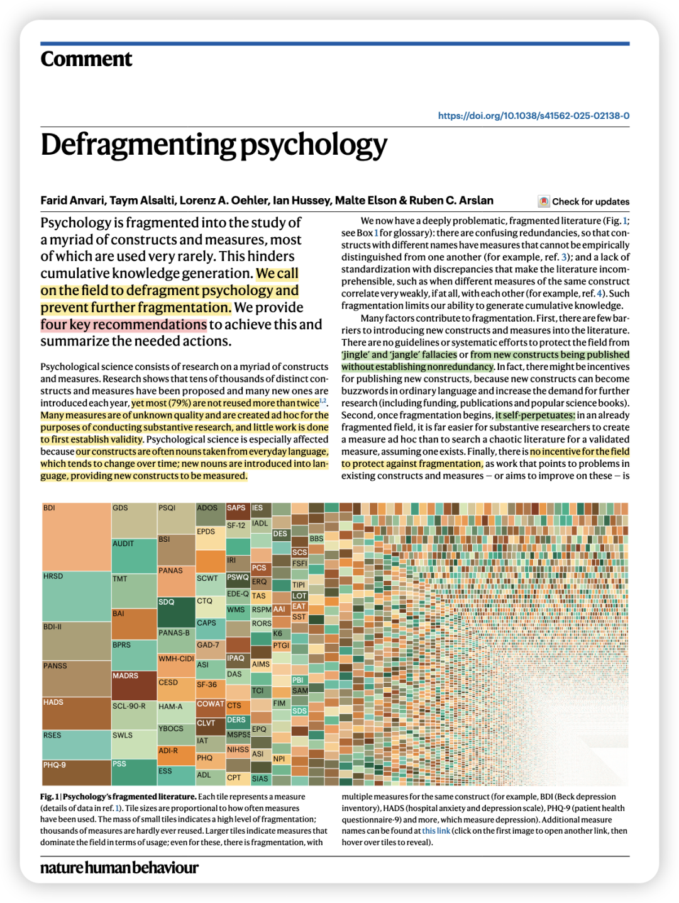
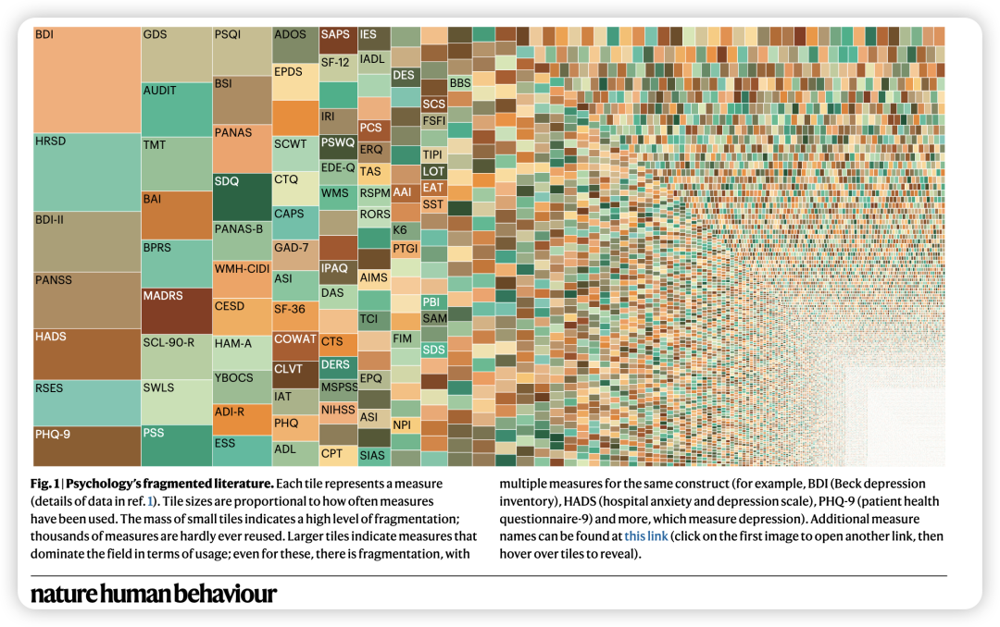
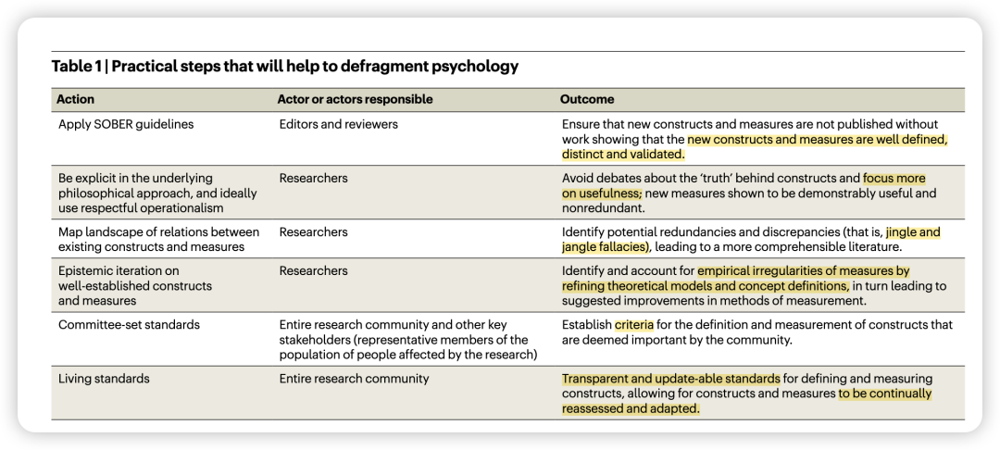
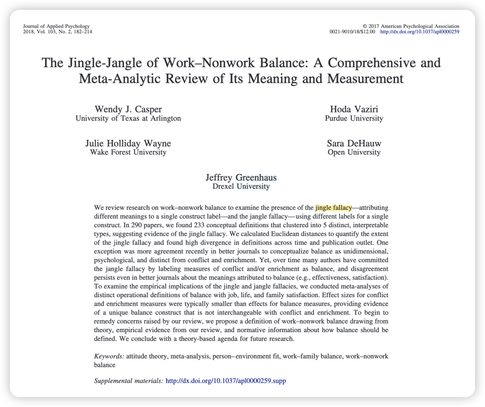
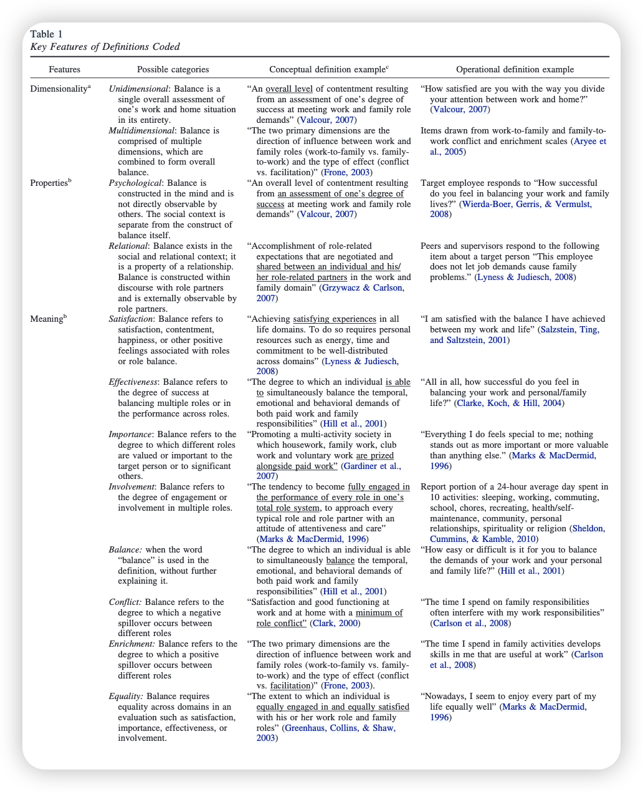

***Reference：***Anvari, F., Alsalti, T., Oehler, L. A., Hussey, I., Elson, M., & Arslan, R. C. (2025). Defragmenting psychology. *Nature Human Behaviour*. https://doi.org/10.1038/s41562-025-02138-0

### 

### **背景简介：**

心理学研究涉及无数的概念和测量方法。研究表明，已经有成千上万个不同的概念和测量方法被提出，并且每年都有新的概念和方法出现，**但其中绝大多数（79%）的使用次数不超过两次。**许多测量工具的质量未知，并且是为特定的研究临时创建的。

**心理学尤其受到影响，因为我们的概念通常来源于日常语言中的名词，而这些名词会随着时间的推移而变化；新的名词被引入语言，从而提供了需要测量的新概念。**

这种碎片化导致了**混乱的冗余**，即不同名称的概念可能具有无法在经验上区分的测量方法。如这个夸张的图一所示，其中小图块代表很少被重复使用的测量方法。

### 

### 导致碎片化的原因

1、**引入新概念和测量方法的门槛很低**，对于jingle-jangle fallacy问题缺少指导。

“术语混淆 (jingle fallacy)”：是指名称相同的测量方法实际上测量的是不同的东西

“概念趋同 (jangle fallacy)：概念趋同是指名称不同的测量方法实际上测量的是相同的东西

2、发表新量表的文章可能还会存在激励，因为新概念可能成为流行语，增加对进一步研究的需求（包括资金、出版物和科普书籍）。

3、一旦碎片化开始，它就会**自我延续。**

4、**缺乏鼓励解决现有概念和测量方法问题的激励。这类工作通常被“贬谪”到方法学期刊，可能很少有研究人员阅读。**

***（好真实 比如我读ORM这种期刊真的很少… ）***

### 

### **解决碎片化的关键步骤**

### 

### 

1、 **阻止进一步的碎片化。**

鼓励编辑和审稿人采用**Elson 等人提出的行为研究标准化 (SOBER) 指南**。

SOBER 指南为修改现有测量方法或引入新测量方法设定了标准，要求作者证明：

(1) 新概念和测量方法与现有概念和测量方法不冗余；

(2) 遵循已建立的测量方法的规程；

(3) 对现有测量方法的偏离进行记录和解释；

(4) 测量程序和评分进行预先注册；

(5) 测量过程的所有方面都被完整记录；

(6) 报告测量方法的均值和标准差，以促进研究综合。

编辑和审稿人在评估稿件时，还可以使用**语义模型**（例如，大型语言模型）根据名称、概念定义和测量内容将新提出的测量方法与现有方法联系起来。

2、使用respectful operationalism这样的哲学观

respectful operationalism是指一个概念根据其测量方法进行狭义定义、但该测量方法必须经过验证以确保其与更广泛的概念定义相关，并且具有可用性。可用性的一个方面是该测量方法**是否能预测重要的结果。**

3、**绘制现有概念和测量方法之间关系的图谱**

通过绘制该领域众多不同概念和测量方法之间的概念和经验关系，我们可以识别潜在的冗余和差异（例如，jingle-jangle fallacy），并使文献更易于理解。

然而，这些方法难以扩展到目前存在的数万个概念和测量方法，而且速度也不足以应对不断涌现的新概念和测量方法。在这方面，**语义模型**可以帮助将新提出的测量方法与现有方法联系起来，并根据条目文本或概念定义预测不同测量方法之间的相关性。

***（看来以后做量表也得用上词向量等方法了🤔）***

p.s.说到jingle-jangle fallacy我还想到JAP 2018年的一篇元分析，做的就是work-nonwork balance测量中的jingle-jangle fallacy问题：

4、**对已确立的概念和测量方法进行“认知迭代”**

即使对于那些领域内已达成共识的、核心的概念，也需要进行碎片化整理和改进，因为它们可能存在许多需要解决的问题。现代温度计的发展就经历了这样一个过程，大约花了 150 年才开始就使用水的冰点和沸点作为固定点达成共识。

心理学的问题在于，**这种认知迭代发生在少数领域，由一小部分研究人员进行，而改进我们的概念和测量所需的努力常常被低估。**

5、**委员会制定的标准**

对于我们认为重要的心理学概念（比如抑郁），我们应该有委员会制定或社区制定的标准。

例如，我们可以成立一个委员会来制定什么是令人满意的生活的标准，并规定如何评估这些标准。**利益相关者的参与非常重要**。委员会应由专家以及将接受生活满意度评估并受研究和可能实施的政策变化影响的民众代表组成。这种标准的制定和后续更新应该是透明的、可以检查测量方法预测社区制定标准的能力、且不断认知迭代的。

6、**持续更新的标准**

概念和测量的改进必然是一个持续进行的过程。这是因为我们用来描述心理现象的概念会随着时间和文化的变化而变化。因此，与大多数领域一样，需要持续更新的标准。

写在后面的碎碎念：

又开始变得好忙好忙！gmat也要学不完了！

又要减少奢侈读顶刊的频率了😭
