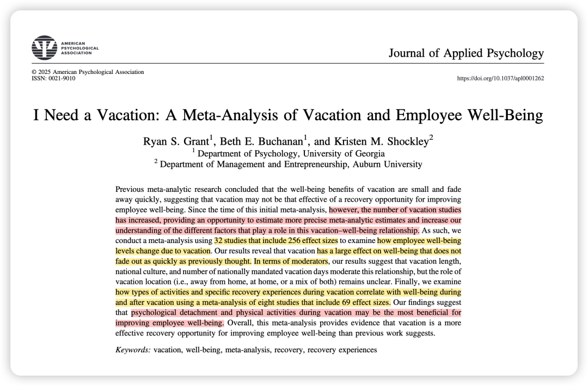
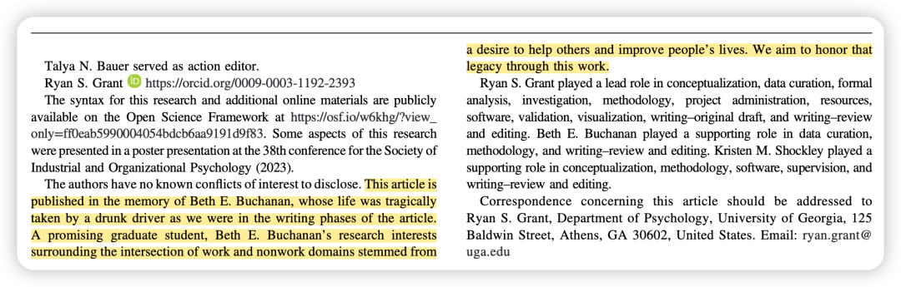
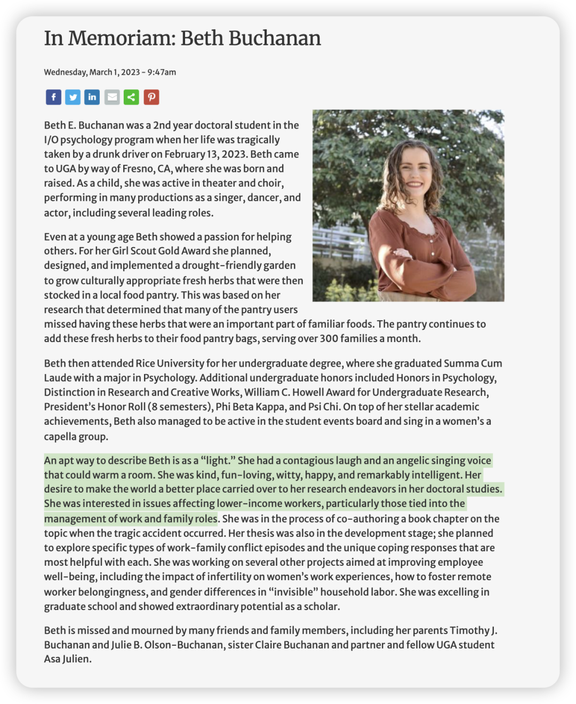
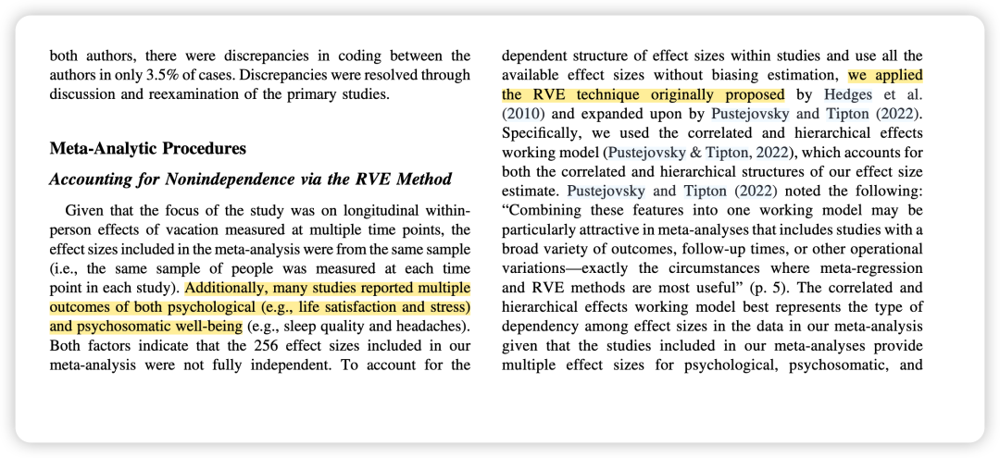
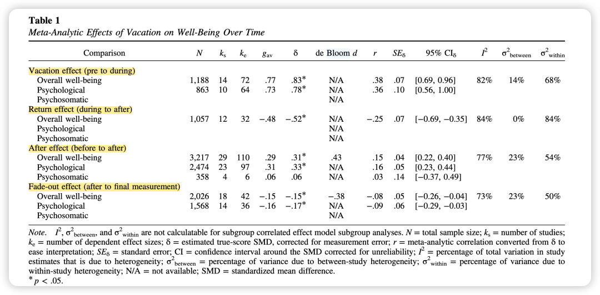
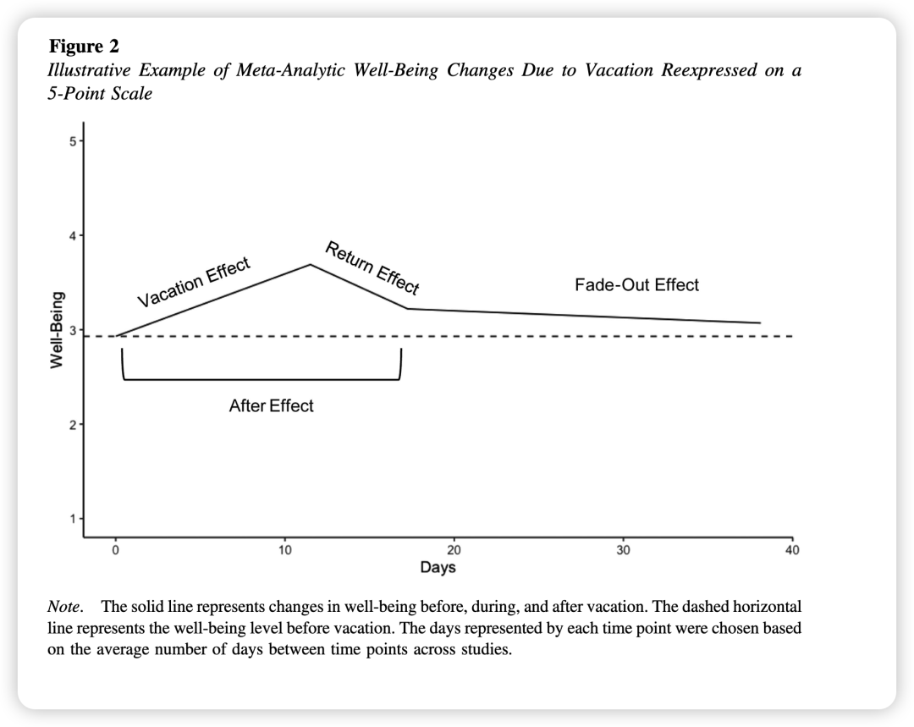
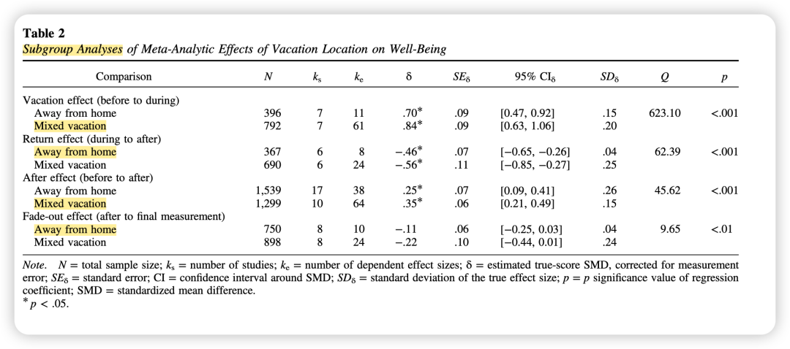
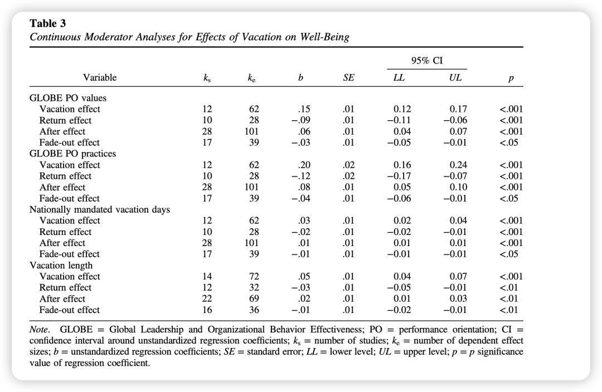
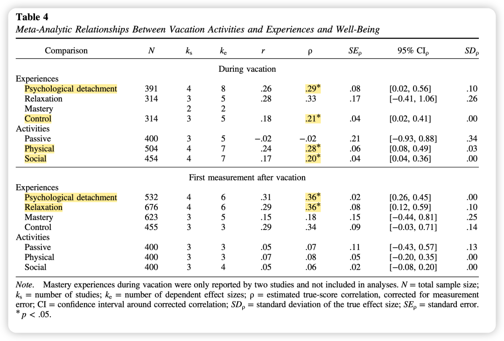
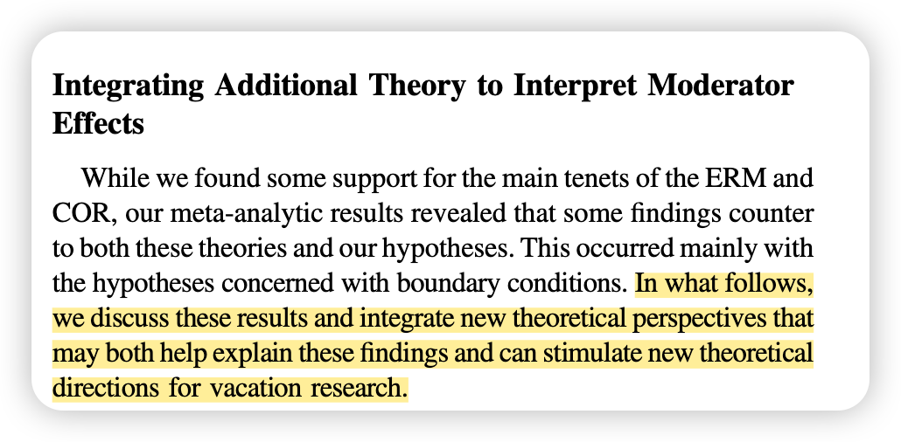

***Reference：***Grant, R. S., Buchanan, B. E., & Shockley, K. M. (2025). I need a vacation: A meta-analysis of vacation and employee well-being. *Journal of Applied Psychology*. https://doi.org/10.1037/apl0001262

### **作者简介：**

这篇文章的一作和二作都是UGA的博士生，三作是曾任职于UGA、现就职于Auburn的教授。

而令人叹惋的是，二作这位年轻美丽的博士生，在2023年被一位醉酒司机残忍夺走生命。在论文首页的acknowledgement部分，作者就写道：

而学校官网也温情地回顾了Beth的生平。ta们写道：描述Beth最恰当的方式就是——她是一束'光'。她那富有感染力的笑声和天使般的歌声，足以温暖整个空间。她善良、充满活力、机智幽默、乐观向上，且聪慧过人。她那'让世界变得更美好'的愿望，也深深融入到了她的博士研究工作中**。**（国外在“whole person”这个维度的贯彻上真的做得太好。国内官方悼念里只有ta发表了多少论文，获得了多少奖…）

让我们带着对beth的缅怀，一起看一看这篇充满人文关怀的文章吧～

### 

### 研究简介：

先前关于休假的元分析研究(de Bloom et al.，2009)认为，休假带来的福祉益处**很小且消退迅速**，这表明休假可能不是改善员工福祉的有效恢复机会。

然而，自2009年这篇元分析以来，**关于休假的研究数量有所增加**，这为更精确地估计元分析结果和加深我们对休假与福祉之间不同影响因素的理解提供了机会。

因此，本篇元分析包含了32 项研究和 256 个效应量，以检验员工福祉水平因休假而发生的变化。此外，研究还通过对 8 项研究（包含 69 个效应量）的元分析，考察了休假期间的活动类型和具体的恢复体验与休假期间及休假后福祉的相关性。

### 理论概述：

**1、努力-恢复模型 (Effort-Recovery Model, ERM)：**该模型认为工作需求要个体付出努力，导致心理生理系统的激活。为了恢复，这些系统必须回到工作前的基线水平，这主要通过脱离压力性的工作需求来实现。休假为员工提供了一个长时间脱离工作需求和压力的机会，使得心理生理系统能够恢复到基线水平，阻止负荷效应（如疲劳）的累积，并保护个体在休假期间免受进一步的资源损失。

**2、资源保存理论 (Conservation of Resources Theory, COR)：**该理论关注个体如何通过恢复、维持和构建资源来应对压力。休假期间，员工可以通过休闲活动（如运动、社交）补充工作消耗的资源（如精力、积极情绪）。资源积累会形成资源增益循环，从而提高福祉。休假提供了一个停止资源损耗并促进资源积累的理想环境。

### **方法概述：**

因为关于vacation的研究常常存在互相依赖的效应量，所以本研究采用**稳健方差估计 (RVE)** 来进行元分析效应检验。

### **结果概述：**

**休假对福祉有显著的积极影响**，且这种影响**不会像之前认为的那样快速消退。**

### 主效应：

**1、休假效应 (Vacation Effect)：**从休假前到休假期间，**员工的福祉水平显著提高 (δ = .83)。这被认为是很大的福祉改善。**

**2、返回效应 (Return Effect)：**从休假期间到返回工作后的第一次测量，员工的福祉水平显著下降 (δ = −.52)。这被认为是中等程度的效应。

**3、后期效应 (After Effect)：**返回工作后的第一次测量时，员工的福祉水平**仍然高于休假前**(δ = .31)。这被认为是小程度的效应。

**4、消退效应 (Fade-Out Effect)：从**返回工作后的第一次测量到研究报告的最后一次测量（平均约 21 天后），员工的福祉水平持续下降 (δ = −.15)，**但仍高于休假前水平**。**这种消退效应的程度被认为是小的，且小于 de Bloom 等人 (2009) 的发现。**

### 调节效应：

**1、休假地点 (Vacation Location)：**与研究人员的假设相反，**混合休假地点（部分参与者在家休假，部分外出休假）的样本显示出更强的休假效应和后期效应，以及更强的返回效应和消退效应。***然而，作者对这些发现持谨慎态度，因为没有研究只包含在家休假的参与者。*

*（想到最近的热词“staycation”哈哈哈 其实我觉得当代年轻人staycation还挺多…）*

**2、休假时长 (Vacation Length)：更长的休假**与更强的休假效应和后期效应相关。更长的休假也与更强的返回效应和消退效应相关。这意味着虽然长假能带来更大的福祉提升，但返回工作后福祉下降也更剧烈，且消退更快😭。

***（越放纵越痛苦 详见春节假期的戒断反应…）***

**3、绩效导向 (Performance Orientation)：**在**高绩效导向文化**中的个体在休假期间经历了更大的福祉益处，但在返回工作后福祉下降也更快。

（which is 如果我不曾见过光明，我本可以忍受黑暗...）

**4、国家法定休假天数 (Nationally Mandated Vacation Days)：**拥有**更多**国家法定休假天数的国家，其研究显示出更强的休假效应和后期效应，以及更强的返回效应和消退效应。

5、**心理恢复体验：在四种recovery experience中，只有心理脱离 (Psychological Detachment)**与休假期间和休假后的第一次测量时的福祉都呈**正相关。**

****

6、**休假活动 (Vacation Activities)**：

-体育活动 (Physical Activities)：与休假期间的福祉呈**最强的正相关。**
-社交活动 (Social Activities)：与休假期间的福祉呈
**中等程度**的正相关。
-被动活动 (Passive Activities)：与休假期间的福祉
**无显著相关**。 然而，这些活动与返回工作后的福祉水平均无显著相关。

*（so 去度假就别一直躺着！会不那么幸福哦！动起来动起来！）*

### **讨论：**

这篇文章的讨论我还挺喜欢，特别是对于和假设不一致的结果，作者又引入了**边界理论（border thoery）和适应水平理论（adaptation-level theory）**去解释。

比如，作者在讨论**休假地点**的调节效应时发现，与他们的假设相反。因此作者引入边界理论，该理论认为个体在工作和生活角色之间创建并维持边界，还区分了边界的灵活性和渗透性，以及个体在分隔（更强的边界）和整合（更弱的边界）之间的偏好。

作者根据这个理论推测，**在休假期间身心都远离家可能会加强工作和休闲之间的边界，从而有助于心理脱离，防止工作压力破坏恢复**。

此外，作者在讨论**休假时长**的调节效应时发现，虽然更长的休假确实带来了更大的福祉提升，但同时也伴随着更剧烈的返回工作后的福祉下降和更快的消退。对于此，作者引用适应水平理论，**该理论认为个体基于先前的刺激暴露形成一个基准适应水平。新的刺激随后会根据这个适应水平进行判断。**

当个体经历的刺激与他们的适应水平差异很大时，可能会导致更强烈的正面或负面情绪反应。作者将此理论应用于休假时长，认为**更长的休假让个体在更高的福祉状态中停留更长时间，这种高福祉状态会成为他们新的适应水平**。**一旦返回工作，由于工作压力与近期积极的休假体验形成的强烈对比，福祉的下降就会更加剧烈。这种推理也适用于消退效应，尽管程度可能较轻。**

*（原来戒断反应对应的理论就是adaptation-level theory哦！）*

此外，作者还将适应水平理论用于解释**绩效导向**和**国家法定休假天数**的调节效应结果中出现的一些意外发现。也是类似的解释～

总之，这样再去借用其他理论把元分析中不一致的结果解释清楚的方式值得学习！而不是仅仅用一些同样不一致的实证研究去证明。

**写在后面的碎碎念：**

昨天发的推送真的给我感动到了🥹 我真的在世界上最有人文关怀的学科、有着世界上最温情有爱的朋友、同学、peers、老师们和陌生的关注者们。我要在周末再写一条bubble好好感恩大家，感恩世界！

祝大家都开心平安！

当然，能时不时休假就更棒啦！😄 长休假没有的话，小小休假也是开心的～

还有，明天就是春分了，白天会越来越长，我们的未来也都会越来越光明的！
